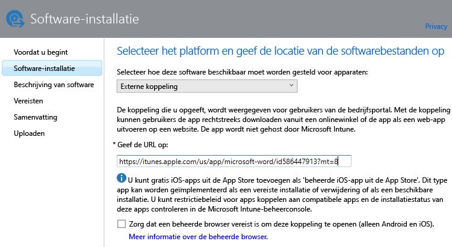
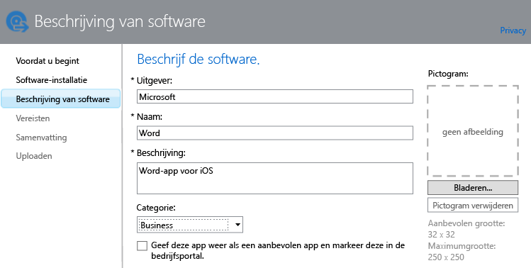

# Apps toevoegen voor geregistreerde apparaten

Voordat u een app kunt implementeren of beheren, moet u de app toevoegen aan Microsoft Intune. In dit onderwerp wordt beschreven hoe u apps voor geregistreerde apparaten toevoegt.

> [!IMPORTANT]
> Met behulp van de informatie in dit onderwerp kunt u apps toevoegen die u wilt implementeren op geregistreerde apparaten en Windows-pc’s. Zie [Apps voor Windows-pc's toevoegen in Microsoft Intune](add-apps-for-windows-pcs-in-microsoft-intune.md) als u apps voor Windows-pc's wilt toevoegen die u beheert met de Intune-clientsoftware.

## De app toevoegen
U gebruikt de uitgever van Intune-software om de eigenschappen van de app te configureren en om, indien van toepassing, de app te uploaden naar de opslagruimte in de cloud. Gebruik de volgende procedure:

1.  Kies in de [Microsoft Intune-beheerconsole](https://manage.microsoft.com) de optie **Apps** &gt; **Apps toevoegen** om Uitgever van Intune-software te starten.

    > [!TIP]
    > Mogelijk moet u uw gebruikersnaam en wachtwoord voor Intune invoeren voordat de uitgever wordt gestart.

2.  Op de pagina **Software-installatie** van de uitgever kiest u een van de volgende opties voor **Selecteren hoe deze software beschikbaar moet worden gesteld voor apparaten**:
    - **Software-installatieprogramma**, voor apps met de extensie **.msi** of **.exe**:
        - **Selecteer het bestandstype voor het software-installatieprogramma**. Dit geeft het type software aan dat u wilt implementeren. Als u bijvoorbeeld een iOS-app wilt installeren, kiest u **App-pakket voor iOS (&#42;.ipa-bestand)**.
        - **Geef de locatie op van de software-installatiebestanden**. Geef de locatie op van de installatiebestanden of kies **Bladeren** om de locatie in een lijst te selecteren.
        - **Neem aanvullende bestanden en submappen op in dezelfde map**. Deze optie is alleen beschikbaar voor het bestandstype **Windows Installer**. Voor sommige software die gebruikmaakt van Windows Installer, zijn ondersteunende bestanden vereist die gewoonlijk in dezelfde map zijn opgeslagen als de installatiebestanden. Selecteer deze optie als u deze bestanden ook wilt implementeren. Dit installatietype maakt gebruik van uw opslagruimte in de cloud.

  -   **Externe koppeling**, voor apps die u wilt maken door een koppeling op te geven naar een app store:

        - **De URL opgeven**. Geef de URL op van een van de volgende zaken:
            - De URL van de app store van de app die u wilt installeren. Als u bijvoorbeeld de Microsoft-app Extern bureaublad voor Android wilt implementeren, geeft u **https://play.google.com/store/apps/details?id=com.microsoft.rdc.android** op. Zoek met een zoekprogramma de pagina van de app in de app store om de URL van de app te vinden. Als u bijvoorbeeld de app Extern bureaublad zoekt, kunt u als zoekterm **Microsoft Extern bureaublad Android** gebruiken.
            - Een website. Intune implementeert een snelkoppelingspictogram naar de site op het apparaat (ook wel een webclip genoemd).
            - Een app op internet. Intune implementeert een snelkoppelingspictogram naar de app op het apparaat.
        - **Zorg dat een beheerde browser vereist is om deze koppeling te openen (alleen Android en iOS).** Wanneer u een koppeling naar een website of web-app voor gebruikers implementeert, kunnen ze deze alleen in de door Intune beheerde browser openen. Deze browser moet op hun apparaat zijn geïnstalleerd. Zie [Internettoegang beheren met beheerde-browserbeleid met Microsoft Intune](manage-internet-access-using-managed-browser-policies.md) voor meer informatie over de beheerde browser. Dit installatietype maakt geen gebruik van uw opslagruimte in de cloud.

  -   **Beheerde iOS-app uit de App Store**: voor gratis apps uit de iTunes Store die u wilt beheren met Mobile Application Management-beleid (MAM):

        - **De URL opgeven**. Typ de URL van de app store van de app die u wilt installeren. Als u bijvoorbeeld de Microsoft-app Werkmappen voor iOS wilt implementeren, geeft u **https://itunes.apple.com/us/app/work-folders/id950878067?mt=8** op. Dit installatietype maakt geen gebruik van uw opslagruimte in de cloud.

        Als u bijvoorbeeld de Microsoft Word-app uit de iTunes Store wilt implementeren op apparaten, ziet de pagina er als volgt uit:

        

3.  Configureer op de pagina **Beschrijving van software** de volgende instellingen:

    > [!TIP]
    > Afhankelijk van het installatietype dat u gebruikt, zijn sommige van deze waarden mogelijk al automatisch ingevoerd.

    - **Uitgever**. Voer de naam van de uitgever van de app in.
    - **Naam**. Voer de naam van de app in zoals deze in de bedrijfsportal zal worden weergegeven. Zorg ervoor dat alle app-namen die u gebruikt, uniek zijn. Als dezelfde app-naam twee keer voorkomt, wordt slechts één van de apps weergegeven voor gebruikers in de bedrijfsportal.
    - **Beschrijving**. Voer een beschrijving in voor de app. Deze wordt weergegeven voor gebruikers in de bedrijfsportal.
    - **URL voor informatie over de software**. Alleen beschikbaar als u **Software-installatieprogramma** hebt geselecteerd. Voer de URL in van een website die informatie over deze app bevat (optioneel). Deze URL wordt weergegeven voor gebruikers in de bedrijfsportal.
    - **Privacy-URL**. Alleen beschikbaar als u **Software-installatieprogramma** hebt geselecteerd. (optioneel) Voer de URL in van een website die privacyinformatie over deze app bevat. Deze URL wordt weergegeven voor gebruikers in de bedrijfsportal.
    - **Categorie** (optioneel). Selecteer een van de ingebouwde app-categorieën. Hierdoor kunnen gebruikers de app gemakkelijker vinden wanneer ze door de bedrijfsportal bladeren.
    - **Geef deze app weer als een aanbevolen app en markeer deze in de bedrijfsportal**. Geef de app prominent weer op de hoofdpagina van de bedrijfsportal wanneer gebruikers door apps bladeren.
    - **Pictogram** (optioneel). Upload een pictogram dat aan de app wordt gekoppeld. Dit is het pictogram dat samen met de app wordt weergegeven wanneer gebruikers door de bedrijfsportal bladeren.

        In dit voorbeeld hebt u een beschrijving geconfigureerd voor de Microsoft Word-app voor iOS:

        

4.  Op de pagina **Vereisten** selecteert u de vereisten waaraan moet worden voldaan voordat de app op een apparaat kan worden geïnstalleerd. Zo kunt u voor een app-pakket voor iOS bijvoorbeeld selecteren welke minimumversie van iOS is vereist. Daarnaast kunt u selecteren welk type apparaat het moet zijn, zoals een iPhone of een iPad.

    > [!TIP]
    > De pagina **Vereisten** wordt niet voor alle typen apps weergegeven.

5.  Als u het bestandstype **Windows Installer** selecteert, worden aanvullende wizardpagina’s weergeven. Dit bestandstype wordt gebruikt wanneer u software implementeert op computers met Windows 10 of hoger die zijn ingeschreven bij Intune.

6.  Controleer op de pagina **Samenvatting** de informatie die u hebt opgegeven. Wanneer u klaar bent, kiest u **Uploaden**.

7.  Kies **Sluiten** om de bewerking te voltooien.

De app wordt weergegeven op het knooppunt **Apps** van de werkruimte **Apps**.

## Voorbeeld: .msi-toepassingen op Windows 10-apparaten implementeren
In deze video van vier minuten leert u hoe u Windows Installer-toepassingen (.msi) implementeert op geregistreerde apparaten waarop Windows 10 wordt uitgevoerd.  

<iframe src="https://channel9.msdn.com/Series/How-to-Control-the-Uncontrolled/6--How-to-Deploy-MSI-Applications-to-Windows-10-Using-Intune-and-Mobile-Device-Management-MDM/player" width="640" height="360" allowFullScreen frameBorder="0"></iframe>

## Volgende stappen

Nadat u een app hebt gemaakt, is de volgende stap om deze te implementeren. Zie [Apps in Microsoft Intune implementeren](deploy-apps.md) voor meer informatie.

<!--HONumber=Oct16_HO4-->

