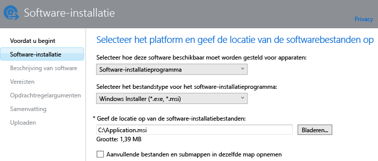

# Apps voor Windows-pc's toevoegen in Microsoft Intune

Gebruik de informatie in dit onderwerp om te weten te komen hoe u apps aan Intune toevoegt voordat u ze implementeert.

> [!IMPORTANT]
> De informatie in dit onderwerp helpt u bij het toevoegen van apps op Windows-pc's die u beheert met de Intune-clientsoftware. Als u apps wilt toevoegen op geregistreerde Windows-pc’s en andere mobiele apparaten, raadpleegt u [Apps voor mobiele apparaten toevoegen in Microsoft Intune](add-apps-for-mobile-devices-in-microsoft-intune.md).

## De app toevoegen
U gebruikt de uitgever van Intune-software om de eigenschappen van de app te configureren en om de app te uploaden naar de cloudopslag. Volg daarvoor deze procedure:

1.  Kies in de [Microsoft Intune-beheerdersconsole](https://manage.microsoft.com) de optie **Apps** &gt; **Apps toevoegen** om de uitgever van Intune-software te starten.

    > [!TIP]
    > Mogelijk moet u uw gebruikersnaam en wachtwoord voor Intune invoeren voordat de uitgever wordt gestart.

2.  Op de pagina **Software-installatie** van de software-uitgever configureert u de volgende instellingen:

    **Selecteren hoe deze software beschikbaar wordt gesteld aan apparaten**: kies **Software-installatieprogramma** en geef de volgende instellingen op:

    - **Het bestandstype voor het software-installatieprogramma selecteren**: dit geeft het type software aan dat u wilt implementeren. Kies voor een Windows-pc de optie **Windows Installer**.
    - **De locatie opgeven van de software-installatiebestanden**: geef de locatie van de installatiebestanden op of kies **Bladeren** om de locatie in een lijst te selecteren.
    - **Aanvullende bestanden en submappen uit dezelfde map opnemen**: voor sommige software die gebruikmaakt van Windows Installer zijn ondersteunende bestanden vereist die gewoonlijk in dezelfde map zijn opgeslagen als de installatiebestanden. Selecteer deze optie als u deze ondersteunende bestanden ook wilt implementeren.

    Als u bijvoorbeeld een app met de naam Application.msi wilt publiceren naar Intune, komt de pagina er als volgt uit te zien: 

   Dit installatietype maakt gebruik van uw opslagruimte in de cloud.

3.  Configureer op de pagina **Beschrijving van software** de volgende instellingen:

    Afhankelijk van het installatiebestand dat u gebruikt, zijn sommige van deze waarden mogelijk al automatisch ingevoerd of worden deze mogelijk niet weergegeven.

    - **Uitgever**: voer de naam van de uitgever of de app in.
    - **Naam**: voer de naam van de app in zoals deze in de bedrijfsportal zal worden weergegeven.  Zorg ervoor dat alle app-namen die u gebruikt, uniek zijn. Als dezelfde app-naam twee keer voorkomt, wordt slechts één van de apps weergegeven voor gebruikers in de bedrijfsportal.
    - **Beschrijving**: voer een beschrijving in voor de app. Deze wordt weergegeven voor gebruikers in de bedrijfsportal.
    - **URL voor informatie over de software**: (optioneel) voer de URL in van een website die informatie over deze app bevat. Deze URL wordt weergegeven voor gebruikers in de bedrijfsportal.
    - **Privacy-URL**: (optioneel) voer de URL in van een website die privacyinformatie over deze app bevat. Deze URL wordt weergegeven voor gebruikers in de bedrijfsportal.
    - **Categorie**: (optioneel) selecteer een van de ingebouwde app-categorieën. Hierdoor kunnen gebruikers de app gemakkelijker vinden wanneer ze door de bedrijfsportal bladeren.
    - **Pictogram**: (optioneel) upload een pictogram dat aan de app wordt gekoppeld. Dit is het pictogram dat samen met de app wordt weergegeven wanneer gebruikers door de bedrijfsportal bladeren.

4.  Op de pagina **Vereisten** selecteert u de vereisten waaraan moet worden voldaan voordat de app op een apparaat kan worden geïnstalleerd. Kies uit **Architectuur**: selecteer of deze app kan worden geïnstalleerd op 32-bits, 64-bits of beide besturingssystemen of **Besturingssysteem**: selecteer het oudste besturingssysteem waarop deze app kan worden geïnstalleerd.

5.  Op de pagina **Detectieregels** kunt u regels configureren om te detecteren of de app die u configureert, al is geïnstalleerd op een pc. U kunt ook de standaardregels voor detectie gebruiken om eerder geïnstalleerde versies van de app automatisch te overschrijven. Deze optie is voor Windows Installer (alleen .exe-bestanden).
6.  
    U kunt de volgende regels configureren:
    - **Bestand bestaat al**: geef het pad op naar het bestand dat u wilt detecteren. U kunt zoeken onder **%ProgramFiles%** (waarmee wordt gezocht binnen **Programmabestanden**\*&lt;pad&gt;* en **Programmabestanden (x86)**\*&lt;pad&gt;*) op de computer of **%SystemDrive%** (waarmee wordt gezocht binnen het basisstation van de pc, meestal C:)
    - **MSI-productcode bestaat al**: kies **Bladeren** om het Windows Installer-bestand (msi) te kiezen dat u wilt detecteren. 
    - **Registersleutel bestaat al**: geef een registersleutel op die begint met **HKEY_LOCAL_MACHINE\**. Er wordt gezocht binnen zowel 32-bits als 64-bits registerpaden. Als de door u opgegeven sleutel bestaat in één van beide locaties, wordt aan de detectieregel voldaan.

    Als de app voldoet aan één van de regels die u hebt geconfigureerd, wordt deze niet geïnstalleerd.

7.  Alleen voor het bestandstype **Windows Installer** (msi en exe): op de pagina **Opdrachtregelargumenten** kiest u of u optionele opdrachtregelargumenten wilt opgeven voor het installatieprogramma. Zo bieden sommige installatieprogramma's mogelijk ondersteuning voor het argument **/q**, zodat het programma op de achtergrond kan worden geïnstalleerd zonder tussenkomst van de gebruiker.

8.  Alleen voor het bestandstype **Windows Installer** (alleen exe): op de pagina **Retourcodes** kunt u nieuwe foutcodes toevoegen die door Intune worden geïnterpreteerd wanneer de app wordt geïnstalleerd op een beheerde Windows-pc.
    Standaard worden door Intune retourcodes volgens de industriestandaard gebruikt om te melden dat de installatie van een app-pakket is mislukt of geslaagd: **0** - Geslaagd of **3010** - Geslaagd en opnieuw opgestart. U kunt ook uw eigen retourcodes aan deze lijst toevoegen. Als u een lijst met retourcodes opgeeft en de installatie van de app een code retourneert die niet in de lijst voorkomt, wordt dit geïnterpreteerd als een fout.

9.  Controleer op de pagina **Samenvatting** de informatie die u hebt opgegeven. Wanneer u klaar bent, kiest u **Uploaden**.

10. Kies **Sluiten** om de bewerking te voltooien.

De app wordt weergegeven op het knooppunt **Apps** van de werkruimte **Apps**.

## Volgende stappen

Wanneer u een app hebt gemaakt, is de volgende stap deze te implementeren. Zie [Apps in Microsoft Intune implementeren](deploy-apps.md) voor meer informatie

<!--HONumber=Jul16_HO3-->

