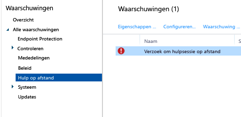

# Algemene beheertaken voor Windows-pc’s met de Microsoft Intune-computerclient
Bestudeer de taken in dit onderwerp voor meer informatie over het beheren van computers met de Intune-pc-clientsoftware. Zie [De Windows-pc-client installeren met Microsoft Intune](install-the-windows-pc-client-with-microsoft-intune.md) als u de client nog niet op uw computers hebt geïnstalleerd.

## Beleid gebruiken voor het vereenvoudigen van pc-beheer
### De Windows Firewall beheren
Beleidsregels vereenvoudigen het beheer van Windows Firewall-instellingen op beheerde computers. Zie [Windows-pc's beschermen met Windows Firewall-beleid in Microsoft Intune](help-protect-windows-pcs-using-windows-firewall-policies-in-microsoft-intune.md) voor meer informatie.

### Het Microsoft Intune Center beheren
Met het Microsoft Intune Center kunnen gebruikers:

-   Toepassingen ophalen via de bedrijfsportal.

-   Controleren op updates.

-   Microsoft Intune Endpoint Protection beheren.

-  Hulp op afstand vragen.

Het Microsoft Intune Center wordt geïnstalleerd op alle beheerde computers. U kunt de volgende instellingen in een Intune-beleid configureren en deze instellingen worden weergegeven aan gebruikers in het Microsoft Intune Center:

|Beleidsinstelling|Details|
|------------------|--------------------|
|**Naam**|De naam van de beheerder die de computer beheert.  Maximale lengte: 40 tekens|
|**Telefoonnummer**|Het telefoonnummer van de beheerder die de computer beheert.  Maximale lengte: 20 tekens|
|**E-mailadres**|Het e-mailadres van de beheerder die de computer beheert.  Maximale lengte: 40 tekens|
|**Websitenaam**|De naam van uw ondersteuningswebsite voor gebruikers.  Maximale lengte: 40 tekens|
|**Website-URL**|De URL van uw ondersteuningswebsite.  Maximale lengte: 150 tekens|
|**Opmerkingen**|Een opmerking die wordt weergegeven voor gebruikers.  Maximale lengte: 120 tekens|

### Instellingen voor software-updates beheren
Gebruik beleidsregels om de instellingen te configureren die beheerde computers gebruiken voor het controleren op en downloaden van software-updates van Microsoft en derden. Zie voor meer informatie [Windows-pc's up-to-date houden met software-updates in Microsoft Intune](keep-windows-pcs-up-to-date-with-software-updates-in-microsoft-intune.md).

### Instellingen voor Endpoint Protection beheren
Gebruik beleidsregels voor het configureren van instellingen voor Endpoint Protection die u vervolgens implementeert op beheerde computers. Dit omvat scanschema's, te ondernemen acties wanneer schadelijke software wordt gedetecteerd, en meer. Zie [Help Windows-pc's beveiligen met Endpoint Protection voor Microsoft Intune](help-secure-windows-pcs-with-endpoint-protection-for-microsoft-intune.md) voor meer informatie.

## Hardware- en software-inventarisatie weergeven
Intune verzamelt gedetailleerde informatie over de hardware en software van beheerde computers. Gebruik de informatie in de volgende procedures om het volgende te leren maken:

-   Een rapport met een overzicht van de informatie over de hardwaremogelijkheden van uw computers.

-   Een rapport met een overzicht van de software die op elke computer is geïnstalleerd.

-   De inventarisatie van een computer vernieuwen om ervoor te zorgen dat de gegevens in het rapport actueel zijn.

### Informatie over uw computers weergeven

1.  Kies in de [Microsoft Intune-beheerconsole](https://manage.microsoft.com/) de optie **Rapporten**&gt;**Computerinventarisatierapporten**.

2.  Op de pagina **Nieuw rapport maken** accepteert u de standaardwaarden of past u deze aan om de resultaten te filteren die door het rapport worden geretourneerd. U kunt bijvoorbeeld selecteren dat alleen computers met Windows 8.1 worden weergegeven in het rapport.

3.  Klik op **Rapport weergeven** om het **Computerinventarisatierapport** te openen in een nieuw venster.

    U kunt het rapport rangschikken op een kolom, zoals **Naam**, **Chassistype** of **Fabrikant**, door te klikken op de bijbehorende kolomkop.

### Software weergeven die op uw computers is geïnstalleerd

1.  Kies in de [Microsoft Intune-beheerconsole](https://manage.microsoft.com/) de optie **Rapporten**&gt;**Rapporten met gedetecteerde software**.

2.  Op de pagina **Nieuw rapport maken** accepteert u de standaardwaarden of past u deze aan om de resultaten te filteren die door het rapport worden geretourneerd. U kunt bijvoorbeeld selecteren dat alleen de software die is uitgegeven door Microsoft, wordt weergegeven in het rapport.

3.  Klik op **Rapport weergeven** om het **Rapport met gedetecteerde software** te openen in een nieuw venster.

    U kunt het rapport rangschikken op een kolom zoals **Naam**, **Uitgever** of **Categorie** door te klikken op de bijbehorende kolomkop. U kunt de updates in de lijst uitbreiden om meer details weer te geven (zoals de computers waarop deze update is geïnstalleerd) door de richtingspijl naast het item te kiezen.

### Computerinventarisatie vernieuwen zodat deze actueel is

1.  Kies in de [Microsoft Intune-beheerconsole](https://manage.microsoft.com/) de optie **Groepen**&gt;**Alle apparaten** (of een andere groep die de computer bevat waarvoor u de inventarisatie wilt vernieuwen).

2.  Selecteer een computer of houd **Ctrl** ingedrukt om meerdere computers te selecteren.

3.  Kies op de taakbalk **Externe taken**&gt;**Inventarisatie vernieuwen**.

4.  Als u de status van de taak wilt weergeven, klikt u op **Externe taken** in de rechterbenedenhoek van de pagina.

    Het dialoogvenster **Taakstatus** wordt weergegeven met huidige externe taken, taakstatus, apparaatnaam en gerapporteerde fouten, en het bevat een koppeling naar informatie voor probleemoplossing.

## Een Windows-pc op afstand opnieuw opstarten

1.  Kies in de [Microsoft Intune-beheerconsole](https://manage.microsoft.com/) de optie **Groepen**&gt;**Alle apparaten** (of een andere groep die de computer bevat die u opnieuw wilt opstarten).

2.  Selecteer een of meer computers en klik vervolgens op **Externe taken**&gt;**Computer opnieuw opstarten**.

3.  Als u de status van de taak wilt weergeven, klikt u op **Externe taken** in de rechterbenedenhoek van de pagina.

4.  In het dialoogvenster **Taakstatus** controleert u de huidige externe taken, de taakstatus, de apparaatnaam en eventuele gerapporteerde fouten.

## Een computer buiten gebruik stellen

1.  Kies in de [Microsoft Intune-beheerconsole](https://manage.microsoft.com/) de optie **Groepen**&gt;**Alle apparaten** (of een andere groep die de computer bevat die u buiten gebruik wilt stellen).

2.  Selecteer de apparaten die u buiten gebruik wilt stellen en kies vervolgens **Buiten gebruik stellen/wissen**.

Als u een computer opnieuw wilt registreren bij Intune, installeert u de clientsoftware opnieuw op de computer met behulp van de informatie in het onderwerp [Installeer de Windows-pc-client met Microsoft Intune](install-the-windows-pc-client-with-microsoft-intune.md).

Als een computer geen verbinding kan maken met Intune, wordt een bericht weergegeven in de werkruimte **Dashboard**.

Wanneer u een computer buiten gebruik stelt:

-   Wordt deze verwijderd uit het Intune-beheer en de Intune-inventarisatie en wordt de licentie die aan de computer is gekoppeld, beschikbaar gesteld voor hergebruik. Met Buiten gebruik stellen/wissen wordt alleen de Intune-softwareclient van de computer verwijderd, niet apps of gegevens.

-   Wordt de status ervan niet meer weergegeven de Intune-console.

-   Verwijdert Intune de clientsoftware van de computer. Als de computer niet met de Intune-service is verbonden, wordt de clientsoftware de volgende keer dat de computer verbinding maakt, verwijderd.

-   Microsoft Intune Endpoint Protection wordt verwijderd van de computer. Als op de computer een andere eindpunttoepassing is geïnstalleerd en deze is uitgeschakeld, kan die toepassing opnieuw worden ingeschakeld nadat Microsoft Intune Endpoint Protection is verwijderd om ervoor te zorgen dat uw computers zijn beveiligd.

-   Eventuele beleidsregels worden verwijderd van de computer en de waarden die zijn ingesteld door het beleid, worden gewijzigd.

-   De computer ontvangt geen software-updates of updates voor definities van schadelijke software meer van de Intune-service.

-   Afhankelijk van de configuratie kunnen computers die buiten gebruik zijn gesteld, nog steeds updates ontvangen via Windows Server Update Services, Windows Update of Microsoft Update.

    > [!IMPORTANT]
    > Als de clientsoftware is geïnstalleerd met behulp van een groepsbeleidsobject (GPO), moet u het groepsbeleidsobject verwijderen voordat u de clientsoftware kunt verwijderen om te voorkomen dat de software wordt geïnstalleerd.

    Als de client niet kan worden verwijderd, leest u [Problemen met Endpoint Protection oplossen](/intune/troubleshoot/troubleshoot-endpoint-protection-in-microsoft-intune) voor meer informatie.

## Gebruiker/apparaatkoppeling beheren
Voordat u software voor een gebruiker kunt implementeren, moet u de gebruiker aan een computer koppelen. U kunt een gebruiker aan meerdere computers koppelen, maar elke computer kan aan slechts één gebruiker worden gekoppeld. Gebruikers worden automatisch gekoppeld aan computers die ze registreren bij Intune met behulp van de bedrijfsportal.

### Een gebruiker aan een computer koppelen

1.  Kies in de [Microsoft Intune-beheerconsole](https://manage.microsoft.com/) de optie **Groepen**&gt;**Alle apparaten** (of een andere groep die de computer bevat die u aan een gebruiker wilt koppelen).

2.  Selecteer de computer die u aan een gebruiker wilt koppelen en kies vervolgens **Gebruiker koppelen**.

    In het dialoogvenster **Gebruiker koppelen** wordt een lijst met beschikbare gebruikers weergegeven met hun weergavenaam, gebruikers-id en het aantal computers waaraan elke gebruiker momenteel is gekoppeld. Als een gebruiker al aan de geselecteerde computer is gekoppeld, worden de naam van die gebruiker en de gebruikers-id weergegeven onder **Huidige gebruiker**. Als de computer niet aan een gebruiker is gekoppeld, wordt **Geen gebruiker** weergegeven onder **Huidige gebruiker**.

3.  Voer een van de volgende handelingen uit:

    -   Als u de computer gekoppeld wilt laten aan de huidige gebruiker, indien aanwezig, kiest u **Annuleren**.

    -   Als u de koppeling met de huidige gebruiker, indien aanwezig, wilt verwijderen, kiest u **Koppeling verwijderen**&gt;**OK**.

    -   Als u de computer aan een nieuwe gebruiker wilt koppelen, selecteert u een gebruiker in de lijst **Alle gebruikers** . Controleer of de gebruikersgegevens juist zijn en kies vervolgens **OK**.

> [!TIP]
> Als u de mogelijkheden van eindgebruikers om zichzelf aan computers te koppelen wilt beperken, schakelt u de optie **Koppelingen tussen gebruikers en computers beperken** in het beleid voor **Instellingen Microsoft Intune-agent** in.

## Hulp op afstand aanvragen en verlenen aan Windows-pc's die gebruikmaken van de Intune-clientsoftware

Microsoft Intune kan de [TeamViewer](https://www.teamviewer.com)-software gebruiken om ervoor te zorgen dat gebruikers van pc's met de Intune-clientsoftware te hulp op afstand van u kunnen krijgen. Wanneer een gebruiker hulp via Microsoft Intune Center aanvraagt, ontvangt u een waarschuwing, kunt u de aanvraag accepteren en vervolgens hulp verlenen.
Deze functionaliteit vervangt de bestaande Windows Hulp op afstand-functionaliteit in Intune.

### Voordat u begint

Voordat u aanvragen voor hulp op afstand kunt uitvoeren en beantwoorden, moet aan de volgende vereisten zijn voldaan:

- U moet zich hebben [aangemeld voor een TeamViewer-account](https://login.teamviewer.com/LogOn#register) om u te kunnen aanmelden bij de TeamViewer-website.
- De Windows-pc's die u wilt beheren, moeten worden [beheerd door de Windows PC-client](manage-windows-pcs-with-microsoft-intune.md).
- Alle Windows PC-besturingssystemen die worden ondersteund door Intune, kunnen worden beheerd.

### De TeamViewer-connector configureren

1. Kies in de [Microsoft Intune-beheerconsole](https://manage.microsoft.com) de optie **Beheer**.
2. Kies in de werkruimte **Beheer** de optie **TeamViewer**.
3. Kies op de pagina **TeamViewer** onder **TeamViewer-connector** de optie **Inschakelen**.
4. Lees de licentievoorwaarden in het dialoogvenster **TeamViewer inschakelen** en klik vervolgens op **Accepteren** om ze te accepteren. Als u nog geen TeamViewer-licentie hebt, kiest u **Een TeamViewer-licentie kopen**.
5. Nadat het TeamViewer-browservenster is geopend, meldt u zich aan met uw TeamViewer-referenties aan bij de site.
6. Lees en accepteer de opties op de TeamViewer-site, zodat Intune verbinding kan maken met TeamViewer.
7. Controleer in de Intune-console of het item **TeamViewer-connector** wordt weergegeven als **Ingeschakeld**.

### Een aanvraag voor hulp op afstand openen (eindgebruiker)

1. Open **Microsoft Intune Center** op een client-pc met Windows.
2. Kies onder **Hulp op afstand** de optie **Hulp op afstand aanvragen**.
3. Nadat u de aanvraag hebt goedgekeurd (zie hieronder), wordt TeamViewer geopend op de client. De gebruiker moet alle berichten accepteren die aangeven dat de webbrowser de TeamViewer-toepassing probeert te openen.
4. De gebruiker ziet een bericht waarin wordt gevraagd of u de pc mag beheren. Ze moeten dit bericht accepteren om door te kunnen gaan.
5. Tijdens de sessie van Hulp op afstand wordt er een venster weergegeven waarin de gebruiker kan zien dat u bent verbonden. Als dit venster wordt gesloten, wordt de externe sessie beëindigd.

### Reageren op een aanvraag voor hulp op afstand

1. Wanneer een gebruiker een aanvraag voor hulp op afstand verzendt, kunt u deze bekijken in de werkruimte **Waarschuwingen** onder **Bewaking** > **Hulp op afstand**. Bijvoorbeeld:
> 

 Als een aanvraag niet binnen vier uur wordt beantwoord, wordt deze verwijderd.
2. Kies **Aanvraag goedkeuren en Hulp op afstand starten** om een aanvraag te accepteren.
3. Kies in het dialoogvenster **Er wacht een nieuw verzoek om hulp op afstand** de optie **Het verzoek om hulp op afstand accepteren**. Als dit nog niet is gedaan, installeert TeamViewer alle benodigde apps op uw computer.
4. TeamViewer informeert de eindgebruiker vervolgens dat u wilt de controle over de pc wilt overnemen. Nadat de gebruiker de aanvraag heeft geaccepteerd, wordt het TeamViewer-venster geopend en kunt u de pc beheren.

Tijdens een sessie van Hulp op afstand kunt u alle beschikbare TeamViewer-opdrachten gebruiken om de externe pc te beheren. Voor hulp bij deze opdrachten, downloadt u de [Handleiding voor extern beheer](http://www.teamviewer.com/en/support/documents/) van de TeamViewer-website.

### De sessie van Hulp op afstand sluiten

Kies in het menu **Acties** van het venster **TeamViewer** de optie **Sessie beëindigen**.

<!--HONumber=Aug16_HO1-->

