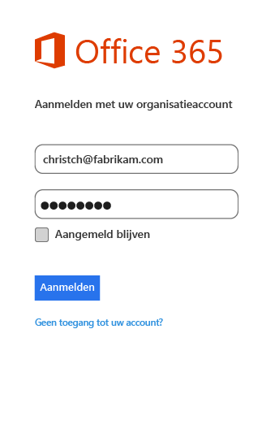

# Ervaring van eindgebruikers voor apps die geschikt zijn voor MAM met Microsoft Intune
Beleidsregels voor Mobile Application Management (MAM) worden alleen toegepast wanneer apps in de context van het werk worden gebruikt.  Lees de volgende scenario's om te begrijpen hoe beheerde apps werken.
##  OneDrive openen op een iOS-apparaat

1.  Start de  **OneDrive** -app om de aanmeldingspagina te openen.

    

    > [!NOTE]
    > Op een privé-apparaat downloadt de eindgebruiker doorgaans de app.  Als het apparaat wordt beheerd door een MDM-oplossing, kunt u de app op het apparaat implementeren.

2.  Voer de gebruikersnaam van uw werkaccount in. U wordt omgeleid naar de pagina **O365-verificatie** , waar u uw werkreferenties kunt invoeren.

    

3.  Nadat uw referenties door Azure AD zijn geverifieerd, worden de MAM-beleidsregels toegepast en wordt u gevraagd om de **OneDrive** -app opnieuw te starten.
  >[OPMERKING] Het dialoogvenster waarin opnieuw opstarten wordt vereist, wordt alleen weergegeven op apparaten die niet zijn geregistreerd in Intune.

    

4.  Wanneer u de **OneDrive**-app opnieuw start, wordt de app gestart met de MAM-beleidsregels ingeschakeld. U wordt nu gevraagd om een **Pincode** voor de app in te stellen (als u het beleid hiervoor hebt geconfigureerd).

    

5.  Nadat u de pincode hebt ingesteld en bevestigd, hebt u toegang tot de bestanden op uw **OneDrive voor Bedrijven**.

    

    > [!NOTE]
    > Wanneer u een geïmplementeerde beleid wijzigt, worden de wijzigingen de volgende keer dat u de app opent, toegepast.

##  OneDrive openen op een Android-apparaat

1.  Start de OneDrive-app om de aanmeldingspagina te openen.

    > [!NOTE]
    > Op een privé-apparaat downloadt de eindgebruiker doorgaans de app.  Als het apparaat wordt beheerd door een MDM-oplossing, kunt u de app op het apparaat implementeren.

2.  Voer de gebruikersnaam van uw werkaccount in. U wordt omgeleid naar de pagina **O365-verificatie** , waar u uw werkreferenties kunt invoeren.

    

3.  Nadat uw referenties door **Azure AD**zijn geverifieerd, ziet u een bericht met instructies voor het installeren van de Bedrijfsportal-app, als deze niet al op het apparaat is geïnstalleerd.  Tik op **Download de app** om door te gaan.

>[!NOTE]
>De bedrijfsportal-app is vereist voor alle apps die zijn gekoppeld aan MAM-beleid op Android-apparaten. Voor apparaten die niet zijn ingeschreven in Intune, moet de app op het apparaat worden geïnstalleerd, maar u hoeft de app niet te starten en u hoeft zich niet bij de app aan te melden.  

  

4.  U bent nu de **Google Play** Store waar u de **Bedrijfsportal** -app downloadt en installeert.

    De Bedrijfsportal-app helpt u de gegevens veilig en beschermd te houden.

    

5.  Nadat u de installatie hebt voltooid, kiest u **Accepteren** om de voorwaarden te accepteren.

6.  De **OneDrive** -app wordt automatisch gestart.

7.  De volgende keer dat u OneDrive opent, wordt u gevraagd een **Pincode**in te stellen, mits er volgens de beleidsinstellingen een pincode wordt vereist voor toegang tot de **OneDrive** -app.

    

8.  Nadat de pincode is ingesteld en bevestigd, kunt u **OneDrive**blijven gebruiken, die nu wordt beheerd door het app-beleid.

##  Apps met ondersteuning voor meerdere identiteiten gebruiken
In dit scenario wordt Microsoft Word als voorbeeld gebruikt.

1.  Open de **Word** -app op uw apparaat. We gebruiken een iOS-apparaat om de stappen weer te geven.

2.  Tik op **Nieuw** om een nieuw Word-document te maken.

    

3.  Typ een willekeurige zin.  Als u dit document probeert op te slaan, worden zowel privé- als werklocaties weergegeven als opties voor het opslaan van het zojuist gemaakte document.  Bij deze stap is het app-beleid nog niet toegepast omdat deze privé-/werkcontext nog niet is vastgesteld.

4.  Sla het document op naar uw OneDrive voor Bedrijven. Nu wordt het document als bedrijfsgegevens gemarkeerd en worden de beleidsbeperkingen toegepast.

    

5.  Open het document dat u naar uw werklocatie hebt opgeslagen.  Kopieer de tekst, open uw persoonlijke **Facebook**-account en probeer de gekopieerde tekst te plakken.  U zou de inhoud niet in het nieuwe Facebook-bericht moeten kunnen plakken. De optie Plakken wordt niet grijs weergegeven, maar er gebeurt niets wanneer u **Plakken**kiest.

    

    

6.  Herhaal nu stap 2 en 3 om een ander nieuw document te maken. Typ een willekeurige zin en sla het document niet op een werklocatie op, maar op een privélocatie, bijvoorbeeld uw persoonlijke **OneDrive**.

    

7.  Open het privédocument.  Kopieer de tekst, open de **Facebook** -app en probeer de gekopieerde tekst te plakken. U ziet dat u de inhoud nu wel in een Facebook-bericht kunt plakken.

    

##  Gebruikersaccounts beheren

Intune biedt alleen ondersteuning voor het implementeren van MAM-beleid naar slechts één gebruikersaccount per apparaat. Als een apparaat meer dan één werkaccount heeft, wordt slechts één werkaccount door het MAM-beleid beheerd.

Afhankelijk van de app die u gebruikt, kan het zijn dat de tweede gebruiker op het apparaat wordt geblokkeerd. In alle gevallen wordt echter alleen de eerste gebruiker die het MAM-beleid ontvangt, door het beleid beïnvloed.

Als een apparaat meerdere gebruikersaccounts heeft voordat het MAM-beleid wordt geïmplementeerd, wordt het account waarop het MAM-beleid als eerste wordt geïmplementeerd, door het Intune MAM-beleid beheerd.

**Microsoft Word**, **Excel** en **PowerPoint** blokkeren een tweede gebruikersaccount niet, maar de tweede gebruikersaccount wordt niet beïnvloed door het MAM-beleid.  

Voor de **OneDrive-app en Outlook-app** kunt u slechts één werkaccount gebruiken.  Het toevoegen van meerdere werkaccounts is op deze apps geblokkeerd.  U kunt wel een gebruiker verwijderen en een andere gebruiker op het apparaat toevoegen.

Lees het voorbeeldscenario hieronder om meer inzicht te krijgen in hoe meerdere gebruikersaccounts worden behandeld.

Gebruiker A werkt voor twee bedrijven: **bedrijf X** en **bedrijf Y**. Gebruiker A heeft voor elk bedrijf een werkaccount en voor beide accounts wordt gebruikgemaakt van Intune om MAM-beleid te implementeren. **Bedrijf X** implementeert MAM-beleid **voordat** **bedrijf Y** dat doet. Het MAM-beleid wordt toegepast op het account dat is gekoppeld aan **bedrijf X**, niet op het account dat is gekoppeld aan bedrijf Y. Als u wilt dat het gebruikersaccount dat is gekoppeld aan bedrijf Y, door het MAM-beleid wordt beheerd, moet u het gebruikersaccount dat is gekoppeld aan bedrijf X, verwijderen.
### Een tweede account toevoegen
#### iOS
Als u een iOS-apparaat gebruikt en probeert op hetzelfde apparaat een tweede werkaccount toe te voegen, ziet u mogelijk een blokkeringsbericht.  U ziet ook een optie om het bestaande account te verwijderen en een nieuw account toe te voegen. U kunt dit doen door **Ja**te kiezen.

####  Android
Als u een Android-apparaat gebruikt, ziet u mogelijk een blokkeringsbericht met instructies voor het verwijderen van het bestaande account en toevoegen van een nieuwe account.  Als u op een Android-apparaat het bestaande account wilt verwijderen, gaat u naar. **Instellingen &gt;Algemeen &gt; Toepassingsbeheer &gt;Bedrijfsportal en selecteert u Gegevens wissen**.

##  Mediabestanden weergeven met de Rights Management-app voor delen
Als u av-, pdf- en afbeeldingsbestanden van uw bedrijf op een Android-apparaat wilt weergeven, gebruikt u de [Microsoft Rights Management-app (RMS-app) voor delen](https://play.google.com/store/apps/details?id=com.microsoft.ipviewer).

Download deze app in Google Play.  Nadat de app op uw apparaat is geïnstalleerd, start u de app en verifieert u uw identiteit met de referenties van uw bedrijf. Nu moet nu niet-beveiligde en beveiligde bestanden kunnen zien van apps die door ander beleid worden beheerd.

De volgende bestandstypen worden ondersteund:

* **Audio:** AAC LC, HE-AACv1 (AAC+), HE-AACv2 (enhanced AAC+), AAC ELD (enhanced low delay AAC), AMR-NB, AMR-WB, FLAC, MP3, MIDI, Vorbis, PCM/WAVE.
* **Video:** H.263, H.264 AVC, MPEG-4 SP, VP8.
* **Afbeelding:** jpg, pjpg, png, ppng, bmp, pbmp, gif, pgif, jpeg, pjpeg.
* PDF, PPDF

------------
|**pfile**|**tekst**|
|----|----|
|Pfile is een algemene 'wrapper'-indeling voor beveiligde bestanden waarmee de versleutelde inhoud en de RMS-licenties worden ingekapseld en die kan worden gebruikt voor het beveiligen van elk bestandstype.|Tekstbestanden, zoals XML, CSV enzovoort, kunnen worden geopend voor weergave in de app, zelfs wanneer ze zijn beveiligd. Bestandstypen: txt, ptxt, csv, pcsv, log, plog, xml, pxml.|
---------------
**Android-apparaten die niet zijn geregistreerd bij Intune**

Voordat u de RMS-app voor delen kunt gebruiken om bestanden weer te geven van andere apps die door Intune worden beheerd, moet u de RMS-app starten en uzelf verifiëren met uw werkaccount.  Wanneer u zich aanmeldt, ziet u het volgende bericht **alleen als u niet over een RMS-licentie beschikt**:

**Verificatie geslaagd: u kunt nu bedrijfsbestanden weergeven, maar uw organisatie is niet ingesteld voor het beveiligen van de bestanden. Neem contact op met de IT-beheerder voor meer informatie.**

U kunt desondanks gewoon de RMS-app voor delen gebruiken om bedrijfsbestanden te bekijken. U kunt nog steeds bedrijfsbestanden openen en weergeven in andere apps die door Intune worden beheerd, en het MAM-beleid blijft van toepassing.  Dit bericht houdt in dat u de aanvullende beveiligingsmogelijkheden van de RMS-app voor delen niet kunt toevoegen.  U moet over een RMS-licentie beschikken om beveiliging aan uw bestanden toe te voegen. Zie [Een bestand beveiligen op een apparaat](https://docs.microsoft.com/en-us/rights-management/rms-client/sharing-app-protect-in-place) en [Een bestand beveiligen dat u via e-mail deelt](https://docs.microsoft.com/en-us/rights-management/rms-client/sharing-app-protect-by-email) voor meer informatie over de mogelijkheden voor RMS-bestandsbeveiliging.

### Zie ook
[Beleid voor Mobile App Management maken en implementeren met Microsoft Intune](create-and-deploy-mobile-app-management-policies-with-microsoft-intune.md)

<!--HONumber=Jul16_HO3-->

