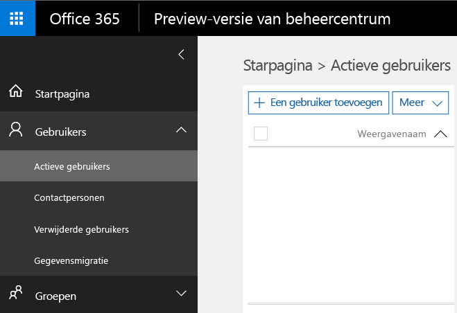
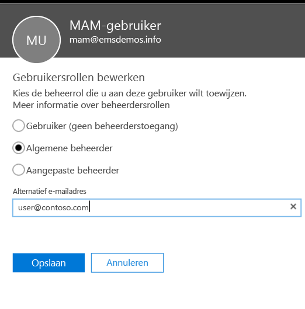
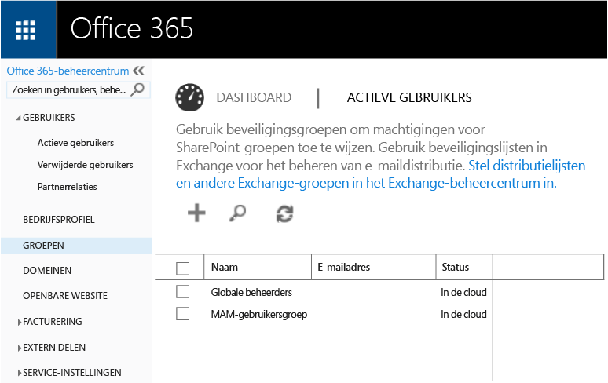
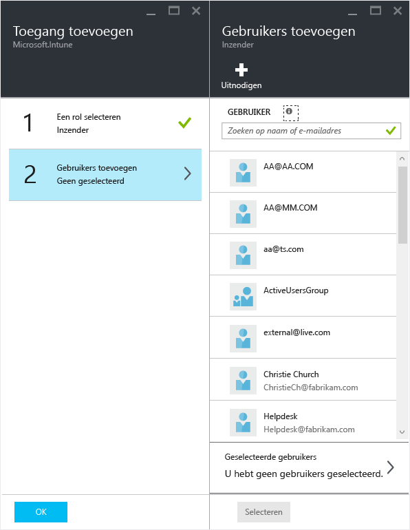

---
# required metadata

title: Voorbereidingen voor het configureren van beleid voor het beheer van mobiele apps (Mobile App Management) | Microsoft Intune
description:
keywords:
author: karthikaraman
manager: jeffgilb
ms.date: 04/28/2016
ms.topic: article
ms.prod:
ms.service: microsoft-intune
ms.technology:
ms.assetid: 7e6a85e7-e007-41b6-9034-64d77f547b87

# optional metadata

#ROBOTS:
#audience:
#ms.devlang:
ms.reviewer: jeffgilb
ms.suite: ems
#ms.tgt_pltfrm:
#ms.custom:

---

# Voorbereidingen voor het configureren van beleid voor het beheer van mobiele apps (Mobile App Management) met Microsoft Intune
In dit onderwerp wordt uitgelegd wat u moet doen voordat u beleid voor het beheer van mobiele apps (Mobile App Management, MAM) in de Azure-portal kunt maken.
Als u momenteel de **Intune-beheerconsole** gebruikt om uw apparaten te beheren, kunt u met de [Intune-beheerconsole](configure-and-deploy-mobile-application-management-policies-in-the-microsoft-intune-console.md) MAM-beleid maken dat apps ondersteunt voor apparaten die zijn ingeschreven bij Intune..
>[!IMPORTANT]
> Mogelijk ziet u in de Intune-beheerconsole niet alle MAM-beleidsinstellingen. De Azure-portal is de nieuwe beheerconsole voor het maken van MAM-beleid.

##  Ondersteunde platforms
- iOS 8.1 of hoger

- Android 4 of hoger

##  Ondersteunde apps
Ga voor de volledige lijst met ondersteunde apps naar de [galerie met mobiele toepassingen van Microsoft Intune](https://www.microsoft.com/en-us/server-cloud/products/microsoft-intune/partners.aspx) op de pagina voor Microsoft Intune-toepassingen van partners.
Klik op de app als u de ondersteunde scenario's en platforms wilt bekijken en wilt controleren of de app meerdere identiteiten ondersteunt.

**Voordat** u MAM-beleid kunt configureren, hebt u het volgende nodig:

-   **Een abonnement op Microsoft Intune**.    Eindgebruikers hebben [!INCLUDE[wit_nextref](../includes/wit_nextref_md.md)]-licenties nodig om apps met MAM-beleid te kunnen downloaden.

-   De **instantie voor beheer van mobiele apparaten** moet worden ingesteld op **Intune** of **Configuration Manager**, afhankelijk van of u gebruikmaakt van Intune alleen of van Configuration Manager geïntegreerd met Intune om uw apparaten te beheren. Als u in O365 geïntegreerd beheer voor mobiele apparaten gebruikt, moet u een Intune-abonnement aanschaffen en [Intune instellen als de instantie voor beheer van mobiele apparaten](get-ready-to-enroll-devices-in-microsoft-intune.md#set-mobile-device-management-authority)..
-   Een abonnement op **Office 365 (O365)**. Dit is vereist voor het volgende:
  - Het toepassen van MAM-beleid op apps met ondersteuning voor meerdere identiteiten.
  - Het maken van SharePoint Online- en Exchange Online-werkaccounts. Exchange On-premises en SharePoint On-premises worden niet ondersteund.

- **Azure Active Directory (Azure AD)** voor het maken van gebruikers. Azure AD verifieert de gebruiker wanneer de eindgebruiker de app start en zijn werkreferenties invoert.

    > [!NOTE]
    > Als u gebruikers instelt met behulp van de [!INCLUDE[wit_nextref](../includes/wit_nextref_md.md)]-console, moet u er rekening mee houden dat de configuratie van MAM-beleid in de toekomst naar de Azure-portal wordt verplaatst en dat u voor het gebruik van deze portal Azure AD-gebruikersgroepen moet instellen met behulp van de Office 365-portal.

## Gebruikers maken en Microsoft Intune-licenties toewijzen

1. U hebt een Intune-abonnement nodig. U hebt al een [!INCLUDE[wit_nextref](../includes/wit_nextref_md.md)]-abonnement als u momenteel [!INCLUDE[wit_nextref](../includes/wit_nextref_md.md)] gebruikt om uw apparaten te beheren.  U hebt ook een [!INCLUDE[wit_nextref](../includes/wit_nextref_md.md)]-abonnement als u een EMS-licentie hebt aangeschaft. Als u [!INCLUDE[wit_nextref](../includes/wit_nextref_md.md)] uitprobeert om te zien wat de MAM-mogelijkheden zijn, kunt u [hier](http://www.microsoft.com/en-us/server-cloud/products/microsoft-intune/) een proefaccount aanvragen..

    Als u wilt controleren of u een [!INCLUDE[wit_nextref](../includes/wit_nextref_md.md)]-abonnement op de Office-portal hebt, gaat u naar de pagina Facturering.  [!INCLUDE[wit_nextref](../includes/wit_nextref_md.md)] zou onder abonnementen als **Actief** moeten zijn aangemerkt.

2.  Meld u met uw beheerdersreferenties aan bij   [de Office-portal](http://portal.office.com) .

3.  Ga naar de pagina **Actieve gebruikers** om gebruikers toe te voegen en [!INCLUDE[wit_nextref](../includes/wit_nextref_md.md)]-licenties toe te wijzen.

    

4.  Als u een gebruiker toegang wilt geven tot de Office-portal, de Azure AD-portal en de Azure-portal, wijst u aan de gebruiker de **rol van algemeen beheerder** toe.

    

5.  MAM-beleid wordt voor gebruikersgroepen geïmplementeerd in Azure Active Directory. Als u gebruikersgroepen wilt maken voor gebruik met uw MAM-beleid, gaat u naar de pagina **Groepen** in de **Office-portal** en klikt u op het pictogram **+** om een nieuwe beveiligingsgroep te maken.  Voer een naam en beschrijving in en klik op **Maken**. Nadat de groep is gemaakt, kunt u gebruikers aan de groep toevoegen door bij de nieuwe beveiligingsgroep op **Leden bewerken** te klikken. De beveiligingsgroep wordt gemaakt in Azure Active Directory.

    

De volgende tabel bevat de rollen en machtigingen die u aan beheergebruikers kunt toewijzen.

|||
|--|----|
|**Rol**|**Machtigingen**|
|Algemeen beheerder (O365-portal)|Toegang tot de O365-portal en Azure AD-portal  Toegang tot de Azure-portal (kan zowel rollen beheren als taken voor het beheer van mobiele apps uitvoeren).|
|Rol van eigenaar (Azure-portal)|Toegang tot de Azure-portal (kan zowel rollen beheren als taken voor het beheer van mobiele apps uitvoeren).|
|Rol van inzender (Azure-portal)|Toegang tot de Azure-portal (kan alleen taken voor het beheer van mobiele apps uitvoeren).|

## De rol van Inzender toewijzen aan een gebruiker

**Algemene beheerders** hebben toegang tot de Azure-portal.  Als u andere beheergebruikers in staat wilt stellen om beleid te configureren en andere taken voor het beheer van mobiele apps uit te voeren, wijst u de **rol van Inzender** toe aan de gebruiker, zoals hieronder wordt beschreven:

1.  Klik op het tabblad **Instellingen** in het gedeelte **Bronbeheer** op de optie **Gebruikers**..

    

2.  Klik op **Toevoegen** om de blade **Toegang toevoegen** te openen.

3.  Klik op **Selecteer een rol** en vervolgens op **Rol van Inzender**..

    

4.  Nadat u de rol hebt geselecteerd, klikt u op **Gebruiker toevoegen** en zoekt u naar de gebruiker op gebruikersnaam of e-mailadres. De gebruikers die u in deze lijst ziet, zijn de eerste 1000 gebruikers die u eerder in Azure AD hebt gemaakt met behulp van de Office-portal. Klik op **OK** op de blade **Toegang toevoegen** om de gebruiker op te slaan en de rol aan de gebruiker toe te wijzen.

    

    > [!IMPORTANT]
    > Als u een gebruiker selecteert aan wie geen [!INCLUDE[wit_nextref](../includes/wit_nextref_md.md)]-licentie is toegewezen, heeft deze geen toegang tot de portal.

## Volgende stappen
[Beleid voor Mobile App Management maken en implementeren met Microsoft Intune](create-and-deploy-mobile-app-management-policies-with-microsoft-intune.md)

<!--HONumber=May16_HO1-->

