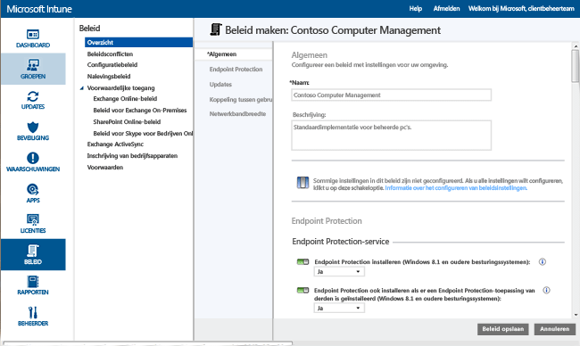
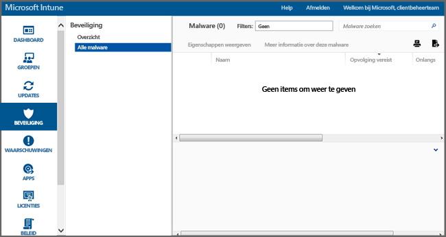

# Help Windows-pc's beveiligen met Endpoint Protection Help voor Microsoft Intune
Microsoft Intune kan u helpen uw beheerde computers op verschillende manieren te beschermen, waaronder Endpoint Protection. Dit biedt realtime-beveiliging tegen bedreigingen door schadelijke software, houdt malwaredefinities bijgewerkt en scant computers automatisch. Ook biedt Endpoint Protection hulpmiddelen waarmee u malware-aanvallen kunt beheren en controleren.

Zie [De Windows-pc-client installeren met Windows Intune](install-the-windows-pc-client-with-microsoft-intune.md) als u de Intune-client nog niet op uw computers hebt geïnstalleerd.

Gebruik de informatie in de volgende rubrieken voor hulp bij het configureren, implementeren en controleren van Endpoint Protection.

## Kiezen wanneer u Endpoint Protection wilt gebruiken
Als IT-beheerder is een van uw eerste prioriteiten ervoor te zorgen dat de computers die u beheert, geen schadelijke software en virussen bevatten. Voordat u Intune op Windows-pc’s in uw organisatie implementeert, moet u bepalen hoe u uw computers beveiligt door een van de volgende opties te selecteren en de bijbehorende beleidsinstellingen te configureren:

|Ik wil:|Endpoint Protection-beleidsinstellingen|Meer informatie|
|--------------|---------------------------------------|--------------------|
|Gebruik Microsoft Intune Endpoint Protection alleen als er geen eindpuntbeveiligingstoepassing van derden is geïnstalleerd.  U kunt Microsoft Intune Endpoint Protection gebruiken op alle computers waarop geen eindpuntbeveiligingstoepassing van derden is geïnstalleerd.|Endpoint Protection installeren = **Ja**  Endpoint Protection inschakelen = **Ja**  Endpoint Protection installeren, zelfs als er een eindpuntbeveiligingstoepassing van derden is geïnstalleerd = **Nee**|Als een eindpuntbeveiligingstoepassing van derden wordt gedetecteerd, wordt Microsoft Intune Endpoint Protection niet geïnstalleerd of wordt de installatie ongedaan gemaakt als het programma al is geïnstalleerd.|
|Microsoft Intune Endpoint Protection gebruiken, zelfs als er een eindpuntbeveiligingstoepassing van derden is geïnstalleerd  Met deze methode voert u Microsoft Intune Endpoint Protection en de eindpuntbeveiligingstoepassing van derden tegelijkertijd uit. Deze configuratie wordt afgeraden, omdat er zich dan prestatieproblemen kunnen voordoen.|Endpoint Protection installeren = **Ja**  Endpoint Protection inschakelen = **Ja**  Endpoint Protection installeren, zelfs als er een eindpuntbeveiligingstoepassing van derden is geïnstalleerd = **Ja**|Gebruiken wanneer:  - U wilt overschakelen op het gebruik van Microsoft Intune Endpoint Protection. - U een nieuwe client met Microsoft Intune Endpoint Protection implementeert. - U een client bijwerkt met Microsoft Intune Endpoint Protection.|
|Gebruik Intune zonder Microsoft Intune Endpoint Protection. In plaats daarvan vertrouwt u op een eindpuntbeveiligingstoepassing van derden.|Endpoint Protection installeren = **Nee**|Als u geen eindpuntbeveiligingstoepassing van derden gebruikt, wordt deze configuratie afgeraden. De computers worden namelijk blootgesteld aan schadelijke software of andere aanvallen.  Microsoft Intune Endpoint Protection wordt niet geïnstalleerd en wordt verwijderd als dit eerder is geïnstalleerd.|
Als u van uw huidige eindpuntbeveiligingstoepassing wilt overschakelen op Microsoft Intune Endpoint Protection, gaat u als volgt te werk:

1.  Houd uw huidige eindpuntbeveiligingstoepassing actief, terwijl u de Intune-clientsoftware op de betreffende computers implementeert.

2.  Controleer of Microsoft Intune Endpoint Protection is geïnstalleerd en u helpt bij de beveiliging van clientcomputers.

3.  Verwijder de eindpuntbeveiligingssoftware van derden door:

    -   Intune-softwaredistributie te gebruiken om een softwareverwijderingshulpmiddel te implementeren dat is geleverd door de fabrikant van de eindpuntbeveiligingstoepassing van derden. Zie [Apps implementeren met Microsoft Intune](deploy-apps.md) voor meer informatie.

    -   De eindpuntbeveiligingstoepassing van derden handmatig te verwijderen.

> [!NOTE]
> Intune verwijdert eindpuntbeveiligingstoepassingen van derden niet automatisch.

## Microsoft Intune Endpoint Protection configureren
Gebruik de volgende stappen om u te helpen bij het configureren van Endpoint Protection voor Microsoft Intune.

1.  Klik in de [Microsoft Intune-beheerconsole](https://manage.microsoft.com/) op **Beleid** > **Beleid toevoegen**.

2.  Vouw **Computerbeheer** uit en selecteer **Instellingen Microsoft Intune-agent**. Selecteer **Aangepast beleid maken en implementeren** om beleid op te geven voor Endpoint Protection-instellingen en klik vervolgens op de knop **Beleid maken**. U kunt de aanbevolen instellingen gebruiken of de instellingen aanpassen. Als u meer informatie wilt over het maken en implementeren van beleid, raadpleegt u het onderwerp [Algemene beheertaken voor Windows-pc’s met de Microsoft Intune-computerclient](common-windows-pc-management-tasks-with-the-microsoft-intune-computer-client.md).

  

U kunt het geïmplementeerde Endpoint Protection-beleid zien op de pagina **Alle beleidsregels** van de werkruimte **Beleid**.

## Instellingen van Endpoint Protection-service

|Beleidsinstelling|Details|
|------------------|--------------------|
|**Endpoint Protection installeren**|Ingesteld op **Ja** om Endpoint Protection op beheerde computers te installeren. Als er een eindpuntbeveiligingstoepassing van derden wordt gedetecteerd tijdens de installatie, wordt Endpoint Protection niet geïnstalleerd, tenzij **Endpoint Protection installeren, zelfs als er een eindpuntbeveiligingstoepassing van derden is geïnstalleerd** is ingesteld op **Ja**. **Opmerking:** Intune Endpoint Protection wordt standaard op beheerde computers geïnstalleerd. Als u Endpoint Protection niet op uw beheerde computers wilt installeren, moet u dit beleid expliciet instellen op **Nee**. Als Endpoint Protection eerder is geïnstalleerd en het beleid wordt bijgewerkt naar **Nee**, wordt de Endpoint Protection-client verwijderd. Aanbevolen waarde: **Ja**|
|**Endpoint Protection installeren, zelfs als er een eindpuntbeveiligingstoepassing van derden is geïnstalleerd**|Ingesteld op **Ja** om Microsoft Intune Endpoint Protection te gebruiken, zelfs als er een eindpuntbeveiligingstoepassing van derden is gedetecteerd.  Aanbevolen waarde: **Ja**|
|**Endpoint Protection inschakelen**|Ingesteld op **Ja** om Microsoft Intune Endpoint Protection in te schakelen op computers met de Endpoint Protection-client.  Als deze optie is ingesteld op **Nee** en Microsoft Intune Endpoint Protection is geïnstalleerd, wordt de gebruikersinterface van de Endpoint Protection-client niet weergegeven voor gebruikers en zijn alle beveiligingsfuncties inactief.  Aanbevolen waarde: **Ja**|
|**Gebruikersinterface van client uitschakelen**|Ingesteld op **Ja** om de gebruikersinterface van de Microsoft Intune Endpoint Protection-client voor gebruikers te verbergen (vereist dat een clientcomputer opnieuw wordt opgestart om de instelling door te voeren).  Aanbevolen waarde: **Nee**|
|**Endpoint Protection installeren, zelfs als er een eindpuntbeveiligingstoepassing van derden is geïnstalleerd**|Ingesteld op **Ja** om de installatie van Microsoft Intune Endpoint Protection af te dwingen, zelfs als er een eindpuntbeveiligingstoepassing van derden is gedetecteerd.  Aanbevolen waarde: **Nee**|
|**Een systeemherstelpunt maken vóór het oplossen van malware**|Ingesteld op **Ja** om een Windows-systeemherstelpunt te maken voordat er wordt begonnen met het oplossen van malware.  Aanbevolen waarde: **Ja**|
|**Opgeloste malware bijhouden (dagen)**|Hiermee kan Endpoint Protection gedurende een bepaalde tijd opgeloste malware bijhouden, zodat u handmatig eerder geïnfecteerde computers kunt controleren.  U kunt een waarde van 0 tot 30 dagen opgeven.  Aanbevolen waarde: **7 dagen**|
Als u de beleidswaarden voor **Endpoint Protection installeren** en **Endpoint Protection inschakelen** op **Ja** en de beleidswaarde voor **Endpoint Protection installeren, zelfs als er een eindpuntbeveiligingstoepassing van derden is geïnstalleerd** op **Nee** hebt ingesteld, detecteert Microsoft Intune Endpoint Protection dat er een andere eindpuntbeveiligingstoepassing is geïnstalleerd en wordt de software niet geïnstalleerd of verwijderd als deze al aanwezig is (Microsoft Intune Endpoint Protection rapporteert echter wel over de status van de andere eindpuntbeveiligingstoepassing in Intune).

  Real-timebeveiliging is de manier waarop Microsoft Security Essentials u waarschuwt wanneer mogelijke bedreigingen, zoals virussen of spyware, proberen om zichzelf te installeren of uit te voeren op uw pc. Op het moment dat dit gebeurt, ziet u een bericht in het systeemvak uiterst rechts in de taakbalk.

### Instellingen voor realtime-beveiliging

|Beleidsinstelling|Details|
|------------------|--------------------|
|**Realtime-beveiliging inschakelen**|Hiermee schakelt u in dat alle bestanden en toepassingen waartoe toegang wordt gekregen, worden gecontroleerd en gescand. Ook worden schadelijke bestanden en toepassingen geblokkeerd voordat ze op computers kunnen worden uitgevoerd.  Aanbevolen waarde: **Ja**|
|**Alle downloads scannen**|Hiermee schakelt u in dat alle bestanden en bijlagen worden gescand die van internet naar computers worden gedownload.  Aanbevolen waarde: **Ja**|
|**Activiteit van bestanden en programma's op de computer bewaken**|Hiermee schakelt u in dat activiteiten van binnenkomende en uitgaande bestanden en van programma's op computers worden bewaakt. Met deze instelling kan Endpoint Protection bewaken wanneer bestanden en programma's worden gestart en wordt u geïnformeerd over alle acties die ze uitvoeren of acties die worden uitgevoerd op deze bestanden en programma's.  Aanbevolen waarde: **Ja**|
|**Bewaakte bestanden**|Als **Activiteit van bestanden en programma's op de computer bewaken** is ingeschakeld, kunt u met deze instelling opgeven dat alleen binnenkomende of alleen uitgaande bestanden of alle bestanden worden bewaakt.  Aanbevolen waarde: **Alle bestanden bewaken**|
|**Gedragscontrole inschakelen**|Hiermee kan Microsoft Intune Endpoint Protection controleren op bepaalde patronen van verdachte activiteiten op clientcomputers.  Aanbevolen waarde: **Ja**|
|**Systeem voor netwerkinspectie inschakelen**|Hiermee schakelt u het systeem voor netwerkinspectie (NIS) in op clientcomputers. NIS maakt gebruik van handtekeningen van bekende beveiligingsproblemen van het [Microsoft Centrum voor beveiliging tegen schadelijke software](http://go.microsoft.com/fwlink/?LinkId=234249) om schadelijk netwerkverkeer te helpen detecteren en blokkeren.  Aanbevolen waarde: **Ja**|

  

### Instellingen voor scanschema's

|Beleidsinstelling|Meer informatie|
|------------------|--------------------|
|**Een dagelijkse snelle scan plannen**|Hiermee plant u een dagelijkse snelle scan van zowel veelgebruikte bestanden als belangrijke systeembestanden op computers. Deze snelle scan heeft een minimale invloed op de prestaties.  Aanbevolen waarde: **Ja**|
|**Een snelle scan uitvoeren als u twee opeenvolgende scans hebt gemist**|Hiermee configureert u Endpoint Protection zo dat er automatisch een snelle scan op computers wordt uitgevoerd als er twee opeenvolgende, geplande snelle scans zijn gemist.  Aanbevolen waarde: **Ja**|
|**Een volledige scan plannen**|Hiermee configureert u een volledige scan van alle bestanden en bronnen op de lokale harde schijven van computers. Deze scan kan even duren en kan van invloed zijn op de prestaties van de computer (al naar gelang het aantal bestanden en bronnen dat wordt gescand).  Aanbevolen waarde: **Nee**|
|**Een volledige scan uitvoeren als u twee opeenvolgende volledige scans hebt gemist**|Hiermee configureert u Endpoint Protection zo dat er automatisch een volledige scan op computers wordt uitgevoerd als er twee opeenvolgende, geplande volledige scans zijn gemist.  Aanbevolen waarde: Niet geconfigureerd|

### Instellingen voor scanopties

|Beleidsinstelling|Details|
|------------------|--------------------|
|**Een volledige scan uitvoeren na de installatie van Endpoint Protection**|Hiermee configureert u Endpoint Protection zo dat er automatisch een volledige systeemscan wordt uitgevoerd nadat Endpoint Protection op een computer is geïnstalleerd. Deze scan wordt alleen uitgevoerd als computers niet actief zijn om te voorkomen dat dit gevolgen heeft voor de productiviteit van gebruikers.  Aanbevolen waarde: **Ja**|
|**Automatisch een volledige scan uitvoeren als dit nodig is na het verwijderen van malware**|Ingesteld op **Ja** om Endpoint Protection automatisch een volledige systeemscan op computers te laten uitvoeren na het verwijderen van malware om te helpen bevestigen dat andere bestanden niet zijn geïnfecteerd.  Aanbevolen waarde: **Ja**|
|**Een geplande scan alleen starten als de computer niet actief is**|Ingesteld op **Ja** om te voorkomen dat geplande scans worden gestart wanneer computers worden gebruikt, om verlies van productiviteit te voorkomen.  Aanbevolen waarde: **Ja**|
|**Controleren op de meest recente malware-definities voordat een scan wordt gestart**|Ingesteld op **Ja** om Endpoint Protection automatisch te laten controleren op de meest recente malwaredefinities voordat een scan op computers wordt gestart.  Aanbevolen waarde: **Ja**|
|**Archiefbestanden scannen**|Ingesteld op **Ja** om Endpoint Protection zo te configureren dat er op schadelijke software in archiefbestanden (zoals .zip- of .cab-bestanden) op computers wordt gecontroleerd.  Aanbevolen waarde: **Nee**|
|**E-mailberichten scannen**|Ingesteld op **Ja** om Endpoint Protection zo te configureren dat binnenkomende e-mailberichten worden gescand als deze op computers binnenkomen.  Aanbevolen waarde: **Ja**|
|**Bestanden scannen die worden geopend vanuit gedeelde netwerkmappen**|Ingesteld op **Ja** om Endpoint Protection zo te configureren dat de bestanden worden gecontroleerd die worden geopend vanuit gedeelde mappen op het netwerk. Dit zijn meestal bestanden die toegankelijk zijn via een UNC-pad. Het inschakelen van deze functie kan problemen veroorzaken voor gebruikers die alleen-lezen toegang hebben, omdat ze geen schadelijke software kunnen verwijderen.  Aanbevolen waarde: **Nee**|
|**Toegewezen netwerkstations scannen**|Ingesteld op **Ja** om Endpoint Protection zo te configureren dat bestanden op toegewezen netwerkstations worden gescand. Het inschakelen van deze functie kan problemen veroorzaken voor gebruikers die alleen-lezen toegang hebben, omdat ze geen schadelijke software kunnen verwijderen.  Aanbevolen waarde: **Nee**|
|**Verwisselbare stations scannen**|Ingesteld op **Ja** om Endpoint Protection zo te configureren dat er op schadelijke en ongewenste software op verwisselbare stations (bijvoorbeeld USB-stations) wordt gescand wanneer u een volledige scan op computers uitvoert.  Aanbevolen waarde: **Ja**|
|**CPU-verbruik tijdens een scan beperken**|Hiermee configureert u het maximale percentage CPU-verbruik dat kan worden gebruikt tijdens geplande scans op computers. U kunt deze waarde instellen van 1 tot 100 procent.  Aanbevolen waarde: **50%**|

### Instellingen voor standaardacties

Met de instelling **Kiezen hoe Endpoint Protection omgaat met schadelijke software met de volgende waarschuwingsniveaus** geeft u de standaardactie op die door Endpoint Protection moet worden uitgevoerd wanneer er malware van verschillende waarschuwingsniveaus wordt gedetecteerd. Voor elk waarschuwingsniveau kunt u de malware verwijderen of in quarantaine plaatsen of de actie uitvoeren die door Microsoft wordt aanbevolen. Aanbevolen waarde: **Aanbevolen actie**, waarmee Endpoint Protection wordt toegestaan actie te ondernemen.   

### Instellingen voor uitgesloten bestanden en mappen

Met de instelling **Bestanden en mappen die u wilt uitsluiten bij een scan of bij realtime-beveiliging** worden specifieke bestanden of mappen uitgesloten wanneer er een scan wordt uitgevoerd of wanneer realtime-beveiliging op computers wordt gebruikt.

### Instellingen voor uitgesloten processen

Met de instelling **Processen die uitgesloten moeten worden bij het scannen en bij realtime-beveiliging** kunt u specifieke processen uitsluiten wanneer er een scan wordt uitgevoerd of bij realtime-beveiliging. U kunt alleen bestanden met de volgende extensies uitsluiten: **.exe**, **.com** en **.scr**.

### Instellingen voor uitgesloten bestandstypen

Met de instelling **Bestandsextensies die u wilt uitsluiten bij een scan of bij realtime-beveiliging** worden specifieke bestandsnaamextensies uitgesloten wanneer er een scan wordt uitgevoerd of wanneer realtime-beveiliging op computers wordt gebruikt.

### Instellingen voor Microsoft Active Protection Service
Microsoft Active Protection Service is een onlinecommunity die helpt bepalen hoe u op mogelijke bedreigingen reageert. De community helpt ook de verspreiding van nieuwe malware-infecties te stoppen. U kunt zich **Aanmelden bij Microsoft Active Protection Service** door **Ja** te selecteren en vervolgens uw **Niveau lidmaatschap** op te geven:
  - **Basis**: verzendt basisinformatie over de gedetecteerde malware naar Microsoft. Dit omvat waar de software van afkomstig is, de acties die u toepast of die Endpoint Protection automatisch toepast en of de acties met succes zijn uitgevoerd.
  - **Geavanceerd**: verzendt meer informatie over malware, spyware en mogelijk ongewenste software naar Microsoft. Dit omvat de locatie van de software, bestandsnamen, hoe de software werkt en hoe deze uw computer heeft beïnvloed.

U kunt ook **Dynamische definities ontvangen, gebaseerd op rapporten van Microsoft Active Protection Service**.

## Beheertaken voor Endpoint Protection
De volgende taken helpen u bij het uitvoeren van verschillende beheertaken op beheerde computers met Endpoint Protection.
 - Malware-definities bijwerken
  - Intune-console: selecteer in de werkruimte **Groepen** de computers die u wilt bijwerken. Klik op **Externe taken** &gt; **Malware-definities bijwerken**.
  - Beheerde computer: start de Endpoint Protection-clientsoftware in het systeemvak. Klik op het tabblad **Bijwerken** en klik vervolgens op **Bijwerken**.
 - Ga als volgt te werk om een scan op schadelijke software uit te voeren:
  - Intune console: selecteer in de werkruimte **Groepen** de computers die u wilt scannen. Klik op **Een volledige scan op malware uitvoeren** of **Een snelle scan op malware uitvoeren**.
  - Beheerde computer: start de Endpoint Protection-clientsoftware in het systeemvak. Selecteer **Snel**, **Volledig**of **Aangepast**en klik vervolgens op **Nu scannen**.

U kunt de status van een externe taak weergeven door te klikken op de koppeling **Externe taken** in de rechterbenedenhoek van de Intune-console. In het dialoogvenster **Status van externe taak** ziet u de huidige externe taken, de taakstatus, de apparaatnaam, gerapporteerde fouten en een koppeling naar oplossingen van problemen, indien van toepassing.

## Endpoint Protection controleren
U kunt de status van schadelijke software op uw computers controleren met behulp van de werkruimte **Beveiliging** van de [Microsoft Intune-beheerconsole](https://manage.microsoft.com/). Deze werkruimte bevat twee pagina's:
 - **Overzicht Endpoint Protection**: bevat belangrijke zaken als koppelingen waarop u kunt klikken voor meer informatie. Dit kan gaan over:
  - **Malware-exemplaren die moeten worden opgevolgd**: klik op de koppeling voor een overzicht van malwareproblemen, inclusief de actie die moet worden ondernomen om het probleem te verhelpen. U kunt verder inzoomen in deze lijst om te zien welke computers zijn beïnvloed.
  - **Computers met malware die moeten worden opgevolgd**: klik op de koppeling om alle computers met niet-opgeloste malwareproblemen weer te geven, inclusief de actie die moet worden ondernomen om het probleem te verhelpen.
  - **Apparaten die niet zijn beveiligd**: klik op de koppeling om te zien welke computers niet zijn beveiligd door eindpuntbeveiligingssoftware omdat er geen software is geïnstalleerd of omdat er een fout is opgetreden. Selecteer een computer om meer details te bekijken.
  - **Apparaten waarop een andere eindpuntbeveiligingstoepassing actief is**: klik op de koppeling om te zien op welke computers een eindpuntbeveiligingstoepassing van derden wordt uitgevoerd.
 - **Alle malware**: geeft een lijst weer van alle actieve malware op uw computers. U kunt inzoomen in deze lijst om te zien welke computers worden beïnvloed door een bepaald onderdeel van malware. Ook kunt u een van de volgende taken selecteren:
  - **Eigenschappen weergeven**: opent een pagina met meer informatie over de geselecteerde malware.
  - **Meer informatie over deze malware**: opent een onderwerp van het Microsoft Malware Protection Center met meer informatie over de malware.

> [!IMPORTANT]
> De werkruimte **Beveiliging** wordt pas weergegeven in de beheerdersconsole nadat u de client op ten minste één computer hebt geïnstalleerd en de client beheert.

  

### Recente detectiepaden voor malware op computers weergeven
Met Intune kunt u de paden van maximaal 10 onlangs gedetecteerde exemplaren van malware op een apparaat weergeven. De optie **Recent detectiepad** is standaard uitgeschakeld. Deze weergave inschakelen:

1.  Ga in de [Microsoft Intune-beheerconsole](https://manage.microsoft.com/) naar **Groepen** > **Alle apparaten**. **Malware**.

2.  Klik met de rechtermuisknop op een kolomkop. Een lijst met beschikbare kolommen wordt weergegeven.

3.  Schakel in de lijst het selectievakje **Recente detectiepaden** in. De kolom **Recente detectiepaden** wordt weergegeven en toont de 10 onlangs op het apparaat gedetecteerde malware-exemplaren.

## Een malwarescan uitvoeren of de malwaredefinities op een computer bijwerken
U kunt met Intune een volledige of snelle malwarescan uitvoeren met Endpoint Protection of Windows Defender op een externe beheerde pc waarop de Intune-client is geïnstalleerd.

1. Ga in de [Microsoft Intune-beheerconsole](https://manage.microsoft.com/) naar **Groepen** > **Overzicht** > **Alle apparaten** > **Alle computers** en selecteer de computer die u wilt targeten.

2. Klik op de vervolgkeuzelijst **Externe taken** en selecteer de taak. De taak die moet worden uitgevoerd op de externe computer.

## Meer hulp nodig?
Zie [Problemen met Endpoint Protection in Microsoft Intune oplossen](/intune/troubleshoot/troubleshoot-endpoint-protection-in-microsoft-intune) voor meer hulp en ondersteuning.

### Zie ook
[Beleid voor het beveiligen van Windows-pc's](policies-to-protect-windows-pcs-in-microsoft-intune.md)

<!--HONumber=Jul16_HO3-->

