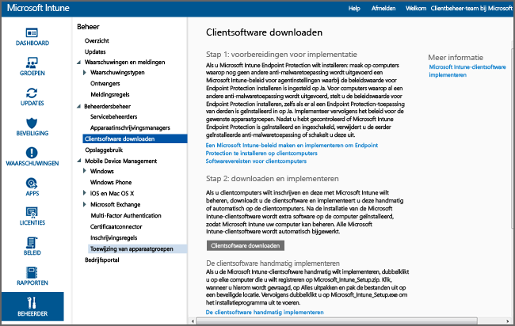

# De Windows-pc-client installeren met Microsoft Intune
Gebruik deze handleiding om uw Windows-pc's te laten beheren door de Microsoft Intune-clientsoftware.

## Voordat u begint
Lees, voordat u de Intune-clientsoftware installeert, het onderwerp [Conflicten tussen GPO-beleid en Microsoft Intune-beleid oplossen](resolve-gpo-and-microsoft-intune-policy-conflicts.md) om te begrijpen wat u nodig hebt om de client correct te installeren. Keer vervolgens terug naar deze instructies.

## De client installeren
Volg deze stappen om de client op te halen:

-   [De clientsoftware downloaden](#to-download-the-client-software)

Gebruik vervolgens een of meer van de volgende methoden om de client te installeren:

-   [De clientsoftware handmatig implementeren](#to-manually-deploy-the-client-software)

-   [De clientsoftware automatisch implementeren met Groepsbeleid](#to-automatically-deploy-the-client-software-by-using-group-policy)

-   [De Microsoft Intune-clientsoftware installeren met een installatiekopie](#install-the-microsoft-intune-client-software-as-part-of-an-image)

Als u een computer niet langer hoeft te beheren met Intune, kunt u de computer buiten gebruik stellen. Hierdoor wordt de clientsoftware ook van de betreffende computer verwijderd. Zie [Algemene beheertaken voor Windows-pc's met de Microsoft Intune-computerclient](common-windows-pc-management-tasks-with-the-microsoft-intune-computer-client.md) voor meer informatie.

### De clientsoftware downloaden

1.  Klik in de [Microsoft Intune-beheerconsole](https://manage.microsoft.com/) op **Beheer** &gt; **Clientsoftware downloaden**

  

2.  Klik op de pagina **Clientsoftware downloaden** op **Clientsoftware downloaden** en sla het **Microsoft_Intune_Setup.zip**-pakket met de software op een veilige locatie in het netwerk op.

    > [!NOTE]
    > Het installatiepakket voor de Intune-clientsoftware bevat informatie over uw account. Als niet-gemachtigde gebruikers toegang krijgen tot het installatiepakket, kunnen ze computers inschrijven bij het account van het certificaat dat is ingesloten in het pakket.

3.  Pak de inhoud van het installatiepakket uit naar een beveiligde locatie in het netwerk.

    > [!IMPORTANT]
    > Hernoem of verwijder het uitgepakte bestand **ACCOUNTCERT** niet, anders mislukt de installatie van de clientsoftware.

### De clientsoftware handmatig implementeren

1.  Blader op een computer naar de map met de installatiebestanden van de clientsoftware en voer **Microsoft_Intune_Setup.exe** uit om de clientsoftware te installeren.

    > [!NOTE]
    > De status van de installatie wordt weergegeven wanneer u met de muisaanwijzer over het pictogram in het systeemvak van de clientcomputer beweegt.

### De clientsoftware automatisch implementeren met Groepsbeleid

1.  Voer onderstaande opdracht uit in de map met de bestanden **Microsoft_Intune_Setup.exe** en **MicrosoftIntune.accountcert** om de op Windows Installer gebaseerde installatieprogramma's voor 32-bits en 64-bits computers te extraheren:

    ```
    Microsoft_Intune_Setup.exe/Extract <destination folder>
    ```

2.  Kopieer de bestanden **Microsoft_Intune_x86.msi**, **Microsoft_Intune_x64.msi** en **MicrosoftIntune.accountcert** naar een netwerklocatie die toegankelijk is voor alle computers waarop de clientsoftware moet worden geïnstalleerd.

    > [!IMPORTANT]
    > Scheid of hernoem de bestanden niet, anders mislukt de installatie van de clientsoftware.

3.  Gebruik Groepsbeleid om de software te implementeren op de computers in uw netwerk.

    Raadpleeg de Windows Server-documentatie voor meer informatie over het gebruik van Groepsbeleid om software automatisch te implementeren.

### De Microsoft Intune-clientsoftware installeren met een installatiekopie
U kunt de Intune-clientsoftware op computers implementeren met een installatiekopie van het besturingssysteem door de volgende voorbeeldprocedure als uitgangspunt te gebruiken:

1.  Kopieer de clientinstallatiebestanden **Microsoft_Intune_Setup.exe** en **MicrosoftIntune.accountcert** naar de map **%Systemdrive%\Temp\Microsoft_Intune_Setup** op de referentiecomputer.

2.  Maak de registervermelding **WindowsIntuneEnrollPending** door de volgende opdracht toe te voegen aan het script **SetupComplete.cmd**:

    ```
    %windir%\system32\reg.exe add HKEY_LOCAL_MACHINE\Software\Microsoft\Onlinemanagement\Deployment /v
    WindowsIntuneEnrollPending /t REG_DWORD /d 1
    ```

3.  Voeg de volgende opdracht toe aan **setupcomplete.cmd** om het inschrijvingspakket uit te voeren met het opdrachtregelargument /PrepareEnroll:

    ```
    %systemdrive%\temp\Microsoft_Intune_Setup\Microsoft_Intune_Setup.exe /PrepareEnroll
    ```
    > [!TIP]
    > Het script **SetupComplete.cmd** staat Windows Setup toe om wijzigingen aan te brengen in het systeem voordat een gebruiker zich aanmeldt. Het opdrachtregelargument **/PrepareEnroll** bereidt een doelcomputer voor om automatisch te worden ingeschreven in Intune nadat Windows Setup is voltooid.

4.  Plaats **SetupComplete.cmd** in de map **%Windir%\Setup\Scripts** op de referentiecomputer.

5.  Leg een installatiekopie van de referentiecomputer vast en implementeer deze vervolgens op de doelcomputers.

Wanneer de doelcomputer opnieuw wordt opgestart om Windows Setup te voltooien, wordt de registervermelding **WindowsIntuneEnrollPending** gemaakt. Het inschrijvingspakket controleert of de computer is ingeschreven. Als de computer is ingeschreven, is er geen verdere actie nodig. Als de computer niet is ingeschreven, maakt het inschrijvingspakket een automatische inschrijvingstaak voor Microsoft Intune.

Wanneer de automatische inschrijvingstaak wordt uitgevoerd op het volgende geplande tijdstip, wordt gecontroleerd of de registerwaarde **WindowsIntuneEnrollPending** bestaat en wordt geprobeerd om de doel-pc in te schrijven bij Intune. Als de inschrijving om een of andere reden mislukt, wordt een nieuwe poging ondernomen de volgende keer dat de taak wordt uitgevoerd. De nieuwe pogingen worden een maand lang uitgevoerd.

De automatische inschrijvingstaak voor Intune, de registerwaarde **WindowsIntuneEnrollPending** en het accountcertificaat worden van de doelcomputer verwijderd wanneer de inschrijving is geslaagd of anders na één maand.

## Geslaagde clientimplementatie controleren en valideren
Gebruik een van de volgende procedures om de clientimplementatie te controleren en te valideren.

### De installatie van de clientsoftware vanaf de Microsoft Intune-beheerconsole verifiëren

1.  Klik in de [Microsoft Intune-beheerconsole](https://manage.microsoft.com/) op **Groepen** &gt; **Alle apparaten** &gt; **Alle computers**.

2.  Schuif omlaag in de lijst met computers om de beheerde computers te vinden die met Intune communiceren, of zoek naar een specifieke beheerde computer door de naam van de computer, of een deel van de naam, te typen in het vak **Apparaten zoeken**.

3.  Controleer de status van de computer in het onderste deelvenster van de console en los eventuele fouten op.

### Een computerinventarisrapport maken om alle ingeschreven computers weer te geven

1.  Klik in de [Microsoft Intune-beheerconsole](https://manage.microsoft.com/) op **Rapporten** &gt; **Computerinventarisatierapporten**.

2.  Behoud op de pagina **Nieuw rapport maken** de standaardwaarde voor alle velden (tenzij u filters wilt toepassen) en klik op **Rapport weergeven**.

3.  De pagina **Computerinventarisrapport** wordt in een nieuw venster geopend met alle computers die zijn ingeschreven bij Intune.

    > [!TIP]
    > Klik op een kolomkop in het rapport om de lijst te sorteren op de inhoud van die kolom.


### Zie ook
[Windows-pc’s Microsoft Intune beheren](manage-windows-pcs-with-microsoft-intune.md)
[Problemen met clientinstallatie oplossen](../troubleshoot/troubleshoot-client-setup-in-microsoft-intune)


<!--HONumber=Aug16_HO4-->


