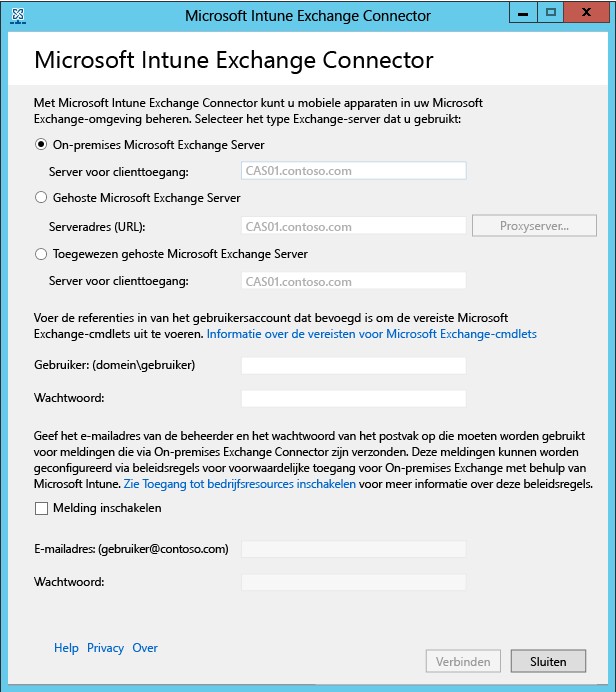

---
# required metadata

title: De Microsoft Intune Exchange Connector installeren voor On-Premises Exchange | Microsoft Intune
description:
keywords:
author: NathBarn
manager: jeffgilb
ms.date: 04/28/2016
ms.topic: article
ms.prod:
ms.service: microsoft-intune
ms.technology:
ms.assetid: 41ff4212-a6f5-4374-8731-631f7560cff1

# optional metadata

#ROBOTS:
#audience:
#ms.devlang:
ms.reviewer: jeffgilb
ms.suite: ems
#ms.tgt_pltfrm:
#ms.custom:

---

# De Intune On-Premises Exchange Connector installeren

Als u een verbinding wilt instellen waarmee Microsoft Intune kan communiceren met de Exchange Server die als host fungeert voor de postvakken van de mobiele apparaten, moet u de On-Premises Connector uit de Intune-beheerconsole downloaden en configureren.

## Vereisten voor de lokale connector
De volgende tabel bevat de vereisten voor de computer waarop u de On-Premises Exchange Connector installeert.

|Vereiste|Meer informatie|
|---------------|--------------------|
|Besturingssystemen|Intune ondersteunt de On-Premises Exchange Connector op een computer waarop een versie van Windows Server 2008 SP2 64-bits, Windows Server 2008 R2, Windows Server 2012 of Windows Server 2012 R2 wordt uitgevoerd.  De connector wordt niet ondersteund op een Server Core-installatie.|
|Microsoft Exchange-versie|De On-Premises Connector vereist Microsoft Exchange 2010 SP1 of hoger.|
|Instantie voor beheer van mobiele apparaten| [De Mobile Device Management-instantie instellen op Intune](get-ready-to-enroll-devices-in-microsoft-intune.md#set-mobile-device-management-authority).|
|Hardware|De computer waarop u de connector installeert, vereist een 1,6 GHz-processor met 2 GB RAM-geheugen en 10 GB aan vrije schijfruimte als minimale hardwarevereisten.|
|Active Directory-synchronisatie|Voordat u een van deze connectors kunt gebruiken om Intune te verbinden met uw Exchange-server, moet u [Active Directory-synchronisatie instellen](/intune/get-started/start-with-a-paid-subscription-to-microsoft-intune-step-3), zodat uw lokale gebruikers en beveiligingsgroepen worden gesynchroniseerd met uw exemplaar van Azure Active Directory.|
|Aanvullende software|Een volledige installatie van Microsoft .NET Framework 4 en Windows PowerShell 2.0 moet worden geïnstalleerd op de computer die als host fungeert voor de connector.|
|Netwerk|De computer waarop u de connector installeert, moet zich in een domein bevinden dat een vertrouwensrelatie heeft met het domein dat als host fungeert voor uw Exchange-server.  Voor de computer zijn configuraties vereist die de computer toegang geven tot de Intune-service via firewalls en proxyservers via de poorten 80 en 443. Domeinen die door Intune worden gebruikt, zijn onder meer manage.microsoft.com, &#42;manage.microsoft.com en &#42;.manage.microsoft.com.|
|Gehoste Exchange geconfigureerd en actief|Zie [Exchange Server 2016](https://technet.microsoft.com/library/mt170645.aspx) voor meer informatie. |
|De Mobile Device Management-instantie instellen op Intune|[Uw instantie voor het beheer van mobiele apparaten instellen op Intune](get-ready-to-enroll-devices-in-microsoft-intune.md#BKMK_Set_MDM_Authority)|

### Vereisten voor Exchange-cmdlets

U moet een Active Directory-gebruikersaccount maken dat wordt gebruikt door de Intune Exchange Connector. Het account moet gemachtigd zijn om de volgende vereiste Windows PowerShell Exchange-cmdlets uit te voeren:

 -   Get-ActiveSyncOrganizationSettings, Set-ActiveSyncOrganizationSettings
 -   Get-CasMailbox, Set-CasMailbox
 -   Get-ActiveSyncMailboxPolicy, Set-ActiveSyncMailboxPolicy, New-ActiveSyncMailboxPolicy, Remove-ActiveSyncMailboxPolicy
 -   Get-ActiveSyncDeviceAccessRule, Set-ActiveSyncDeviceAccessRule, New-ActiveSyncDeviceAccessRule, Remove-ActiveSyncDeviceAccessRule
 -   Get-ActiveSyncDeviceStatistics
 -   Get-ActiveSyncDevice
 -   Get-ExchangeServer
 -   Get-ActiveSyncDeviceClass
 -   Get-Recipient
 -   Clear-ActiveSyncDevice, Remove-ActiveSyncDevice
 -   Set-ADServerSettings
 -   Get-Command

## Het software-installatiepakket voor de On-Premises Exchange Connector downloaden

1. Open op een ondersteund besturingssysteem voor de On-Premises Exchange Connector de [Microsoft Intune-beheerconsole](http://manage.microsoft.com) (http://manage.microsoft.com) met een gebruikersaccount dat een beheerder is in de Exchange-tenant met een licentie om Exchange Server te gebruiken.

2.  Kies in het snelkoppelingendeelvenster van de werkruimte de optie **Beheer**..

3.  Vouw in het navigatievenster onder **Mobiele apparaten beheren** de optie **Microsoft Exchange** uit en kies vervolgens **Exchange-verbinding instellen**..

4.  Kies op de pagina **Exchange-verbinding instellen** de optie **On-Premises Connector downloaden**..

5.  De On-Premises Exchange Connector bevindt zich in een gecomprimeerde map (.zip) die kan worden geopend of opgeslagen. Kies in het dialoogvenster **Bestand downloaden** de optie **Opslaan** om de gecomprimeerde map op een veilige locatie op te slaan.

> [!IMPORTANT]
> Wijzig of verplaats de bestanden in de map op de On-Premises Exchange Connector niet. Als er inhoud van de map wordt hernoemd of verplaatst, wordt de installatie afgebroken.

## De Intune On-Premises Exchange Connector installeren en configureren
Voer de volgende stappen uit om de Intune On-Premises Exchange Connector te installeren. De On-Premises Exchange Connector kan maar eenmaal per Intune-abonnement worden geïnstalleerd en slechts op één computer. Als u probeert een extra On-Premises Exchange Connector te configureren, wordt de oorspronkelijke verbinding vervangen door de nieuwe.

1.  Pak op een ondersteund besturingssysteem voor de On-Premises Connector de bestanden in **Exchange_Connector_Setup.zip** uit op een veilige locatie.

2.  Nadat de bestanden zijn uitgepakt, opent u de map waarin de bestanden zijn uitgepakt en dubbelklikt u op **Exchange_Connector_Setup.exe** om de On-Premises Exchange Connector te installeren.

    > [!IMPORTANT]
    > Als de doelmap geen veilige locatie is, verwijdert u het certificaatbestand **WindowsIntune.accountcert** nadat u de On-Premises Connector hebt geïnstalleerd.

3.  Selecteer in het veld **Exchange-server** het type Exchange-serveromgeving: **On-Premises Microsoft Exchange Server** of **Gehoste Microsoft Exchange Server**..

  

  Voor een On-Premises Exchange-server geeft u de servernaam of de FQDN-naam van de Exchange-server op die als host fungeert voor de **serverfunctie voor clienttoegang**.

  Voor een gehoste Exchange-server geeft u het adres van de Exchange-server op. De URL van de gehoste Exchange-server zoeken:

      1.  Open de Outlook Web App voor Office 365.

      2.  Kies het pictogram '?' links bovenin en selecteer **Over**..

      3.  Zoek de waarde **POP van externe server**.

      4.  Kies **Proxyserver** om proxyserverinstellingen op te geven voor de gehoste Exchange-server.
        1.  Selecteer **Proxyserver gebruiken bij synchroniseren van gegevens van mobiel apparaat**..

        2.  Voer de **proxyservernaam** en het **poortnummer** in die moeten worden gebruikt voor toegang tot de server.

        3.  Als u gebruikersreferenties moet opgeven om toegang te krijgen tot de proxyserver, selecteert u ‘Referenties gebruiken om verbinding te maken met de proxyserver’ en voert u **het domein\de gebruiker** en het **wachtwoord** in..

        4.  Kies **OK**..

5.  Geef de referenties op, **Gebruiker (Domein\gebruiker)** en **Wachtwoord**, die nodig zijn om verbinding te maken met de Exchange-server.

6.  Geef beheerdersreferenties op die nodig zijn om meldingen te verzenden naar het Exchange-postvak van een gebruiker. Deze meldingen kunnen worden geconfigureerd via beleidsregels voor voorwaardelijke toegang met behulp van Intune.

    Zorg ervoor dat de Autodiscover-service en de Exchange-webservices zijn geconfigureerd op de Exchange-server voor clienttoegang. Zie [Server voor clienttoegang](https://technet.microsoft.com/library/dd298114.aspx) voor meer informatie over dat onderwerp..

7.  Geef in het veld **Wachtwoord** het wachtwoord voor dit account op om Intune in te schakelen voor toegang tot de Exchange-server.

8. Kies **Verbinding maken**..

    Het kan enkele minuten duren voordat de verbinding is ingesteld.

Tijdens het configureren slaat de Exchange Connector uw proxy-instellingen voor toegang tot internet op. Als de proxy-instellingen worden gewijzigd, moet u de Exchange Connector opnieuw configureren om de bijgewerkte proxy-instellingen toe te passen op de Exchange Connector.

Nadat de Exchange Connector de verbinding heeft ingesteld, worden de mobiele apparaten die zijn gekoppeld aan gebruikers die worden beheerd in Exchange Connector, automatisch gesynchroniseerd en toegevoegd aan de Exchange Connector. Het kan enige tijd duren voordat deze synchronisatie is voltooid.

> [!NOTE]
> Als u de On-Premises Exchange Connector hebt geïnstalleerd en u op een bepaald moment de Exchange-verbinding verwijdert, moet u de On-Premises Exchange Connector verwijderen van de computer waarop deze is geïnstalleerd.

## De Exchange-verbinding valideren

Nadat u de Exchange-Connector hebt geconfigureerd, kunt u de status van de verbinding en de laatste geslaagde synchronisatiepoging weergeven. Kies in de [Microsoft Intune-beheerconsole](http://manage.microsoft.com) de werkruimte **Beheer** en kies onder **Mobiele apparaten beheren** de optie **Microsoft Exchange**. Controleer of de details die u hebt opgegeven, worden vermeld onder **Gegevens van Exchange-verbinding**..

U kunt ook de tijd en datum van de laatste geslaagde synchronisatiepoging controleren.

<!--HONumber=May16_HO1-->

