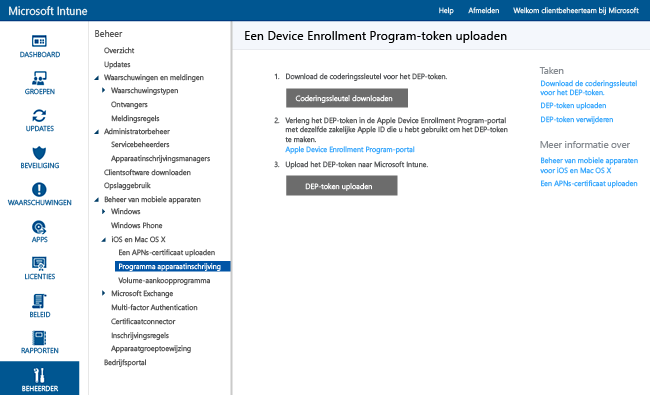

# iOS-apparaten in bedrijfseigendom met het Device Enrollment Program inschrijven
Microsoft Intune kan 'draadloos' een inschrijvingsprofiel implementeren op iOS-apparaten die via het Device Enrollment Program zijn aangeschaft. Het inschrijvingspakket kan configuratieassistentopties voor het apparaat bevatten. Gebruikers kunnen de inschrijving niet opheffen wanneer de apparaten zijn ingeschreven via DEP.

## Apple DEP-beheer voor iOS-apparaten met Microsoft Intune
Voor het beheren van iOS-apparaten in bedrijfseigendom met het Device Enrollment Program (DEP) van Apple moet uw organisatie lid worden van DEP en apparaten verwerven via dat programma. Details van dit proces kunt u vinden op: [https://deploy.apple.com](https://deploy.apple.com). Voordelen van het programma zijn onder andere handsfree instellen, dus zonder dat elk apparaat via een USB-verbinding op een computer moet worden aangesloten.

Voordat u iOS-apparaten van het bedrijf met DEP kunt inschrijven, moet u een DEP-token van Apple ontvangen. Intune kan met dit token informatie synchroniseren over apparaten binnen uw bedrijf die aan DEP deelnemen. Ook kan Intune hiermee inschrijvingsprofielen naar Apple uploaden en apparaten toewijzen aan die profielen.

1.  **Beginnen met het beheren van iOS-apparaten met Microsoft Intune** 
    Voordat u iOS-apparaten met het Device Enrollment Program (DEP) kunt inschrijven, moet u het iOS-beheer voor Intune hebben ingeschakeld.

2.  **Een coderingssleutel ophalen** 
    Open de [Microsoft Intune-beheerconsole](http://manage.microsoft.com) als gebruiker met beheerdersrechten, ga naar **Beheer** &gt; **Beheer van mobiele apparaten** &gt; **iOS** &gt; **Programma apparaatinschrijving** en klik op **Coderingssleutel downloaden**. Sla het coderingssleutelbestand (.pem) lokaal op. Het .pem-bestand wordt gebruikt om een vertrouwensrelatiecertificaat bij de portal Apple Device Enrollment Program aan te vragen.

      

3.  **Een Device Enrollment Program-token ophalen** 
    Ga naar de [Device Enrollment Program-portal](https://deploy.apple.com) (https://deploy.apple.com) en meld u aan met de Apple-id van uw bedrijf. Deze Apple-id moet later worden gebruikt om uw DEP-token te verlengen.

    1.  Ga in de [portal Device Enrollment Program](https://deploy.apple.com) naar **Programma apparaatinschrijving** &gt; **Servers beheren** en kies **MDM-server toevoegen**.

    2.  Voer de **MDM-servernaam** in en kies **Volgende**. De servernaam is voor eigen referentie en dient om de MDM-server te identificeren. Het is niet de naam of URL van de Microsoft Intune-server.

    3.  Het dialoogvenster **&lt;Servernaam&gt; toevoegen** wordt geopend. Kies **Bestand selecteren...** om het .pem-bestand te uploaden en kies **Volgende**.

    4.  In het dialoogvenster **&lt;Servernaam&gt; toevoegen** wordt een koppeling met **Uw servertoken** weergegeven. Download het servertokenbestand (.p7m) naar uw computer en kies **Gereed**.

    Dit certificaatbestand (.p7m) wordt gebruikt om een vertrouwensrelatie tussen Intune en de Device Enrollment Program-servers van Apple tot stand te brengen.

4.  **Het DEP-token toevoegen aan Intune** 
    In de [Microsoft Intune-beheerconsole](http://manage.microsoft.com) gaat u naar **Beheer** &gt; **Mobiele apparaten beheren** &gt; **iOS** &gt; **Programma apparaatinschrijvingen** en kiest u **Het DEP-token uploaden**. **Blader** naar het certificaatbestand (.p7m), voer uw **Apple-id**in en kies **Uploaden**.

5.  **Inschrijvingsbeleid voor bedrijfsapparaten toevoegen** 
    Ga in de [Microsoft Intune-beheerconsole](http://manage.microsoft.com) naar **Beleid** &gt; **Inschrijving van bedrijfsapparaten** en kies **Toevoegen**.

    Geef **algemene** gegevens op zoals **Naam** en **Beschrijving** en geef aan of apparaten die aan het profiel zijn toegewezen, gebruikersaffiniteit hebben of deel uitmaken van een groep.
      - **Vragen om gebruikersaffiniteit**: het apparaat moet aan een gebruiker worden gekoppeld tijdens de eerste configuratie voordat toegang tot gegevens en e-mail van het bedrijf kan worden verleend. **Gebruikersaffiniteit** moet worden ingesteld voor DEP-beheerde apparaten die eigendom zijn van gebruikers en de bedrijfsportal moeten gebruiken (bijvoorbeeld om apps te installeren).  **Opmerking:** Meervoudige authenticatie kan niet door DEP-apparaten met gebruikersaffiniteit worden ondersteund.

      > [!NOTE]
      > Voor DEP met gebruikersaffiniteit moet WS-Trust 1.3 gebruikersnaam/mixed-eindpunt zijn ingeschakeld om een gebruikerstoken aan te vragen.

      - **Geen gebruikersaffiniteit**: het apparaat is niet gekoppeld aan een gebruiker. Gebruik deze relatie voor apparaten waarmee taken worden uitgevoerd zonder toegang tot lokale gebruikersgegevens. Apps waarvoor een gebruikersrelatie is vereist, zoals de bedrijfsportal-app die gebruikt wordt voor het installeren van LOB-apps, zullen niet werken.

    U kunt ook **apparaten aan de volgende groep toewijzen**. Kies **Selecteren** om een groep te kiezen.

    [!INCLUDE[groups deprecated](../includes/group-deprecation.md)]

    Schakel vervolgens **DEP-instellingen (programma voor apparaatinschrijving) voor dit beleid configureren** in om DEP te ondersteunen.

      

     De volgende instellingen zijn beschikbaar voor DEP-beheerde apparaten:

     - **Afdeling**: wordt weergegeven wanneer gebruikers tijdens de activering op **Over configuratie** tikken
     - **Telefoonnummer van ondersteuning**: wordt weergegeven wanneer de gebruiker tijdens de activering de knop **Hulp nodig?** kiest
     - **Voorbereidingsmodus**: wordt ingesteld tijdens de activering en kan niet worden gewijzigd zonder het apparaat op de fabrieksinstellingen terug te zetten:
        - **Niet onder supervisie**: beperkte beheermogelijkheden
        - **Onder supervisie**: hiermee worden standaard meer beheeropties ingeschakeld en de activeringsvergrendeling uitgeschakeld
     - **Registratieprofiel vergrendelen voor het apparaat**: wordt ingesteld tijdens de activering en kan niet worden gewijzigd zonder het apparaat op de fabrieksinstellingen terug te zetten
        - **Uitschakelen**: hiermee kan het beheerprofiel worden verwijderd uit het menu **Instellingen**
        - **Inschakelen**: (vereist **Voorbereidingsmodus** = **Onder supervisie**) hiermee worden de iOS-instellingen uitgeschakeld waarmee het beheerprofiel kan worden verwijderd
     - **Configuratieassistentopties**: deze instellingen zijn optioneel en kunnen naderhand worden geconfigureerd in het iOS-menu **Instellingen**.
        - **Wachtwoordcode**: hiermee wordt tijdens de activering gevraagd om de wachtwoordcode. Vraag altijd om een wachtwoordcode tenzij het apparaat wordt beveiligd of de toegang tot het apparaat op een andere manier wordt beheerd (bijvoorbeeld de kioskmodus waarmee op het apparaat maar één app kan worden uitgevoerd).
        - **Locatieservices**: als deze optie is ingeschakeld, wordt tijdens de activering door Configuratieassistent om de service gevraagd
        - **Herstellen**: als deze optie is ingeschakeld, wordt tijdens de activering door Configuratieassistent gevraagd om een iCloud-back-up
        - **Apple-id**: als deze optie is ingeschakeld, worden gebruikers door iOS gevraagd om een Apple-id wanneer Intune een app zonder een id probeert te installeren. Een Apple-id is vereist voor het downloaden van iOS-apps uit de App Store, waaronder de apps die zijn geïnstalleerd door Intune.
        - **Voorwaarden**: als deze optie is ingeschakeld, wordt tijdens de activering door Configuratieassistent gevraagd de voorwaarden van Apple te accepteren
        - **Touch ID**: als deze optie is ingeschakeld, wordt tijdens de activering door Configuratieassistent om deze service gevraagd
        - **Apple Pay**: als deze optie is ingeschakeld, wordt tijdens de activering door Configuratieassistent om deze service gevraagd
        - **In- en uitzoomen**: als deze optie is ingeschakeld, wordt tijdens de activering door Configuratieassistent om deze service gevraagd
        - **Siri**: als deze optie is ingeschakeld, wordt tijdens de activering door Configuratieassistent om deze service gevraagd
        - **Diagnostische gegevens verzenden naar Apple**: als deze optie is ingeschakeld, wordt tijdens de activering door Configuratieassistent om deze service gevraagd
     -  **Extra beheer via Apple Configurator inschakelen**: stel deze optie in op **Niet toestaan** om te voorkomen dat bestanden met iTunes of beheer via Apple Configurator worden gesynchroniseerd. Het is een goed idee om **Niet toestaan** in te stellen, verdere configuraties vanuit Apple Configurator te exporteren en vervolgens als een aangepast iOS-configuratieprofiel via Intune te implementeren in plaats van deze instelling te gebruiken om een handmatige implementatie met of zonder een certificaat toe te staan.
        - **Niet toestaan**: hiermee wordt voorkomen dat het apparaat communiceert via USB (het koppelen wordt uitgeschakeld)
        - **Toestaan**: hiermee wordt toegestaan dat een apparaat communiceert via een USB-verbinding voor een pc of Mac
        - **Certificaat vereisen**: hiermee is het mogelijk een Mac te koppelen met een certificaat dat is geïmporteerd in het registratieprofiel

6.  **DEP-apparaten toewijzen voor beheer** Ga naar de [Device Enrollment Program-portal](https://deploy.apple.com) (https://deploy.apple.com) en meld u aan met de Apple-id van uw bedrijf. Ga naar **Implementatieprogramma** &gt; **Programma apparaatinschrijving** &gt; **Apparaten beheren**. Geef een manier voor **Apparaten kiezen** op, geef apparaatgegevens op en geef apparaatdetails op aan de hand van **Serienummer** en **Bestelnummer** of voer **CSV-bestand uploaden** uit. Selecteer vervolgens **Toewijzen aan server**, kies de &lt;Servernaam&gt; die is opgegeven voor Microsoft Intune en kies vervolgens **OK**.

7.  **DEP-beheerde apparaten synchroniseren** Open de [Microsoft Intune-beheerconsole](http://manage.microsoft.com) als gebruiker met beheerdersrechten, ga naar **Beheer** &gt; **Beheer van mobiele apparaten** &gt; **iOS** &gt; **Programma apparaatinschrijving** en kies **Nu synchroniseren**. Er wordt een synchronisatieaanvraag verzonden naar Apple. Als u DEP-beheerde apparaten wilt bekijken na de synchronisatie, gaat u in de [Microsoft Intune-beheerconsole](http://manage.microsoft.com) naar **Groepen** &gt; **Alle apparaten** &gt; **Vooraf geregistreerde bedrijfsapparaten** &gt; **Op iOS-serienummer**. In de werkruimte ** Op iOS-serienummer** wordt de **Status** voor beheerde apparaten weergegeven als 'Geen contact gemaakt' totdat het apparaat wordt ingeschakeld en de configuratieassistent wordt uitgevoerd om het apparaat in te schrijven.

    Om te voldoen aan de voorwaarden van Apple voor acceptabel DEP-verkeer, worden door Intune de volgende beperkingen opgelegd:
     -  Een volledige DEP-synchronisatie kan niet vaker dan eens in de zeven dagen worden uitgevoerd. Tijdens een volledige synchronisatie vernieuwt Intune elk serienummer dat door Apple aan Intune is toegewezen, of het serienummer eerder is gesynchroniseerd of niet. Als een volledige synchronisatie wordt uitgevoerd binnen zeven dagen na de vorige volledige synchronisatie, vernieuwt Intune alleen serienummers die nog niet aanwezig zijn in Intune.
     -  Een synchronisatieaanvraag krijgt 10 minuten de tijd om te worden uitgevoerd. Gedurende deze tijd of totdat de aanvraag is geslaagd, is de knop **Synchronisatie** uitgeschakeld.

8.  **Apparaten aan gebruikers distribueren** Uw apparaten in bedrijfseigendom kunnen nu aan gebruikers worden gedistribueerd. Wanneer een iOS-apparaat wordt ingeschakeld, zal het worden ingeschreven voor beheer door Intune.

## Wijzigingen aan Intune-groepstoewijzingen

In november wordt apparaatgroepbeheer verplaatst naar Azure Active Directory. Na de overgang naar Azure Active Directory-groepen wordt groepstoewijzing niet weergegeven in de opties voor het **registratieprofiel voor bedrijfsapparaten**. Omdat deze wijziging in een aantal maanden wordt geïmplementeerd, ziet u de wijziging mogelijk niet meteen. Na de overgang naar de nieuwe portal kunnen er dynamische apparaatgroepstoewijzingen worden gedefinieerd op basis van de namen van de inschrijvingsprofielen voor bedrijven. Dit proces zorgt ervoor dat apparaten die vooraf zijn toegewezen aan een apparaatgroep al automatisch worden geregistreerd bij de groep waarvoor het beleid en de apps zijn geïmplementeerd. [Meer informatie over Azure Active Directory-groepen](https://azure.microsoft.com/documentation/articles/active-directory-accessmanagement-manage-groups/)

### Zie tevens
[Vereisten voor de registratie van apparaten](prerequisites-for-enrollment.md)

<!--HONumber=Nov16_HO1-->

