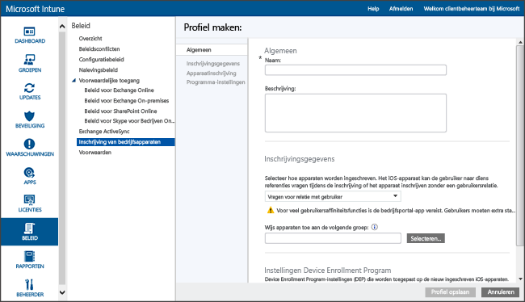
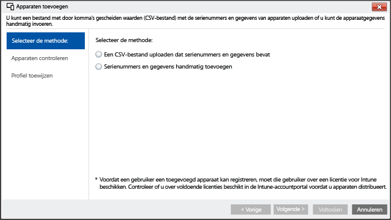

---
# required metadata

title: Directe inschrijving voor iOS-apparaten met Microsoft Intune | Microsoft Intune
description:
keywords:
author: NathBarn
manager: jeffgilb
ms.date: 04/28/2016
ms.topic: article
ms.prod:
ms.service: microsoft-intune
ms.technology:
ms.assetid: a692b90c-72ae-47d1-ba9c-67a2e2576cc2

# optional metadata

#ROBOTS:
#audience:
#ms.devlang:
ms.reviewer: jeffgilb
ms.suite: ems
#ms.tgt_pltfrm:
#ms.custom:

---

# iOS-apparaten direct inschrijven met behulp van Apple Configurator
Intune ondersteunt de inschrijving van iOS-apparaten die bedrijfseigendom zijn, met behulp van het hulpprogramma [Apple Configurator](http://go.microsoft.com/fwlink/?LinkId=518017) dat wordt uitgevoerd op een Mac-computer. Met dit proces wordt het apparaat niet teruggezet op de fabrieksinstellingen en wordt het apparaat met een vooraf gedefinieerd beleid ingeschreven. Deze methode is bedoeld voor apparaten waarop **Geen relatie met gebruiker** is ingesteld. Voor deze methode is vereist dat u met het iOS-apparaat een USB-verbinding met een Mac-computer maakt om bedrijfsinschrijving in te stellen. De bedrijfsportal-app wordt niet ondersteund voor direct ingeschreven apparaten. In deze richtlijnen wordt ervan uitgegaan dat u Apple Configurator 2.0 gebruikt op een Mac-computer.

1.  **Een profiel maken voor apparaten**
    Met een inschrijvingsprofiel voor apparaten worden de instellingen gedefinieerd die worden toegepast op apparaten. Als u dit nog niet hebt gedaan, maakt u een inschrijvingsprofiel voor iOS-apparaten die worden ingeschreven met Apple Configurator.

    #### Een profiel maken

    1.  Ga in de [Microsoft Intune-beheerconsole](http://manage.microsoft.com) naar **Beleid** &gt; **Inschrijving van bedrijfsapparaten** en klik vervolgens op **Toevoegen...**.

        

    2.  Geef details voor de apparaatprofielen op:

        -   **Naam**: naam van het inschrijvingsprofiel voor apparaten. Niet zichtbaar voor gebruikers.

        -   **Beschrijving**: beschrijving van het inschrijvingsprofiel voor apparaten. Niet zichtbaar voor gebruikers.

        -   **Gebruikersrelatie**: geeft aan hoe apparaten worden ingeschreven. Selecteer voor directe inschrijving **Geen relatie met gebruiker**..

        -   **Vooraf toegewezen apparatengroep**: alle apparaten waarvoor dit profiel wordt geïmplementeerd, behoren in eerste instantie tot deze groep. U kunt apparaten na de inschrijving opnieuw toewijzen.

    3.  Klik op **Profiel opslaan** om het profiel toe te voegen.

2.  **iOS-apparaten toevoegen voor inschrijving met Apple Configurator**
    Ga in de [Microsoft Intune-beheerconsole](http://manage.microsoft.com) naar **Groepen** &gt; **Alle apparaten** &gt; **Vooraf ingeschreven bedrijfsapparaten** &gt; **Op iOS-serienummer** en klik vervolgens op **Apparaten toevoegen...**.

    

      U kunt apparaten op twee manieren toevoegen:

    -   **Een CSV-bestand met serienummers uploaden**: maak een lijst met door komma's gescheiden waarden (CSV) van twee kolommen zonder header voor maximaal 5000 apparaten of 5 MB per CSV-bestand.

        |||
        |-|-|
        |&lt;Serienummer 1&gt;|&lt;Details apparaat 1&gt;|
        |&lt;Serienummer 2&gt;|&lt;Details apparaat 2&gt;|
        Dit CSV-bestand ziet er in een teksteditor als volgt uit:

        ```
        0000000,PO 1234
        111111111,PO 1234
        ```

    -   **Handmatig apparaatdetails toevoegen**: geef het serienummer en de apparaatdetails van maximaal vijf apparaten op en klik op **Volgende**..

    > [!NOTE]
    > Als u op een later tijdstip apparaten in bedrijfseigendom uit het Intune-beheer wilt verwijderen, moet u het serienummer van het apparaat in de groep **Apparaten in bedrijfseigendom** uit Intune verwijderen om de apparaatinschrijving uit te schakelen.  Als door Intune een noodherstelprocedure wordt uitgevoerd op of rond de tijd dat de serienummers worden verwijderd, moet u controleren of alleen de serienummers van actieve apparaten in die groep worden weergegeven.

3.  **Apparaten voor inschrijving selecteren**
    Bevestig de apparaten die moeten worden ingeschreven. Serienummers die al zijn ingeschreven of die op een andere manier worden ingeschreven, kunnen niet worden geïmporteerd. Klik op **Volgende** om door te gaan.

4.  **Profiel toewijzen**
    Kies in de lijst met beschikbare profielen het profiel dat u wilt toewijzen, controleer de **details van het inschrijvingsprofiel** en klik vervolgens op **Voltooien**. U kunt handmatig toegevoegde apparaten toewijzen aan elk inschrijvingsprofiel.

5.  **Een profiel selecteren voor implementatie op iOS-apparaten**
    Ga in de [Microsoft Intune-beheerconsole](http://manage.microsoft.com) naar **Beleid** &gt; **Inschrijving van bedrijfsapparaten** en selecteer vervolgens het apparaatprofiel dat u wilt implementeren op mobiele apparaten. Dit profiel moet hetzelfde zijn als het profiel dat u in de vorige stap hebt toegewezen voor implementatie. Klik op **Exporteren...** in de taakbalk. Klik op **Profiel downloaden** en sla het gedownloade .mobileconfig-bestand op.

6.  **Het bestand overdragen**
    Kopieer het gedownloade .mobileconfig-bestand naar een Mac-computer.
    > [!NOTE]
    > De profiel-URL voor inschrijving is na het exporteren twee weken geldig. Na twee weken moet u een nieuwe profiel-URL voor inschrijving exporteren om iOS-apparaten te registreren met Configuratieassistent.
7.  **Het apparaat voorbereiden met Apple Configurator**
    iOS-apparaten zijn verbonden met de Mac-computer en ingeschreven voor beheer van mobiele apparaten.

    1.  Open **Apple Configurator 2.0** op een Mac-computer..

    2.  Verbind het iOS-apparaat met de Mac-computer met behulp van een USB-kabel. Sluit **Foto's**, **iTunes** en andere apps die voor het apparaat worden geopend wanneer het apparaat wordt gedetecteerd.

    3.  Klik in Apple Configurator één keer op het verbonden iOS-apparaat en klik vervolgens op de knop **Toevoegen**. Opties die kunnen worden toegevoegd aan het apparaat, worden weergegeven in de vervolgkeuzelijst. Klik op **Profielen**. .

    4.  Gebruik de bestandskiezer om het .mobileconfig-bestand dat u uit Intune hebt geëxporteerd, te selecteren. Klik vervolgens op **Toevoegen**. Het profiel wordt toegevoegd aan het apparaat.  Als het apparaat **Niet onder supervisie** is, vereist de installatie acceptatie op het apparaat.

8.  **Het profiel installeren**
    U bent gereed voor installatie van het profiel op het iOS-apparaat. Het apparaat moet de Configuratieassistent al hebben uitgevoerd en gereed zijn voor gebruik.  Als inschrijving app-implementaties omvat, moet op het apparaat een Apple-id zijn ingesteld, omdat de app-implementaties vereisen dat u met een Apple-id bent aangemeld voor de App Store.

    ###### Profielacceptatie voltooien voor iOS-apparaten die niet onder supervisie zijn

    1.  Ontgrendel het iOS-apparaat.

    2.  Tik in het dialoogvenster **Profiel installeren** voor **Beheerprofiel** op **Installeren**..

    3.  Geef zo nodig een **Wachtwoordcode** of **Apple-id** op.

    4.  Accepteer de **Waarschuwing** en tik op **Installeren**..

    5.  Accepteer de **Externe waarschuwing** en tik op **Vertrouwen**..

    6.  Wanneer in het vak **Profiel geïnstalleerd** wordt bevestigd dat het profiel is **Geïnstalleerd**, klikt u op **Gereed**..

9. **Profiel controleren**
    Start op het iOS-apparaat **Instellingen**, ga naar **Algemeen** &gt; **Apparaatbeheer** &gt; **Beheerprofiel** &gt; en bevestig dat de profielinstallatie wordt weergegeven. Controleer de geïnstalleerde apps en de beperkingen van het iOS-beleid. Het kan 10 minuten duren voordat beleidsbeperkingen en apps worden weergegeven op het apparaat.

10. **Apparaten distribueren**
    Het iOS-apparaat is nu ingeschreven bij Intune en wordt beheerd.


### Zie tevens
[Voorbereidingen voor het inschrijven van apparaten](get-ready-to-enroll-devices-in-microsoft-intune.md)


<!--HONumber=May16_HO1-->


