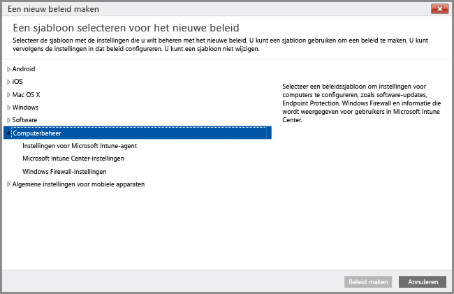

# Windows-pc's beheren met de Intune-pc-clientsoftware
In plaats van [Windows-pc's als mobiele apparaten te registreren](set-up-windows-device-management-with-microsoft-intune.md), kunt u Windows-pc's ook registreren en beheren door de Intune-clientsoftware te installeren.

Intune beheert Windows-pc’s met beleidsregels op een manier die lijkt op hoe Windows Server Active Directory Domain Services (AD DS) dat met groepsbeleidsobjecten doet. Als u Active Directory-computers die lid zijn van een domein, wilt beheren met Intune, moet u [ervoor zorgen dat het Intune-beleid niet in strijd is met de groepsbeleidsobjecten](resolve-gpo-and-microsoft-intune-policy-conflicts.md) die in uw organisatie van kracht zijn.

Hoewel de Intune-softwareclient [beheermogelijkheden ondersteunt die helpen bij de beveiliging van pc's](policies-to-protect-windows-pcs-in-microsoft-intune.md) door het beheer van software-updates, Windows Firewall en Endpoint Protection, kan er geen ander Intune-beleid worden toegepast op pc's die worden beheerd door de Intune-softwareclient, waaronder **Windows**-beleidsinstellingen die specifiek zijn gericht op Mobile Device Management.

> [!NOTE]
> Apparaten met Windows 8.1 of hoger kunnen worden beheerd met de Intune-client of als mobiel apparaat. Dit onderwerp is van toepassing op computers met de Intune-softwareclient. Installatie van de Intune-client en registratie via Mobile Device Management wordt niet ondersteund.

## Vereisten voor Intune-pc-clientbeheer

**Hardware**: hieronder vindt u de minimale hardwarevereisten voor het installeren van de Intune-client:

|Vereiste|Meer informatie|
|---------------|--------------------|
|Netwerk|De client vereist dat de computer een internetverbinding heeft.|
|Processor en geheugen|Raadpleeg de vereisten voor de processor en het RAM-geheugen voor het besturingssysteem van de computer.|
|Schijfruimte|200 MB vrije schijfruimte voordat de clientsoftware wordt geïnstalleerd.|

**Software**: hieronder staan de softwarevereisten beschreven voor het installeren van de client:

|Vereiste|Meer informatie|
|---------------|--------------------|
|Besturingssysteem | Windows-apparaat waarop Windows 7 of later wordt uitgevoerd. |
|Beheermachtigingen|Het account waarmee de clientsoftware wordt geïnstalleerd, moet lokale beheerdersmachtigingen op het apparaat hebben.|
|Windows Installer 3.1|De computer moet minimaal Windows Installer 3.1 hebben.  Zo controleer u welke versie van Windows Installer op een computer is geïnstalleerd:  - Klik op de pc met de rechtermuisknop op **%windir%\System32\msiexec.exe** en klik vervolgens op **Eigenschappen**.  U kunt de meest recente versie van Windows Installer downloaden van de pagina [Herdistribueerbare Windows Installer-pakketten](http://go.microsoft.com/fwlink/?LinkID=234258) op de Microsoft Developer Network-website.|
|Niet-compatibele clientsoftware verwijderen|Voordat u de Intune-clientsoftware installeert, moet u de Configuration Manager- of Systems Management Server-clientsoftware van de pc verwijderen.|

## Computerbeheer met de Intune-computerclient
De beheermogelijkheden na installatie van de Intune-clientsoftware zijn: [toepassingsbeheer](deploy-apps-in-microsoft-intune.md), [realtime bewaking en Endpoint Protection](help-secure-windows-pcs-with-endpoint-protection-for-microsoft-intune.md), [beheer van Windows Firewall-instellingen](help-protect-windows-pcs-using-windows-firewall-policies-in-microsoft-intune.md), hardware- en software-inventarisatie, extern beheer (via verzoeken om hulp op afstand), [instellingen voor software-updates](keep-windows-pcs-up-to-date-with-software-updates-in-microsoft-intune.md) en rapportage over nalevingsinstellingen.

Bepaalde beheeropties voor pc's die als mobiel apparaat worden beheerd, zijn niet beschikbaar voor pc’s die met de softwareclient worden beheerd, waaronder:

-   Volledig wissen (selectief wissen is beschikbaar)
-   Voorwaardelijke toegang
-   Ander Windows-beleid dan **Computerbeheer**

Naast de agentacties van de Intune-client die lokaal op afzonderlijke computers worden uitgevoerd, kunt u de Intune-beheerconsole ook gebruiken om andere [algemene computerbeheertaken](common-windows-pc-management-tasks-with-the-microsoft-intune-computer-client.md) uit te voeren op Windows-pc’s waarop de client is geïnstalleerd en wel om het volgende te doen:

-   Informatie over de hardware en software op beheerde computers weergeven

-   Een computer op afstand opnieuw opstarten

-   Een computer buiten gebruik stellen om de clientsoftware te verwijderen en de computer uit Intune-beheer te verwijderen

-   Gebruikers koppelen aan specifieke beheerde computers

-   Reageren op aanvragen voor hulp op afstand

De Intune-clientagent wordt doorgaans in stille modus op de achtergrond uitgevoerd zonder dat de gebruiker iets hoeft te doen of problemen hoeft op te lossen. Mocht u echter hulp nodig hebben bij het verhelpen van problemen met het beheren van computers, dan zijn er verschillende [resources beschikbaar om u te helpen bij het oplossen van problemen](/intune/troubleshoot/troubleshoot-client-setup-in-microsoft-intune).

<!--HONumber=Sep16_HO1-->

