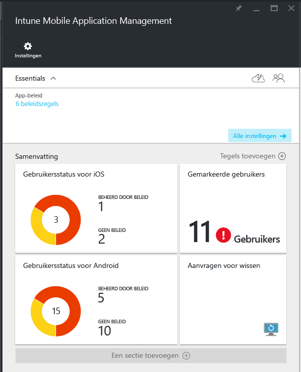
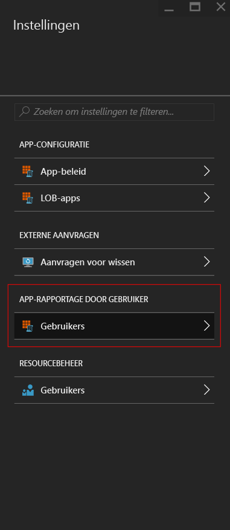
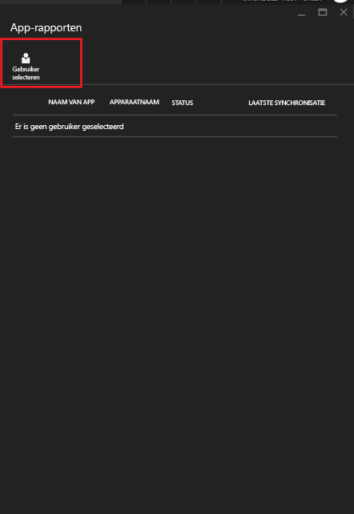
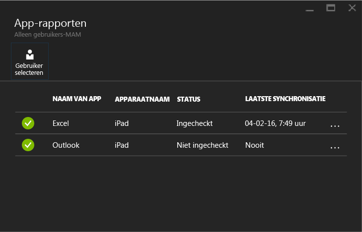

# Mobile App Management-beleid bewaken met Microsoft Intune
Nadat u een MAM-beleid hebt geconfigureerd en toegepast op de gebruikers, kunt u de nalevingsstatus in [Azure Portal](https://portal.azure.com) bewaken. De Azure-portal bevat informatie over de gebruikers die door het beleid worden beïnvloed, de nalevingsstatus en eventuele problemen die uw eindgebruikers ondervinden.
## Samenvattingsweergave
Op het tabblad **Intune Mobile Application Management** ziet u een samenvatting van de nalevingsstatus, zoals hieronder wordt beschreven:

-   **GEBRUIKERS:** het totale aantal gebruikers in uw bedrijf dat gebruikmaakt van de apps die zijn gekoppeld aan het beleid.

-   **BEHEERD DOOR BELEID**: het aantal gebruikers dat ten minste één van de apps in een werkcontext heeft gebruikt.

-   **GEEN BELEID:** het aantal gebruikers dat gebruikmaakt van de apps die zijn gekoppeld aan het beleid, maar op wie het beleid niet is gericht.  U kunt overwegen deze gebruikers toe te voegen aan uw beleid.

- **Gemarkeerde gebruikers:** het aantal gebruikers dat problemen ondervindt. Momenteel worden onder **Gemarkeerde gebruikers** alleen gebruikers met gekraakte apparaten gerapporteerd.

## Detailweergave
U kunt de gedetailleerde weergave van de samenvatting openen door te klikken op de tegel **Gebruikersstatus** en de tegel **Gemarkeerde gebruikers**.

### Gebruikersstatus
U kunt zoeken naar een afzonderlijke gebruiker en de nalevingsstatus voor deze gebruiker bekijken. Het tabblad **App-rapportage** bevat de volgende informatie voor de geselecteerde gebruiker:
- Appara(a)t(e)n gekoppeld aan het gebruikersaccount
- App(s) met MAM-beleid op het apparaat
- Status:

  **Ingeschakeld:** dit betekent dat het beleid is geïmplementeerd voor de gebruiker en de app minstens eenmaal in een werkcontext is gebruikt.

  **Niet ingeschakeld**: geeft aan dat het beleid is geïmplementeerd voor de gebruiker, maar dat de app sindsdien niet is gebruikt in een werkcontext.

>[!NOTE]
> Als het MAM-beleid niet op de gebruiker waarnaar u hebt gezocht is toegepast, wordt in een bericht gemeld dat de gebruiker niet in aanmerking komt voor een app-beleid.

Ga als volgt te werk om de rapportage voor een gebruiker te bekijken:

**Stap 1:** selecteer de gewenste gebruiker. Klik hiertoe op de tegel Samenvatting of kies de optie **APP-RAPPORTAGE DOOR GEBRUIKER** op het tabblad **Instellingen**, zoals hieronder wordt weergegeven:

**Stap 2:** het tabblad **App-rapportage** wordt nu geopend. Kies **Gebruiker selecteren** om te zoeken naar een Azure Active Directory-gebruiker.

**Stap 3:** na selectie van de gebruiker in de lijst ziet u de details van de nalevingsstatus voor de betreffende gebruiker.

### Gemarkeerde gebruikers
De gedetailleerde weergave bevat het foutbericht, de app die werd geopend toen de fout is opgetreden, het platform van het apparaat en een tijdstempel.  

### Zie tevens
[Gegevensoverdracht tussen iOS-apps beheren](manage-data-transfer-between-ios-apps-with-microsoft-intune.md)

* [Wat u kunt verwachten wanneer uw Android-app wordt beheerd door MAM-beleid](user-experience-for-mam-enabled-android-apps-with-microsoft-intune.md)
* [Wat u kunt verwachten wanneer uw iOS-app wordt beheerd door MAM-beleid](user-experience-for-mam-enabled-ios-apps-with-microsoft-intune.md)

<!--HONumber=Oct16_HO3-->

