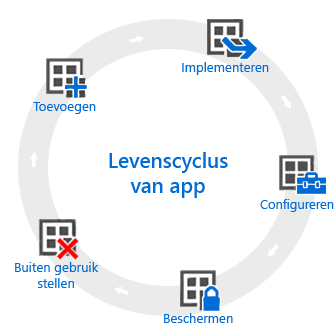

# Overzicht van de app-levenscyclus

De levenscyclus van de Intune-app begint zodra een app wordt toegevoegd. Vervolgens doorloopt de app aanvullende fasen totdat u de app verwijdert.

## Toevoegen

De eerste stap in app-implementatie is het toevoegen van de apps die u wilt beheren en implementeren, aan Intune. U kunt met veel verschillende typen apps werken, maar de basisprocedures zijn hetzelfde. Met Intune kunt u apps toevoegen voor zowel [geregistreerde apparaten](add-apps-for-mobile-devices-in-microsoft-intune.md) als [Windows-pc's die u beheert met de Intune-clientsoftware](add-apps-for-windows-pcs-in-microsoft-intune.md).

## Implementeren

Nadat u de app aan Intune hebt toegevoegd, kunt u deze [implementeren op apparaten die u beheert](deploy-apps.md). In Intune is dit proces gemakkelijk en zodra de app is geïmplementeerd, kunt u [het succes bewaken](monitor-apps-in-microsoft-intune.md) van de implementatie vanuit de Intune-beheerconsole. Bovendien kunt u in sommige app stores, zoals die van [Apple](manage-ios-apps-you-purchased-through-a-volume-purchase-program-with-microsoft-intune.md) en [Windows](manage-apps-you-purchased-from-the-windows-store-for-business-with-microsoft-intune.md), bulksgewijs app-licenties voor uw bedrijf kopen. Intune kan gegevens synchroniseren met deze stores zodat u het licentiegebruik voor deze typen apps kunt implementeren en bijhouden vanuit de Intune-beheerconsole.

## Configureren

Als onderdeel van de app-levenscyclus worden er regelmatig nieuwe versies van apps uitgebracht. Intune biedt hulpprogramma's waarmee u eenvoudig uw geïmplementeerde [apps kunt bijwerken](update-apps-using-microsoft-intune.md) naar een nieuwere versie. Daarnaast kunt u voor sommige apps extra functionaliteit configureren:
- Met [beleidsregels voor de configuratie van iOS-apps](configure-ios-apps-with-mobile-app-configuration-policies-in-microsoft-intune.md) kunt u instellingen opgeven voor compatibele iOS-apps die worden gebruikt wanneer de app wordt uitgevoerd. Voor een app kunnen bijvoorbeeld bepaalde instellingen vereist zijn voor de huisstijl of de naam van de server waarmee verbinding wordt gemaakt.
- Met de [beleidsregels voor Managed Browser](manage-internet-access-using-managed-browser-policies.md) kunt u instellingen configureren voor de Intune Managed Browser die de standaardbrowser van het apparaat vervangt, en kunt u beperkingen instellen voor de websites die uw gebruikers mogen bezoeken.

## Beveiligen

Intune biedt tal van manieren om de gegevens in uw apps te beveiligen. De belangrijkste methoden zijn:
- [Voorwaardelijke toegang](restrict-access-to-email-and-o365-services-with-microsoft-intune.md): hiermee regelt u de toegang tot e-mail en andere services op basis van voorwaarden die u opgeeft. Voorwaarden omvatten apparaattypen of naleving van een [nalevingsbeleid voor apparaten](introduction-to-device-compliance-policies-in-microsoft-intune.md) dat u hebt geïmplementeerd.
- [Mobile Application Management (MAM)](protect-app-data-using-mobile-app-management-policies-with-microsoft-intune.md) werkt met afzonderlijke apps om de gebruikte bedrijfsgegevens te beveiligen. U kunt bijvoorbeeld beperkingen instellen voor het kopiëren van gegevens tussen onbeheerde apps en de apps die u beheert, of u kunt voorkomen dat apps worden uitgevoerd op apparaten waarop jailbreaking of rooting is uitgevoerd.

## Buiten gebruik stellen

Waarschijnlijk raken de apps die u hebt geïmplementeerd, uiteindelijk verouderd en moeten deze worden verwijderd. In Intune kunt u gemakkelijk [apps buiten gebruik stellen](retire-apps-using-microsoft-intune.md).

<!--HONumber=Aug16_HO2-->

