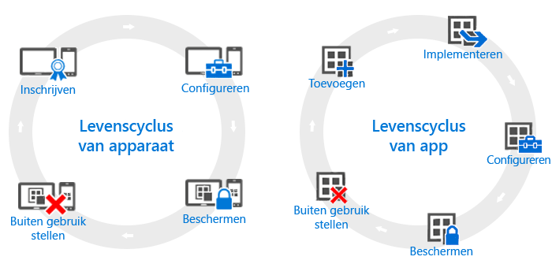

---
# required metadata

title: Overzicht van de levenscycli van apparaten en apps | Microsoft Intune
description:
keywords:
author: robstackmsft
manager: jeffgilb
ms.date: 04/28/2016
ms.topic: article
ms.prod:
ms.service: microsoft-intune
ms.technology:
ms.assetid: 38e08253-14a0-4cc4-87be-7b110c12a523

# optional metadata

#ROBOTS:
#audience:
#ms.devlang:
ms.reviewer: jeffgilb
ms.suite: ems
#ms.tgt_pltfrm:
#ms.custom:

---

# Overzicht van de levenscycli van apparaten en apps

Hoewel de behoeften van individuele organisaties mogelijk verschillen, zijn er bepaalde algemene stappen die alle organisaties continu moeten ondernemen, ongeacht hun operationele behoeften. Deze kunnen worden gegroepeerd in twee hoofdcategorieën en worden **levenscycli** genoemd. De levenscyclus van de implementatie die u volgt, is afhankelijk van het scenario dat u wilt implementeren. U hebt bijvoorbeeld alleen de levenscyclus van het apparaat nodig, de levenscyclus van de app of beide.

Voor beheer hebben alle apparaten een levenscyclus, die loopt van registratie van het apparaat tot het buiten gebruik stellen wanneer het apparaat niet langer nodig is. De [levenscyclus van apparaatbeheer](overview-of-device-lifecycle-in-microsoft-intune.md) leidt u door alle registratieopties, manieren waarop u deze apparaten kunt configureren en beveiligen, en het verwijderen van de apparaten uit het beheer.

Apps die u gebruikt, hebben hun eigen [app-levenscyclus](overview-of-app-lifecycle-in-microsoft-intune.md), met stappen die variëren van het toevoegen van een app aan Intune, tot het verwijderen van de app wanneer deze niet meer nodig is.

<!--HONumber=May16_HO2-->

