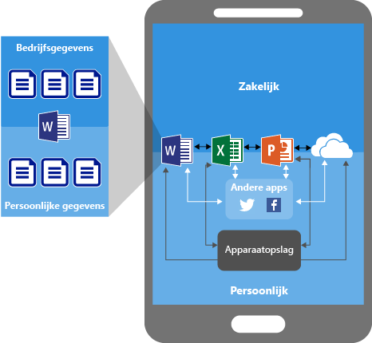
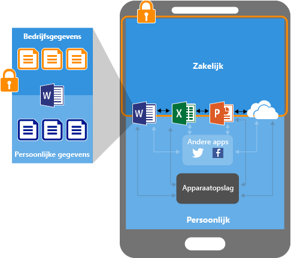
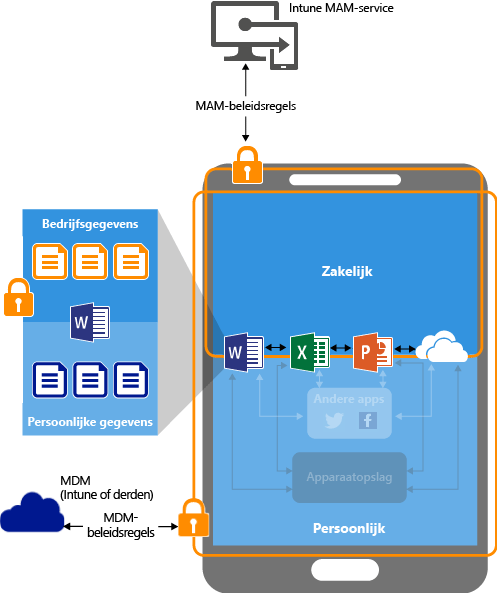
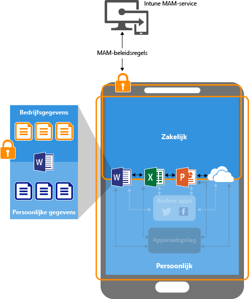

# App-gegevens beveiligen via beleid voor het beheer van mobiele apps met Microsoft Intune

## Hoe u app-gegevens kunt beveiligen
Uw werknemers gebruiken mobiele apparaten voor zowel privé- als werktaken.  U wilt er niet alleen voor zorgen dat uw werknemers productief kunnen zijn, maar u wilt ook bedoeld of onbedoeld gegevensverlies voorkomen.  Bovendien wilt u de mogelijkheid hebben om bedrijfsgegevens te beschermen die toegankelijk zijn via apparaten, zelfs als deze apparaten niet door u worden beheerd.

U kunt beleid voor Mobile Application Management (MAM-beleid) van Intune gebruiken om te helpen bij het beveiligen van uw bedrijfsgegevens. Omdat Intune-MAM-beleid **onafhankelijk van een beheeroplossing voor mobiele apparaten (MDM)** werkt, kunt u MAM gebruiken om de gegevens van uw bedrijf te beveiligen met of zonder inschrijving van apparaten in een oplossing voor apparaatbeheer. Door **beleid op app-niveau** te implementeren, kunt u de toegang tot bedrijfsbronnen beperken en gegevens binnen de controlesfeer van uw IT-afdeling houden.

MAM-beleid kan worden geconfigureerd voor apps die worden uitgevoerd op apparaten die:

- **Zijn ingeschreven bij Microsoft Intune:** bij de apparaten in deze categorie gaat het meestal om apparaten die in het bezit zijn van het bedrijf.

-   **Zijn ingeschreven bij een MDM-oplossing van derden:** bij de apparaten in deze categorie gaat het meestal om apparaten die in het bezit zijn van het bedrijf.

  > [!NOTE]
  > MAM-beleid mag niet worden gebruikt met MAM-oplossingen van derden of beveiligde container-oplossingen.

-   **Niet zijn ingeschreven bij een MDM-oplossing:** bij de apparaten in deze categorie gaat het meestal om apparaten die in het bezit zijn van werknemers, of om apparaten die niet worden beheerd door of zijn ingeschreven bij Intune of een andere MDM-oplossing.

> [!IMPORTANT]
> U kunt MAM-beleid maken voor mobiele Office-apps die verbinding maken met Office 365-services. MAM-beleid wordt niet ondersteund voor apps die verbinding maken met on-premises Exchange-, Skype voor Bedrijven-, of SharePoint-services.

**De belangrijke voordelen van het gebruik van MAM-beleid zijn**

-   Uw bedrijfsgegevens worden beschermd op het niveau van de app.  Omdat het beheer van mobiele apps geen apparaatbeheer vereist, kunt u bedrijfsgegevens beveiligen op zowel beheerde als onbeheerde apparaten. Het beheer wordt gecentreerd rond de identiteit van de gebruiker, waardoor er geen apparaatbeheer is vereist.

-   De productiviteit van eindgebruikers wordt niet negatief beïnvloed en het beleid wordt niet toegepast wanneer de app in een persoonlijke context wordt gebruikt.  Het beleid wordt alleen in een werkcontext toegepast, waardoor u de mogelijkheid hebt om bedrijfsgegevens te beschermen zonder aan persoonlijke gegevens te komen.

Het gebruik van MDM met MAM-beleid biedt extra voordelen en bedrijven kunnen MAM met en zonder MDM gelijktijdig gebruiken. Een medewerker kan bijvoorbeeld een telefoon gebruiken die door het bedrijf is verstrekt en daarnaast een privétablet gebruiken.  In dit geval is de bedrijfstelefoon ingeschreven in MDM en beveiligd door MAM-beleid, terwijl het privéapparaat alleen door MAM-beleid wordt beveiligd.

- **MDM zorgt ervoor dat het apparaat wordt beveiligd**.  U kunt bijvoorbeeld een pincode vereisen voor toegang tot het apparaat, of u kunt beheerde apps op het apparaat implementeren. U kunt ook apps implementeren op apparaten via uw MDM-oplossing, zodat u meer controle over het beheer van apps hebt.

- **MAM-beleid zorgt ervoor dat de app-laag goed wordt beveiligd**. U kunt bijvoorbeeld een pincode vereisen voor het openen van een werkgerelateerde app, of voor het uitwisselen van gegevens tussen apps, of u kunt voorkomen dat gegevens van bedrijfsapps naar een persoonlijke opslaglocatie worden opgeslagen.

### MAM-beleid wordt momenteel ondersteund op:
-   iOS 8.1 of hoger

-   Android 4 of hoger

Windows-apparaten worden momenteel niet ondersteund.
##  Hoe MAM-beleid app-gegevens beschermt

####  Apps zonder MAM-beleid:

Bedrijfsgegevens en persoonlijke gegevens kunnen met elkaar worden vermengd als er apps zonder beperkingen worden gebruikt.  Bedrijfsgegevens kunnen terechtkomen op locaties zoals persoonlijke opslag of kunnen worden overgebracht naar apps die buiten uw controlesfeer liggen, wat leidt tot gegevensverlies. De pijlen in het diagram geven onbeperkte verplaatsingen van gegevens tussen apps (bedrijfs-apps en persoonlijke app) en naar opslaglocaties aan.

### Gegevensbeveiliging met MAM-beleid:

U kunt MAM-beleid gebruiken om te voorkomen dat bedrijfsgegevens worden opgeslagen in de lokale opslag van het apparaat, en de verplaatsing van gegevens naar andere apps die niet zijn beveiligd door MAM-beleid. beperken. De MAM-beleidsinstellingen omvatten:
- Beleid voor gegevensverplaatsing zoals **Geen Opslaan als**, **Knippen, kopiëren en plakken beperken**.
- Instellingen voor toegangsbeleid zoals **Eenvoudige pincode vereisen voor toegang**, **De uitvoering blokkeren van beheerde apps die worden uitgevoerd op apparaten waarop jailbreaking is uitgevoerd of die worden uitgevoerd als rootgebruiker**.

### Gegevensbeveiliging met MAM-beleid op apparaten die worden beheerd door een MDM-oplossing:

**Voor apparaten die zijn ingeschreven in een MDM-oplossing**-

Bovenstaande afbeelding toont de beveiligingslagen die worden geboden door MDM- en MAM-beleid samen.

De MDM-oplossing:

-   Schrijft het apparaat in

-   Implementeert de apps op het apparaat

-   Zorgt voor continue apparaatcompatibiliteit en -beheer

**MAM-beleid biedt de volgende toegevoegde waarde:**

-   Het helpt u bedrijfsgegevens te beveiligen tegen het lekken van gegevens naar consumenten-apps en -services

-   Het past beperkingen toe (opslaan als, klembord, pincode, enzovoort) op mobiele apps

-   Het wist bedrijfsgegevens van apps zonder die apps van het apparaat te verwijderen

### Het biedt gegevensbeveiliging met MAM-beleid voor apparaten die niet zijn ingeschreven

Het bovenstaande diagram laat zien hoe beleid voor gegevensbeveiliging op app-niveau werkt zonder MDM

Voor BYOD-apparaten die niet zijn ingeschreven in een MDM-oplossing, kan MAM-beleid helpen bij het beschermen van bedrijfsgegevens op app-niveau.
Er zijn echter enkele beperkingen waar u rekening mee moet houden, zoals:

-   U kunt geen apps implementeren op het apparaat.  De eindgebruiker moet de apps downloaden uit de Store.

-   U kunt geen certificaatprofielen op deze apparaten inrichten.

-   U kunt geen Wi-Fi- en VPN-instellingen van het bedrijf op deze apparaten inrichten.

## Meerdere identiteiten

Met apps die ondersteuning bieden voor meerdere identiteiten, kunt u verschillende accounts gebruiken, zakelijk en persoonlijk, om toegang te krijgen tot de dezelfde apps terwijl MAM-beleid wordt toegepast wanneer de apps worden gebruikt in zakelijke context.  

Wanneer de eindgebruiker de OneDrive-app start vanaf een werkaccount, kan hij de bestanden niet verplaatsen naar een persoonlijke opslaglocatie. Maar wanneer de eindgebruiker OneDrive start vanaf een persoonlijk account, kan hij zonder beperkingen gegevens kopiëren en verplaatsen vanaf zijn persoonlijke OneDrive-locatie.  

Lees [Apps met ondersteuning voor meerdere identiteiten gebruiken](end-user-experience-for-mam-enabled-apps-with-microsoft-intune.md#using-apps-with-multi-identity-support) voor een gedetailleerde beschrijving van het gebruik van apps die zijn gekoppeld aan MAM-beleid, en van de wijze waarop apps met ondersteuning voor meerdere entiteiten toepassing van MAM-beleid op uitsluitend de werkomgeving mogelijk maken.

Alle mobiele apps van Office ondersteunen meerdere identiteiten.

##  Volgende stappen
[Voorbereidingen voor het configureren van beleid voor het beheer van mobiele apps (Mobile App Management)](get-ready-to-configure-mobile-app-management-policies-with-microsoft-intune.md)

[Beleid voor Mobile App Management maken en implementeren met Microsoft Intune](create-and-deploy-mobile-app-management-policies-with-microsoft-intune.md)

<!--HONumber=Jul16_HO4-->

