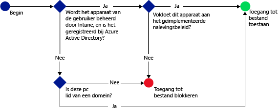

# Toegang tot SharePoint Online beperken met Microsoft Intune
Gebruik de voorwaardelijke toegang van [!INCLUDE[wit_firstref](../includes/wit_firstref_md.md)] om toegang tot bestanden op SharePoint Online te beheren.
Voorwaardelijke toegang bestaat uit twee onderdelen:
- Nalevingsbeleid voor apparaten waar het apparaat aan moet voldoen om te worden beschouwd als een apparaat dat het beleid naleeft.
- Beleid voor voorwaardelijke toegang waarin u de voorwaarden opgeeft waaraan het apparaat moet voldoen om toegang tot de service te krijgen.
Zie het onderwerp [De toegang tot e-mail, O365 en andere services beperken](restrict-access-to-email-and-o365-services-with-microsoft-intune.md) voor meer informatie over hoe voorwaardelijke toegang werkt.

Het nalevingsbeleid en het beleid voor voorwaardelijke toegang worden op de gebruiker toegepast. Een apparaat dat de gebruiker gebruikt voor toegang tot de services wordt gecontroleerd op naleving van het beleid.

Wanneer een gebruiker probeert verbinding te maken met een bestand via een ondersteunde app, zoals OneDrive, op zijn of haar apparaat, wordt de volgende evaluatie uitgevoerd:

**Voordat** u beleid voor voorwaardelijke toegang configureert voor SharePoint Online, moet u:
- Een **SharePoint Online-abonnement** hebben. Gebruikers moeten bovendien een licentie voor SharePoint Online hebben.
- Een **abonnement voor Enterprise Mobility + Security of Azure Active Directory Premium** hebben, en moeten de gebruikers een licentie hebben voor EMS of Azure AD. Zie de [Enterprise Mobility-pagina met prijzen](https://www.microsoft.com/en-us/cloud-platform/enterprise-mobility-pricing) of de [Azure Active Directory-pagina met prijzen](https://azure.microsoft.com/en-us/pricing/details/active-directory/) voor meer informatie.

  Om verbinding te maken met de vereiste bestanden, moet het apparaat:
-   Zijn **ingeschreven** bij [!INCLUDE[wit_nextref](../includes/wit_nextref_md.md)] of een pc zijn die lid is van een domein.

-   **Registreer het apparaat** bij Azure Active Directory (dit gebeurt automatisch wanneer het apparaat wordt geregistreerd bij [!INCLUDE[wit_nextref](../includes/wit_nextref_md.md)]).

-   Voldoen aan het geïmplementeerde [!INCLUDE[wit_nextref](../includes/wit_nextref_md.md)]-nalevingsbeleid

De apparaatstatus wordt opgeslagen in Azure Active Directory, die toegang tot de bestanden verleent of blokkeert op basis van de opgegeven voorwaarden.

Als niet aan een voorwaarde wordt voldaan, krijgt de gebruiker een van de volgende berichten te zien wanneer deze zich aanmeldt:

-   Als het apparaat niet is ingeschreven bij [!INCLUDE[wit_nextref](../includes/wit_nextref_md.md)] of niet is geregistreerd bij Azure Active Directory, wordt er een bericht weergegeven met instructies voor het installeren van de bedrijfsportal-app en het inschrijven van het apparaat.

-   Als het apparaat niet aan het beleid voldoet, wordt er een bericht weergegeven waarin de gebruiker naar de [!INCLUDE[wit_nextref](../includes/wit_nextref_md.md)]-website van de bedrijfsportal wordt verwezen. Hier vindt hij informatie over het probleem en aanwijzingen voor het oplossen ervan.

**Voorwaardelijke toegang wordt afgedwongen op alle SharePoint-sites en extern delen wordt geblokkeerd**

>[!NOTE]
>Als u voorwaardelijke toegang voor SharePoint Online inschakelt, raden wij aan het domein in de lijst uit te schakelen zoals staat beschreven in het onderwerp [Remove-SPOTenantSyncClientRestriction](https://technet.microsoft.com/en-us/library/dn917451.aspx).  

## Ondersteuning voor mobiele apparaten
- iOS 8.0 en hoger
- Android 4.0 en hoger, Samsung Knox Standard 4.0 en hoger
- Windows Phone 8.1 en hoger

U kunt de toegang tot SharePoint Online beperken als deze service wordt geopend via een browser op een **iOS**- of **Android**-apparaat.  Toegang wordt alleen toegestaan vanaf ondersteunde browsers op compatibele apparaten:
* Safari (iOS)
* Chrome (Android)
* Managed Browsers (iOS en Android)

**Niet-ondersteunde browser worden geblokkeerd**.

## Ondersteuning voor pc's
- Windows 8.1 en hoger (mits ingeschreven bij Intune)
- Windows 7.0, Windows 8.1 of Windows 10 (mits lid van een domein)
> [!NOTE]
>Als u voorwaardelijke toegang met Windows 10-pc's wilt gebruiken, moet u deze pc's bijwerken met de Windows 10 Jubileumupdate.

  - Pc’s die deel uitmaken van een domein, moeten zodanig worden ingesteld dat deze zich [automatisch registreren](https://azure.microsoft.com/en-us/documentation/articles/active-directory-conditional-access-automatic-device-registration/) bij Azure Active Directory.
AAD DRS wordt automatisch geactiveerd voor Intune- en Office 365-klanten. Klanten die de ADFS Device Registration Service al hebben geïmplementeerd, zien geen geregistreerde apparaten in hun on-premises Active Directory.

  - Als het beleid zo is ingesteld dat de pc lid moet zijn van een domein en de pc geen lid is van een domein, wordt in een bericht weergegeven dat er contact moet worden opgenomen met de IT-beheerder.

  - Als het beleid zodanig is ingesteld dat de pc lid moet zijn van een domein of aan het beleid moet voldoen en de pc niet aan één of beide vereisten voldoet, wordt er een bericht weergegeven met instructies voor het installeren van de bedrijfsportal-app en het inschrijven van de pc.
  >[!NOTE]
  >Voorwaardelijke toegang wordt niet ondersteund op computers met de Intune-computerclient.

-    [Moderne authenticatie van Office 365-moet zijn ingeschakeld](https://support.office.com/en-US/article/Using-Office-365-modern-authentication-with-Office-clients-776c0036-66fd-41cb-8928-5495c0f9168a) en alle nieuwe Office-updates moeten zijn geïnstalleerd.

    Moderne verificatie maakt op Active Directory Authentication Library (ADAL) gebaseerde aanmelding beschikbaar op Windows-clients met Office 2013 en zorgt voor een betere beveiliging, zoals **meervoudige verificatie** en **verificatie op basis van een certificaat**.

## Beleid voor voorwaardelijke toegang voor SharePoint Online

### Stap 1: Active Directory-beveiligingsgroepen configureren
Voordat u begint, moet u Azure Active Directory-beveiligingsgroepen configureren voor het beleid voor voorwaardelijke toegang. U kunt deze groepen configureren in het **Office 365-beheercentrum**of in de **Intune-accountportal**. Deze groepen worden gebruikt om gebruikers in of uit te sluiten van het beleid. Wanneer een gebruiker deel uitmaakt van de doelgroep voor het beleid, moet elk apparaat dat hij of zij gebruikt, aan het beleid voldoen om toegang te krijgen tot bronnen.

U kunt twee soorten groepen opgeven in een SharePoint Online-beleid:

-   **Doelgroepen**: bevat groepen gebruikers waarop het beleid van toepassing is.

-   **Uitgesloten groepen**: bevat groepen gebruikers waarop het beleid niet van toepassing is.

Als een gebruiker zich in beide groepen bevindt, wordt het beleid niet op de gebruiker toegepast.

### Stap 2: Nalevingsbeleid configureren en implementeren
Als u dit nog niet hebt gedaan, maak en implementeer dan nalevingsbeleid voor gebruikers waarop het SharePoint Online-beleid van toepassing moet zijn.

> [!NOTE]
> Terwijl nalevingsbeleid wordt geïmplementeerd voor [!INCLUDE[wit_nextref](../includes/wit_nextref_md.md)]-groepen, is beleid voor voorwaardelijke toegang gericht op Azure Active Directory-beveiligingsgroepen.

Zie [Een nalevingsbeleid maken](create-a-device-compliance-policy-in-microsoft-intune.md) voor meer informatie over het configureren van het nalevingsbeleid.

> [!IMPORTANT]
> Als u geen nalevingsbeleid hebt geïmplementeerd, worden de apparaten beschouwd als apparaten die het beleid naleven.

Wanneer u klaar bent, gaat u door naar **stap 3**.

### Stap 3: Het SharePoint Online-beleid configureren
Configureer vervolgens het beleid om ervoor te zorgen dat alleen beheerde apparaten en apparaten die aan het beleid voldoen toegang hebben tot SharePoint Online. Dit beleid wordt opgeslagen in Azure Active Directory.

#### 

>[!NOTE]
> U kunt ook een beleid voor voorwaardelijke toegang maken in de Azure AD-beheerconsole. Met de Azure AD-beheerconsole kunt u beleid voor voorwaardelijke toegang voor het Intune-apparaat maken (aangeduid als het **op apparaten gebaseerd beleid voor voorwaardelijke toegang** in Azure AD), naast ander beleid voor voorwaardelijke toegang zoals Multi-Factor Authentication.  U kunt ook beleid voor voorwaardelijke toegang voor bedrijfsapps van derden instellen, zoals voor Salesforce en Box, dat door Azure AD worden ondersteund. Zie voor meer informatie [How to set Azure Active Directory device-based conditional access policy for access control to Azure Active Directory connected applications](https://azure.microsoft.com/en-us/documentation/articles/active-directory-conditional-access-policy-connected-applications/) (Het instellen van het op apparaten gebaseerde beleid voor voorwaardelijke toegang tot toepassingen die zijn verbonden met Azure Active Directory).

1.  Klik in de [Microsoft Intune-beheerconsole](https://manage.microsoft.com) op **Beleid** > **Voorwaardelijke toegang** > **SharePoint Online-beleid**.

2.  Selecteer **Beleid voor voorwaardelijke toegang inschakelen voor SharePoint Online**.

3.  Onder **Toegang voor toepassingen** kunt u kiezen of u beleid voor voorwaardelijke toegang wilt toepassen:

    -   **Alle platforms**

        Hiervoor is vereist dat alle apparaten die worden gebruikt om toegang te krijgen tot **SharePoint Online**, moeten worden ingeschreven bij Intune en voldoen aan het nalevingsbeleid.  Elke clienttoepassing die **moderne authenticatie** gebruikt, is onderworpen aan beleid voor voorwaardelijke toegang. Als het platform momenteel niet wordt ondersteund door Intune, wordt toegang tot **SharePoint Online** geblokkeerd.

        Als u **Alle platformen** selecteert, betekent dat dat Azure Active Directory dit beleid toepast op alle verificatieaanvragen, ongeacht het platform dat wordt gerapporteerd door de clienttoepassing.  Alle platformen moeten worden ingeschreven en voldoen aan de voorwaarden, behalve:
        *   Windows-apparaten moeten worden ingeschreven, voldoen aan het beleid en lid zijn van een domein met om-premises Active Directory, of beide
        * Niet-ondersteunde platformen, zoals Mac.  Apps met moderne authenticatie die afkomstig zijn van deze platformen, worden wel nog geblokkeerd.

    -   **Specifieke platforms**

         Het beleid voor voorwaardelijke toegang wordt toegepast op elke clienttoepassing die moderne authenticatie gebruikt op de door u geselecteerde platforms.

     Voor Windows-pc's moet de pc lid zijn van een domein of zijn ingeschreven bij [!INCLUDE[wit_nextref](../includes/wit_nextref_md.md)] en voldoen aan het beleid. U kunt de volgende vereisten instellen:

     -   **Apparaten moeten lid zijn van een domein of voldoen aan het beleid.** Kies deze optie als u wilt dat de pc's lid zijn van een domein of het beleid naleven dat is ingesteld in [!INCLUDE[wit_nextref](../includes/wit_nextref_md.md)]. Als de pc niet aan een van deze vereisten voldoet, wordt de gebruiker gevraagd het apparaat in te schrijven bij [!INCLUDE[wit_nextref](../includes/wit_nextref_md.md)].

     -   **Apparaten moeten lid zijn van een domein.** Selecteer deze optie als u verplicht wilt stellen dat de pc's lid moeten zijn van een domein om toegang te kunnen krijgen tot Exchange Online. Als de pc geen lid is van een domein, wordt de toegang tot e-mail geblokkeerd en wordt de gebruiker gevraagd contact op te nemen met de IT-beheerder.

     -   **Apparaten moeten voldoen aan het beleid.** Selecteer deze optie om verplicht te stellen dat de pc's moeten zijn ingeschreven bij [!INCLUDE[wit_nextref](../includes/wit_nextref_md.md)] en aan het nalevingsbeleid moeten voldoen. Als de pc is niet ingeschreven, wordt een bericht met instructies voor het inschrijven weergegeven.

4.   Onder **Browsertoegang** tot SharePoint Online en OneDrive voor Bedrijven kunt u ervoor kiezen om toegang tot Exchange Online alleen toe te staan via de ondersteunde browsers: Safari (iOS) en Chrome (Android). Toegang vanaf andere browsers wordt geblokkeerd.  De platformbeperkingen die u hebt geselecteerd voor toegang tot OneDrive zijn hier ook van toepassing.

  Op **Android**-apparaten moeten gebruikers browsertoegang inschakelen.  Om dit te doen, moeten eindgebruikers de optie Browsertoegang inschakelen als volgt inschakelen op ingeschreven apparaten:
  1.    Open de **app Bedrijfsportal**.
  2.    Ga naar de pagina **Instellingen** via de drie puntjes (...) of via de menuknop Hardware.
  3.    Selecteer **Browsertoegang inschakelen**.
  4.  In de browser Chrome meldt u zich af bij Office 365. Start vervolgens Chrome opnieuw op.

  Op **iOS- en Android**-platformen genereert Azure Active Directory een Transport Layer Security-certificaat (TLS) voor het apparaat om te bepalen welk apparaat wordt gebruikt om de service te openen.  Op het apparaat wordt het certificaat met een prompt weergegeven aan de eindgebruiker; deze kan het certificaat dan selecteren zoals in de onderstaande schermafbeeldingen wordt weergegeven. De eindgebruiker moet dit certificaat selecteren om de browser te kunnen blijven gebruiken.

  **iOS**

  

  **Android**

  
5.  Selecteer onder **Doelgroepen** de optie **Wijzigen** om de Active Directory-beveiligingsgroepen te selecteren waarop het beleid van toepassing moet zijn. U kunt ervoor kiezen dit op alle gebruikers of alleen op bepaalde groepen gebruikers toe te passen.

6.  Selecteer desgewenst onder **Uitgesloten groepen** de optie **Wijzigen** om de Active Directory-beveiligingsgroepen te selecteren waarop dit beleid niet van toepassing is.

6.  Als u klaar bent, kiest u **Opslaan**.

U hoeft het beleid voor voorwaardelijke toegang niet te implementeren; het wordt direct van kracht.

### Stap 4: Het nalevingsbeleid en het beleid voor voorwaardelijke toegang bewaken
In de werkruimte **Groepen** kunt u de status van uw apparaten bekijken.

Selecteer een groep mobiele apparaten en selecteer op het tabblad **Apparaten** een van de volgende **Filters**:

-   **Apparaten die niet zijn geregistreerd bij AAD** : deze apparaten hebben geen toegang tot SharePoint Online.

-   **Apparaten die niet voldoen aan het beleid** : deze apparaten hebben geen toegang tot SharePoint Online.

-   **Apparaten die zijn geregistreerd bij AAD en die voldoen aan het beleid** : deze apparaten hebben toegang tot SharePoint Online.

### Zie tevens
[De toegang tot e-mail en O365-service beperken met Microsoft Intune](restrict-access-to-email-and-o365-services-with-microsoft-intune.md)

<!--HONumber=Oct16_HO1-->

