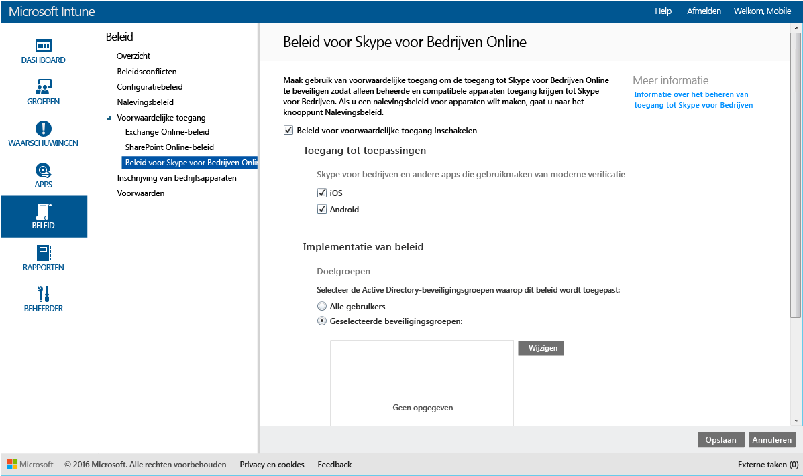

# Toegang tot Skype voor Bedrijven Online beperken met Microsoft Intune
Gebruik beleid voor voorwaardelijke toegang voor **Skype voor Bedrijven Online** om toegang tot Skype voor Bedrijven Online te beheren.
Voorwaardelijke toegang bestaat uit twee onderdelen:
- Nalevingsbeleid voor apparaten waar het apparaat aan moet voldoen om te worden beschouwd als een apparaat dat het beleid naleeft.
- Beleid voor voorwaardelijke toegang waarin u de voorwaarden opgeeft waaraan het apparaat moet voldoen om toegang tot de service te krijgen.
Zie het artikel [De toegang tot e-mail en O365-service beperken](restrict-access-to-email-and-o365-services-with-microsoft-intune.md) voor meer informatie over hoe voorwaardelijke toegang werkt.

Wanneer een gebruiker in de doelgroep Skype voor Bedrijven Online op zijn apparaat probeert te gebruiken, wordt de volgende evaluatie uitgevoerd:

**Voordat** u beleid voor voorwaardelijke toegang voor Skype voor Bedrijven Online configureert, moet u:
- Een **Skype voor Bedrijven Online-abonnement** hebben en een Skype voor Bedrijven Online-licentie toewijzen aan gebruikers.
- Een **abonnement voor Enterprise Mobility + Security of Azure Active Directory Premium** hebben, en moeten de gebruikers een licentie hebben voor EMS of Azure AD. Zie de [Enterprise Mobility-pagina met prijzen](https://www.microsoft.com/en-us/cloud-platform/enterprise-mobility-pricing) of de [Azure Active Directory-pagina met prijzen](https://azure.microsoft.com/en-us/pricing/details/active-directory/) voor meer informatie. 

-   [Moderne authenticatie inschakelen](https://docs.microsoft.com/en-us/intune/deploy-use/restrict-access-to-skype-for-business-online-with-microsoft-intune) voor Skype voor Bedrijven Online.
-  Al uw eindgebruikers moeten **Skype voor Bedrijven Online** gebruiken. Als u een implementatie van zowel Skype voor Bedrijven Online als een lokale Skype voor Bedrijven hebt, wordt er geen beleid voor voorwaardelijke toegang toegepast op eindgebruikers.

    Het apparaat waarvoor toegang tot Skype voor Bedrijven Online nodig is, moet:

-   Een **Android**- of **iOS**-apparaat zijn.

-   Zijn **geregistreerd** bij [!INCLUDE[wit_nextref](../includes/wit_nextref_md.md)].

-   **Voldoen aan** het geïmplementeerde [!INCLUDE[wit_nextref](../includes/wit_nextref_md.md)]-nalevingsbeleid.

De apparaatstatus wordt opgeslagen in Azure Active Directory, dat toegang verleent of deze blokkeert op basis van de opgegeven voorwaarden.

Als niet aan een voorwaarde wordt voldaan, krijgt de gebruiker een van de volgende berichten te zien wanneer deze zich aanmeldt:

-   Als het apparaat niet is ingeschreven bij [!INCLUDE[wit_nextref](../includes/wit_nextref_md.md)] of niet is geregistreerd bij Azure Active Directory, wordt er een bericht weergegeven met instructies voor het installeren van de bedrijfsportal-app en het inschrijven van het apparaat.

-   Als het apparaat niet aan het beleid voldoet, wordt er een bericht weergegeven dat de eindgebruiker omleidt naar de website of app van de [!INCLUDE[wit_nextref](../includes/wit_nextref_md.md)]-bedrijfsportal. Hier vindt de gebruiker informatie over het probleem en aanwijzingen om dit op te lossen.

## Beleid voor voorwaardelijke toegang configureren voor Skype voor Bedrijven Online

### Stap 1: Active Directory-beveiligingsgroepen configureren
Voordat u begint, moet u Azure Active Directory-beveiligingsgroepen configureren voor het beleid voor voorwaardelijke toegang. U kunt deze groepen configureren in het **Office 365-beheercentrum**. Deze groepen worden gebruikt om gebruikers in of uit te sluiten van het beleid. Wanneer een gebruiker deel uitmaakt van de doelgroep voor het beleid, moet elk apparaat dat hij of zij gebruikt, aan het beleid voldoen om toegang te krijgen tot bronnen.

U kunt twee soorten groepen opgeven die u voor het beleid voor Skype voor Bedrijven kunt gebruiken:

-   **Doelgroepen**: bevat groepen gebruikers waarop het beleid van toepassing is.

-   **Uitgesloten groepen**: bevat groepen gebruikers waarop het beleid niet van toepassing is.

Als een gebruiker zich in beide groepen bevindt, wordt het beleid niet op de gebruiker toegepast.

### Stap 2: Nalevingsbeleid configureren en implementeren
[Maak](create-a-device-compliance-policy-in-microsoft-intune.md) en [implementeer](deploy-and-monitor-a-device-compliance-policy-in-microsoft-intune.md) nalevingsbeleid op alle apparaten die door het beleid worden beïnvloed. Dit zijn alle apparaten die door de gebruikers in de **doelgroepen ** worden gebruikt.

> [!NOTE]
> Terwijl nalevingsbeleid wordt geïmplementeerd voor [!INCLUDE[wit_nextref](../includes/wit_nextref_md.md)]-groepen, is beleid voor voorwaardelijke toegang gericht op Azure Active Directory-beveiligingsgroepen.

> [!IMPORTANT]
> Als u geen nalevingsbeleid hebt geïmplementeerd, worden de apparaten beschouwd als apparaten die het beleid naleven.

Wanneer u klaar bent, gaat u door naar **stap 3**.

### Stap 3: Het beleid voor Skype voor Bedrijven Online configureren
Configureer vervolgens het beleid om ervoor te zorgen dat alleen beheerde apparaten en apparaten die aan het beleid voldoen, toegang hebben tot Skype voor Bedrijven Online. Dit beleid wordt opgeslagen in Azure Active Directory.

####
1.  Klik in de [Microsoft Intune-beheerconsole](https://manage.microsoft.com) op **Beleid** > **Voorwaardelijke toegang** > **Skype voor Bedrijven Online**.

2.  Selecteer **Beleid voor voorwaardelijke toegang inschakelen**.

3.  Onder **Toegang voor toepassingen** kunt u kiezen of u beleid voor voorwaardelijke toegang wilt toepassen:

    -   **iOS**

    -   **Android**

4.  Klik onder **Doelgroepen**op **Wijzigen** om de Active Directory-beveiligingsgroepen te selecteren waarop het beleid van toepassing moet zijn. U kunt ervoor kiezen dit op alle gebruikers of alleen op bepaalde groepen gebruikers toe te passen.

5.  Klik desgewenst onder **Uitgesloten groepen**op **Wijzigen** om de Active Directory-beveiligingsgroepen te selecteren waarop dit beleid niet van toepassing is.

6.  Wanneer u klaar bent, klikt u op **Opslaan**.

U hebt nu voorwaardelijke toegang voor Skype voor Bedrijven Online geconfigureerd. U hoeft het beleid voor voorwaardelijke toegang niet te implementeren; het wordt direct van kracht.

## De compatibiliteit en het beleid voor voorwaardelijke toegang bewaken
In de werkruimte **Groepen** kunt u de status voor voorwaardelijke toegang van uw apparaten bekijken.

Selecteer een groep mobiele apparaten en selecteer op het tabblad **Apparaten** een van de volgende **Filters**:

* **Apparaten die niet zijn geregistreerd bij AAD**: voor deze apparaten is de toegang tot Skype voor Bedrijven Online geblokkeerd.

* **Apparaten die niet voldoen aan het beleid**: voor deze apparaten is de toegang tot Skype voor Bedrijven Online geblokkeerd.

* **Apparaten die zijn geregistreerd bij AAD en voldoen aan het beleid**: deze apparaten hebben toegang tot Skype voor Bedrijven Online.

<!--HONumber=Oct16_HO1-->

