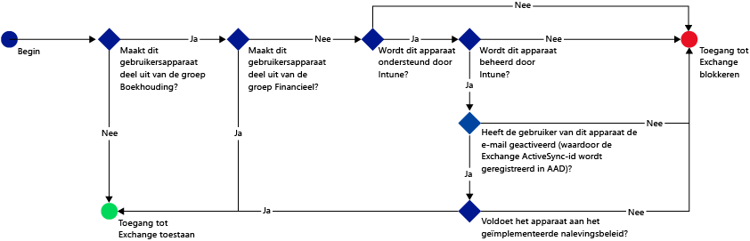
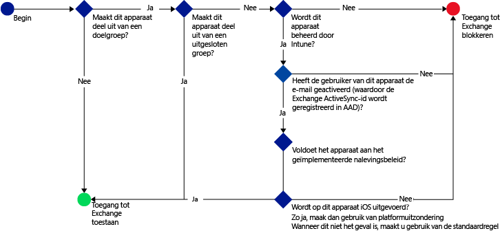

# Toegang tot e-mail beperken met Microsoft Intune: voorbeeldscenario’s

## De toegang tot Exchange Online blokkeren voor gebruikers met een apparaat dat niet voldoet aan het beleid.
### Scenariovereisten
- Voor alle gebruikers in de Active Directory-beveiligingsgroep **Accounting** moet de toegang tot Exchange Online worden geblokkeerd als hun apparaat niet voldoet aan het door u geïmplementeerde nalevingsbeleid.
- Als de groep gebruikers bevat van wie het apparaat niet door [!INCLUDE[wit_nextref](../includes/wit_nextref_md.md)] wordt ondersteund, mogen zij via dat apparaat geen toegang krijgen tot Exchange Online.
- Bovendien moeten alle gebruikers in de Active Directory-beveiligingsgroep **Finance** worden uitgesloten van het beleid, zelfs als ze zich ook in de beveiligingsgroep **Accounting** bevinden.

U doet dit door een beleid voor voorwaardelijke toegang voor Exchange Online te configureren met de volgende instellingen:

-   Selecteer **Beleid voor voorwaardelijke toegang inschakelen**.

- Selecteer de platforms die u toegang wilt geven vanuit apps met moderne authenticatie.
- Selecteer voor Exchange ActiveSync-apps de optie **Apparaten die het beleid niet naleven op platformen die worden ondersteund door Microsoft Intune** en **Alle andere apparaten op platformen die niet worden ondersteund door Microsoft Intune blokkeren**.
-   Kies in de sectie **Doelgroep** onder **Geselecteerde beveiligingsgroepen** de gebruikersgroep **Accounting**.

-   Kies in de sectie **Uitgesloten groep** onder **Geselecteerde beveiligingsgroepen** de gebruikersgroep **Finance**.

De volgende werkstroom wordt gebruikt om te bepalen welke apparaten toegang krijgen tot Exchange Online:

## Alle iOS-apparaten die toegang hebben tot Exchange On-premises, moeten worden beheerd door Intune
### Scenariovereisten
- Alleen apparaten met iOS mogen toegang hebben tot Exchange On-premises.
- De apparaten moeten ook worden ingeschreven in Intune en voldoen aan de regels van het nalevingsbeleid voordat ze kunnen worden gebruikt om toegang te krijgen tot Exchange.

U doet dit door het volgende beleid voor voorwaardelijke toegang voor Exchange On-premises te configureren met de volgende instellingen:

-   Selecteer de optie **De toegang tot Exchange On-premises blokkeren voor e-mail-apps indien het apparaat niet voldoet aan het beleid of niet is ingeschreven in Microsoft Intune**. Met het selecteren van deze optie wordt het beleid voor voorwaardelijke toegang ingeschakeld, waarvoor is vereist dat alle apparaten in Microsoft Intune moeten zijn ingeschreven en moeten voldoen aan de regels van het nalevingsbeleid, voordat ze toegang kunnen krijgen tot Exchange.

-   Als u geavanceerde Exchange Active Sync-instellingen wilt maken, maakt u een:

  -   Platformuitzondering waardoor apparaten met iOS toegang krijgen tot Exchange.   

  -   Als voor een apparaat een standaardregel geldt waarmee wordt aangegeven wanneer de platformuitzonderingsregel niet van toepassing is op een apparaat, mag dat apparaat geen toegang krijgen tot Exchange. Deze regel zorgt ervoor dat de toegang tot Exchange voor apparaten zonder iOS wordt geblokkeerd.

De volgende stroom wordt gebruikt om te bepalen welke apparaten toegang krijgen tot Exchange:

## Android-apparaten krijgen geen toegang tot Exchange On-premises.
### Scenariovereisten
- Voor alle Android-apparaten moet de toegang tot Exchange worden geblokkeerd.
- Alle andere ondersteunde apparaten kunnen wel toegang krijgen tot Exchange op voorwaarde dat ze worden beheerd door [!INCLUDE[wit_nextref](../includes/wit_nextref_md.md)].

U doet dit door een beleid voor voorwaardelijke toegang voor Exchange On-premises te configureren met de volgende instellingen:

-   Selecteer de optie **De toegang tot Exchange On-premises blokkeren voor e-mail-apps indien het apparaat niet voldoet aan het beleid of niet is ingeschreven voor Microsoft Intune**. Als u deze optie selecteert, moet elk apparaat zijn ingeschreven in Intune en voldoen aan de regels van het nalevingsbeleid.

- Als u geavanceerde Exchange Active Sync-instellingen wilt maken, maakt u een:
  -   Platformuitzondering waardoor de toegang tot Exchange door apparaten met Android wordt geblokkeerd. Deze regel zorgt ervoor dat Android-apparaten niet kunnen worden gebruikt om toegang te krijgen tot Exchange.

  -   Standaardregel waarmee wordt aangegeven dat wanneer een apparaat niet onder andere regels valt, er toegang tot Exchange moet worden gegeven. Deze standaardregel zorgt ervoor dat apparaten waarop een ander platform dan Android wordt uitgevoerd dat wel door Microsoft Intune wordt ondersteund, kunnen worden gebruikt om toegang te krijgen tot Exchange. Ze moeten echter in Intune worden ingeschreven en voldoen aan de regels van het nalevingsbeleid.

De volgende stroom wordt gebruikt om te bepalen welke apparaten toegang krijgen tot Exchange:

<!--HONumber=Oct16_HO4-->

