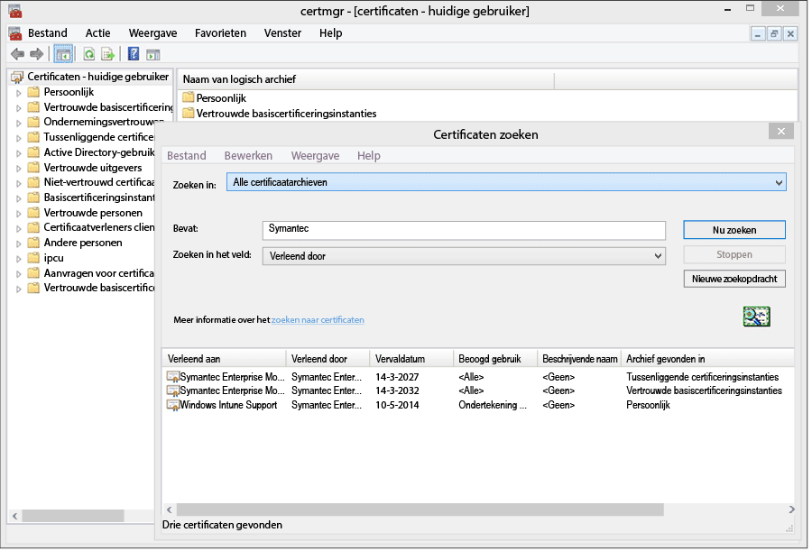
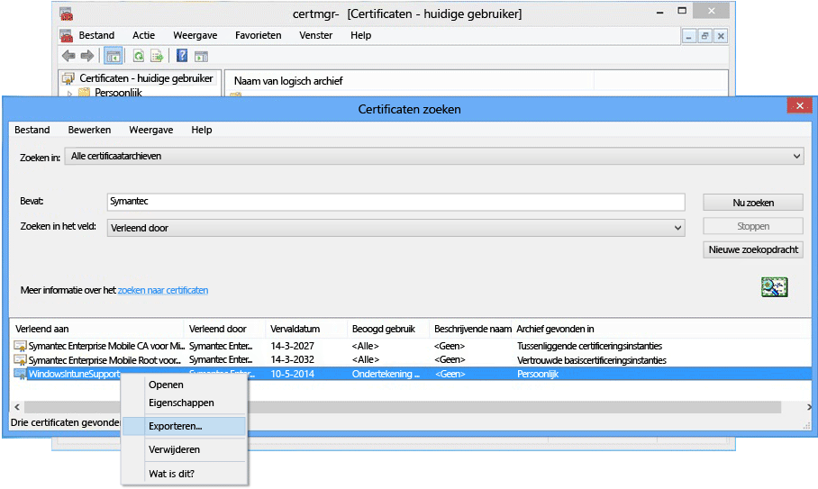

---
# required metadata

title: Windows Phone 8.0-beheer met Microsoft Intune instellen | Microsoft Intune
description:
keywords:
author: NathBarn
manager: jeffgilb
ms.date: 04/28/2016
ms.topic: article
ms.prod:
ms.service: microsoft-intune
ms.technology:
ms.assetid: 61e9b6c3-8795-49b0-8ab2-a9a05ee3ea1f

# optional metadata

#ROBOTS:
#audience:
#ms.devlang:
ms.reviewer: jeffgilb
ms.suite: ems
#ms.tgt_pltfrm:
#ms.custom:

---

# Apparaatbeheer instellen voor Windows Phone 8.0

Voordat u mobiele apparaten met Windows Phone kunt beheren met Intune, moet u beheervereisten instellen. [Door een DNS CNAME te maken](set-up-windows-phone-management-with-microsoft-intune.md), kunnen gebruikers verbinding maken met de Intune-bedrijfsportal. Windows Phone 8.0 heeft een Symantec-certificaat nodig om een versleutelde IP-verbinding tot stand te brengen tussen apparaten en Intune. Er is ook een certificaat vereist om line-of-business-apps te ondertekenen.

-   Voor **Windows Phone 8.1 en Windows 10 Mobile** is alleen in de volgende gevallen een certificaat nodig:

    -   Als u de bedrijfsportal-app met Intune wilt implementeren.

    -   Als u line-of-business-apps (oftewel 'sideloaded') implementeert.

-   **Windows Phone 8**: vereist


  > [!IMPORTANT]
  > Het Symantec-certificaat waarmee bepaalde Windows-apparaten en mobiele apparaten met Windows Phone worden beheerd, [moet regelmatig worden vernieuwd](renew-a-symantec-code-signing-certificate.md).

De installatievereisten voor het beheer van mobiele Windows Phone-apparaten zijn afhankelijk van de manier waarop u apparaten beheert.  Als u twee CNAME’s instelt u de DNS-registratie van uw bedrijf, kunt u eenvoudiger inschrijven voor gebruik. Als uw gebruikers de bedrijfsportal-app uit de Store downloaden en u de DNS-instellingen hebt geconfigureerd, hoeft u alleen de bedrijfsportal in te stellen en gebruikers te informeren hoe ze zich kunnen inschrijven.  Voor Windows Phone 8.0 of Windows Phone 8.1 waarop u de bedrijfsportal implementeert, hebt u een Symantec-certificaat nodig om de code van de app te ondertekenen.

## Installatievereisten configureren om Windows Phone-beheer in te schakelen
1.  **Intune instellen**
    Als u dit nog niet hebt gedaan, moet u het beheer van mobiele apparaten voorbereiden door [de beheerautoriteit voor mobiele apparaten in te stellen](https://technet.microsoft.com/library/mt346013.aspx) als **Microsoft Intune** en MDM in te stellen.

2.  **Een DNS-alias voor het inschrijvingsserveradres** (optioneel)

    Met een DNS-alias (CNAME-recordtype) kunen gebruikers hun apparaten makkelijker inschrijven door de servernaam automatisch in te vullen tijdens het inschrijven.

    1.  Klik in de [Intune-beheerconsole](http://manage.microsoft.com) op **Beheer** &gt; **Mobile Device Management** &gt; **Windows Phone**.

    2.  Typ de URL van het geverifieerde domein voor de bedrijfswebsite in het vak **Geef een geverifieerde domeinnaam op** en klik op **Automatische detectie testen**..

    3.  Maak **CNAME**-DNS-bronrecords voor uw bedrijfsdomein. De CNAME-resourcerecords moeten de volgende informatie bevatten:

        |Hostnaam|Verwijst naar|TTL|
        |-------------|-------------|-------|
        |enterpriseenrollment.bedrijfsdomein.com|enterpriseenrollment.manage.microsoft.com |1 uur|
        |enterpriseregistration.bedrijfsdomein.com|enterpriseregistration.windows.net|1 uur|
        Als de website van uw bedrijf bijvoorbeeld contoso.com is, maakt u een CNAME in DNS die EnterpriseEnrollment.contoso.com omleid naar manage.microsoft.com. Als er meer dan één gecontroleerd domein is, maakt u een CNAME-record voor elk domein.

        -   `manage.microsoft.com` – Biedt ondersteuning voor een omleiding naar de Intune-service met domeinherkenning vanuit de domeinnaam van het e-mailadres

        -   `enterpriseregistration.windows.net` – Ondersteunt Werkplek toevoegen voor mobiele apparaten. Ondersteunt ook voorwaardelijke toegang voor Windows 8.1

    

3.  **Certificaatbeheer ter ondersteuning van app-ondertekening**
    [Vereist voor Windows Phone 8.0 en Windows Phone 8.1 zonder toegang tot de Windows Phone Store en/of waarvoor line-of-business-apps zijn vereist.]

    Ter ondersteuning van de bedrijfsportal-app voor Windows Phone 8.0 en voor de implementatie van bedrijfs-apps naar Windows Phone 8.1 is een **Symantec Enterprise-certificaat voor ondertekening van mobiele code**vereist. U kunt geen certificaat gebruiken dat is uitgegeven door uw eigen certificeringsinstantie omdat alleen het Symantec-certificaat wordt vertrouwd door Windows Phone-apparaten. Dit certificaat is vereist om:

    -   De bedrijfsportal-app te ondertekenen voor implementatie naar [!INCLUDE[winphone8_client_1](../includes/winphone8_client_1_md.md)] voor inschrijvings- en telefoonbeheer

    -   Zakelijke line-of-business-apps te ondertekenen, zodat [!INCLUDE[wit_nextref](../includes/wit_nextref_md.md)] deze kan implementeren op Windows-telefoons.

    Gebruik onderstaande stappen om de vereiste certificaten op te halen en de bedrijfsportal-app te ondertekenen. U hebt een Windows Phone Dev Center-account nodig en vervolgens moet u een Symantec-certificaat kopen.

    1.  **Lid worden van het Windows Phone Developer Center**
        Word met uw zakelijke accountgegevens lid van het [Windows Phone Developer Center](http://go.microsoft.com/fwlink/?LinkId=268442) wanneer u zich aanmeldt om uw bedrijfsaccount aan te schaffen. Deze aanvraag moet worden geautoriseerd door een bedrijfsverantwoordelijke voordat u het certificaat voor ondertekening van programmacode ontvangt.

    2.  **Een zakelijk Symantec-certificaat kopen**
        Koop een certificaat op de [Symantec-website](http://go.microsoft.com/fwlink/?LinkId=268441) met uw Symantec-id. Nadat u het certificaat hebt gekocht, ontvangt de zakelijke goedkeurder die u hebt opgegeven in uw Windows Phone Developer Center-account een e-mail met een aanvraag voor goedkeuring van de certificaataanvraag. Lees de veelgestelde vragen over het inschrijven van Windows-apparaten in [Waarom is een Symantec-certificaat vereist voor Windows Phone?](https://technet.microsoft.com/en-us/library/dn764959.aspx#BKMK_Symantec) voor meer informatie over het vereiste Symantec-certificaat.

    3.  **Certificaten importeren**
        Zodra de aanvraag is goedgekeurd, ontvangt u een e-mail met instructies voor het importeren van certificaten. Volg de instructies in de e-mail om de certificaten te importeren.

    4.  **Geïmporteerde certificaten verifiëren**
        Ga naar de module **Certificaten**, klik met de rechtermuisknop op **Certificaten** en selecteer **Certificaten zoeken** om te controleren of de certificaten correct zijn geïmporteerd. Typ 'Symantec' in het veld **Bevat** en klik op **Nu zoeken**. De certificaten die u hebt geïmporteerd, worden weergegeven in de resultaten.

        

    5.  **Een handtekeningcertificaat exporteren**
        Wanneer u hebt gecontroleerd of de certificaten aanwezig zijn, kunt u het PFX-bestand exporteren om de bedrijfsportal te ondertekenen. Selecteer het Symantec-certificaat met 'Handtekening bij programmacode' onder **Beoogde doeleinden**. Klik met de rechtermuisknop op het certificaat voor ondertekening van programmacode en selecteer **Exporteren**..

        

        Selecteer in de **Wizard Certificaat exporteren** de optie **Ja, de persoonlijke sleutel exporteren** en klik op **Volgende**. **Selecteer Personal Information Exchange – PKCS #12 (. (PFX)** en schakel **Indien mogelijk alle certificaten in het certificeringspad opnemen** in. Voltooi de wizard. Zie [Certificaten exporteren met de persoonlijke sleutel](http://go.microsoft.com/fwlink/?LinkID=203031) voor meer informatie..

    6.  **De bedrijfsportal-app downloaden en ondertekenen**

        Voor ondersteuning van de Windows Phone-inschrijving moet de Windows Phone 8.0-bedrijfsportal-app zijn ondertekend en geüpload naar Intune.

        1.  **De bedrijfsportal downloaden**
            Download de [Intune-bedrijfsportal voor Windows Phone](http://go.microsoft.com/fwlink/?LinkId=268440) via het Downloadcentrum. De standaardlocatie voor installatie is `C:\Program Files (x86)\Microsoft Corporation\Windows Intune Company Portal for Windows Phone`.

        2.  **De Windows Phone 8.0 SDK downloaden**
            De [Windows Phone SDK](http://go.microsoft.com/fwlink/?LinkId=615570) downloaden.

        3.  **De code van het bestand van de bedrijfsportal-app ondertekenen**
            Gebruik de XAPSignTool-app die u met de SDK hebt gedownload, om de bedrijfsportal te ondertekenen met het PFX-bestand dat u hebt gemaakt op basis van het Symantec-certificaat. Zie [Een bedrijfsapp ondertekenen met XapSignTool](http://go.microsoft.com/fwlink/?LinkID=280195)voor meer informatie.

    7.  **De bedrijfsportal-app uploaden naar Intune**
        Upload het ondertekende bedrijfsportal-app-bestand en uw certificaat voor ondertekening van programmacode om de app beschikbaar te stellen aan uw eindgebruikers.

        1.  Klik in de [Intune-beheerconsole](http://manage.microsoft.com) op **Beheer** &gt; **Windows Phone**.

        2.  Klik op **Ondertekende app uploaden** en meld u aan met uw Intune-beheerder-id.

        3.  Blader op de pagina **Software-installatie** voor **Geef de locatie van de Setup-bestanden voor de software op** naar de locatie van de bedrijfsportal-app waarvan de code is ondertekend (.xap voor Windows Phone 8.0 of .appx voor Windows Phone 8.1).

            Als u een proefversie van Intune gebruikt en een ondertekend app-bestand uploadt in een Intune-proefaccount, schakelt u het selectievakje **Het bedrijfsportal-app-bestand gebruiken dat is ondertekend door het voorbeeldcertificaat van Symantec voor ondertekening van programmacode** uit.

        4.  Voeg het geëxporteerde certificaatbestand (.pfx) toe aan **Certificaat voor ondertekening van programmacode** en maak een wachtwoord voor het certificaat.

        5.  Vul de velden in op de pagina **Beschrijving van software** en onthoud dat deze gegevens ook worden weergegeven op de apparaten van de gebruikers wanneer ze informatie over de app bekijken in de bedrijfsportal.

        6.  Voltooi de wizard. Gebruikers die een Windows Phone 8.0-apparaat inschrijven, ontvangen vervolgens de bedrijfsportal-app op hun apparaten tijdens de inschrijving. Windows Phone 8.1-gebruikers kunnen de bedrijfsportal-app uit de Store-versie van de bedrijfsportal installeren.  Als Windows Phone 8.1 apparaten de Windows Phone Store niet kunnen gebruiken of u de bedrijfsportal-app wilt implementeren met Intune, moet u bedrijfsportal-app voor Windows Phone 8.1 (SSP.appx) downloaden en ondertekenen.

4.  **Vertel gebruikers hoe ze met de bedrijfsportal toegang krijgen tot bronnen**
    Uw gebruikers moeten weten hoe ze hun apparaten kunnen inschrijven en wat ze kunnen verwachten als deze onder beheer zijn gebracht. [Wat u uw eindgebruikers vertelt over het gebruik van Microsoft Intune](what-to-tell-your-end-users-about-using-microsoft-intune.md)

## De Windows Phone 8.1-bedrijfsportal-app implementeren
U kunt de bedrijfsportal-app met Intune implementeren op Windows Phone 8.1-apparaten in plaats van installatie vanuit de Windows Phone Store. Inschrijving van Windows Phone-apparaten moet nog steeds worden ingeschakeld met de bovenstaande stappen met het Symantec-certificaat. Vervolgens moet u de Windows Phone 8.1-bedrijfsportal-app downloaden en deze ondertekenen met uw Symantec-certificaat.  Dit is alleen nodig als uw gebruikers de Store van het bedrijf niet gebruiken en u de bedrijfsportal wilt implementeren op Windows Phone 8.1-apparaten.


1.  **De bedrijfsportal downloaden**

    Download de [Microsoft Intune-bedrijfsportal-app voor Windows Phone 8.1](http://go.microsoft.com/fwlink/?LinkId=615799) vanuit het Downloadcentrum en voer het zelfuitpakkende bestand (.exe) uit. Dit bestand bevat twee bestanden:

    -   CompanyPortal.appx: de installatie-app van de bedrijfsportal voor Windows Phone 8.1

    -   WinPhoneCompanyPortal.ps1:  een PowerShell-script waarmee u het bestand van de bedrijfsportal-app kunt ondertekenen, zodat het kan worden geïmplementeerd naar Windows Phone 8.1-apparaten

2.  **De Windows Phone SDK downloaden**
    Download de [Windows Phone SDK 8.0](http://go.microsoft.com/fwlink/?LinkId=615570) (http://go.microsoft.com/fwlink/?LinkId=268439) en installeer de SDK op uw computer. Deze SDK is nodig om een token voor toepassingsinschrijving te genereren.

3.  **Een AETX-bestand genereren**
    Genereer een bestand met een inschrijvingstoken van de toepassing (.aetx) met het Symantec PFX-bestand met AETGenerator.exe, onderdeel van Windows Phone SDK 8.0. Zie [Een inschrijvingstoken van de toepassing  genereren voor Windows Phone](https://msdn.microsoft.com/library/windows/apps/jj735576.aspx)voor informatie over het maken van een AETX-bestand.

4.  **De Windows-SDK voor Windows 8.1 downloaden**
    Download en installeer de [SDK voor Windows Phone](http://go.microsoft.com/fwlink/?LinkId=613525) (http://go.microsoft.com/fwlink/?LinkId=613525). Het PowerShell-script dat is opgenomen in de bedrijfsportal-app gebruikt de standaardinstallatielocatie `${env:ProgramFiles(x86)}\Windows Kits\8.1`. Als u op een andere locatie wilt installeren, moet u de locatie in een cmdlet-parameter opnemen.

5.  **De code van de app ondertekenen met PowerShell**
    Open **Windows PowerShell** als beheerder op de host waarop de Windows-SDK is geïnstalleerd en het Symantec Enterprise-certificaat voor ondertekening van mobiele code staat. Ga naar het bestand Sign-WinPhoneCompanyPortal.ps1 en voer het script uit.

    **Voorbeeld 1**

    ```
    .\Sign-WinPhoneCompanyPortal.ps1 -InputAppx 'C:\temp\CompanyPortal.appx' -OutputAppx 'C:\temp\CompanyPortalEnterpriseSigned.appx' -PfxFilePath 'C:\signing\cert.pfx' -PfxPassword '1234' -AetxPath 'C:\signing\cert.aetx'
    ```
    In dit voorbeeld wordt de CompanyPortal.appx ondertekend op C:\temp\ en wordt  CompanyPortalEnterpriseSigned.appx gemaakt. Het PFX-wachtwoord 1234 wordt gebruikt en de uitgevers-id uit het PFX-bestand wordt gelezen. De ondernemings-id wordt ook gelezen uit het cert.aetx-bestand.

    **Voorbeeld 2**

    ```
    .\Sign-WinPhoneCompanyPortal.ps1 -InputAppx 'C:\temp\CompanyPortal.appx' -OutputAppx 'C:\temp\CompanyPortalEnterpriseSigned.appx' -PfxFilePath 'C:\signing\cert.pfx' -PfxPassword '1234' -PublisherId 'OID.0.9.2342.19200300.100.1.1=1000000001, CN="Test, Inc.", OU=Test 1' -EnterpriseId 1000000001
    ```
    In dit voorbeeld wordt de CompanyPortal.appx ondertekend op C:\temp\ en wordt  CompanyPortalEnterpriseSigned.appx gemaakt. Het PFX-wachtwoord 1234 wordt gebruikt samen met de opgegeven uitgevers-ID.

    **Parameters:**

    -   `-InputAppx` – Het lokale pad naar het bestand CompanyPortal.appx tussen enkele aanhalingstekens. Bijvoorbeeld 'C:\temp\CompanyPortal.appx'

    -   `-OutputAppx` – Het lokale pad en de bestandsnaam voor de ondertekende bedrijfsportal-app tussen enkele aanhalingstekens. Bijvoorbeeld 'C:\temp\CompanyPortalEnterpriseSigned.appx'

    -   `-PfxFilePath` – Het lokale pad en de bestandsnaam voor het geëxporteerde PFX-bestand van het Symantec-certificaat. Bijvoorbeeld 'C:\signing\cert.pfx'

    -   `-PfxPassword` – Het wachtwoord dat is gebruikt voor het ondertekenen van het PFX-bestand, in enkele aanhalingstekens. Bijvoorbeeld '1234'

    -   `-AetxPath` – Het lokale pad naar het .aetx-bestand dat wordt gebruikt voor het lezen van de ondernemings-id als het argument EnterpriseId is niet gedefinieerd. Dit argument of een EnterpriseId moet worden opgegeven. Bijvoorbeeld 'C:\signing\cert.aetx'

    -   `-PublisherId` – De uitgevers-id van de onderneming. Als deze niet is opgegeven, wordt het veld Onderwerp van Symantec Enterprise-certificaat voor ondertekening van mobiele code gebruikt. Bijvoorbeeld 'OID.0.9.2342.19200300.100.1.1=1000000001, CN="Test, Inc.", OU=Test 1'

    -   `-SdkPath` – Het pad naar de hoofdmap van de Windows-SDK voor Windows 8.1. Dit argument is optioneel en wordt standaard ingesteld op ${env:ProgramFiles(x86)} \Windows Kits\8.1.

    -   `-EnterpriseId` – De enterprise-id. Dit argument of AetxPath moet worden opgegeven. Als dit argument niet is opgegeven, wordt de ondernemings-id uit het AETX-bestand gelezen. Bijvoorbeeld 1000000001

6.  Implementeer de Windows Phone 8.1-bedrijfsportal-app (SSP.appx).

    > [!IMPORTANT]
    > De ssp.xap en de bedrijfsportal uit de Store kunnen tegelijk worden geïnstalleerd, wat soms verwarrend kan zijn voor gebruikers. Als u wilt dat alle gebruikers de ssp.xap gebruiken, stelt u een geblokkeerde app in voor de Store-versie van de bedrijfsportal. Als u wilt dat alle Windows Phone 8.1-apparaten alleen de Store-versie van de bedrijfsportal gebruiken, hebt u drie opties:
    >
    > -   Als u geen apps wilt sideloaden en Windows Phone 8.0 niet hoeft te ondersteunen, uploadt u de ondertekende ssp.xap niet.
    > -   Als sideload-apps nodig zijn, en als er geen Windows Phone 8-apparaten worden ingeschreven, wijzigt u de automatisch gemaakte implementatie van ssp.xap van 'beschikbaar' in 'verwijderen'.
    > -   Als sideload-apps moeten worden geïnstalleerd en Windows Phone 8.0-apparaten moeten worden ingeschreven en de ssp.xap nodig hebben, maakt u een nieuwe software-implementatie van ssp.xap en implementeert u deze met de actie **verwijderen** . Windows Phone 8.0-apparaten bieden geen ondersteuning voor het geforceerd installeren of verwijderen van apps, en dus negeren ze de implementatie. Windows Phone 8.1-apparaten ondersteunen de verwijderactie en verwijderen de ssp.xap.


<!--HONumber=May16_HO1-->


