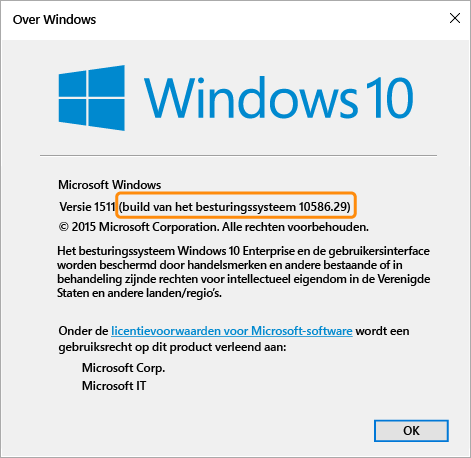

---
# required metadata

title: Instellingen voor nalevingsbeleid voor Windows-apparaten | Microsoft Intune
description:
keywords:
author: karthikaraman
manager: jeffgilb
ms.date: 04/28/2016
ms.topic: article
ms.prod:
ms.service: microsoft-intune
ms.technology:
ms.assetid: f996842c-e9a4-4819-acb4-ee66e8fb35b8

# optional metadata

#ROBOTS:
#audience:
#ms.devlang:
ms.reviewer: jeffgilb
ms.suite: ems
#ms.tgt_pltfrm:
#ms.custom:

---

# Instellingen voor nalevingsbeleid voor Windows-apparaten in Microsoft Intune

De beleidsinstellingen die in dit onderwerp worden beschreven, zijn van toepassing op apparaten waarop het Windows-besturingssysteem wordt uitgevoerd. De specifieke versie van Windows die wordt ondersteund, staat in de onderstaande secties vermeld.

Als u op zoek bent naar informatie over andere platforms, selecteer dan een van de volgende opties:
> [!div class="op_single_selector"]
- [Instellingen voor nalevingsbeleid voor iOS-apparaten](ios-compliance-policy-settings-in-microsoft-intune.md)
- [Instellingen voor nalevingsbeleid voor Android-apparaten](android-compliance-policy-settings-in-microsoft-intune.md)

## Instellingen voor nalevingsbeleid voor Windows Phone-apparaten
De instellingen in deze sectie worden ondersteund op Windows Phone 8.1 en hoger.

## Instellingen voor systeembeveiliging
### Wachtwoord
- **Wachtwoord vereisen voor het ontgrendelen van mobiele apparaten**: stel deze optie in op **Ja** als u gebruikers wilt verplichten een wachtwoord in te voeren voordat
  ze toegang tot hun apparaat krijgen.

- **Eenvoudige wachtwoorden toestaan**: stel deze optie in
   op **Ja** als u wilt toestaan dat gebruikers eenvoudige wachtwoorden maken,
   Zoals ‘**1234**’ of ‘**1111**’.

-  **Minimale wachtwoordlengte:**
  Geef het minimale aantal cijfers of tekens op waaruit
  het wachtwoord van de gebruiker moet bestaan.
- **Vereist wachtwoordtype:** geef op of gebruikers
een **alfanumeriek** of een **numeriek** wachtwoord moeten instellen.

  Bij Windows-apparaten die met een Microsoft-account toegankelijk zijn, kan het nalevingsbeleid geen goede controle uitvoeren als de minimale wachtwoordlengte langer is dan acht tekens of als het minimale aantal tekensets meer is dan twee.

- **Minimum aantal tekensets:** als u **Vereist wachtwoordtype** instelt op
**Alfanumeriek** bepaalt deze instelling het minimale aantal
tekensets waaruit het wachtwoord moet bestaan. De vier tekensets zijn:
  -   Kleine letters
  -   Hoofdletters
  -   Symbolen
  -   Getallen

  Hoe hoger de waarde is die u instelt, hoe complexer de gebruikers hun wachtwoorden moeten maken. Bij Windows-apparaten die met een Microsoft-account toegankelijk zijn, kan het nalevingsbeleid geen goede controle uitvoeren als de minimale wachtwoordlengte langer is dan acht tekens of als het minimale aantal tekensets meer is dan twee.
- **Minuten inactief voordat wachtwoord is vereist:** hiermee geeft u aan na hoeveel niet-actieve tijd gebruikers hun wachtwoord opnieuw moeten invoeren.

- **Verlopen van wachtwoorden (dagen)**: selecteer het aantal dagen waarna het wachtwoord van de gebruiker verloopt
  en de gebruiker een nieuw wachtwoord moet maken.

- **Wachtwoordgeschiedenis onthouden**: gebruik deze instelling in combinatie met **Wachtwoorden niet opnieuw gebruiken** om te voorkomen dat gebruikers
  eerder gebruikte wachtwoorden opnieuw gebruiken.

- **Wachtwoorden niet opnieuw gebruiken**: als **Wachtwoordgeschiedenis onthouden** is geselecteerd, geeft u op
  hoeveel eerder gebruikte wachtwoorden er niet opnieuw mogen worden gebruikt.
- **Wachtwoord vereisen wanneer het apparaat wordt geactiveerd vanuit een niet-actieve status:** deze instelling moet worden gebruikt samen met de instelling **Minuten van inactiviteit voordat wachtwoord vereist is**. Eindgebruikers wordt gevraagd een wachtwoord op te geven om toegang te krijgen tot een apparaat dat langer inactief is geweest dan de tijd die is opgegeven bij de instelling **Minuten van inactiviteit voordat wachtwoord vereist is**.

  **Deze instelling geldt alleen voor Windows 10 Mobile-apparaten.**
### Versleuteling
- **Versleuteling vereisen op mobiel apparaat**: stel dit in op **Ja** als u verplicht wilt stellen dat apparaten worden
  versleuteld om verbinding te kunnen maken met bronnen.

## Instellingen voor de status van het apparaat
- **Vereisen dat apparaten worden gerapporteerd als goed:** u kunt een regel instellen om te vereisen dat **Windows 10 Mobile** apparaten als goed rapporteert bij nieuw of bestaand nalevingsbeleid.  Als deze instelling is ingeschakeld, worden Windows 10-apparaten via de Health Attestation-service (HAS) op de volgende gegevenspunten beoordeeld:
  -  **BitLocker is ingeschakeld:** wanneer BitLocker is ingeschakeld, kan het apparaat gegevens die zijn opgeslagen op de schijf, beschermen tegen onbevoegde toegang wanneer het systeem wordt uitgeschakeld of naar de slaapstand overschakelt. Windows BitLocker-stationsversleuteling versleutelt alle gegevens die zijn opgeslagen op het volume met het Windows-besturingssysteem. BitLocker gebruikt de TPM om het Windows-besturingssysteem en de gebruikersgegevens te beschermen en ervoor te zorgen dat een computer niet kan worden gemanipuleerd, zelfs niet als deze onbeheerd, verloren of gestolen is. Als de computer is uitgerust met een compatibele TPM, gebruikt BitLocker de TPM om de versleutelingssleutels te vergrendelen die de gegevens beschermen. Als gevolg hiervan kunnen de sleutels niet worden gebruikt tot de TPM de status van de computer heeft gecontroleerd
  -  **Code-integriteitsbeleidsbestand is ingeschakeld:** code-integriteit is een functie die voortdurend de integriteit valideert van een stuurprogramma- of systeembestand wanneer dat bestand in het geheugen wordt geladen. Code-integriteit detecteert of een niet-ondertekend stuurprogramma- of systeembestand in de kernel wordt geladen, of dat een systeembestand is gewijzigd door schadelijke software die wordt uitgevoerd door een gebruikersaccount met beheerdersbevoegdheden.
  - **Beveiligd opstarten is ingeschakeld:** als beveiligd opstarten is ingeschakeld, wordt het systeem gedwongen om in een vertrouwde fabrieksstatus op te starten. Als beveiligd opstarten is ingeschakeld, moeten de belangrijkste onderdelen van de computer de juiste cryptografische handtekeningen hebben die worden vertrouwd door de organisatie die het apparaat heeft gemaakt. De UEFI-firmware verifieert dit voordat de computer kan worden opgestart. Als er bestanden zijn gemanipuleerd, waardoor de handtekening ongeldig is geworden, kan het systeem niet worden opgestart.

  Zie [Health Attestation CSP](https://msdn.microsoft.com/library/dn934876.aspx) voor meer informatie over de werking van de HAS-service.
##  Instellingen voor apparaateigenschappen
- **Minimale versie van het besturingssysteem die is vereist**: als een apparaat niet voldoet aan de minimumvereiste voor de versie van het
    besturingssysteem, wordt dit als niet-compatibel gemeld.
    Er wordt een koppeling met informatie over het uitvoeren van een upgrade weergegeven. De eindgebruiker kan dan kiezen of hij een upgrade van zijn apparaat wil uitvoeren, waarna hij toegang tot bedrijfsbronnen krijgt.

- **Maximale versie van het besturingssysteem die is toegestaan:** wanneer een apparaat gebruikmaakt van
    een versie van het besturingssysteem die hoger is dan wat in de regel is bepaald, wordt de toegang tot bedrijfsbronnen geblokkeerd en wordt de gebruiker gevraagd contact op te nemen met zijn IT-beheerder. Tot er een wijziging is doorgevoerd in de regel die de versie van het besturingssysteem toestaat, kan dit apparaat niet worden gebruikt om toegang tot bedrijfsbronnen te krijgen.

## Instellingen voor nalevingsbeleid voor Windows-pc’s
De instellingen in deze sectie worden ondersteund op Windows-pc’s.
## Instellingen voor systeembeveiliging
### Wachtwoord
- **Minimale wachtwoordlengte:** ondersteund op Windows 8.1.

  Hiermee geeft u het minimale aantal cijfers of tekens op waaruit het wachtwoord van de gebruiker moet bestaan.

  Voor apparaten met Windows die zijn beveiligd met een Microsoft-account, kunnen met het nalevingsbeleid geen goede controles worden uitgevoerd als **Minimale wachtwoordlengte** meer dan 8 tekens is of als **Minimum aantal tekensets** meer dan twee tekens is.

- **Vereist wachtwoordtype:** wordt ondersteund op Windows RT, Windows RT 8.1 en Windows 8.1

  Hiermee geeft u aan of gebruikers een **alfanumeriek** of een **numeriek** wachtwoord moeten maken.

- **Minimum aantal tekensets:** wordt ondersteund op Windows RT, Windows RT 8.1 en Windows 8.1. Als **Vereist wachtwoordtype** is ingesteld op **Alfanumeriek**, wordt hier het minimale aantal tekensets opgegeven waaruit het wachtwoord moet bestaan. De vier tekensets zijn:
  -   Kleine letters
  -   Hoofdletters
  -   Symbolen
  -   Nummers: hoe hoger de waarde is die u instelt, hoe complexer gebruikers hun wachtwoorden moeten maken.

  Voor Windows-apparaten die zijn beveiligd met een Microsoft-account, kunnen met het nalevingsbeleid geen goede controles worden uitgevoerd als **Minimale wachtwoordlengte** meer dan 8 tekens is of als **Minimum aantal tekensets** meer dan 2 tekens is.
- **Minuten van inactiviteit voordat wachtwoord vereist is:** wordt ondersteund op Windows RT, Windows RT 8.1 en Windows 8.1

  Hiermee geeft u aan na hoeveel niet-actieve tijd gebruikers hun wachtwoord opnieuw moeten invoeren.

- **Wachtwoord verloopt (dagen):** wordt ondersteund op Windows RT, Windows RT 8.1 en Windows 8.1.

  Selecteer het aantal dagen waarna het wachtwoord van gebruikers verloopt en ze een nieuw wachtwoord moeten maken.

- **Wachtwoordgeschiedenis onthouden:** wordt ondersteund op Windows RT, Windows RT en Windows 8.1.

  Gebruik deze instelling in combinatie met **Wachtwoorden niet opnieuw gebruiken** om te voorkomen dat gebruikers eerder gebruikte wachtwoorden opnieuw gebruiken.
- **Wachtwoorden niet opnieuw gebruiken:** wordt ondersteund op Windows RT, Windows RT 8.1 en Windows 8.1

  Als **Wachtwoordgeschiedenis onthouden:** is geselecteerd, geef dan aan hoeveel eerder gebruikte wachtwoorden er niet opnieuw kunnen worden gebruikt.

## Instellingen voor de status van het apparaat
- **Vereisen dat apparaten worden gerapporteerd als goed:** wordt ondersteund op Windows 10-apparaten.
U kunt een regel instellen die vereist dat Windows 10-apparaten in nieuw of bestaand nalevingsbeleid als goed moeten worden gerapporteerd.  Als deze instelling is ingeschakeld, worden Windows 10-apparaten via de Health Attestation-service (HAS) op de volgende gegevenspunten beoordeeld:
  -  **BitLocker is ingeschakeld:** wanneer BitLocker is ingeschakeld, kan het apparaat gegevens die zijn opgeslagen op de schijf, beschermen tegen onbevoegde toegang wanneer het systeem wordt uitgeschakeld of naar de slaapstand overschakelt. Windows BitLocker-stationsversleuteling versleutelt alle gegevens die zijn opgeslagen op het volume met het Windows-besturingssysteem. BitLocker gebruikt de TPM om het Windows-besturingssysteem en de gebruikersgegevens te beschermen en ervoor te zorgen dat een computer niet kan worden gemanipuleerd, zelfs niet als deze onbeheerd, verloren of gestolen is. Als de computer is uitgerust met een compatibele TPM, gebruikt BitLocker de TPM om de versleutelingssleutels te vergrendelen die de gegevens beschermen. Als gevolg hiervan kunnen de sleutels niet worden gebruikt tot de TPM de status van de computer heeft gecontroleerd
  -  **Code-integriteitsbeleidsbestand is ingeschakeld:** code-integriteit is een functie die voortdurend de integriteit valideert van een stuurprogramma- of systeembestand wanneer dat bestand in het geheugen wordt geladen. Code-integriteit detecteert of een niet-ondertekend stuurprogramma- of systeembestand in de kernel wordt geladen, of dat een systeembestand is gewijzigd door schadelijke software die wordt uitgevoerd door een gebruikersaccount met beheerdersbevoegdheden.
  - **Beveiligd opstarten is ingeschakeld:** als beveiligd opstarten is ingeschakeld, wordt het systeem gedwongen om in een vertrouwde fabrieksstatus op te starten. Als beveiligd opstarten is ingeschakeld, moeten de belangrijkste onderdelen van de computer de juiste cryptografische handtekeningen hebben die worden vertrouwd door de organisatie die het apparaat heeft gemaakt. De UEFI-firmware verifieert dit voordat de computer kan worden opgestart. Als er bestanden zijn gemanipuleerd, waardoor de handtekening ongeldig is geworden, kan het systeem niet worden opgestart.
  - **Early Launch Antimalware is ingeschakeld:** Early Launch Anti-Malware (ELAM) biedt de computers in uw netwerk bescherming wanneer ze worden opgestart en wanneer stuurprogramma’s van derden worden geïnitialiseerd.

  Zie [Health Attestation CSP](https://msdn.microsoft.com/library/dn934876.aspx) voor meer informatie over de werking van de HAS-service.

## Instellingen voor apparaateigenschappen
- **Minimale versie van het besturingssysteem die is vereist:** wordt ondersteund op Windows 8.1 en Windows 10.

  Geef hier het nummer van de major.minor.build op. Het versienummer moet overeenkomen met de versie die wordt geretourneerd door de opdracht winver.

  Wanneer een apparaat een eerdere versie heeft dan de opgegeven versie van het besturingssysteem, wordt de versie als niet-compatibel gerapporteerd. Er wordt een koppeling met informatie over het uitvoeren van een upgrade weergegeven. De eindgebruiker kan dan kiezen of hij een upgrade van zijn apparaat wil uitvoeren, waarna hij toegang tot bedrijfsbronnen krijgt.

- **Maximale versie van het besturingssysteem die is toegestaan:** wordt ondersteund op Windows 8.1 en Windows 10.

  Wanneer een apparaat een versie van het besturingssysteem gebruikt dat hoger is dan wat in de regel is bepaald, wordt de toegang tot bedrijfsbronnen geblokkeerd en wordt de gebruiker gevraagd contact op te nemen met zijn IT-beheerder. Tot er een wijziging is doorgevoerd in de regel die de versie van het besturingssysteem toestaat, kan dit apparaat niet worden gebruikt om toegang tot bedrijfsbronnen te krijgen.

Als u de versie van het besturingssysteem wilt vinden die u voor de instellingen **Minimale versie van het besturingssysteem die is vereist** en **Maximale versie van het besturingssysteem dat is toegestaan** wilt gebruiken, voert u via de opdrachtregel de opdracht **winver** uit. De opdracht winver retourneert de gemelde versie van het besturingssysteem.
- Windows 8.1-pc's retourneren versie **6.3**.    Als de besturingssysteemversieregel is ingesteld op Windows 8.1 voor Windows, wordt het apparaat als in strijd met het nalevingsbeleid gerapporteerd, zelfs als het apparaat Windows 8.1 heeft.
- Voor Windows 10-computers moet de versie worden ingesteld op 10.0, gevolgd door het build-nummer van het besturingssysteem dat wordt geretourneerd door de opdracht winver. Dit nummer ziet er bijvoorbeeld zo uit: 10.0.10586.
> 

<!--HONumber=May16_HO1-->

