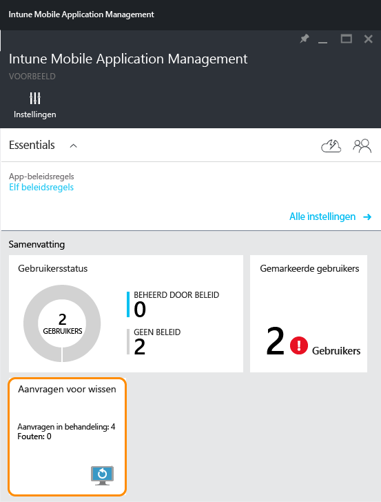
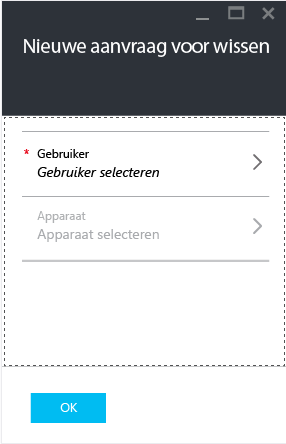
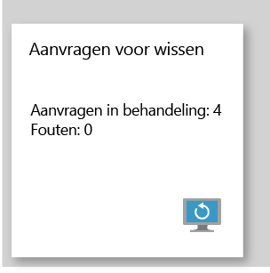

# Bedrijfsgegevens van beheerde apps wissen met Microsoft Intune
Wanneer een apparaat is vermist of is gestolen, of als een werknemer uw bedrijf verlaat, wilt u dat de gegevens in zakelijke apps van het apparaat worden verwijderd. U wilt echter geen persoonlijke gegevens op het apparaat verwijderen, vooral niet als het apparaat het eigendom van de werknemer is.

Als u selectief gegevens van zakelijke apps wilt verwijderen, moet u een wisaanvraag maken. Dit doet u door de stappen te volgen die in het gedeelte **Een wisaanvraag maken** van dit onderwerp worden beschreven.  Wanneer de aanvraag is ingediend, worden de bedrijfsgegevens uit de app verwijderd wanneer de app de volgende keer op het apparaat wordt uitgevoerd.
>[!NOTE]
> Contactpersonen die rechtstreeks vanuit de app zijn gesynchroniseerd met het systeemeigen adresboek, worden verwijderd. Contactpersonen die vanuit het systeemeigen adresboek zijn gesynchroniseerd met een andere externe bron, kunnen niet worden gewist. Dit is momenteel alleen van toepassing op de Microsoft Outlook-app.

## Een wisaanvraag maken

1.  Klik op het tabblad **Intune Mobile Application Management** op de tegel **Aanvragen voor wissen**.

    

2.  Kies **Nieuwe aanvragen voor wissen**.

    

3.  Klik op het tabblad **Nieuwe aanvragen voor wissen** op **Gebruiker** om het tabblad **Gebruiker** te openen. Selecteer vervolgens de gebruiker van wie u de app-gegevens wilt wissen.

4.  Kies **Apparaat**.  Hiermee opent u het tabblad **Apparaat** met een lijst met alle apparaten die aan de geselecteerde gebruiker zijn gekoppeld.  Selecteer het apparaat dat u wilt wissen.

5.  U bent nu terug op het tabblad **Nieuwe aanvraag voor wissen**. Kies **Ok** om een wisaanvraag te maken. De service maakt en volgt voor elke beveiligde app op het apparaat een afzonderlijk verzoek om te wissen.

## Uw verzoeken om te wissen bijhouden
Het tabblad **Intune Mobile Application Management** biedt een samenvattingsrapport op de tegel **Verzoek om te wissen** .  Dit rapport toont de algemene status inclusief het aantal in behandeling zijnde verzoeken en fouten. U kunt meer informatie krijgen door de stappen te volgen die hieronder worden beschreven:

1.  Klik op het tabblad **Intune Mobile Application Management** op de tegel **Aanvraag voor wissen** om het tabblad **Aanvraag voor wissen** te openen.

2.  Op het tabblad **Verzoek om te wissen** ziet u een lijst met uw verzoeken, gegroepeerd per gebruiker.  Omdat het systeem voor elke beveiligde app die op het apparaat wordt uitgevoerd een verzoek om te wissen maakt, ziet u mogelijk meerdere verzoeken voor dezelfde gebruiker.  De status geeft aan of een verzoek om te wissen nog steeds **in behandeling**, **mislukt**of **geslaagd**is.

### Zie ook
[App-gegevens beschermen met beleid voor het beheren van mobiele apps ](protect-app-data-using-mobile-app-management-policies-with-microsoft-intune.md)

[De Azure-portal gebruiken](azure-portal-for-microsoft-intune-mam-policies.md)

<!--HONumber=Jul16_HO5-->

