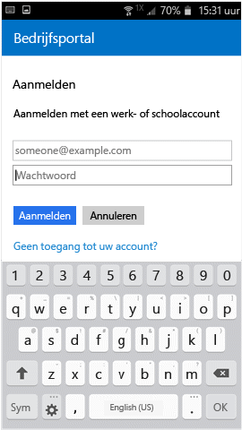

# Uw Android-apparaat inschrijven bij Intune

Als uw bedrijf of school gebruikmaakt van Microsoft Intune, kunt u uw Android-apparaat registreren voor toegang tot zakelijke e-mail, bestanden en andere bronnen. Door uw apparaten te registreren, kan uw IT-afdeling deze werk- of schoolbronnen beheren en veilig houden, en beschikt u over de vrijheid om het apparaat van uw voorkeur te gebruiken voor uw werk. Zie [Wat gebeurt er wanneer ik de bedrijfsportal-app installeer en mijn apparaat inschrijf?](what-happens-if-you-install-the-Company-Portal-app-and-enroll-your-device-in-intune-android.md) voor meer informatie over inschrijving.

<iframe src="https://channel9.msdn.com/Series/IntuneEnrollment/Android-Enrollment/player" width="960" height="540" allowFullScreen frameBorder="0"></iframe>

Deze registratie-instructies zijn bestemd voor 'native' en Samsung KNOX Android-apparaten. Samsung KNOX is een beveiligingstype dat door sommige Samsung-apparaten wordt gebruikt als extra bescherming naast de beveiligingsfuncties van native Android-apparaten. Als u wilt controleren of u een Samsung KNOX-apparaat hebt, gaat u naar **Instellingen** > **Over apparaat**. Als de KNOX-versie niet wordt vermeld, hebt u een systeemeigen Android-apparaat.

Voor of na de registratie wordt u mogelijk gevraagd om een categorie te kiezen die het beste beschrijft hoe u uw apparaat gebruikt. Uw IT-beheerder gebruikt deze categorie om te controleren tot welke apps u toegang hebt.

Als er een fout optreedt bij het registreren van uw apparaat bij Intune, kunt u [registratiefouten naar uw IT-beheerder verzenden](send-enrollment-errors-to-your-it-admin-android.md).

**Ga als volgt te werk om uw Android-apparaat te registeren:**

1.  Installeer de gratis app Intune-bedrijfsportal via [Google Play](http://play.google.com/store/apps/details?id=com.microsoft.windowsintune.companyportal).

2.  Open de app Microsoft Intune-bedrijfsportal.

3.  Tik in het **aanmeldingsscherm** van de bedrijfsportal op **Aanmelden** en meld u vervolgens aan met uw werk- of schoolaccount.

       

4.  Als de IT-beheerder voorwaarden van het bedrijf heeft ingesteld, tikt u op **ACCEPTEREN** om de voorwaarden te accepteren.

    

5.  Meld u aan bij de bedrijfsportal-app met uw werk- of schoolaccount en wachtwoord, en tik vervolgens op **Aanmelden**.

    

6.  Tik in het scherm **Instellen van bedrijfstoegang** op **STARTEN**.

    

7.  Lees op het scherm **Waarom moet u uw apparaat registreren?** informatie over wat u kunt doen wanneer u uw apparaat registreert en tik vervolgens op **DOORGAAN**.

    

8.  Bekijk een lijst met zaken die de IT-beheerder wel en niet kan zien op het apparaat, en tik vervolgens op **DOORGAAN**.

    

9.  Lees op het scherm **De volgende stap** wat er gebeurt tijdens het registreren en tik vervolgens op **REGISTREREN**.

    

10.  Als u Android 6.0 of hoger gebruikt, moet u deze stap uitvoeren. Ga anders naar de volgende stap.

    Als de IT-beheerder bepaald beleid heeft ingesteld, ziet u mogelijk de volgende berichten:
    -    **De bedrijfsportal toestaan telefoongesprekken uit te voeren en te beheren?**

        

    Als u dit bericht ziet, tikt u op **TOESTAAN**. Het is veilig om op TOESTAAN te tikken, omdat **Microsoft nooit telefoongesprekken uitvoert of beheert**. Google beheert de tekst van het bericht. De tekst kan niet worden gewijzigd door Microsoft. Als u toegang toestaat, staat u alleen toe dat het IMEI-nummer ( International Mobile Equipment Identity) van uw apparaat wordt verzonden naar Intune. Het IMEI-nummer is vergelijkbaar met een serienummer en is uniek voor een mobiel apparaat.

    Als u de toegang weigert, wordt het bericht de volgende keer dat u zich bij de bedrijfsportal aanmeldt, opnieuw weergegeven. U kunt echter toekomstige berichten uitschakelen door op het selectievakje **Niet opnieuw vragen** te tikken. Als u later besluit toegang te verlenen, gaat u naar **Instellingen** &gt; **Apps** &gt; **Bedrijfsportal** &gt; **Machtigingen** &gt; **Telefoon** en schakelt u de machtiging in.

    -    **Toestaan dat Bedrijfsportal toegang heeft tot uw contactpersonen?**

        

    Als u dit bericht ziet, tikt u op **TOESTAAN**. Het is veilig om op TOESTAAN te tikken, omdat **Microsoft nooit toegang tot uw contactpersonen probeert te krijgen**. Google beheert de tekst van het bericht. De tekst kan niet worden gewijzigd door Microsoft. Als u toegang toestaat, kan alleen met de bedrijfsportal-app uw werkaccount worden gemaakt, gebruikt en beheerd.

    Als u de toegang weigert, wordt het bericht de volgende keer dat u zich bij de bedrijfsportal aanmeldt, opnieuw weergegeven. U kunt echter toekomstige berichten uitschakelen door op het selectievakje **Niet opnieuw vragen** te tikken. Als u later besluit toegang te verlenen, gaat u naar **Instellingen** &gt; **Apps** &gt; **Bedrijfsportal** &gt; **Machtigingen** &gt; **Telefoon** en schakelt u de machtiging in.

11.  Tik op het scherm **Apparaatbeheerder activeren** op **Activeren**.

    

12.  Volg de aanwijzingen voor het invoeren van de pincode of het wachtwoord. Als u al een pincode of wachtwoord op dit apparaat hebt ingesteld, wordt dit scherm niet weergegeven of wordt u niet verzocht om een nieuwe pincode of nieuw wachtwoord in te voeren.

    

13.  Als u een Samsung Knox-apparaat gebruikt, tikt u op **Bevestigen**. U ziet dan een bericht dat uw apparaat wordt geregistreerd. Als u een systeemeigen Android-apparaat gebruikt, let dan op het volgende scherm waarin wordt weergegeven dat het apparaat wordt geregistreerd.

    

    Op dit scherm wordt aangegeven dat uw apparaat wordt geregistreerd.

    

14. Wanneer het scherm **Instellen van bedrijfstoegang** wordt weergegeven, tikt u op **DOORGAAN**. Als er een bericht verschijnt waarin wordt aangegeven dat het apparaat niet voldoet aan het beleid, volgt u de instructies om het probleem te verhelpen en tikt u vervolgens op **DOORGAAN**.

      

11. Tik in het scherm **Instellen van bedrijfstoegang is voltooid** op **GEREED**. Uw apparaat is nu geregistreerd.

    

Ga naar **Instellingen** &gt; **Beveiliging** en schakel **Onbekende bronnen** in voordat u bedrijfsapps installeert. Als u deze optie niet inschakelt voordat u apps installeert, wordt het volgende bericht weergegeven: "Installatie geblokkeerd. Uw apparaat is uit veiligheidsoverwegingen zo ingesteld dat installaties van apps die afkomstig zijn van onbekende bronnen, worden geblokkeerd." U kunt in het foutberichtvenster op **Instellingen** tikken om naar de optie **Onbekende bronnen** te gaan.

Nog hulp nodig? Neem contact op met uw IT-beheerder (zie de [bedrijfsportalwebsite](http://portal.manage.microsoft.com) voor contactgegevens) of stuur een e-mail naar het Microsoft Android-team via wintunedroidfbk@microsoft.com.

<!--HONumber=Feb17_HO2-->

