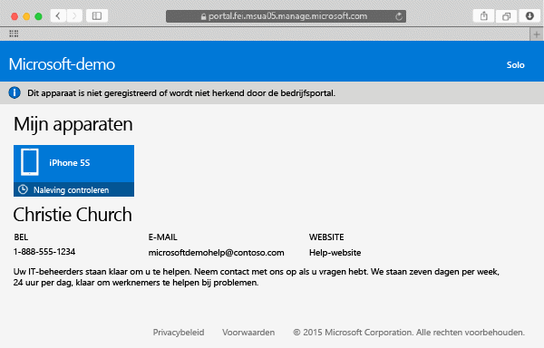

---
# required metadata

title: Uw Mac OS X-apparaat inschrijven bij Intune | Microsoft Intune
description:
keywords:
author: Staciebarker
manager: jeffgilb
ms.date: 04/28/2016
ms.topic: article
ms.prod:
ms.service: microsoft-intune
ms.technology:
ms.assetid: 58eb0e7a-1321-4c66-a281-88fb01e72c1c

# optional metadata

ROBOTS: noindex
#audience:
#ms.devlang:
ms.reviewer: jeffgilb
ms.suite: ems
#ms.tgt_pltfrm:
#ms.custom:

---

# Uw Mac OS X-apparaat inschrijven bij Intune

Wanneer u uw Mac OS X-apparaat bij Intune inschrijft, kunt u toegang krijgen tot het bedrijfsnetwerk, de e-mail van uw werk en werkbestanden, en kunt u bedrijfsapps installeren. Zie [Wat gebeurt er wanneer ik de bedrijfsportal-app installeer en mijn apparaat inschrijf bij Intune?](what-happens-if-you-install-the-company-portal-app-and-enroll-your-device-in-intune-ios.md) voor meer informatie over wat er gebeurt wanneer u uw apparaat inschrijft..

Raadpleeg [Uw iOS-apparaat inschrijven bij Intune](enroll-your-device-in-intune-ios.md) als u probeert een iOS-apparaat in te schrijven..

Ga als volgt te werk om uw Mac OS X-apparaat in te schrijven:

1.  Open de [bedrijfsportalwebsite](https://portal.manage.microsoft.com) met een Safari-browser en tik op het systeemvak.

2.  Tik op **Dit apparaat is niet ingeschreven of kan niet worden geïdentificeerd door de bedrijfsportal**..

     

3.  Tik op **Installeren** om uw apparaat in te schrijven.

     

4.  Tik in het dialoogvenster **Beheerprofiel installeren** op **Installeren**. Als er een dialoogvenster wordt weergegeven waarin u wordt gevraagd uw referenties in te voeren, voert u uw gebruikersnaam en wachtwoord in en tikt u op **Doorgaan** &gt; **Installeren**..

     

    Wanneer u klaar bent met het inschrijven, ziet u een beheerprofielpagina waarop wordt aangegeven dat uw profiel is geverifieerd.

     

### Zie tevens
[Uw iOS- of Mac OS X-apparaat gebruiken met Intune](using-your-ios-or-mac-os-x-device-with-intune.md)

<!--HONumber=May16_HO1-->

