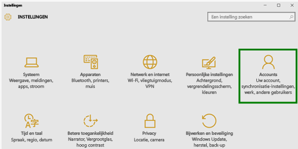
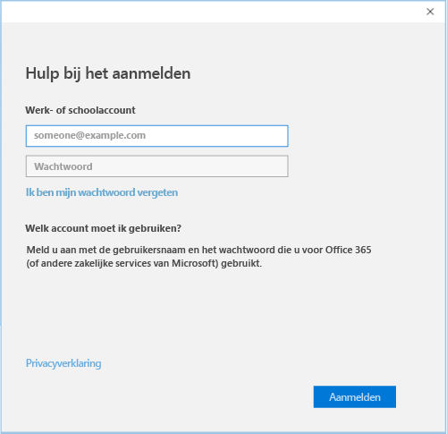

# Uw Windows 10-apparaat inschrijven bij Intune

1.  Ga in Windows naar **Instellingen** en tik op **Accounts**.

    

2.  Tik op **Uw account**.

    

3.  Tik op **Een werk- of schoolaccount toevoegen**.

    

4.  Meld u aan met de referenties van uw werk- of schoolaccount.

    

Nog steeds geen toegang tot uw e-mail, bestanden of andere gegevens voor werk of school? Probeer het toegangsprobleem op te lossen door het [oplossen van problemen met uw account](troubleshoot-your-windows-10-device-windows.md#troubleshooting-steps-to-follow-if-you-see-your-account). Als dit ook niet werkt, kunt u contact opnemen met uw IT-beheerder voor verdere assistentie.

Een eenvoudige manier om de hulp van uw IT-beheerder in te roepen, is via de contactgegevens die beschikbaar zijn in de bedrijfsportal-app. Hier kunt u ook aanbevolen en vereiste apps voor uw dagelijkse taken vinden en downloaden. Het is mogelijk dat de bedrijfsportal-app al op uw apparaat is geïnstalleerd. Als u snel wilt controleren of u de app hebt, zoekt u naar __Bedrijfsportal__ in de lijst __Alle apps__.

Als u Bedrijfsportal niet in de lijst met apps ziet, volgt u deze stappen om het te installeren.

1.  Tik op **Start** &gt; **Store**.

2.  Tik op **Zoeken** en typ **bedrijfsportal**.

3.  Tik in de lijst met resultaten op **Bedrijfsportal** &gt; **Installeren**.

4.  Tik op **Installeren** of **Gratis**. Er is geen verschil tussen deze twee opties. De keuze die wordt weergegeven, is afhankelijk van hoe de bedrijfsportal-app is ingesteld in uw organisatie.

<!--HONumber=Dec16_HO2-->

