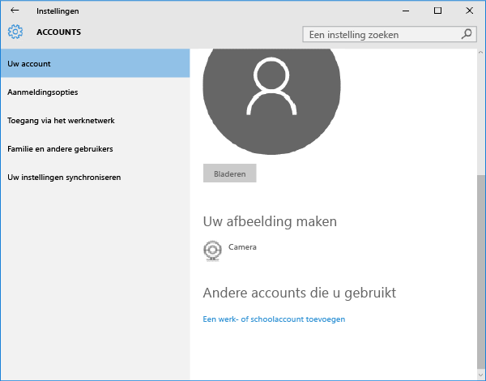

---
# required metadata

title: Uw Windows 10 Mobile- of Windows 10-desktopapparaat inschrijven bij Intune | Microsoft Intune
description:
keywords:
author: Staciebarker
manager: jeffgilb
ms.date: 04/28/2016
ms.topic: article
ms.prod:
ms.service: microsoft-intune
ms.technology:
ms.assetid: 36250832-c6fd-4e8d-b681-de735023ebc3

# optional metadata

#ROBOTS:
#audience:
#ms.devlang:
ms.reviewer: jeffgilb
ms.suite: ems
#ms.tgt_pltfrm:
#ms.custom:

---

# Uw Windows 10 Mobile- of Windows 10-desktopapparaat inschrijven bij Intune

Als uw bedrijf of school gebruikmaakt van Microsoft Intune, kunt u uw apparaten inschrijven voor toegang tot zakelijke e-mail, bestanden en andere bronnen. Door uw apparaten in te schrijven, kan uw organisatie bedrijfsgegevens veilig houden. Zie [Wat gebeurt er wanneer ik de bedrijfsportal-app installeer en mijn apparaat inschrijf bij Intune?](what-happens-if-you-install-the-company-portal-app-and-enroll-your-device-in-intune-windows.md) en [ Wat de IT-beheerder kan zien op het apparaat](what-can-your-it-administrator-see-when-you-enroll-your-device-in-intune-windows.md) voor meer informatie over inschrijving..

Ga als volgt te werk om uw Windows 10 Mobile- of Windows 10-desktopapparaat in te schrijven:

1.  Ga in Windows naar **Instellingen** en tik op **Accounts**..

    

2.  Tik op **Uw account**..

    

3.  Tik op **Een werk- of schoolaccount toevoegen**..

    

4.  Meld u aan met de referenties van uw werk- of schoolaccount.

    

Als u bovenstaande stappen hebt uitgevoerd, maar nog steeds geen toegang hebt tot e-mail, bestanden en andere gegevens van uw werk of school, ga dan terug naar **Accounts** en tik op **Toegang via het werknetwerk**..

-   Als u uw werk- of schoolaccount ziet, is het gelukt. U bent verbonden.

-   Als u uw werk- of schoolaccount niet ziet, tikt u op **Verbinding maken** en meldt u zich aan met de referenties van uw werk- of schoolaccount.

Het wordt ook aangeraden de bedrijfsportal-app te installeren, waarmee u eenvoudig de bedrijfsapps die relevant zijn voor u en uw rol, kunt identificeren en downloaden. Afhankelijk van hoe uw bedrijf Intune heeft geconfigureerd, is de bedrijfsportal-app mogelijk geïnstalleerd als onderdeel van het inschrijvingsproces. Als u wilt controleren of u de app hebt, zoekt u naar **Bedrijfsportal** in de lijst met apps. Als u Bedrijfsportal niet in de lijst met apps ziet, volgt u deze stappen om het te installeren.

1.  Tik op **Start** &gt; **Store**..

2.  Tik op **Zoeken** en typ **bedrijfsportal**..

3.  Tik in de lijst met resultaten op **Bedrijfsportal** &gt; **installeren**.

4.  Tik op **Installeren** of **Gratis**. De optie die wordt weergegeven, is afhankelijk van hoe de app binnen uw bedrijf is geconfigureerd.

### Zie tevens
[Uw Windows-apparaat inschrijven bij Intune](enroll-your-device-in-intune-windows.md) 
[Uw Windows-apparaat gebruiken met Intune](using-your-windows-device-with-intune.md)

<!--HONumber=May16_HO1-->

