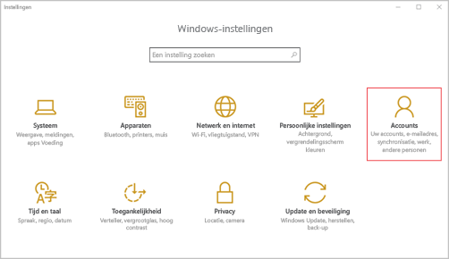
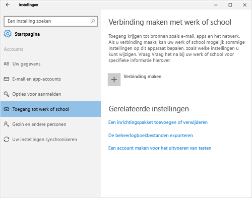
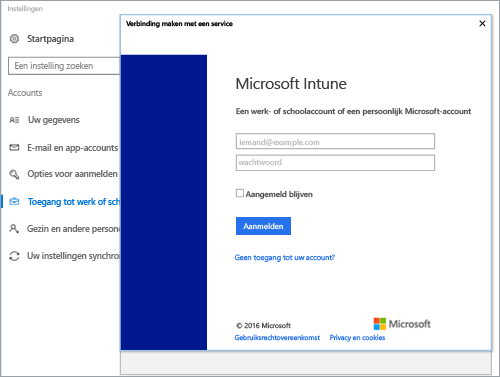
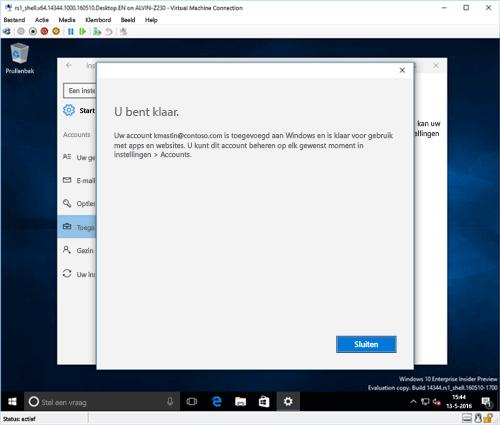
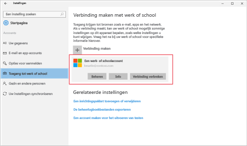

# Uw Windows 10 Mobile- of Windows 10-desktopapparaat registreren bij Intune

Als uw bedrijf of school gebruikmaakt van Microsoft Intune, kunt u uw apparaten registreren voor toegang tot zakelijke e-mail, bestanden en andere bronnen. Door uw apparaten te registreren, kan uw organisatie bedrijfsgegevens veilig houden. Zie [Wat gebeurt er als u de bedrijfsportal-app installeert en uw apparaat registreert bij Intune?](what-happens-if-you-install-the-company-portal-app-and-enroll-your-device-in-intune-windows.md) en [Wat de IT-beheerder kan zien op het apparaat](what-can-your-it-administrator-see-when-you-enroll-your-device-in-intune-windows.md) voor meer informatie over registratie.

Ga als volgt te werk om uw Windows 10 Mobile- of Windows 10-desktopapparaat te registreren:

1.  Ga in Windows naar **Instellingen** en tik op **Accounts**.

    

2.  Bekijk de volgende twee schermen en kies het scherm dat lijkt op het scherm op uw apparaat. Volg de stappen die bij het scherm horen dat u op het apparaat ziet.

    Als u dit scherm ziet, volgt u de stappen in [Stappen om te volgen als u Werk of school openen ziet](#steps-to-follow-if-you-see-access-work-or-school).

    

    Als u dit scherm ziet, volgt u de stappen in [Stappen om te volgen als u Uw account ziet](#steps-to-follow-if-you-see-your-account).

    

## Stappen om te volgen als u Werk of school openen ziet

1.  Tik op **Werk of school openen**.

    

2.  Voer uw werk- of schoole-mailadres in en tik op **Volgende**.

    

3. Meld u aan bij Intune met uw werk- of schoolaccount.

    

    U ziet een bericht waarin staat dat bij uw bedrijf of school uw apparaat wordt geregistreerd.

4. Wanneer u de pagina **U bent klaar.** ziet, tikt u op **Sluiten**. U bent klaar.

  

5. Als u wilt controleren of uw verbinding wel klopt, gaat u terug naar **Instellingen**. Daar ziet u dat uw werk- of schoolaccount wordt vermeld.

    

Als u bovenstaande stappen hebt uitgevoerd, maar nog steeds geen toegang hebt tot uw werk- of schoole-mail en -bestanden, volgt u de stappen in [Probleemoplossingsstappen als u Werk of school openen ziet](troubleshoot-your-windows-10-device-windows.md#troubleshooting-steps-to-follow-if-you-see-access-work-or-school).

## Stappen om te volgen als u Uw account ziet

1.  Ga in Windows naar **Instellingen** en tik op **Accounts**.

    

2.  Tik op **Uw account**.

    

3.  Tik op **Een werk- of schoolaccount toevoegen**.

    

4.  Meld u aan met de referenties van uw werk- of schoolaccount.

    

Als u bovenstaande stappen hebt uitgevoerd, maar nog steeds geen toegang hebt tot uw werk- of schoole-mail, -bestanden en andere gegevens, volgt u de stappen in [Probleemoplossingsstappen als u Uw account ziet](troubleshoot-your-windows-10-device-windows.md#troubleshooting-steps-to-follow-if-you-see-your-account).

Het wordt ook aangeraden de bedrijfsportal-app te installeren, waarmee u eenvoudig de bedrijfsapps die relevant zijn voor u en uw rol kunt identificeren en downloaden. Afhankelijk van hoe uw bedrijf Intune heeft geconfigureerd, is de bedrijfsportal-app mogelijk geïnstalleerd als onderdeel van het inschrijvingsproces. Als u wilt controleren of u de app hebt, zoekt u naar **Bedrijfsportal** in de lijst met apps. Als u Bedrijfsportal niet in de lijst met apps ziet, volgt u deze stappen om het te installeren.

1.  Tik op **Start** &gt; **Store**.

2.  Tik op **Zoeken** en typ **bedrijfsportal**.

3.  Tik in de lijst met resultaten op **Bedrijfsportal** &gt; **Installeren**.

4.  Tik op **Installeren** of **Gratis**. De optie die wordt weergegeven is afhankelijk van hoe de app binnen uw bedrijf is geconfigureerd.

Nog hulp nodig? Neem contact op met uw IT-beheerder. Ga naar de [bedrijfsportalwebsite](http://portal.manage.microsoft.com) voor de betreffende contactgegevens.

### Zie tevens
[Uw Windows-apparaat gebruiken met Intune](using-your-windows-device-with-intune.md)

<!--HONumber=Aug16_HO3-->

