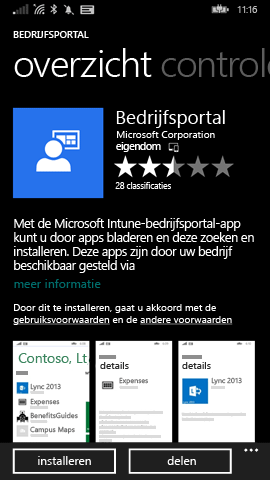
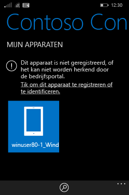
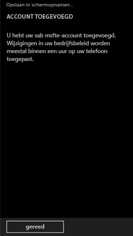

# Uw Windows Phone 8.1-apparaat registreren bij Intune

Als uw bedrijf of school gebruikmaakt van Microsoft Intune, kunt u uw apparaten registreren voor toegang tot zakelijke e-mail, bestanden en andere bronnen. Door uw apparaten te registreren, kan uw organisatie bedrijfsgegevens veilig houden. Zie [Wat gebeurt er als u de bedrijfsportal-app installeert en uw apparaat registreert bij Intune?](what-happens-if-you-install-the-company-portal-app-and-enroll-your-device-in-intune-windows.md) en [Wat de IT-beheerder kan zien op het apparaat](what-can-your-it-administrator-see-when-you-enroll-your-device-in-intune-windows.md) voor meer informatie over registratie.

Volg de instructies die binnen uw bedrijf of school van toepassing zijn voor het registreren van een Windows Phone 8.1-apparaat bij Intune:

-   [Als uw bedrijf toestaat dat u de bedrijfsportal gebruikt vanuit de Windows Store](#if-your-company-lets-you-use-the-company-portal-from-the-windows-store)

-   [Als u vanaf uw Windows Phone geen toegang hebt tot de Windows Store of als u geen Microsoft-account hebt](#if-you-are-not-allowed-to-access-the-windows-store-from-your-windows-phone-or-if-you-do-not-have-a-microsoft-account)

## Als uw bedrijf toestaat dat u de bedrijfsportal gebruikt vanuit de Windows Store
Installeer de bedrijfsportal-app op uw apparaat:

1.  Tik op **Start** &gt; **Store**.

2.  Tik op **Zoeken** en typ **bedrijfsportal**.

3.  Tik in de lijst met resultaten op **Bedrijfsportal**.

    

4.  Tik op **Bedrijfsportal** &gt; **Installeren**.

    

Uw apparaat inschrijven:

1.  Open de app **Microsoft Intune-bedrijfsportal** op het apparaat.

2.  Geef uw referenties op. U wordt mogelijk gevraagd akkoord te gaan met de voorwaarden van uw bedrijf, indien van toepassing.

3.  Veeg naar **Mijn apparaten**.

4.  Tik op **Tik om dit apparaat te registreren of te identificeren**.

    

5.  Tik op **Dit apparaat registreren**.

    

6.  Tik op **Account toevoegen**.

    

7.  Voer de gevraagde aanvullende gegevens in en tik op **Aanmelden** om de registratie te voltooien. Uw werkplekaccount wordt nu weergegeven op de pagina **Instellingen** &gt; **Werkplek**.

    

## Als u vanaf uw Windows Phone geen toegang hebt tot de Windows Store of als u geen Microsoft-account hebt

1.  Tik op **Instellingen** &gt; **Werkplek**.

2.  Tik op **Account toevoegen** en meld u aan met uw werkaccount.

3.  Voer de gevraagde aanvullende gegevens in en tik op **Aanmelden** om de registratie te voltooien.

4.  Als u wordt gevraagd de bedrijfsapp of hub te installeren, zorgt u ervoor dat het relevante selectievakje is ingeschakeld en tikt u op **Gereed**.

Als uw IT-beheerder de bedrijfsportal zo heeft ingesteld dat deze tijdens de inschrijving is geïnstalleerd, wordt de bedrijfsportal weergegeven in de lijst met apps.

Nog hulp nodig? Neem contact op met uw IT-beheerder. Controleer of hun contactgegevens beschikbaar zijn op de [bedrijfsportalwebsite](http://portal.manage.microsoft.com).

<!--HONumber=Nov16_HO1-->

