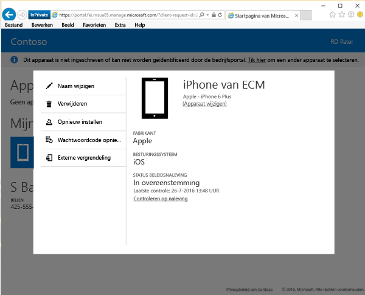

# Uw apparaat opnieuw instellen op de website van de bedrijfsportal

Als u uw apparaat kwijt bent of als het gestolen is, hebt u de mogelijkheid de fabrieksinstellingen ervan terug te zetten om te voorkomen dat onbevoegden toegang tot uw gegevens krijgen. U kunt uw apparaat op afstand opnieuw instellen op de [website van de bedrijfsportal](http://portal.manage.microsoft.com). De bedrijfsportalwebsite is een webpagina waarop u de computers en apparaten beheert die u bij Intune hebt geregistreerd. U kunt deze website gebruiken om de meeste taken uit te voeren die u ook met de bedrijfsportal-app uitvoert.

Als u uw apparaat opnieuw instelt, wordt het apparaat niet meer weergegeven in de bedrijfsportal en worden de fabrieksinstellingen op het apparaat hersteld.

Ga als volgt te werk om uw apparaat opnieuw in te stellen:

1.  Open de [website van de bedrijfsportal](http://portal.manage.microsoft.com) en tik op het apparaat dat u opnieuw wilt instellen.

2.  Tik op **Opnieuw instellen**.

    

3. Lees de waarschuwing waarmee wordt aangegeven dat u op het punt staat uw apparaat in te stellen op de standaardinstellingen en tik op **Instellen** om uw apparaat opnieuw in te stellen.

Uw apparaat is nu opnieuw ingesteld.

Nog hulp nodig? Neem contact op met uw IT-beheerder. Ga naar de [bedrijfsportalwebsite](http://portal.manage.microsoft.com) voor de betreffende contactgegevens.

<!--HONumber=Dec16_HO3-->

