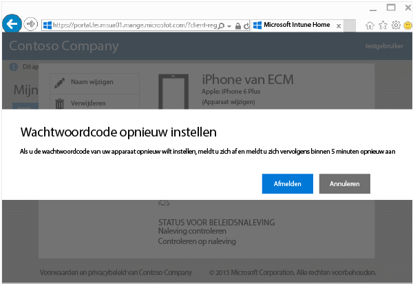
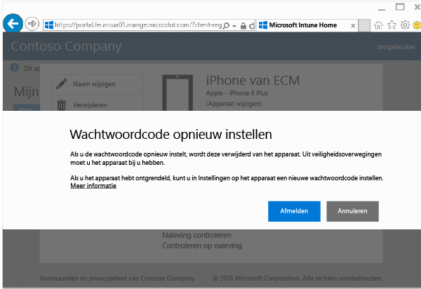

# De wachtwoordcode van uw apparaat opnieuw instellen op de website van de bedrijfsportal

Als u de pincode of het wachtwoord van het apparaat dat u bij Intune hebt geregistreerd, bent vergeten, kunt u de [website van de bedrijfsportal](http://portal.manage.microsoft.com) gebruiken om de pincode of het wachtwoord opnieuw in te stellen. De website van de bedrijfsportal is een webpagina waarop u computers en apparaten kunt beheren die u hebt geregistreerd in Intune en waarop u de meeste taken kunt uitvoeren die u ook met uw bedrijfsportalapp kunt uitvoeren.

> [!NOTE]
> Het is mogelijk de knop Wachtwoordcode opnieuw instellen niet wordt weergegeven. Dit is afhankelijk van hoe uw IT-beheerder Intune heeft geconfigureerd. Het opnieuw instellen van wachtwoordcodes wordt niet ondersteund op Windows 8.1-apparaten.

Ga als volgt te werk om uw wachtwoordcode opnieuw in te stellen:

1.  Open de [website van de bedrijfsportal](http://portal.manage.microsoft.com) en tik op het apparaat waarvan u de wachtwoordcode wilt wijzigen.

2.  Tik op **Wachtwoordcode opnieuw instellen**.

    

3.  Tik op **Afmelden** en meld u vervolgens opnieuw aan met de referenties van uw werk- of schoolaccount. U moet zich binnen vijf minuten opnieuw aanmelden.

    

4.  Tik op **Wachtwoordcode opnieuw instellen**.

    

    Raadpleeg de tabel om te zien hoe het opnieuw instellen van de wachtwoordcode op uw apparaat werkt.

    |Platform|Support|
    |------------|-----------|
    |Android|Hiermee maakt u een nieuwe, tijdelijke, alfanumerieke wachtwoordcode.|
    |iOS|Hiermee verwijdert u de wachtwoordcode van het apparaat en wordt er geen nieuwe, tijdelijke wachtwoordcode gemaakt. Als u Touch ID gebruikt, moet u dit opnieuw instellen op uw apparaat, omdat het wordt verwijderd wanneer u uw wachtwoordcode opnieuw instelt.|
    |Windows 10 (alleen voor mobiele apparaten)|Hiermee maakt u een nieuwe, tijdelijke, alfanumerieke wachtwoordcode. Windows Hello wordt ondersteund.|
    |Windows Phone 8,1|Hiermee maakt u een nieuwe, tijdelijke, numerieke wachtwoordcode.|
    Nadat u uw apparaat hebt ontgrendeld, kunt u een nieuwe wachtwoordcode instellen door op uw apparaat naar **Instellingen** te gaan.

5.  Ontgrendel uw apparaat en stel vervolgens een nieuwe wachtwoordcode in of wijzig de tijdelijke wachtwoordcode door op uw apparaat naar **Instellingen** te gaan.

    Als u een melding wilt zien die bevestigt dat uw wachtwoord opnieuw is ingesteld, klikt u op de meldingsvlag boven aan de website van de bedrijfsportal.

Nog hulp nodig? Neem contact op met uw IT-beheerder. Controleer of hun contactgegevens beschikbaar zijn op de [bedrijfsportalwebsite](http://portal.manage.microsoft.com).

<!--HONumber=Oct16_HO2-->

