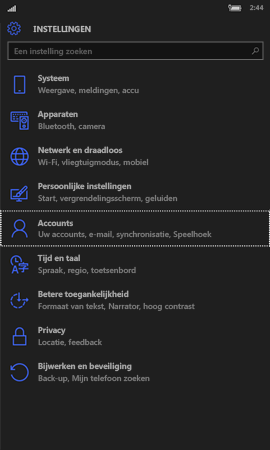
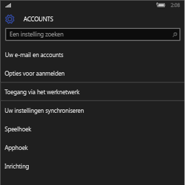
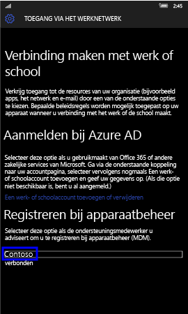
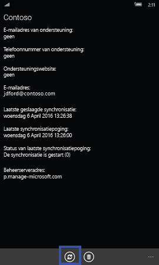
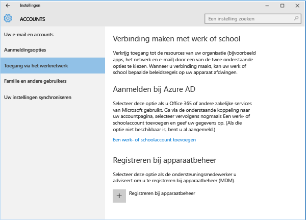
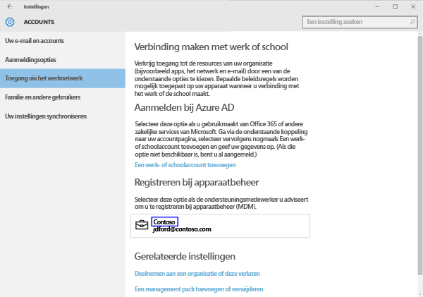
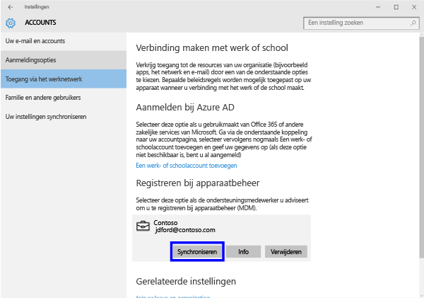
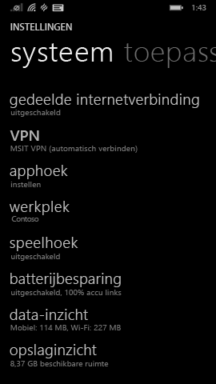
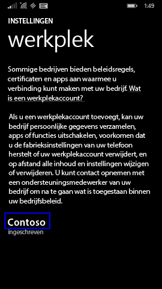
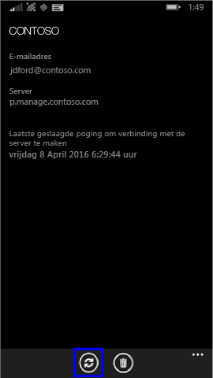

# Uw Windows-apparaat handmatig synchroniseren
Als de installatie van de app te lang duurt, voer dan de volgende instructies uit om uw Windows-apparaat handmatig te synchroniseren. Dit kan helpen om de installatie te versnellen. De enige versies die worden ondersteund, zijn de versies die hier worden vermeld. Gebruik de koppeling, in de bovenstaande sectie In dit artikel, die overeenkomt met het type apparaat dat u gebruikt:

* [Windows 10 Mobile](#windows-10-mobile)
* [Windows 10 Desktop](#windows-10-desktop)
* [Windows Phone 8,1](#windows-phone-8-1)

## Windows 10 Mobile
Ga als volgt te werk als u uw Windows 10 Mobile-apparaat handmatig wilt synchroniseren om een trage installatie van de app te versnellen:

1. Ga naar **Alle apps** > **Instellingen** > **Accounts**.

    
    
2. Tik op **Toegang via het werknetwerk**.

    
    
3. Tik onder **Registreren voor apparaatbeheer** op de naam van uw bedrijf, zoals hieronder wordt weergegeven.

    
    
4. Tik op het pictogram **Synchroniseren**.

    
    
    Boven in het scherm wordt het bericht 'Uw account wordt gesynchroniseerd' weergegeven. De knop Synchroniseren is pas beschikbaar nadat de synchronisatie van het apparaat is voltooid.

## Windows 10-bureaublad
Ga als volgt te werk als u uw Windows 10-desktopapparaat handmatig wilt synchroniseren om een trage installatie van de app te versnellen:

1. Klik op de knop **Start**, zoals hieronder wordt weergegeven, en selecteer vervolgens **Instellingen**.

    
    
2. Selecteer op de pagina **Instellingen** de optie **Accounts**.
 
    
    
3. Selecteer op de pagina **Accounts** de optie **Toegang via het werknetwerk**.
    
    
    
4. Klik in de sectie **Registreren voor apparaatbeheer** op de naam van uw bedrijf, zoals hieronder met blauw is gemarkeerd.
    
    
   
5. Klik op de knop **Synchroniseren**.
    
    
   
   De knop wordt uitgeschakeld totdat de synchronisatie is voltooid.

## Windows Phone 8,1
Ga als volgt te werk als u uw Windows Phone 8.1-apparaat handmatig wilt synchroniseren om een trage installatie van de app te versnellen:

1. Ga naar **Alle apps** > **Instellingen** > **Werkplek**.

    
    
2. Tik op de naam van uw bedrijf, zoals hieronder met blauw is gemarkeerd.

    
   
3. Tik op het pictogram **Synchroniseren**.

    
    
   Boven in het scherm wordt het bericht 'Uw account wordt gesynchroniseerd' weergegeven tot het apparaat is gesynchroniseerd.

Nog hulp nodig? Neem contact op met uw IT-beheerder. Ga naar de [bedrijfsportalwebsite](http://portal.manage.microsoft.com) voor de betreffende contactgegevens.

### Zie tevens
[Uw Windows-apparaat gebruiken met Intune](using-your-windows-device-with-intune.md)

<!--HONumber=Jul16_HO3-->

