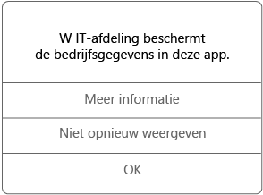

---
# required metadata

title: Beheerde apps op uw apparaat gebruiken | Microsoft Intune
description:
keywords:
author: Staciebarker
manager: jeffgilb
ms.date: 04/28/2016
ms.topic: article
ms.prod:
ms.service: microsoft-intune
ms.technology:
ms.assetid: 3232c5c1-cb9f-45ca-806f-7e74eeb3533e

# optional metadata

ROBOTS: noindex
#audience:
#ms.devlang:
ms.reviewer: jeffgilb
ms.suite: ems
#ms.tgt_pltfrm:
#ms.custom:

---

# Beheerde apps op uw apparaat gebruiken

Beheerde apps zijn apps die door de IT-beheerder kunnen worden geconfigureerd zodat de bedrijfsgegevens die toegankelijk zijn in die app, kunnen worden beveiligd. Wanneer u met bedrijfsgegevens in een beheerde app op uw iOS-apparaat werkt, merkt u wellicht dat de app iets anders werkt dan u verwacht. Zo kunt u beveiligde bedrijfsgegevens mogelijk niet kopiëren en plakken of op bepaalde locaties opslaan.

Verschillende beheerde apps kunnen ook samenwerken op uw apparaat zodat u uw dagelijkse taken kunt uitvoeren, terwijl de bedrijfsgegevens beveiligd blijven. Als u bijvoorbeeld een bedrijfsbestand in een beheerde app opent en een andere beheerde app nodig is om dat bestand weer te geven, wordt de beheerde app waarmee u het bestand kunt weergeven, automatisch geopend. Als een vereiste app niet beschikbaar is, zijn bepaalde acties mogelijk niet beschikbaar, zoals het openen van een document of het gebruiken van een webkoppeling in een beheerd document.

Wanneer u toegang krijgt tot bedrijfsgegevens in een beheerde app, wordt een bericht weergeven zoals hieronder, waarin wordt vermeld dat de app die u wilt openen, wordt beheerd.

### Hoe kom ik in het bezit van beheerde apps?
Beheerde apps zijn op verschillende manieren beschikbaar:

-   Wanneer het apparaat is geregistreerd bij Microsoft Intune, installeert u de app via de bedrijfsportal-app of de bedrijfsportalwebsite. Het is ook mogelijk dat de app door de IT-beheerder op het apparaat wordt geïnstalleerd. Zie [Uw iOS-apparaat inschrijven bij Intune](enroll-your-device-in-intune-ios.md) of [Uw Mac OS X-apparaat inschrijven bij Intune](enroll-your-device-in-intune-mac-os-x.md) voor meer informatie over inschrijving..

-   U installeert een app uit de App Store en vervolgens meldt u zich aan met uw zakelijke gebruikersaccount dat wordt beheerd met Intune.

### Wat kan de IT-beheerder beheren in een app?
Hier volgen enkele voorbeelden van opties die de IT-beheerder in een app kan beheren en die van invloed kunnen zijn op het gebruik van bedrijfsgegevens op uw apparaat:

-   Toegang tot bepaalde websites

-   Overdracht van gegevens tussen apps

-   Opslaan van bestanden

-   Kopiëren en plakken

-   Vereisten voor toegang via een pincode

-   Uw aanmelding, met bedrijfsreferenties

-   De mogelijkheid om een back-up te maken in de cloud

-   De mogelijkheid om schermafbeeldingen te maken

-   Vereisten voor de versleuteling van gegevens

Een aantal veelgebruikte apps die mogelijk door uw IT-afdeling worden beheerd:

-   Managed Browser

-   Beheerde afbeeldingsviewer

-   Beheerde PDF-viewer

-   Beheerde AV-speler

-   Microsoft Word, Excel, PowerPoint

Neem contact op met de IT-beheerder voor meer informatie over de beheerde apps op uw apparaat.

### Zie tevens
[Using your iOS or Mac OS X device with Intune](using-your-ios-or-mac-os-x-device-with-intune.md)

<!--HONumber=May16_HO1-->

