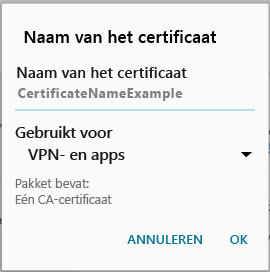

# Er ontbreekt een vereist certificaat voor uw apparaat

## Er ontbreekt een certificaat voor uw apparaat dat normaal gesproken op uw telefoon is geïnstalleerd
Als uw Android-apparaat niet bij Intune is geregistreerd en er ontbreekt een certificaat dat normaal gesproken op uw telefoon is geïnstalleerd, kunt u zich niet bij de bedrijfsportal-app voor Android aanmelden. Wanneer u zich probeert aan te melden, wordt het volgende bericht weergegeven:

U kunt dit probleem als volgt oplossen en het vereiste certificaat ophalen:

1.  Navigeer in een browser naar deze [pagina voor Digicert-certificaten](https://www.digicert.com/digicert-root-certificates.htm).

2.  Zoek en download het Baltimore CyberTrust-basiscertificaat (https://www.digicert.com/CACerts/BaltimoreCyberTrustRoot.crt).

3.  Veeg vanaf de bovenkant van het scherm naar beneden om uw meldingenlijst te openen en tik in die lijst op **BaltimoreCyberTrustRoot.crt**.

4.  Accepteer in het scherm **Benoem het certificaat** de standaardcertificaatnaam.

5. Zorg ervoor dat **Gebruik van referenties** is ingesteld op **Worden gebruikt voor VPN en apps** en tik op **OK**.

    

6. Sluit de webbrowser en de bedrijfsportal-app.

7. Open de bedrijfsportal-app opnieuw. Nu moet u zich bij de bedrijfsportal-app kunnen aanmelden. Neem contact op met de IT-beheerder als u hulp nodig hebt.

## Er ontbreekt een certificaat voor uw apparaat dat is vereist door uw IT-beheerder
Als uw Android-apparaat niet bij Intune is ingeschreven en er ontbreekt een bepaald certificaat dat is vereist door uw IT-beheerder, dan kunt u zich niet bij de bedrijfsportal-app voor Android aanmelden. Wanneer u zich probeert aan te melden, wordt het volgende bericht weergegeven:

>[!NOTE]
> Als er al een keer een melding omtrent een 'ontbrekend certificaat' is weergegeven, en u de stappen hebt gevolgd in [Er ontbreekt een certificaat voor uw apparaat dat normaal gesproken op uw telefoon is geïnstalleerd](#your-device-is-missing-a-certificate-that-usually-comes-installed-on-your-phone), dan is dit in orde. Dit betreft een ander bericht en certificaat. U kunt de stappen in dit gedeelte dus volgen om het ontbrekende certificaat op te halen.

Om dit probleem op te lossen en het vereiste certificaat op te halen, moeten er twee belangrijke stappen worden uitgevoerd:

- Het ontbrekende certificaat identificeren door te kijken op een bedrijfs- of school-pc.
- Het ontbrekende certificaat downloaden van internet met behulp van uw apparaat.

### Het ontbrekende certificaat identificeren door te kijken op een bedrijfs- of school-pc

1. Open Internet Explorer op een pc. Als u voor dit doel niet over een pc beschikt, neemt u contact op met uw IT-beheerder. Ga naar de [bedrijfsportalwebsite](http://portal.manage.microsoft.com) voor de contactgegevens van de IT-beheerder.

2. Ga naar de [bedrijfsportalwebsite](http://portal.manage.microsoft.com) en meld u aan met de referenties van uw werk- of schoolaccount.

3. Aan de rechterkant van de adresbalk van de browser klikt u op het symbool dat lijkt op een hangslot, zoals hieronder is weergegeven. Als u het hangslot niet ziet, stop dan en neem contact op met de IT-beheerder. Het hangslot betekent dat u veilig bent aangemeld. Ga dus alleen verder als u dit symbool ziet.

    

4. Klik op **Certificaten weergeven**.

    

5. Klik in het dialoogvenster **Certificaat** op het tabblad **Certificaatpad**, en identificeer vervolgens het certificaat dat u nodig hebt van het internet. De naam van het certificaat dat u nodig hebt, bevindt zich op dezelfde positie als het gemarkeerde certificaat in het bovenstaande voorbeeld.

### Het ontbrekende certificaat op uw mobiele Android-apparaat downloaden en installeren

1. Gebruik een zoekmachine zoals Bing of Google, en zoek op de naam van het ontbrekende certificaat dat u in het vorige gedeelte hebt geïdentificeerd. Het certificaat kan verschillende extensies hebben, zoals '.crt' of '.pem', enzovoort.

2. Download het basiscertificaat van de website.

3. Nadat het certificaat is gedownload, sleept u omlaag vanaf de bovenkant van uw apparaat om de meldingen te openen en vervolgens tikt u op de naam van het certificaat in de lijst met meldingen.

4. In het dialoogvenster **Benoem het certificaat** dat hieronder is weergegeven, accepteert u de standaardcertificaatnaam.

5. Zorg ervoor dat **Gebruik van referenties** is ingesteld op **Worden gebruikt voor VPN en apps** en tik op **OK**.

    

6. Sluit de bedrijfsportal-app.

7. Open de bedrijfsportal-app opnieuw. Nu moet u zich bij de bedrijfsportal-app kunnen aanmelden. Neem contact op met de IT-beheerder als u hulp nodig hebt.

Als u dezelfde melding omtrent een 'ontbrekend certificaat' ziet als de melding hierboven, en u de bovenstaande stappen reeds hebt uitgevoerd, dan is er waarschijnlijk nog een ander certificaat dat met behulp van de IT-beheerder moet worden geïnstalleerd. Neem contact op met de IT-beheerder en geef deze [koppeling](/intune/troubleshoot/troubleshoot-device-enrollment-in-intune#android-certificate-issues) door, die de stappen bevat voor het oplossen van het probleem.

<!--HONumber=Aug16_HO5-->

