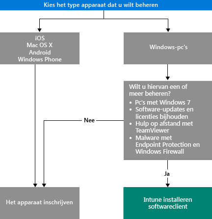

# Kiezen hoe u apparaten beheert

Als u gebruik wil maken van de vele functies van Intune, zoals implementatie van apps en beheer van apparaatinstellingen, moeten uw apparaten worden *beheerd*. Hoe u apparaten beheert, is afhankelijk van de Intune-mogelijkheden die u wilt gebruiken.
Dit onderwerp helpt u bij het kiezen van een methode dia aan uw behoeften voldoet.

Als u iOS-, Mac OS X-, Android- of Windows Phone-apparaten wilt beheren, moet u ze *registreren*.

Als u Windows-pc's wilt beheren, hebt u twee opties:

1. Registreer het apparaat **of**
2. Installeer de *Intune-softwareclient*.

## Bepalen welke methode u wilt gebruiken
Gebruik dit stroomschema om te bepalen hoe uw apparaten worden beheerd.

Registreer Windows-pc's voor de meeste functionaliteit. De Intune-softwareclient past misschien beter bij uw behoeften wanneer:

- Windows 7 wordt uitgevoerd op de pc
- U software-updates voor Windows en het gebruik van licenties wilt beheren
- U malware wilt beheren met Endpoint Protection en Windows Firewall
- U met behulp van de software TeamViewer hulp op afstand wilt bieden aan gebruikers

Zie [Mogelijkheden voor Mobile Device Management](mobile-device-management-capabilities-in-microsoft-intune.md) en [Mogelijkheden voor de Intune-pc-softwareclient](windows-pc-management-capabilities-in-microsoft-intune.md) voor een gedetailleerd overzicht van de beheermogelijkheden van beide methoden.
Zie [Ondersteunde mobiele apparaten en computers](/intune/get-started/supported-mobile-devices-and-computers) voor meer informatie over de apparaten en pc's die ondersteuning bieden voor Intune.

## Exchange ActiveSync-beheer
Naast het registreren van een apparaat of het installeren van de Intune-softwareclient, kunt u ook apparaten ook beheren [met behulp van Exchange ActiveSync](/intune/deploy-use/mobile-device-management-with-exchange-activesync-and-microsoft-intune). Bij deze methode moet u de lokale connector installeren of de ingebouwde Service-to-Service-connector gebruiken om verbinding te maken met uw Exchange-server.
Hoewel dit een derde optie is voor beheer van apparaten, zijn de beheermogelijkheden beperkt in vergelijking met de andere methoden.

## Volgende stappen

- [Kiezen hoe u mobiele apparaten registreert](/intune/get-started/choose-how-to-enroll-devices1)
- [Windows-pc's beheren met de Intune-pc-clientsoftware](/intune/deploy-use/manage-windows-pcs-with-microsoft-intune)

- [Mobiele apparaten met Exchange ActiveSync beheren met Microsoft Intune](/intune/deploy-use/mobile-device-management-with-exchange-activesync-and-microsoft-intune).

<!--HONumber=Nov16_HO1-->

