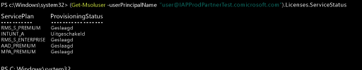

# Intune-licenties beheren
Voordat gebruikers zich kunnen aanmelden bij de Intune-service of hun apparaten kunnen registreren bij het beheer, moet u eerst aan elke gebruiker een licentie toewijzen voor uw Intune-abonnement via de [Office 365-portal](http://go.microsoft.com/fwlink/p/?LinkId=698854).

In organisaties die gebruikmaken van Enterprise Mobility + Security (EMS) van Microsoft, werken mogelijk gebruikers die alleen Azure Active Directory Premium of Intune-services in het EMS-pakket nodig hebben. Met [Azure Active Directory PowerShell-cmdlets](https://msdn.microsoft.com/library/jj151815.aspx) kunt u één service of een subset van services toewijzen. Zie [Intune-licenties beheren met PowerShell](start-with-a-paid-subscription-to-microsoft-intune-step-4-posh.md) voor meer informatie.

## De toewijzing van Intune-licenties
Als gebruikersaccounts worden gesynchroniseerd vanuit uw on-premises Active Directory of handmatig via het [Office 365-portal](http://go.microsoft.com/fwlink/p/?LinkId=698854) worden toegevoegd aan uw abonnement op cloudservices, krijgen ze niet automatisch een Intune-licentie toegewezen. Een Intune-tenantbeheerder moet echter op een later tijdstip het gebruikersaccount bewerken om in de Office 365-portal een licentie aan de gebruiker toe te wijzen.

Als uw abonnement Azure AD deelt met andere cloudservices die aan uw abonnement zijn gekoppeld, hebt u ook toegang tot gebruikers die aan deze services zijn toegevoegd. Deze gebruikers hebben geen licentie voor [!INCLUDE[wit_nextref](../includes/wit_nextref_md.md)] totdat u een licentie aan elk van deze gebruikers toewijst.

> [!TIP]
> Als de optie voor het toewijzen of intrekken van een licentie voor [!INCLUDE[wit_nextref](../includes/wit_nextref_md.md)] is uitgeschakeld, bevat uw abonnement mogelijk geen volumelicentie-opties, zoals de opties die beschikbaar zijn wanneer u de [Enterprise Mobility Suite + Security](https://www.microsoft.com/en-us/server-cloud/enterprise-mobility/overview.aspx) gebruikt. Zie de documentatie voor uw licentie-opties voor informatie over het toewijzen of intrekken van licenties.

## Een Intune-gebruikerslicentie toewijzen

U gebruikt de [Office 365-portal](http://go.microsoft.com/fwlink/p/?LinkId=698854) om handmatig cloudgebruikers toe te voegen en licenties toe te wijzen aan zowel cloudgebruikersaccounts als accounts die vanuit uw on-premises Active Directory zijn gesynchroniseerd met Azure AD.

1.  Meld u bij de [Office 365-portal](http://go.microsoft.com/fwlink/p/?LinkId=698854) aan met uw tenantbeheerdersreferenties en selecteer vervolgens **Personen** > **Alle gebruikers**.

2.  Selecteer het gebruikersaccount waaraan u een Intune-gebruikerslicentie wilt toewijzen en selecteer **Microsoft Intune** (zelfstandig) of **Enterprise Mobility Suite**.

3.  Het gebruikersaccount beschikt nu over de benodigde machtigingen om de service te gebruiken en apparaten in te schrijven bij het beheer.

> [!NOTE] Zodra een apparaat is geregistreerd, wordt de gebruiker weergegeven in de console. 

### PowerShell gebruiken om EMS-gebruikerslicenties selectief te beheren
In organisaties die gebruikmaken van Enterprise Mobility + Security (voorheen Enterprise Mobility Suite) van Microsoft, werken mogelijk gebruikers die alleen Azure Active Directory Premium of Intune-services in het EMS-pakket nodig hebben. Met [Azure Active Directory PowerShell-cmdlets](https://msdn.microsoft.com/library/jj151815.aspx) kunt u één service of een subset van services toewijzen.

Als u selectief gebruikerslicenties voor EMS-services wilt toewijzen, opent u PowerShell als beheerder op een computer waarop de [Azure Active Directory-module voor Windows PowerShell](https://msdn.microsoft.com/library/jj151815.aspx#bkmk_installmodule) is geïnstalleerd. U kunt PowerShell installeren op een lokale computer of op de ADFS-server.

U moet een nieuwe licentie-SKU-definitie maken die alleen van toepassing is op de gewenste serviceplannen. Daarvoor schakelt u de plannen uit die u niet wilt toepassen. U kunt bijvoorbeeld een licentie-SKU-definitie maken waarmee geen licentie voor Intune wordt toegewezen. Typ het volgende om een lijst met beschikbare services weer te geven:

    (Get-MsolAccountSku | Where {$_.SkuPartNumber -eq "EMS"}).ServiceStatus

U kunt de volgende opdracht uitvoeren om het Intune-serviceplan uit te sluiten. Met dezelfde methode kunt u een complete beveiligingsgroep uitbreiden. U kunt echter ook gedetailleerdere filters gebruiken.

**Voorbeeld 1** Een nieuwe gebruiker maken via de opdrachtregel en een Enterprise Mobility Suite-licentie toewijzen zonder het Intune-gedeelte van de licentie in te schakelen:

    Connect-MsolService

    New-MsolUser -DisplayName “Test User” -FirstName FName -LastName LName -UserPrincipalName user@<TenantName>.onmicrosoft.com –Department DName -UsageLocation US

    $CustomEMS = New-MsolLicenseOptions -AccountSkuId "<TenantName>:EMS" -DisabledPlans INTUNE_A
    Set-MsolUserLicense -UserPrincipalName user@<TenantName>.onmicrosoft.com -AddLicenses <TenantName>:EMS -LicenseOptions $CustomEMS

Controleer met:

    (Get-MsolUser -UserPrincipalName "user@<TenantName>.onmicrosoft.com").Licenses.ServiceStatus

**Voorbeeld 2** Het Intune-gedeelte van de Enterprise Mobility Suite-licentie uitschakelen voor een gebruiker aan wie al een licentie is toegewezen:

    Connect-MsolService

    Set-MsolUserLicense -UserPrincipalName user@<TenantName>.onmicrosoft.com -RemoveLicenses IAPProdPartnerTest:EMS

    $CustomEMS = New-MsolLicenseOptions -AccountSkuId "<TenantName>:EMS" -DisabledPlans INTUNE_A
    Set-MsolUserLicense -UserPrincipalName user@<TenantName>.onmicrosoft.com -AddLicenses <TenantName>:EMS -LicenseOptions $CustomEMS

Controleer met:

    (Get-MsolUser -UserPrincipalName "user@<TenantName>.onmicrosoft.com" .Licenses.ServiceStatus

### Volgende stappen
Gefeliciteerd. U hebt zojuist stap 4 van de *Snelstartgids voor Intune* voltooid.
>[!div class="step-by-step"]

>[&larr; **Gebruikers synchroniseren met Intune**](.\start-with-a-paid-subscription-to-microsoft-intune-step-2.md)     [**Gebruikers en apparaten organiseren** &rarr;](.\start-with-a-paid-subscription-to-microsoft-intune-step-5.md)  

<!--HONumber=Sep16_HO3-->

