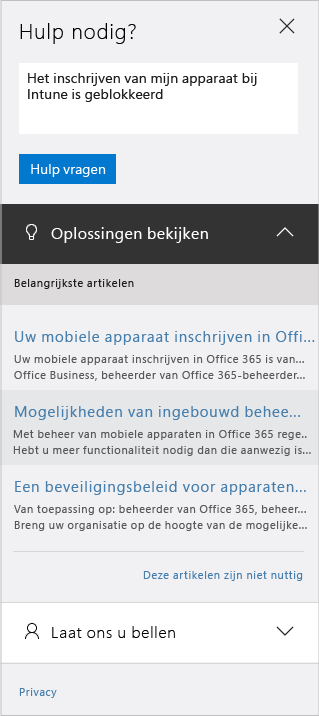

# Ondersteuning voor Microsoft Intune krijgen

[!INCLUDE[classic-portal](../includes/classic-portal.md)]

Microsoft biedt wereldwijde technische, voorverkoop-, facturerings- en abonnementsondersteuning voor Microsoft Intune. Ondersteuning is online en telefonisch beschikbaar voor betaalde abonnementen en proefabonnementen. Online technische ondersteuning is beschikbaar in het Engels en Japans. Telefonische ondersteuning en online-ondersteuning bij factureren zijn in meer talen beschikbaar.

Ondersteuning voor Intune en voor Intune in combinatie met Configuration Manager is gratis. Premier Support-klanten worden kosten in rekening gebracht voor vragen over procedures (bijvoorbeeld hoe het configureren van een functie van Intune in zijn werk gaat).

>[!IMPORTANT]
> Neem voor technische ondersteuning bij producten die met Intune werken en niet door Microsoft zijn gemaakt, bijvoorbeeld SaaSwedo, Cisco of Lookout, contact op met de leverancier van dat product om te controleren of u het product correct hebt geconfigureerd, voordat u een aanvraag opent bij Intune-ondersteuning.

## Hulp krijgen zonder een ondersteuningsticket te openen

Bekijk de volgende bronnen voor antwoorden en informatie voordat u een ondersteuningsticket maakt. U kunt ook [algemene tips voor probleemoplossing voor Microsoft Intune](https://docs.microsoft.com/intune/troubleshoot/general-troubleshooting-tips-for-microsoft-intune) doorlezen.

### Microsoft Intune TechNet-forums

Stel een vraag of start een discussie met technische experts van Microsoft. Wij geven antwoorden en inzichten op het doorzoekbare [Microsoft Intune TechNet-forum](https://social.technet.microsoft.com/Forums/home).

### Aan de slag met het forum

1. Voer in het vak Forums op de pagina voor forums Microsoft Intune in en selecteer het item vervolgens in de lijst. 

2. U ziet nu Microsoft Intune in uw lijst met geselecteerde forums. 

### Microsoft Intune UserVoice-productfeedbacksite

Hebt u feedback over hoe Microsoft Intune nog beter kan maken? Laat het ons weten door uw ideeën toe te voegen op de Microsoft Intune [UserVoice](https://microsoftintune.uservoice.com/forums/291681-ideas)-feedbacksite. U kunt ook stemmen op ideeën die anderen hebben toegevoegd aan UserVoice.

## Een ondersteuningsticket maken

Als u geen antwoorden kunt vinden met de bronnen voor zelfhulp, kunt u een onlineondersteuningsticket maken. **Meld niet meer dan één probleem per ondersteuningsticket** zodat we u beter van dienst kunnen zijn. Waarom is:

- Ondersteuningsmedewerkers die u helpen zijn waarschijnlijk in specifieke gebieden gespecialiseerd. Op deze manier maakt u het eenvoudiger om de juiste specialisten te vinden om u met het probleem te helpen.
- Engineeringteams kunnen prioriteiten in hun werk aanbrengen in de productgebieden waar de meeste incidenten worden gegenereerd.
- Het is gemakkelijker om extra lastige problemen naar de juiste medewerker te escaleren.

Lees de [definitie van een ondersteuningsincident](#definition-of-a-support-incident) voordat u een ondersteuningsticket maakt.

### Stappen om een onlineondersteuningsticket te maken

1.  Meld u aan bij het [Office 365-beheercentrum](https://portal.office.com) met de referenties van uw Intune.

    Als u een Premier Support-klanten bent, moet u in plaats daarvan een Intune-ondersteuningsticket openen op de [Premier Support-pagina](https://support.microsoft.com/en-us/premier/contacts).

    >[!NOTE]
    >
    >Premier Support-klanten moeten een Intune-ondersteuningsticket openen op de [Premier Support-pagina](https://support.microsoft.com/en-us/premier/contacts).

2.  Kies de tegel **Beheer**.
3.  Kies aan de linkerkant onder **Ondersteuning** de optie **Ondersteuning** om een ticket te openen.

    

    >[!NOTE]
    >  Klanten die een O365-account met maximaal 100 licenties hebben of hebben gehad, krijgen dit bericht te zien. Als dit bericht wordt weergegeven, raadpleegt u [Een ondersteuningsticket maken via alternatieve methoden](#create-a-support-ticket-with-alternate-methods).

    > 

    -   Selecteer voor facturerings-, licentie- en accountproblemen **Facturerings- en productinformatie**.

    -   Voor alle andere problemen met Intune selecteert u de optie **Mobile Device Management**.

    > [!NOTE]
    > Mogelijk moet u onder aan de lijst **meer** selecteren om alle categorieën weer te geven.

3.  Volg de instructies voor het openen van uw aanvraag.

### Stappen om een ondersteuningsticket te maken via alternatieve methoden

Volg deze procedure als uw ondersteuningspagina in het Office 365-beheercentrum er als volgt uitziet:

1. Kies **Hulp nodig**.
2. Typ een beschrijving van uw probleem in het tekstvak en kies vervolgens **Hulp vragen**.

    

3. Bekijk de voorgestelde onlineresources of kies **Laat ons u bellen** waarna u wordt gebeld door Microsoft Ondersteuning.

## Telefonische ondersteuning krijgen
Zie [Contact opnemen met telefonische ondersteuning voor Microsoft Intune](contact-assisted-phone-support-for-microsoft-intune.md) voor een lijst met telefoonnummers voor ondersteuning per land en regio, ondersteuningsuren en ondersteunde talen voor elke regio.

## Uw ondersteuningsaanvragen bijhouden
1.  Meld u aan bij het [Office 365-beheercentrum](https://portal.office.com) met de referenties van de Intune-beheerder.
2.  Kies de tegel **Beheer**.
3.  Kies aan de linkerkant bij **Ondersteuning** de optie **Serviceaanvragen**. Vervolgens kunt u de aanvragen bekijken.

Hoe lang het duurt voordat we reageren op ondersteuningsaanvragen, hangt af van de ernst van het probleem. Voor onze Professional-klanten geldt dat ze bij zeer ernstige problemen binnen twee uur een eerste reactie kunnen verwachten. Voor Premier Support-klanten geldt dat de reactie afhankelijk is van de ondersteuningsovereenkomst. Een case is **zeer ernstig** wanneer:

- Een of meer services niet toegankelijk zijn of onbruikbaar zijn.
- Productie, bedrijfsactiviteiten of implementatiedeadlines aanzienlijke hinder ondervinden of er ernstige gevolgen voor de productie of winstgevendheid zijn.
- Meerdere gebruikers of services worden beïnvloed.

Voor onze Professional-klanten geldt dat ze bij minder ernstige problemen binnen vier uur een eerste reactie kunnen verwachten. Voor Premier Support-klanten geldt dat de reactie afhankelijk is van de ondersteuningsovereenkomst. Een case is **matig ernstig** wanneer:

- De service is bruikbaar maar functioneert niet zo goed als gebruikelijk.
- De situatie matige impact op de bedrijfsactiviteiten heeft en tijdens de kantooruren kan worden afgehandeld.
- Eén gebruiker, klant of service gedeeltelijk wordt beïnvloed.

Voor onze Professional-klanten geldt dat ze voor andere problemen binnen acht uur een eerste reactie kunnen verwachten. Voor Premier Support-klanten geldt dat de reactie afhankelijk is van de ondersteuningsovereenkomst. Een case is niet ernstig wanneer:

- De situatie minimale gevolgen heeft voor de bedrijfsactiviteiten.
- Het probleem belangrijk is, maar heeft niet onmiddellijk aanzienlijke gevolgen voor de huidige service of productiviteit van de klant.
- Eén gebruiker gedeeltelijke onderbrekingen ondervindt, maar er een acceptabele tijdelijke oplossing voorhanden is.

> [!NOTE]
> **Als u gebruikmaakt van Microsoft System Center Configuration Manager** of **Microsoft System Center Endpoint Protection:** voor technische ondersteuning bij Configuration Manager of Endpoint Protection neemt u contact op met uw partner of gaat u naar de [Microsoft System Center Configuration](https://docs.microsoft.com/sccm/)- en [Endpoint Protection](https://technet.microsoft.com/en-us/library/hh508836.aspx)-documentatie voor uitgebreide zelfhulpinformatie. Daarnaast kunt online of telefonisch een ondersteuningsaanvraag openen.
>
> Technische ondersteuning voor System Center Configuration Manager of System Center Endpoint Protection moet worden betaald of wordt bijgeschreven op uw bestaande licentie- of Premier Support-overeenkomsten.

## Ondersteuning voor een volumelicentie
Als u al licenties van Microsoft hebt aangeschaft onder een volumelicentieprogramma, gebruikt u de volgende resources voor ondersteuning:

-   Zie het [servicecentrum voor volumelicenties](http://go.microsoft.com/fwlink/p/?LinkID=282016) voor ondersteuning gerelateerd aan licenties en het vinden van codes.

-   Zie [Ondersteuning voor facturerings- en abonnementsbeheer](http://support.microsoft.com/oas/default.aspx?prid=15371)voor vragen over facturering.

-   Zie [Volumelicenties](http://go.microsoft.com/fwlink/p/?LinkID=282015) voor algemene informatie over volumelicenties.

## Definitie van een ondersteuningsincident

Een ondersteuningsincident is gedefinieerd als één ondersteuningsprobleem en het werk dat nodig is om het op te lossen. Een enkel ondersteuningsprobleem kan niet worden opgesplitst in onderliggende problemen. Als u onderliggende problemen kunt identificeren, wordt elk onderliggend probleem beschouwd als een afzonderlijk incident. Mogelijk zijn er meerdere contactmomenten en offlineonderzoek nodig om een bepaald probleem te verhelpen. De tijd besteed aan het leveren van deze oplossingen is onafhankelijk van wat in rekening wordt gebracht.

In abonnementen op Microsoft Intune en Mobile Device Management voor Office 365 is ondersteuning van het type 'schadevergoeding' opgenomen. Dit betekent dat u niet tegen extra kosten oploopt als u nog een ondersteuningsincident opent.

Als een ondersteuningsmedewerker u verzoekt een extra ondersteuningsincident te openen voor aanvullende problemen, dient u te begrijpen dat dit in het belang van iedereen is. Bedankt voor uw begrip. In samenwerking met u kunnen we ondersteuning van wereldklasse bieden!

Zie [Professional Support Options](https://support.microsoft.com/gp/offerprophone) (Professionele ondersteuningsopties) voor de prijzen per incident en de ernstniveaus.

