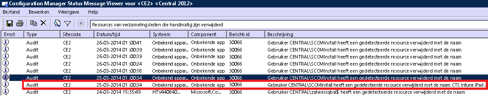

---
# required metadata

title: Problemen bij de apparaatregistratie oplossen | Microsoft Intune
description:
keywords:
author: Nbigman
manager: jeffgilb
ms.date: 05/26/2016
ms.topic: article
ms.prod:
ms.service: microsoft-intune
ms.technology:
ms.assetid: 6982ba0e-90ff-4fc4-9594-55797e504b62

# optional metadata

#ROBOTS:
#audience:
#ms.devlang:
ms.reviewer: jeffgilb
ms.suite: ems
#ms.tgt_pltfrm:
#ms.custom:

---

# Problemen bij de apparaatinschrijving oplossen

Hier vindt u enkele problemen die zich kunnen voordoen bij de registratie van apparaten en wordt beschreven hoe u deze kunt oplossen.

> [!NOTE]
> Gebruikers van beheerde apparaten kunnen registratie- en diagnostische gegevens laten vastleggen in logboeken, zodat u deze kunt bekijken. Gebruikersinstructies voor het vastleggen van gegevens in logboeken vindt u in:
>- [Logboeken met diagnostische gegevens over Android naar de IT-beheerder verzenden via een USB-kabel](/intune/enduser/send-diagnostic-data-logs-to-your-it-administrator-using-a-usb-cable-android)
>- [Logboeken met diagnostische gegevens over Android naar de IT-beheerder verzenden via e-mail](/intune/enduser/send-diagnostic-data-logs-to-your-it-administrator-using-email-android)
>- [Android-registratiefouten verzenden naar de IT-beheerder](/intune/enduser/send-enrollment-errors-to-your-it-administrator-android)
>- [iOS-registratiefouten verzenden naar de IT-beheerder](/intune/enduser/send-errors-to-your-it-admin-ios)

Zie [Ondersteuning voor Microsoft Intune krijgen](how-to-get-support-for-microsoft-intune.md) voor meer manieren om hulp te krijgen als u het probleem niet kunt oplossen met deze informatie.

## Apparaatlimiet bereikt
**Probleem:** een gebruiker ontvangt tijdens de registratie een foutbericht op het apparaat, zoals het foutbericht **De bedrijfsportal is tijdelijk niet beschikbaar** op een iOS-apparaat, en DMPdownloader.log in Configuration Manager bevat de fout **DeviceCapReached**.

**Oplossing:** gebruikers kunnen standaard niet meer dan vijf apparaten inschrijven.

### Controleer het aantal apparaten dat is ingeschreven en dat wordt toegestaan

1.  Controleer in de Intune-beheerportal of er niet meer dan 5 apparaten aan de gebruiker zijn toegewezen

2.  Controleer in het Intune-beheerportal onder Admin\Mobile Device Management\Enrollment Rules of de limiet voor de apparaatinschrijving is ingesteld op 5

Gebruikers van mobiele apparaten kunnen apparaten verwijderen via de volgende URL: [https://byodtestservice.azurewebsites.net/](https://byodtestservice.azurewebsites.net/).

Beheerders kunnen apparaten verwijderen in de Azure Active Directory-portal:

### U kunt als volgt apparaten verwijderen in de Azure Active Directory-portal:

1.  Blader naar [http://aka.ms/accessaad](http://aka.ms/accessaad) of kies **Beheer** &gt; **Azure AD** op [https://portal.office.com](https://portal.office.com).

2.  Meld u aan met uw organisatie-id via de koppeling aan de linkerkant van de pagina.

3.  Een Azure-abonnement maken als u er nog geen hebt. U kunt dit zonder creditcard of betaling doen als u beschikt over een betaald account (kies de abonnementskoppeling **Uw gratis Azure Active Directory registreren**).

4.  Selecteer **Active Directory** en vervolgens uw organisatie.

5.  Selecteer het tabblad **Gebruikers** .

6.  Selecteer de gebruiker waarvoor u de apparaten wilt verwijderen.

7.  Kies **Apparaten**.

8.  Verwijder waar nodig apparaten, zoals apparaten die niet langer in gebruik zijn of die onjuist zijn gedefinieerd.

> [!NOTE]

> U kunt de limiet voor apparaatregistraties vermijden met behulp van apparaatregistratiebeheerfuncties, zoals wordt beschreven in [Apparaten in bedrijfseigendom registreren met de apparaatregistratiebeheerfunctie in Microsoft Intune](/intune/deploy-use/enroll-corporate-owned-devices-with-the-device-enrollment-manager-in-microsoft-intune).
>
> Met een gebruikersaccount dat is toegevoegd aan de groep Apparaatinschrijvingsmanagers kunnen geen apparaten worden ingeschreven wanneer een voorwaardelijk toegangsbeleid van kracht is voor die specifieke gebruikersaanmelding.

## De profielinstallatie is mislukt
**Probleem:** een gebruiker ontvangt op een iOS- of Android-apparaat de fout **Profiel is niet geïnstalleerd**.

### Stappen voor de probleemoplossing bij een mislukte profielinstallatie

1.  Controleer of er een juiste licentie aan de gebruiker is toegewezen voor de versie van de Intune-service die u gebruikt.

2.  Controleer of het apparaat niet al is ingeschreven met een andere MDM-provider of dat er voor het apparaat niet al een beheerprofiel is geïnstalleerd.

3.  Voor een iOS-apparaat gaat u naar [https://portal.manage.microsoft.com](https://portal.manage.microsoft.com) en probeert u het profiel te installeren als u daarom wordt gevraagd.

4.  Controleer of Safari for iOS en Chrome for Android de standaardbrowsers zijn en of cookies zijn ingeschakeld.

## Bedrijfsportal is tijdelijk niet beschikbaar
**Probleem:** een gebruiker ontvangt op zijn of haar apparaat de fout **De bedrijfsportal tijdelijk niet beschikbaar**.

### Probleemoplossing bij het foutbericht Bedrijfsportal tijdelijk niet beschikbaar

1.  Verwijder de Intune-bedrijfsportal-app van het apparaat.

2.  Open de browser op het apparaat, ga naar [https://portal.manage.microsoft.com](https://portal.manage.microsoft.com)en meld u aan.

3.  Als de gebruiker zich niet kan aanmelden, vraagt u deze om zich bij een ander netwerk aan te melden.

4.  Als dat mislukt, controleert u of de referenties van de gebruiker juist zijn gesynchroniseerd met Azure Active Directory.

5.  Als de gebruiker zich heeft aangemeld, wordt u op een iOS-apparaat gevraagd om de Intune-bedrijfsportal-app te installeren en het apparaat in te schrijven. Op een Android-apparaat moet u de Intune-bedrijfsportal-app handmatig installeren, waarna u het apparaat opnieuw kunt inschrijven.

## De MDM-instantie is niet gedefinieerd
**Probleem:** een gebruiker ontvangt de fout **De MDM-instantie is niet gedefinieerd**.

### Probleemoplossing bij het foutbericht MDM-instantie is niet gedefinieerd

1.  Controleer of de MDM-instantie juist is ingesteld voor de versie van de Intune-service die u gebruikt, dat wil zeggen, voor Intune, O365 MDM of System Center Configuration Manager met Intune. Voor Intune wordt de MDM-instantie ingesteld in **Beheer** &gt; **Mobile Device Management**. Voor Configuration Manager met Intune stelt u deze in wanneer u de Intune-connector configureert. In O365 is het een instelling in **Mobiele apparaten**.

    > [!NOTE] Wanneer u de MDM-instantie eenmaal hebt ingesteld, kunt u deze alleen wijzigen door contact op te nemen met Ondersteuning, zoals wordt beschreven in [Ondersteuning voor Microsoft Intune krijgen](how-to-get-support-for-microsoft-intune.md).

2.  Controleer of de referenties van de gebruiker juist zijn gesynchroniseerd met Azure Active Directory door te controleren of de UPN overeenkomt met de Active Directory-gegevens in de accountportal.
    Doe het volgende als de UPN niet overeenkomt met de Active Directory-gegevens:

    1.  Schakel DirSync uit op de lokale server.

    2.  Verwijder de gebruiker waarvoor geen overeenkomende gegevens zijn gevonden uit de gebruikerslijst van de **Intune-accountportal** .

    3.  Wacht ongeveer één uur zodat de onjuiste gegevens door de Azure-service kunnen worden verwijderd.

    4.  Schakel DirSync weer in en controleer of de gebruiker nu juist is gesynchroniseerd.

3.  Als u gebruikmaakt van System Center Configuration Manager met Intune, controleert u of de gebruiker over een geldige cloudgebruikers-id beschikt:

    1.  Open SQL Management Studio.

    2.  Maak verbinding met de betreffende database.

    3.  Open de databasemap, ga naar de map **CM_DBName** en open deze. Hierbij staat DBName voor de naam van de klantendatabase.

    4.  Kies bovenaan **Nieuwe query** en voer de volgende query's uit:

        -   Als u alle gebruikers wilt weergeven: `select * from [CM_ DBName].[dbo].[User_DISC]`

        -   Als u specifieke gebruikers wilt weergeven, gebruikt u de volgende query waarbij %testuser1% staat voor username@domain.com voor de gebruiker die u wilt weergeven: `select * from [CM_ DBName].[dbo].[User_DISC] where User_Principal_Name0 like '%testuser1%'`

        Nadat u de query hebt opgesteld, kiest u **!Execute**.
        Wanneer de resultaten worden weergegeven, zoekt u naar de cloudgebruikers-id.  Als er geen id is gevonden, beschikt de gebruiker niet over een licentie om Intune te gebruiken.

## Mobiele apparaten verdwijnen bij het gebruik van System Center Configuration Manager met Intune
**Probleem:** nadat een mobiel apparaat bij Configuration Manager is ingeschreven, verdwijnt het uit de verzameling van mobiele apparaten, maar het apparaat heeft nog steeds een beheerprofiel en wordt vermeld in CSS Gateway.

**Oplossing:** dit probleem kan optreden omdat er een aangepast proces actief is dat apparaten verwijdert die niet aan een domein zijn toegevoegd, of omdat de gebruiker het apparaat uit het abonnement heeft verwijderd. Als u wilt nagaan door welk gebruikersaccount of proces het apparaat uit de Configuration Manager-console is verwijderd, voert u de volgende stappen uit.

### Controleer hoe het apparaat is verwijderd

1.  Selecteer in de Configuration Manager-beheerconsole **Bewaking** &gt; **Systeemstatus** &gt; **Statusberichtquery's**.

2.  Klik met de rechtermuisknop op **Resources van verzamelingsleden die handmatig zijn verwijderd** en selecteer **Berichten weergeven**.

3.  Kies een passende tijd/datum of de afgelopen 12 uur.

4.  Zoek het betreffende apparaat en bekijk hoe het is verwijderd. In het volgende voorbeeld ziet u dat het apparaat via een onbekende toepassing is verwijderd door het account SCCMInstall.

    

5.  Controleer of er geen geplande taak, script of ander proces voor Configuration Manager voorkomt waarmee apparaten die niet tot een domein behoren, mobiele apparaten of gerelateerde apparaten worden gewist.

## Ingeschreven iOS-apparaat wordt niet weergegeven in de console wanneer u System Center Configuration Manager met Intune gebruikt
**Probleem:** een gebruiker schrijft zijn of haar iOS-apparaat in, maar het apparaat wordt niet weergegeven in de beheerconsole van Configuration Manager. Op het apparaat wordt niet aangegeven dat het is ingeschreven. Mogelijke oorzaken:

- Misschien hebt u uw Intune-connector ingeschreven bij het ene account en vervolgens ingeschreven bij een ander account. 
- Misschien hebt u het MDM-certificaat gedownload vanuit het ene account en het vervolgens gebruikt in een ander account.

**Oplossing**: voer de volgende stappen uit:

1. Schakel iOS uit in de Windows Intune-connector. 
    1. Klik met de rechtermuisknop op het Intune-abonnement en selecteer **Eigenschappen**.
    1. Schakel op het tabblad iOS de optie iOS-registratie inschakelen uit.

1. Voer in SQL de volgende stappen uit voor de CAS-database
  
    1. update SC_ClientComponent_Property set Value2 = '' where Name like '%APNS%' 
    1. delete from MDMPolicy where PolicyType = 7 
    1. delete from MDMPolicyAssignment where PolicyType = 7
    1. update SC_ClientComponent_Property set Value2 = '' where Name like '%APNS%' 
    1. delete from MDMPolicy where PolicyType = 11 
    1. delete from MDMPolicyAssignment where PolicyType = 11 
    1. DELETE Drs_Signals
1. Start de service SMS Executive opnieuw of start de CM-server opnieuw 

1. Haal een nieuw APN-certificaat op en upload dit: klik met de rechtermuisknop op het Intune-abonnement in het linkerdeelvenster van Configuration Manager. Selecteer **APNs-certificaataanvraag maken** en volg de instructies.

## De computer is al ingeschreven: fout hr 0x8007064c
**Probleem:** de registratie is mislukt met de fout **De computer is al ingeschreven**. In het registratielogboek wordt de fout **hr 0x8007064c** vermeld.
  
Dit komt mogelijk doordat de computer eerder is ingeschreven of een gekloonde installatiekopie bevat van een computer die is ingeschreven. Het accountcertificaat van het vorige account staat nog op de computer.

**Oplossing:** 

1. Kies in het menu **Start** de opdracht **Uitvoeren** -> **MMC**. 
1. **Bestand** -> **Modules toevoegen of verwijderen**.
1. Dubbelklik op **Certificaten**, kies **Computeraccount**, **Volgende** en selecteer **Lokale computer**.
1. Dubbelklik op **Certificaten (lokale computer)** en kies **Persoonlijke certificaten**. 
1. Zoek het Intune-certificaat dat is uitgegeven door Sc_Online_Issuing en verwijder dit als het aanwezig is
1. Verwijder de volgende registersleutel als deze bestaat en alle subsleutels: ** HKEY_LOCAL_MACHINE\SOFTWARE\Microsoft\OnlineManagement regkey**.
1. Probeer opnieuw in te schrijven. 
1. Als de computer nog steeds niet kan worden ingeschreven, zoekt u de volgende sleutel en verwijdert u de sleutel als deze bestaat: **KEY_CLASSES_ROOT\Installer\Products\6985F0077D3EEB44AB6849B5D7913E95**. 
1. Probeer opnieuw in te schrijven. 

    > [!IMPORTANT]
    > Deze sectie, methode of taak bevat stappen voor het wijzigen van het register. Als u het register onjuist bewerkt, kunnen er echter ernstige problemen optreden. Zorg daarom ervoor dat u deze stappen zorgvuldig uitvoert. Maak voor de zekerheid een back-up van het register voordat u het aanpast. Vervolgens kunt u het register herstellen als er een probleem optreedt.
    > Lees [Een back-up maken van het register en het herstellen in Windows](https://support.microsoft.com/en-us/kb/322756) voor meer informatie over het maken en terugzetten een back-up van het register

## Kan geen beleid maken of apparaten registreren als de bedrijfsnaam speciale tekens bevat
**Probleem:** u kunt geen beleid maken of apparaten registreren.

**Oplossing:** verwijder in het [Office 365-beheercentrum](https://portal.office.com/) de speciale tekens uit de bedrijfsnaam en sla de bedrijfsgegevens op.

## U kunt zich niet aanmelden of apparaten registreren wanneer u meerdere geverifieerde domeinen hebt
**Probleem:** als u een tweede geverifieerd domein toevoegt aan uw AD FS, kunnen gebruikers met het UPN-achtervoegsel (User Principal Name) van het tweede domein zich mogelijk niet aanmelden bij de portals of kunnen ze geen apparaten registreren. 

**Oplossing:** Microsoft Office 365-klanten die gebruikmaken van eenmalige aanmelding (SSO) via AD FS 2.0 en meerdere domeinen op het hoogste niveau hebben voor UPN-achtervoegsels van gebruikers in hun organisatie (bijvoorbeeld @contoso.com of @fabrikam.com), moeten voor elk achtervoegsel een afzonderlijk exemplaar van de AD FS 2.0 Federation Service implementeren.  Er is nu een [updatepakket voor AD FS 2.0](http://support.microsoft.com/kb/2607496) dat kan worden gebruikt met de schakeloptie **SupportMultipleDomain** om de AD FS-server in te schakelen voor ondersteuning van dit scenario zonder extra AD FS 2.0-servers. Lees [deze blog](https://blogs.technet.microsoft.com/abizerh/2013/02/05/supportmultipledomain-switch-when-managing-sso-to-office-365/) voor meer informatie.

## Foutcodes

|Foutcode|Mogelijk probleem|Voorgestelde oplossing|
|--------------|--------------------|------------------------|
|0x80CF0437 |De klok op de clientcomputer is niet ingesteld op de juiste tijd.|Zorg ervoor dat de klok en de tijdzone op de clientcomputer zijn ingesteld op de juiste tijd en tijdzone.
|
|0x80240438, 0x80CF0438, 0x80CF402C|Kan geen verbinding maken met de Intune-service. Controleer de proxy-instellingen voor de client.|Controleer of de proxyconfiguratie op de clientcomputer wordt ondersteund door Intune en of de clientcomputer internettoegang heeft.|
|0x80240438, 0x80CF0438|Proxy-instellingen in Internet Explorer en lokaal systeem zijn niet geconfigureerd.|Kan geen verbinding maken met de Intune-service. Controleer de proxyinstellingen van de client en verzeker u ervan dat de proxyconfiguratie op de clientcomputer wordt ondersteund door Intune. Controleer ook of de clientcomputer internettoegang heeft.|
|0x80043001, 0x80CF3001, 0x80043004, 0x80CF3004|Inschrijvingspakket is verouderd.|Download en installeer het huidige clientsoftwarepakket via de beheerwerkruimte.|
|0x80043002, 0x80CF3002|Account is in onderhoudsmodus.|U kunt geen nieuwe clientcomputers inschrijven wanneer de account in onderhoudsmodus is. Meld u aan bij uw account om uw accountinstellingen weer te geven.|
|0x80043003, 0x80CF3003|Account is verwijderd.|Controleer of uw account en abonnement op Intune nog actief zijn. Meld u aan bij uw account om uw accountinstellingen weer te geven.|
|0x80043005, 0x80CF3005|De clientcomputer is buiten gebruik gesteld.|Wacht enkele uren, verwijder oudere versies van de clientsoftware van de computer en voer de installatie van de clientsoftware opnieuw uit.|
|0x80043006, 0x80CF3006|Het maximum aantal toegestane seats voor het account is bereikt.|Uw organisatie moet extra plaatsen aanschaffen voordat u meer clientcomputers in de service kunt inschrijven.|
|0x80043007, 0x80CF3007|Kan het certificaatbestand niet vinden in dezelfde map als het installatieprogramma.|Pak alle bestanden uit voordat u de installatie start. Wijzig of verplaats de uitgepakte bestanden niet: alle bestanden moeten aanwezig zijn in dezelfde map, anders mislukt de installatie.|
|0x8024D015, 0x00240005, 0x80070BC2, 0x80070BC9, 0x80CFD015|De software kan niet worden geïnstalleerd omdat een herstart van de client in behandeling is.|Start de computer opnieuw op en voer de installatie van de clientsoftware opnieuw uit.|
|0x80070032|Een of meer vereisten voor het installeren van de clientsoftware zijn niet gevonden op de clientcomputer.|Zorg ervoor dat alle vereiste updates zijn geïnstalleerd op de clientcomputer en voer de installatie van de clientsoftware opnieuw uit.|
|0x80043008, 0x80CF3008|De Microsoft Online Management Updates-service kan niet worden gestart.|Neem contact op met Microsoft Ondersteuning, zoals wordt beschreven in [Ondersteuning voor Microsoft Intune krijgen](how-to-get-support-for-microsoft-intune.md).|
|0x80043009, 0x80CF3009|De clientcomputer is al ingeschreven bij de service.|U moet de clientcomputer buiten gebruik stellen voordat u deze opnieuw in de service kunt inschrijven.|
|0x8004300B, 0x80CF300B|Het installatiepakket voor de clientsoftware kan niet worden uitgevoerd omdat de versie van Windows die op de client wordt uitgevoerd, niet wordt ondersteund.|Intune biedt geen ondersteuning voor de versie van Windows die wordt uitgevoerd op de clientcomputer.|
|0xAB2|Windows Installer heeft geen toegang tot VBScript-runtime voor aangepaste actie.|Deze fout wordt veroorzaakt door een aangepaste actie die is gebaseerd op DLL-bestanden. Wanneer u problemen met de DLL oplost, moet u mogelijk gebruikmaken van de hulpprogramma's die worden beschreven in [Microsoft Ondersteuning KB198038: Useful Tools for Package and Deployment Issues (Nuttige hulpprogramma's voor pakket- en implementatieproblemen)](https://support.microsoft.com/en-us/kb/198038).|
|0x80cf0440|De verbinding met het service-eindpunt is beëindigd.|Het proefaccount of het betaalde account is onderbroken. Maak een nieuw proefaccount of betaald account en schrijf u opnieuw in.|

## iOS-inschrijvingsfouten
In de gebruikersdocumentatie van het apparaat vindt u in [Er worden fouten weergegeven tijdens het registreren van het apparaat in Intune](/intune/enduser/using-your-ios-or-mac-os-x-device-with-intune) een lijst met andere iOS-registratiefouten.

### Volgende stappen
Als deze informatie over probleemoplossing u niet heeft geholpen, kunt u contact opnemen met Microsoft Ondersteuning zoals is beschreven in [Ondersteuning voor Microsoft Intune krijgen](how-to-get-support-for-microsoft-intune.md).

<!--HONumber=Jun16_HO1-->

