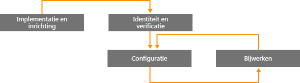
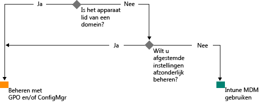

# Pad naar beheer van modern Windows met Microsoft Intune

De manier waarop organisaties apparaten beheren verandert door het gebruik van persoonlijke apparaten voor werk en door werknemers die niet op kantoor werken. Voor bepaalde delen van sommige organisaties is een grondige, nauwkeurige controle op apparaten vereist. Andere organisaties hebben op hun beurt een lichter beheer op basis van scenario’s, zodat medewerkers op een moderne manier kunnen werken.

Net als eerdere Windows-platformen levert ook Windows 10 het best beheerde besturingssysteem voor organisaties. Windows biedt ondersteuning voor grondige beheersbaarheid en beveiliging met technologieën zoals groepsbeleid, Active Directory en System Center Configuration Manager. Daarnaast levert Windows een vereenvoudigd en modern beheer waarbij alles draait om de cloud en mobiliteit. Hierbij wordt gebruikgemaakt van cloudoplossingen voor apparaatbeheer, zoals Microsoft Enterprise Mobility Suite (EMS). Toekomstige innovaties van Windows die via Windows-as-a-Service worden geleverd, worden aangevuld met snel veranderende cloudservices, zoals Microsoft Intune, Azure Active Directory, Azure Rights Management-service, Office 365 en Windows Store voor Bedrijven.

IT-organisaties hebben meer flexibiliteit doordat ze profiteren van innovatie en kostenbesparingen. In dit document staat informatie over strategieën voor het implementeren en beheren van Windows 10. Bovendien is te lezen hoe Microsoft strategisch nadenkt over hulpprogramma's voor apparaatbeheer. Als u de grondbeginselen van beheer wilt toepassen op verschillende apparaten, houd dan rekening met de volgende vier fasen van de levenscyclus van apparaten:

## Implementatie en inrichting

In tegenstelling tot de traditionele implementatie van besturingssystemen met complexe IT-bewerkingen, biedt modern apparaatbeheer de mogelijkheid tot 'kant-en-klaar beheer'. De IT-afdeling wil nieuwe apparaten eenvoudig kunnen omzetten naar volledig geconfigureerde, volledig beheerde apparaten, zonder gebruik van installatiekopieën.  Dynamisch inrichten gaat nu makkelijker dan ooit, dankzij cloudservices voor apparaatbeheer, zoals Microsoft Intune. U kunt ook onafhankelijke inrichtingspakketten maken die met Windows Imaging and Configuration Designer (ICD) zijn gebouwd. Natuurlijk worden traditionele technieken voor installatiekopieën nog steeds ondersteund, zodat organisaties aangepaste installatiekopieën met behulp van System Center Configuration Manager kunnen implementeren.

## Identiteit en authenticatie

Windows 10 en services zoals Azure Active Directory bieden nieuwe mogelijkheden voor identiteit, authenticatie en beheer in de cloud. Met scenario's zoals BYOD en CYOD kunnen ondernemingen zorgvuldig overwegen hoe gebruikers toegang krijgen tot bedrijfsbronnen en apps. Gebruikers- en apparaatbeheer vallen onder de volgende twee categorieën:

- Zakelijke (CYOD) en persoonlijke (BYOD) apparaten die door mobiele gebruikers worden gebruikt voor SaaS-apps, zoals Office 365.

  Met Windows 10 kunnen werknemers zelf apparaten inrichten. Met Azure AD Join kan de toegang tot het bedrijfsnetwerk gemakkelijk worden geconfigureerd op zakelijke apparaten. En met de nieuwe, vereenvoudigde BYOD-ervaring kunnen gebruikers hun werkaccount toevoegen aan Windows en bronnen op hun eigen apparaat openen. Als Azure AD Join en automatische registratie van Intune MDM worden gecombineerd, worden apparaten in [één eenvoudige stap](https://blogs.technet.microsoft.com/ad/2015/08/14/windows-10-azure-ad-and-microsoft-intune-automatic-mdm-enrollment-powered-by-the-cloud/) geheel vanuit de cloud door het bedrijf beheerd. Azure AD Join is ook een ideale oplossing voor tijdelijk personeel, partners of parttime werknemers. Deze accounts kunnen worden geïsoleerd van het on-premises AD-domein, maar hebben nog steeds toegang tot de benodigde bedrijfsbronnen.
- Pc's en tablets in een domein waarop traditionele toepassingen en bronnen worden gebruikt waarvoor authenticatie is vereist of waarop toegang moet worden verkregen tot uiterst gevoelige of vertrouwelijke on-premises bronnen

  Windows 10-apparaten in een on-premises Active Directory-domein worden automatisch bij Azure AD geregistreerd. Gebruikers kunnen dus profiteren van de extra voordelen van Windows 10, zoals eenmalige aanmelding bij cloud- en on-premises bronnen vanaf elke locatie, zakelijke roaming van instellingen, Microsoft Passport for Work en Windows Hello. Pc's en tablets in een domein moeten voortdurend met de System Center Configuration Manager-client of een groepsbeleid worden beheerd.

Controleer de rollen in uw organisatie. Identificeer gebruikers of apparaten waarvoor domeindeelname is vereist en zet andere over naar Azure AD. In [dit artikel](https://azure.microsoft.com/en-us/documentation/articles/active-directory-azureadjoin-windows10-devices/) vindt u meer informatie over hoe de toegang tot bedrijfsbronnen via verschillende apparaten en scenario's met Windows 10 en Azure AD kan worden geoptimaliseerd.

Hier ziet u een voorbeeld van een gegeneraliseerde beslissingsstructuur. In sommige gevallen gelden natuurlijk uitzonderingen.

## Instellingen en configuratie

Het benodigde beheerniveau, de beheerde apparaten en gegevens en industriële eisen kunnen allemaal bepalend zijn voor de configuratievereisten. Ondertussen maken werknemers zich vaak zorgen over het strenge beleid van de IT-afdeling wat betreft persoonlijke apparaten. Toch willen ze toegang tot zakelijke e-mail en documenten. Via een gemeenschappelijke MDM-laag zorgt Windows 10 voor een consistente configuratieset op alle pc's, tablets en telefoons. De MDM-benadering vereist instellingen waarmee de bedoelingen van de beheerder worden bereikt, zonder dat alle instellingen worden weergegeven. Bij groepsbeleid daarentegen worden verfijnde instellingen weergegeven die de beheerder afzonderlijk beheert. Een voordeel van MDM is dat beheerders uitgebreidere instellingen voor privacy, beveiliging en toepassingsbeheer kunnen toepassen via eenvoudigere en efficiëntere hulpprogramma's. Hierdoor is MDM de beste keuze voor apparaten waarvan de gebruikers voortdurend onderweg zijn.

Veel organisaties moeten computers die aan een domein zijn toegevoegd nog steeds op gedetailleerd niveau beheren, zoals de 1500 configureerbare GP-instellingen van Internet Explorer of zeer specifieke regels van Windows Firewall. In dergelijke gevallen zijn groepsbeleid en System Center Configuration Manager nog steeds uitstekende beheeropties. Groepsbeleid is de beste manier voor gedetailleerde configuratie van Windows-pc's en -tablets die aan een domein zijn toegevoegd en via Windows-programma's met het bedrijfsnetwerk zijn verbonden. Microsoft blijft instellingen voor groepsbeleid aan elke nieuwe Windows-versie toevoegen. Voor gedetailleerde configuratie met robuuste software-implementatie, Windows-updates en implementatie van het besturingssysteem blijft Configuration Manager de aanbevolen procedure.

## Windows-apparaten bijwerken

Met Windows-as-a-Service hoeven IT-organisaties niet meer bij elke nieuwe Windows-versie complexe processen voor installatiekopieën (wipe-and-load) uit te voeren. De nieuwste functies en kwaliteitsupdates worden via eenvoudige, vaak automatische patchprocessen op apparaten geladen, ongeacht of het Current Branch (CB) of Current Branch for Business (CBB) betreft. MDM en Intune bieden hulpprogramma's voor het toepassen van Windows-updates op clientcomputers in de onderneming. Configuration Manager maakt uitgebreid beheer en het bijhouden van deze updates mogelijk, bijvoorbeeld met onderhoudsvensters en regels voor automatische implementatie.

## Samenvatting

Als u overweegt om met uw organisatie het pad naar modern apparaatbeheer in te slaan, sta dan eens stil bij de stappen die uw reis mogelijk maken.

1. **U kunt vandaag nog gaan investeren.** Welke onderdelen van het traditionele apparaatbeheer moet u behouden en waar kunt u moderniseren? Of u nu het gebruik van aangepaste installatiekopieën wilt minimaliseren, het instellingenbeheer opnieuw wilt evalueren of authenticatie en naleving opnieuw wilt beoordelen, u kunt direct voordeel behalen.

2. **Evalueer de verschillende use cases in uw omgeving.** Zijn er apparaatgroepen die baat kunnen hebben bij lichter, vereenvoudigd beheer? BYOD-apparaten zijn bijvoorbeeld prima kandidaten voor cloudbeheer. Voor gebruikers of apparaten die meer gereguleerde gegevens gebruiken, is mogelijk een on-premises AD-domein nodig voor authenticatie. Configuration Manager en EMS bieden u de flexibiliteit om de implementatie van moderne beheerscenario's gefaseerd uit te voeren en u tegelijkertijd te richten op verschillende apparaten op een wijze die het best tegemoetkomt aan uw bedrijfsbehoeften. De keuze is aan u.

## Wat u vervolgens moet doen

- **Evalueer de beheerbehoeften in uw omgeving.** Afhankelijk van werknemers, hun mobiliteit, hun apparaten en de gegevens waartoe ze toegang hebben, is één oplossing mogelijk niet voldoende voor al uw behoeften.
- **Bedenk wat nodig is.** Met Windows 10, Configuration Manager en Enterprise Mobility Suite kunt u hulpprogramma's voor installatiekopieën, authenticatie, instellingen en beheer voor elk scenario inzetten.
- **Neem kleine stappen.** Bij de overstap op modern apparaatbeheer hoeft u niet over één nacht ijs te gaan.
- **Optimaliseer uw bestaande investeringen.** Profiteer tijdens de overgang van traditioneel on-premises beheer naar modern cloudbeheer van de flexibele, hybride architectuur van Configuration Manager en Intune. Het cloudidentiteits-/MDM-model biedt steeds meer mogelijkheden. Microsoft zet alles in het werk om een duidelijk pad van traditioneel naar modern beheer te creëren.

<!--HONumber=Oct16_HO4-->

