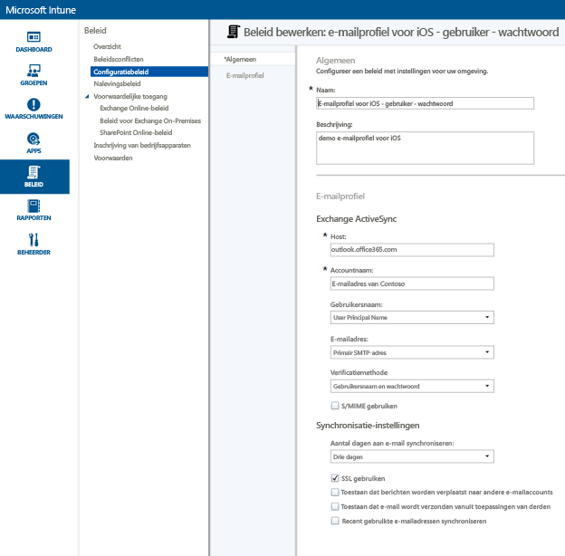
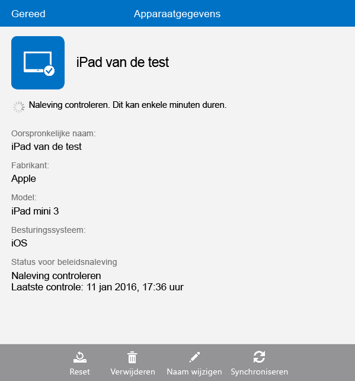

# Toegang tot e-mail op iOS-apparaten instellen met Microsoft Intune
Wanneer apparaten zijn ingeschreven bij Intune, kunt u de apparaten configureren zodat gebruikers toegang hebben tot bedrijfse-mail. Een manier om dat toe te passen op specifieke apparaattypen, is het maken en implementeren van een **e-mailprofiel**. E-mailprofielen zijn een soort Intune-beleid waarmee het apparaat van een gebruiker wordt ingesteld en verbonden met de e-mailservice van uw bedrijf.
Door het gebruik van een e-mailprofiel hebben geregistreerde apparaten automatisch toegang tot e-mail. Hierdoor hoeft u niet elk apparaat handmatig in te stellen. Het gebruik van een e-mailprofiel zorgt er ook voor dat de toegang van alle eindgebruikers op dezelfde manier en met dezelfde algemene instellingen wordt ingesteld.

## Doelstellingen van deze procedure

- Een e-mailprofiel voor iOS-apparaten maken en implementeren
- Verifiëren dat het e-mailprofielbeleid is toegepast

## Wat u nodig hebt voordat u met deze procedure begint

- Een Exchange-Server, on-premises of gehost op Azure als onderdeel van uw Office-/E3-abonnement.
- De hostnaam van de Exchange-server van uw bedrijf. Dit is de volledig gekwalificeerde domeinnaam (FQDN), bijvoorbeeld **contosodemo55.onmicrosoft.com**.
- Een gebruikersgroep waarvoor het e-mailprofiel kan worden geïmplementeerd. Als u de procedure voor [Een proefversie van Microsoft Intune in gebruik nemen en een iOS-pincodebeleid implementeren](start-a-microsoft-intune-trial-and-deploy-ios-pin-policy.md) hebt voltooid, kunt u de gebruikersgroep **GroupDemo** die u hiervoor hebt gemaakt, in gebruik nemen.
- Ingeschreven iOS-apparaten waarop het profiel moet worden toegepast. Nogmaals: als u de procedure voor [Een proefversie van Microsoft Intune in gebruik nemen en een iOS-pincodebeleid implementeren](start-a-microsoft-intune-trial-and-deploy-ios-pin-policy.md) hebt voltooid, hebt u een aantal iOS-apparaten ingeschreven.

## Stappen voor het maken en implementeren van een e-mailprofiel voor iOS-apparaten

Voor deze procedure gebruiken we de gehoste Exchange-server die wordt geleverd met een proefabonnement.
1. Klik in de Intune-console op **Beleid** en vervolgens op **Beleid toevoegen**.

2. Vouw in het dialoogvenster **Een nieuw beleid maken** **iOS** uit, selecteer **E-mailprofiel** en klik vervolgens op **Beleid maken**.  

3. Voer op de pagina Beleid maken een naam voor het beleid in, bijvoorbeeld **iOS-e-mailprofiel - gebruikerswachtwoord**, en een beschrijving. Mogelijk hebt u meerdere e-mailprofielen voor verschillende apparaattypen en verschillende verificatiemethoden, zodat u de naam kunt gebruiken om te laten zien waar het profiel voor dient.
4. Voer de naam van de Exchange-host in. We gebruiken de Exchange-server die wordt gehost op Azure, dus voeren we gewoon **outlook.office365.com**

5. Geef de accountnaam op die wordt weergegeven voor gebruikers van het apparaat, zodat zij de e-mailservice kunnen identificeren. Bijvoorbeeld **Contoso-e-mail**.
6. Aangezien we de gebruikersnaam en het wachtwoord gebruiken om de gebruiker voor de Exchange-service te verifiëren, kunt u de instellingen voor de gebruikersnaam en het wachtwoord ongewijzigd laten.
7. Pas de synchronisatie-instellingen aan om te voldoen aan uw behoeften. Voorlopig gebruikt u gewoon de standaardinstellingen, tenzij er een specifieke instelling is die u wilt wijzigen.  
8. Klik op **Beleid opslaan**.
9. Er wordt een dialoogvenster weergegeven waarin u wordt gevraagd of u het beleid nu wilt implementeren. Klik op **Ja**.

10. Selecteer in het volgende venster de gebruikersgroep waarop u het e-mailprofiel wilt toepassen. Klik op **Toevoegen** en vervolgens op **OK**.  
  
Nadat u op **OK** hebt geklikt, wordt het beleid naar ingeschreven apparaten uitgerold. Dit duurt ongeveer twee minuten.

## Stappen om te verifiëren dat het profiel is toegepast

Om te verifiëren dat het profiel is toegepast, moet u toegang hebben tot een van de apparaten waarop u het e-mailprofiel hebt toegepast.
1. Open de e-mailapp op het iOS-apparaat.
De app vraagt u om de gebruikersnaam en het wachtwoord van het e-mailadres.  

2. Voer de gebruikersnaam en het wachtwoord voor het Exchange-e-mailaccount van de gebruiker in en tik op **OK**.
 De e-mailapp wordt geopend met het Exchange-account en het e-mailadres begint te synchroniseren naar het apparaat.

3. Controleer de accountinstellingen van de e-mailapp om te controleren of de accountnaam dezelfde is als die u hebt ingevoerd in het e-mailprofiel (bijvoorbeeld **Contoso-e-mail**). Controleer ook of de synchronisatie-instellingen juist zijn ingesteld.

  
  Als het erop lijkt dat het e-mailprofiel niet automatisch op het apparaat is toegepast, kunt u het beleid handmatig toepassen via de app Bedrijfsportal op het apparaat.
1. Open de app Bedrijfsportal.
2. Tik op **Mijn apparaten**.
3. Tik op de naam van uw apparaat.

4. Tik op **Synchroniseren** > **Naleving controleren**.
 Na enkele ogenblikken wordt het e-mailprofiel toegepast op het apparaat. Daarna kunt u de verificatiestappen volgen om te controleren of het profiel correct is toegepast.

## Zie ook
[Intune-evaluatiehandleiding](get-started-with-a-30-day-trial-of-microsoft-intune.md)

<!--HONumber=Jul16_HO4-->

