# Een proefversie van Microsoft Intune in gebruik nemen en een iOS-pincodebeleid implementeren
Deze stapsgewijze instructies helpen u bij het instellen van een Intune-proefabonnement en de configuratie van een pincodebeleid voor iOS-apparaten. Zie [Algemene Microsoft Intune-evaluatietaken](common-microsoft-intune-evaluation-tasks.md) voor een lijst met algemene Intune-evaluatietaken die u kunt uitvoeren.

## Vereisten voor deze taak controleren

-   Een Windows-pc met Internet Explorer voor het uitvoeren van beheertaken

-   Een apparaat met iOS 7.1 of hoger om de validatie van het gebruikersbeleid te testen

-   Een telefoon om uzelf te verifiëren tijdens uw aanmelding voor het proefabonnement

## Een gratis proefaccount bij Intune maken
> [!NOTE]
> Als u al een Intune-abonnement hebt, kunt u deze sectie overslaan en naar de volgende sectie gaan.

1.  Klik op een Windows-pc met de rechtermuisknop op **Internet Explorer** (IE) en selecteer **InPrivate-browsing**.

    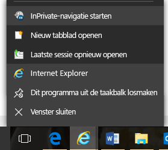

2.  Ga naar de [portal om u aan te melden bij Intune](https://portal.office.com/Signup/Signup.aspx?OfferId=40BE278A-DFD1-470a-9EF7-9F2596EA7FF9&dl=INTUNE_A&ali=1), voer de vereiste gegevens in en klik op **Volgende**.

    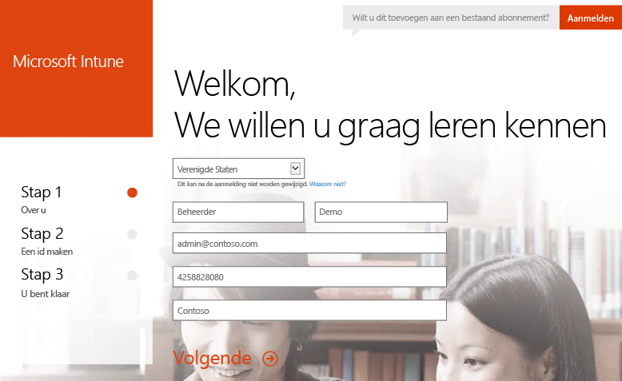

3.  Voer een gebruikers-id en wachtwoord in voor uw beheerdersaccount en klik op **Volgende**. U gebruikt deze id wanneer u zich aanmeldt bij de Intune-portal om beheertaken uit te voeren.

    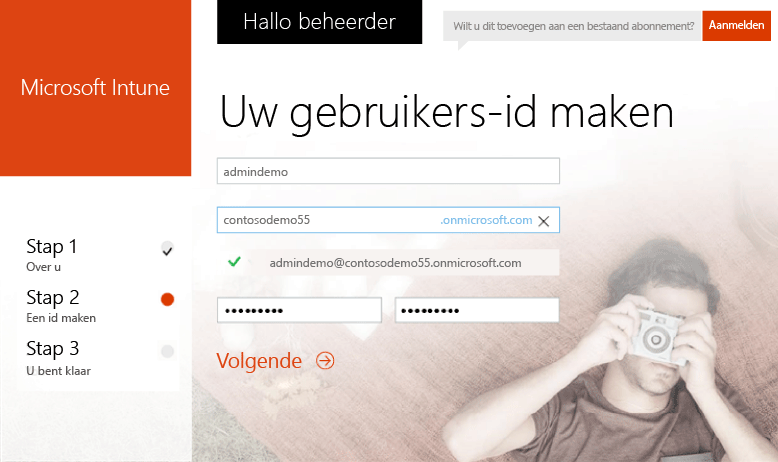

4.  Voer uw mobiele telefoonnummer in en klik op **Stuur me een SMS** om uw nummer te valideren.

    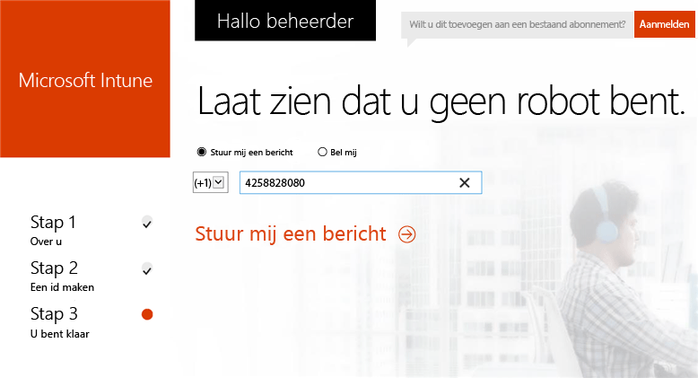

5.  Sla de gegevens die op het scherm worden weergegeven, op en klik op **U bent klaar om aan de slag te gaan...**.

    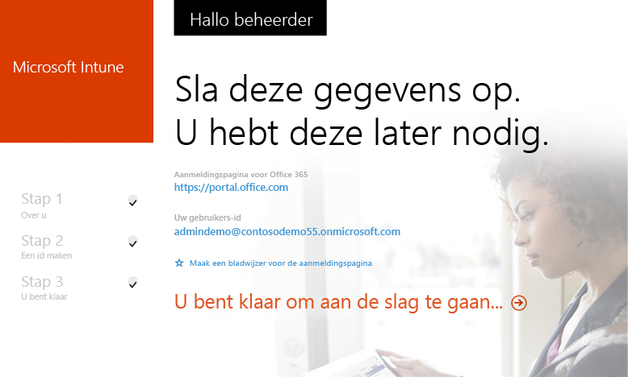

## Een testgebruiker maken

1.  Klik op een Windows-pc op **Start** om naar de pagina voor gebruikersbeheer te gaan.

    

2.  Klik op de knop **+** om een gebruiker toe te voegen.

    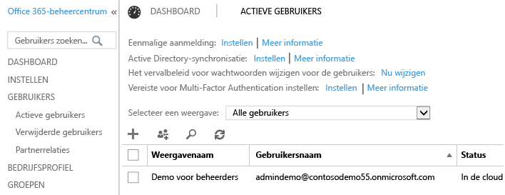

3.  Ga als volgt te werk op de pagina **Nieuw gebruikersaccount maken**:

    1.  Geef de gegevens voor de testgebruiker op.

    2.  Selecteer de optie **Geef het wachtwoord op**.

    3.  Schakel het selectievakje **Vraag deze persoon zijn wachtwoord te wijzigen bij volgende aanmelding** uit.

    4.  Klik op **Maken**.

    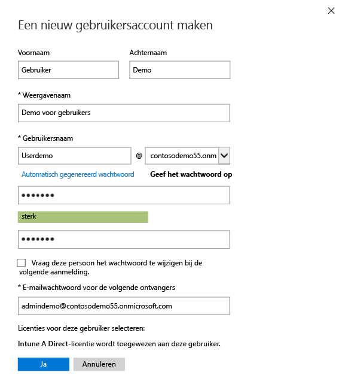

4.  Klik op de bevestigingspagina voor het maken van een gebruiker op **Sluiten**.

    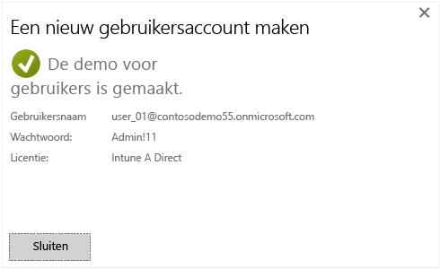

5.  Klik op de knop **Vernieuwen** om de zojuist gemaakte testgebruiker weer te geven.

    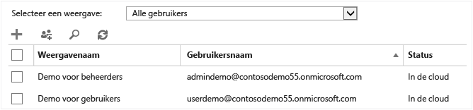

## Een iOS-pincodebeleid voor de testgebruiker configureren

1.  Met een Windows-pc stelt u als volgt de MDM-instantie in op Intune:

    1.  Ga naar de [Intune-beheerconsole](http://manage.microsoft.com/), meld u aan met uw beheerdersaccount en klik op **Beheer van mobiele apparaten starten**. De pagina Instantie voor beheer van mobiele apparaten wordt geopend

        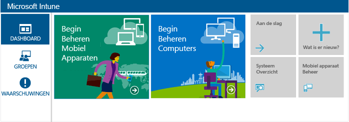

    2.  Klik op de koppeling **Instantie voor beheer van mobiele apparaten instellen**.

        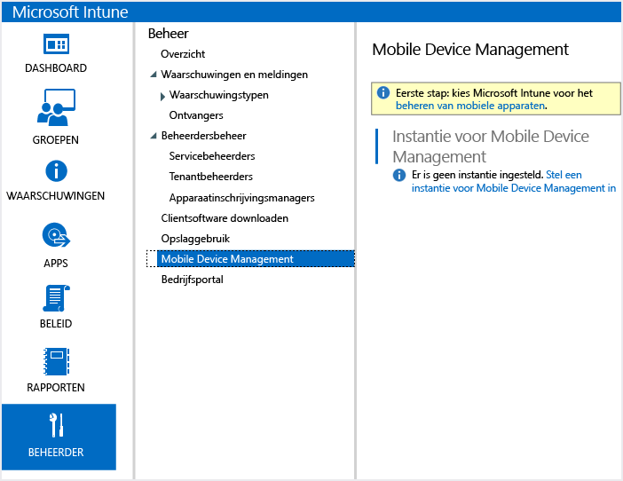

2.  Schakel iOS-apparaten in voor inschrijving. Met dit proces wordt een vertrouwd certificaat ingesteld tussen de Apple Push Notification Service (APNs) en uw Intune-abonnement.

    1.  Klik op **Het iOS- en Mac OS X-platform inschakelen**.

        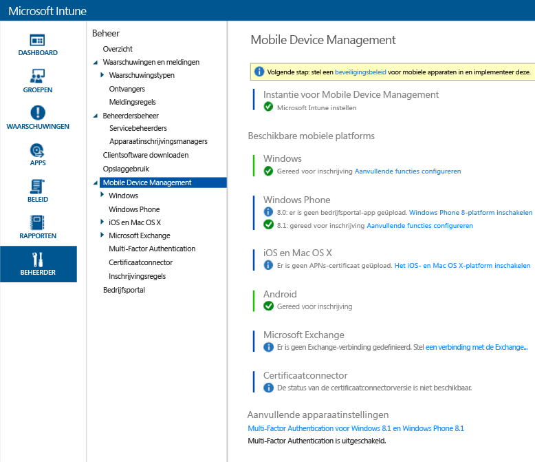

    2.  Klik op **De APNs-certificaataanvraag downloaden**.

        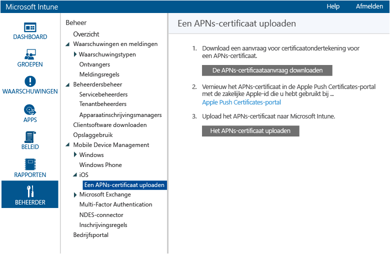

    3.  Geef een bestandsnaam en locatie op voor uw CSR (Certificate Signing Request) en klik op **Opslaan**. Dit bestand bevat de openbare sleutel die overeenkomt met een persoonlijke sleutel die is opgeslagen in uw Intune-abonnement.

        

    4.  Klik op **Apple Push Certificates-portal** om een nieuw tabblad te openen.

        

    5.  Voer uw Apple-id en -wachtwoord in en klik op **Aanmelden**. Dit kan de id zijn die op uw iOS-apparaat wordt gebruikt om apps op te halen uit de iOS App Store.

        

    6.  Klik op **Een certificaat maken**.

        

    7.  Lees de gebruiksvoorwaarden van Apple, schakel het selectievakje in en klik op **Accepteren**.

        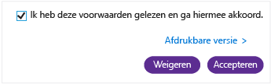

    8.  Klik op **Bladeren**.

        

    9. Selecteer het CSR-bestand dat u eerder hebt opgeslagen en klik op **Openen**.

        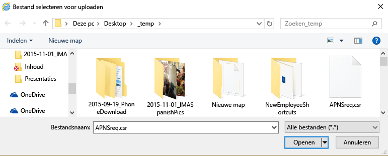

    10. Klik op de knop **Uploaden**.

        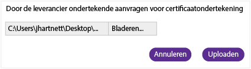

    11. Wanneer u wordt gevraagd een JSON-bestand te downloaden, klikt u op **Opslaan als**.

        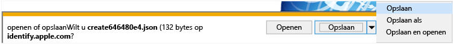

    12. Geef een locatie voor uw JSON-bestand op en klik op **Opslaan**.

        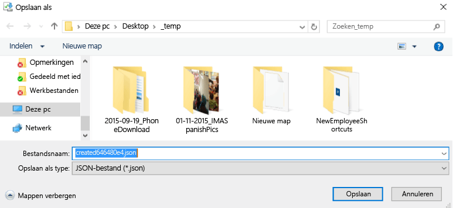

        Als de pagina na enkele seconden niet automatisch wordt omgeleid, klikt u op **Annuleren**.

        

    13. Klik op **Downloaden** als u het zojuist gemaakte certificaatbestand wilt ophalen.

        

    14. Wanneer u wordt gevraagd een PEM-bestand te downloaden, klikt u op **Opslaan als**.

        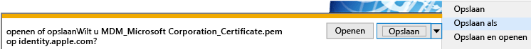

    15. Geef een locatie voor uw PEM-bestand op en klik op **Opslaan**.

        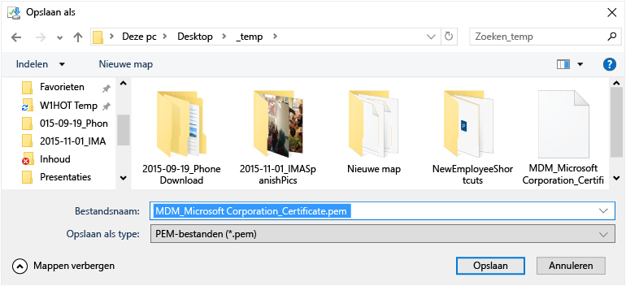

    16. Ga terug naar het tabblad Intune-beheerconsole en klik op **Het APNs-certificaat uploaden**.

        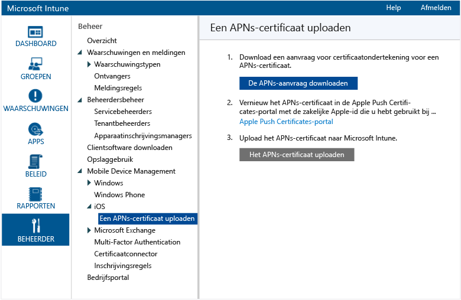

    17. Voer uw Apple-id in en klik op **Bladeren**.

        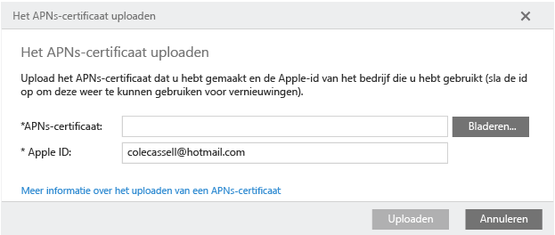

    18. Selecteer het PEM-bestand dat u zojuist hebt opgeslagen en klik op **Openen**.

        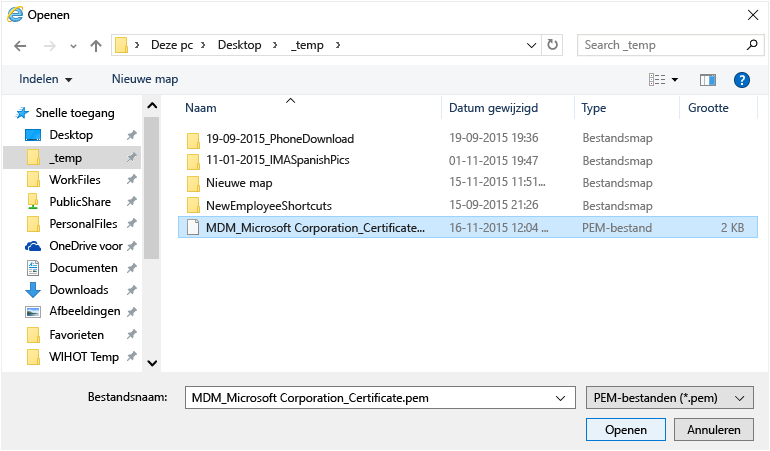

    19. Klik op **Uploaden**.

        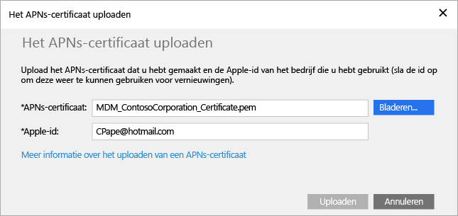

        Uw APNs-certificaat is nu geconfigureerd.

        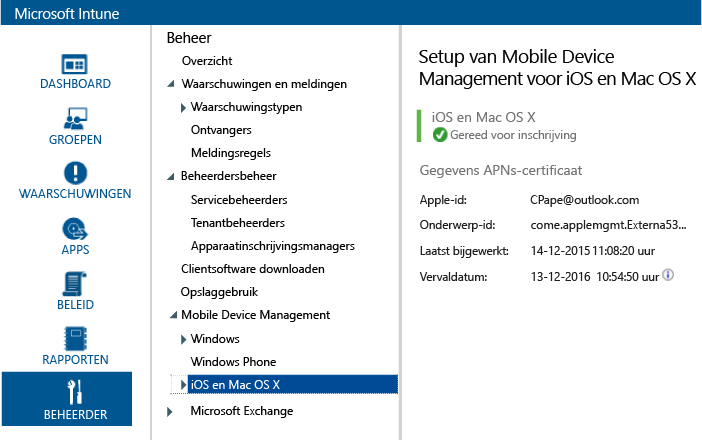

3.  Ga als volgt te werk om een testgebruikersgroep te maken waarmee u het beleid wilt testen:

    1.  Klik in het linkerdeelvenster op **Groepen**.

        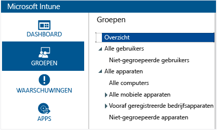

    2.  Klik helemaal rechts op **Groep maken**.

        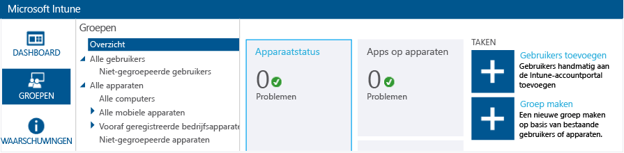

    3.  Geef een groepsnaam op, selecteer **Alle gebruikers** als bovenliggende groep en klik op **Volgende**.

        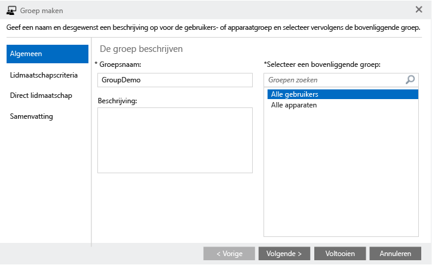

    4.  Selecteer in het veld **Groepslidmaatschap starten met:** de optie **Alle gebruikers in de bovenliggende groep** en klik op **Voltooien**.

        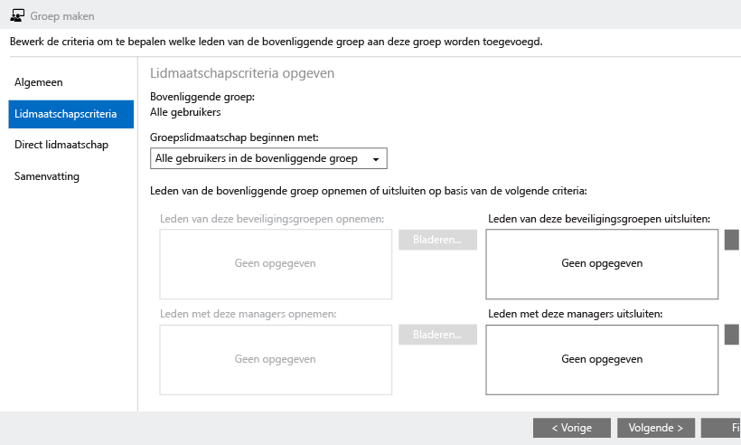

4.  Ga als volgt te werk om een iOS-pincodebeleid te maken en dit in te stellen voor de testgebruikersgroep:

    1.  Klik in het linkerdeelvenster op **Beleid**.

        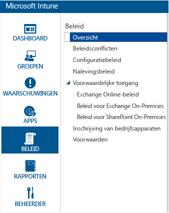

    2.  Klik helemaal rechts op **Beleid toevoegen**.

        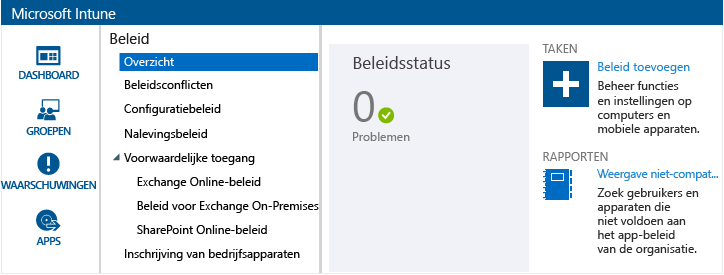

    3.  Vouw het knooppunt iOS uit, selecteer de rij **Algemene configuratie** en klik op **Beleid maken**.

        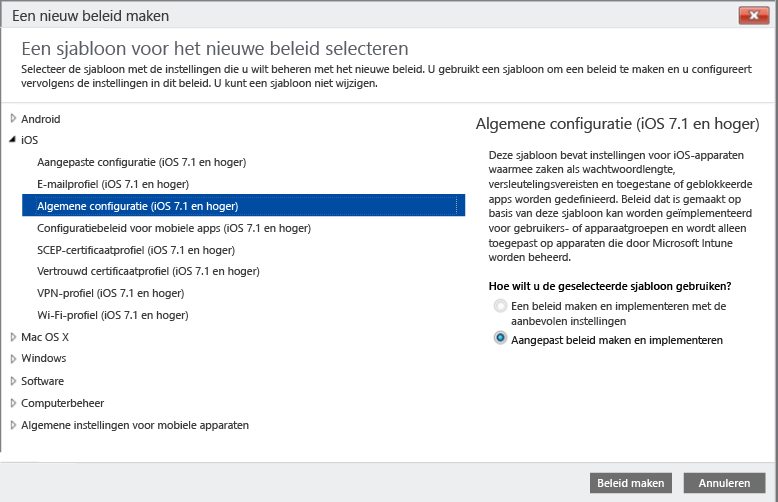

    4.  Typ een naam voor het beleid, schakel de optie **Wachtwoord vereisen voor het ontgrendelen van mobiele apparaten** in en stel de **Minimale wachtwoordlengte** in op **4**.

        

    5.  Klik op **Ja** om het beleid te implementeren.

        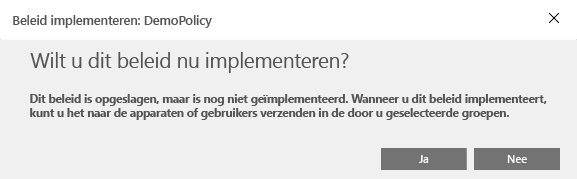

    6.  Klik op de gebruikersgroep die u eerder hebt gemaakt. Klik vervolgens op **Toevoegen** en daarna op **OK**.

        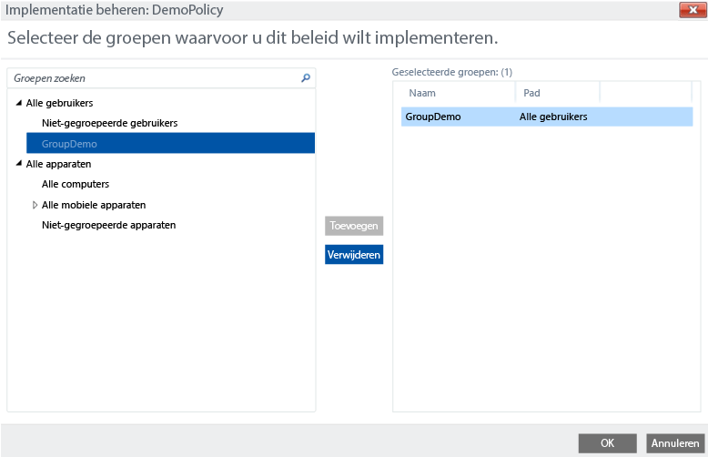

        U hebt nu een iOS-pincodebeleid gemaakt dat is gericht op uw testgebruikersgroep.

        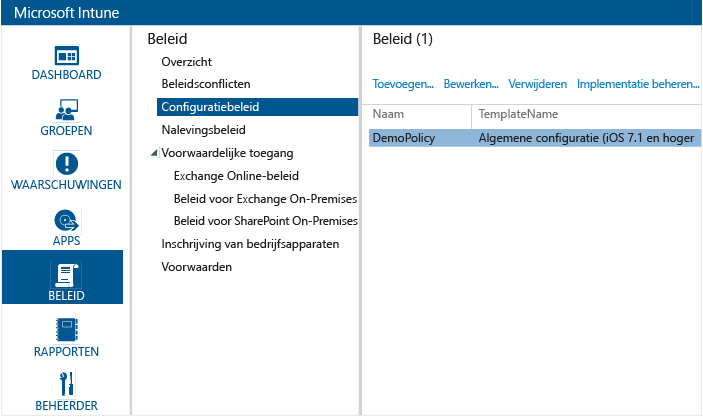

## Controleren of het beleid wordt toegepast op een iOS-apparaat

1.  Start de iOS App Store op een iPad, installeer de gratis app **Microsoft Intune-bedrijfsportal** en open deze.

    

2.  Voer de naam en het wachtwoord van uw testgebruikersaccount in en tik op **Aanmelden**.

    

3.  Tik op **Inschrijven** om de inschrijving van het apparaat in Intune te starten.

    

4.  Tik in het scherm **Profiel installeren** op **Installeren**.

    

5.  Tik in het dialoogvenster **Profiel installeren** op **Installeren**.

    

6.  Tik in het scherm **Waarschuwing** op **Installeren**.

    

7.  Tik in het dialoogvenster **Extern beheer** op **Vertrouwen**.

    

8.  Tik op **Gereed** wanneer de installatie van het beheerprofiel is voltooid. De inschrijving is nu voltooid.

    

9. Wanneer de inschrijving is voltooid, tikt u op **OK** en sluit u de bedrijfsportal-app.

    

10. Tik op **Doorgaan** wanneer u wordt gevraagd een wachtwoordcode te configureren.

    

11. Voer uw wachtwoordcode in, tik op **Doorgaan**, voer uw wachtwoordcode nogmaals in en tik op **Opslaan**.

    

12. Druk op de aan/uit-knop om uw iPad te vergrendelen. Wanneer u de schuifknop omzet om de iPad te ontgrendelen, ziet u dat u nu uw wachtwoordcode moet invoeren om het apparaat te ontgrendelen.

### Zie tevens
[Intune-evaluatiehandleiding](get-started-with-a-30-day-trial-of-microsoft-intune.md)

<!--HONumber=Jul16_HO4-->

