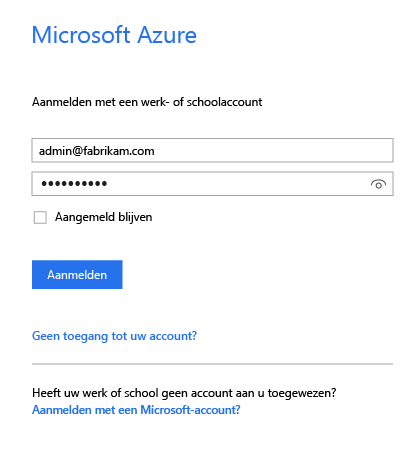
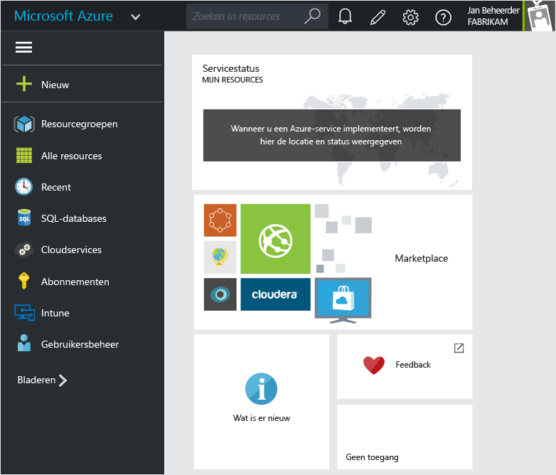
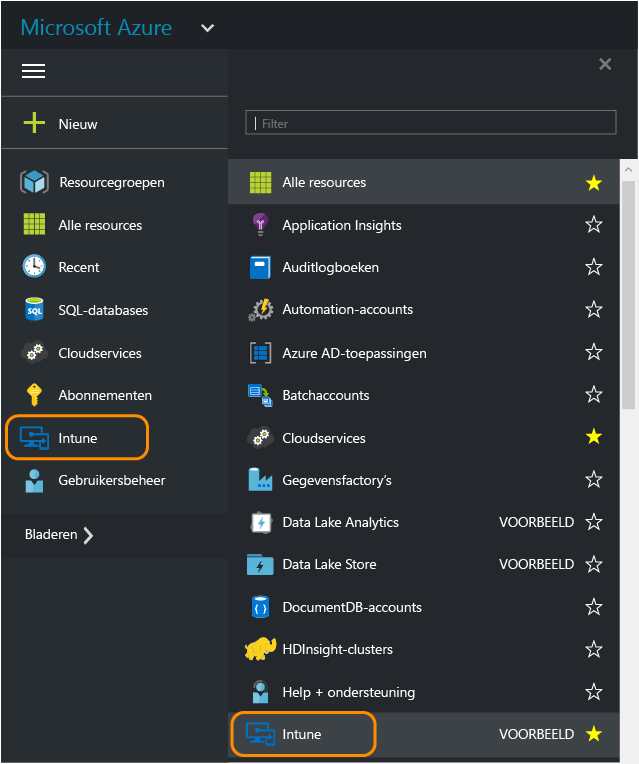
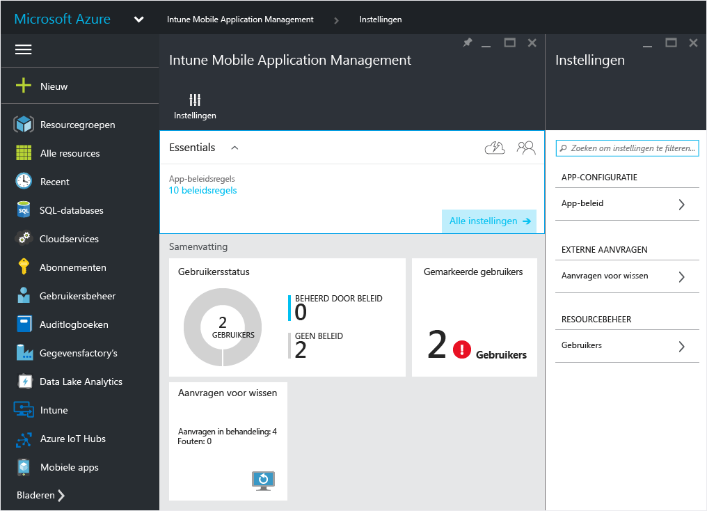
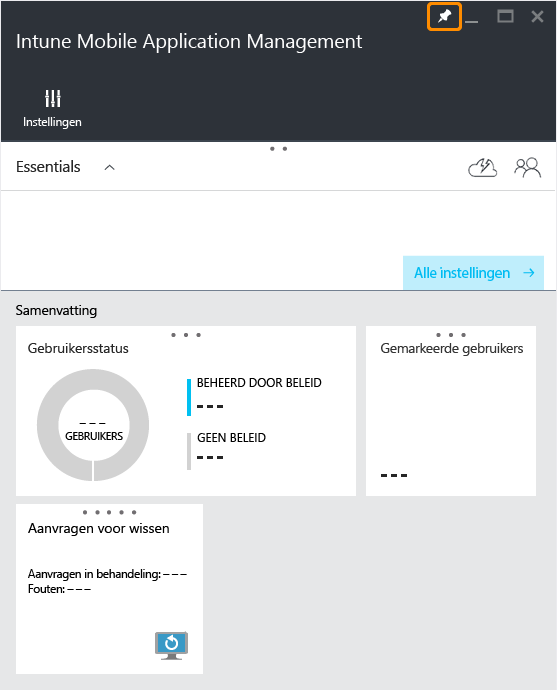
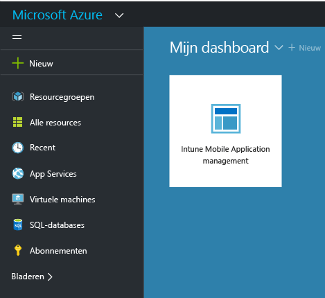

# Azure-portal voor Microsoft Intune MAM-beleid

## De Azure-portal gebruiken
In de Azure-portal kunt u beleid voor het beheer van mobiele apps (MAM) maken en beheren.

De Azure-portal biedt ondersteuning voor het maken van MAM-beleid voor:
- Apps die worden uitgevoerd op apparaten die zijn **geregistreerd bij en worden beheerd in Intune**.

- Apps die worden uitgevoerd op apparaten die **niet zijn ingeschreven** bij een MDM-oplossing.
- Apps die worden uitgevoerd op apparaten die zijn **geregistreerd bij een MDM-oplossing van derden**.

>[!IMPORTANT]

> Als u de Intune-beheerconsole gebruikt om uw apparaten te beheren, kunt u met de [Intune-beheerconsole](configure-and-deploy-mobile-application-management-policies-in-the-microsoft-intune-console.md) MAM-beleid maken dat apps ondersteunt voor apparaten die zijn geregistreerd bij Intune.

> Mogelijk ziet u niet alle MAM-beleidsinstellingen in de Intune-beheerconsole. De Azure-portal is de nieuwe beheerconsole voor het maken van MAM-beleid. Als u een MAM-beleid in zowel de Intune-beheerconsole als de Azure Portal maakt, wordt het beleid in de Azure Portal toegepast op de apps en geïmplementeerd op gebruikers.

## Meld u aan bij de Azure-portal en pas uw startpagina aan

1.  Ga naar de [Azure-portal](https://portal.azure.com) en meld u aan met uw [!INCLUDE[wit_nextref](../includes/wit_nextref_md.md)]-referenties.

    

2.  Nadat u zich hebt aangemeld, ziet u het **dashboard**. De **Dashboard**-pagina kan worden aangepast.

    

3.  Ga in het menu **Bladeren** naar **Intune**.

4.  Kies **Intune** > **Intune Mobile Application Management** > **Instellingen**.

    

    > [!TIP]

    > Als u een tabblad op de **Start** -pagina wilt vastzetten, gebruikt u de optie **Vastzetten** op het tabblad. Klik op het punaisepictogram op het tabblad **Intune Mobile Application Management** om het tabblad op de **Start**-pagina vast te zetten.

    

    
## Volgende stappen
[Voorbereidingen voor het configureren van beleid voor het beheer van mobiele apps](get-ready-to-configure-mobile-app-management-policies-with-microsoft-intune.md)

<!--HONumber=Dec16_HO2-->

