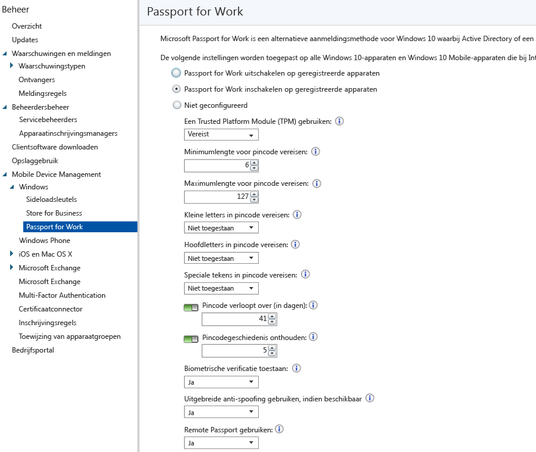

# Instellingen van Windows Hello voor Bedrijven beheren op apparaten met Microsoft Intune

[!INCLUDE[classic-portal](../includes/classic-portal.md)]

Microsoft Intune integreert met Windows Hello voor Bedrijven (voorheen Microsoft Passport for Work). Dit is een alternatieve aanmeldingsmethode waarbij Active Directory of een Azure Active Directory-account wordt gebruikt om een wachtwoord, smartcard of virtuele smartcard te vervangen.

Met Hello voor Bedrijven kan de gebruiker zich aanmelden met een *gebaar* in plaats van met een wachtwoord. Een gebaar van de gebruiker kan een eenvoudige pincode zijn, biometrische verificatie zoals Windows Hello of een extern apparaat zoals een vingerafdruklezer.

Intune integreert op twee manieren met Hello voor bedrijven:

-   U kunt Intune-beleid gebruiken om te bepalen welke gebaren gebruikers wel en niet kunnen gebruiken om zich aan te melden.

-   U kunt verificatiecertificaten opslaan in de sleutelarchiefprovider (KSP) van Windows Hello voor Bedrijven. Zie [Toegang tot beveiligde resources met certificaatprofielen in Microsoft Intune](secure-resource-access-with-certificate-profiles.md) voor meer informatie.

> [!IMPORTANT]
> In Windows 10 Desktop en Windows 10 Mobile vóór de jubileumupdate kunt u twee verschillende pincodes instellen voor het verifiëren van resources:
- U kunt de **pincode van het apparaat** gebruiken om het apparaat te ontgrendelen en verbinding te maken met cloudresources.
- De **pincode voor werk** werd gebruikt om toegang tot krijgen tot de Azure AD-resources op de persoonlijke apparaten van de gebruiker (BYOD).

>In de jubileumupdate zijn deze twee pincodes samengevoegd tot één pincode voor het apparaat.
De waarde voor deze nieuwe pincode wordt ingesteld op basis van de Intune-configuratiebeleidsregels die u hebt ingesteld voor het beheer van de pincode van het apparaat, en eventuele Windows Hello-bedrijfsbeleidsregels die u hebt geconfigureerd.
Als u beide beleidstypen voor het beheren van de pincode hebt ingesteld, wordt het Windows Hello-bedrijfsbeleid toegepast op apparaten met zowel Windows 10 Desktop als apparaten met Windows 10 Mobile.
Als u ervoor wilt zorgen dat beleidsconflicten worden opgelost en het pincodebeleid correct wordt toegepast, werkt u het Windows Hello-bedrijfsbeleid bij zodat dit overeenkomt met de instellingen in het configuratiebeleid. Vervolgens vraagt u de gebruikers hun apparaten te synchroniseren in de bedrijfsportal-app.

## Een beleid voor Windows Hello voor Bedrijven maken

1.  Klik in de [Microsoft Intune-beheerconsole](https://manage.microsoft.com) op **Beheer** &gt; **Mobile Device Management** &gt; **Windows** &gt; **Windows Hello voor Bedrijven** om de pagina Windows Hello voor Bedrijven weer te geven.

    

2.  Kies een van de volgende instellingen:
    - **Windows Hello voor Bedrijven op ingeschreven apparaten uitschakelen**. Als u Windows Hello voor Bedrijven niet wilt gebruiken, selecteert u deze instelling. Alle andere instellingen op het scherm zijn niet beschikbaar.
    - **Windows Hello voor Bedrijven op ingeschreven apparaten inschakelen**. Selecteer deze instelling als u instellingen voor Windows Hello voor Business wilt configureren.
    - **Niet geconfigureerd**. Selecteer deze instelling als u niet met Intune instellingen voor Windows Hello voor Bedrijven wilt beheren. Alle eventueel bestaande Windows Hello voor Bedrijven-instellingen voor Windows 10-apparaten worden niet gewijzigd. Alle andere instellingen op het scherm zijn niet beschikbaar.
3.  Als u **Windows Hello voor Bedrijven op ingeschreven apparaten inschakelen** hebt geselecteerd, configureert u de vereiste instellingen die worden toegepast op alle ingeschreven Windows 10- en Windows 10 Mobile-apparaten.
4.  Als u klaar bent, kiest u **Opslaan**.

## Instellingen voor het beleid voor Windows Hello voor Bedrijven

- **Een Trusted Platform Module (TPM) gebruiken**. Een TPM-chip biedt een extra laag gegevensbeveiliging. Kies een van de volgende waarden:
    - **Vereist** (standaard). Alleen apparaten met een toegankelijke TPM kunnen Windows Hello voor Bedrijven inrichten.
    - **Voorkeur**. Apparaten proberen eerst een TPM te gebruiken. Als deze niet beschikbaar is, kunnen ze softwareversleuteling gebruiken.
- **Minimumlengte voor pincode vereisen**/**Maximumlengte voor pincode vereisen**. Hiermee configureert u apparaten om de opgegeven minimum- en maximumlengte van de pincode te gebruiken voor het beveiligen van de aanmelding. De standaardwaarde voor de pincode is 6 tekens, maar u kunt een minimumlengte van 4 tekens afdwingen. De maximumlengte voor de pincode is 127 tekens.
- **Kleine letters voor pincode vereisen**/**Hoofdletters voor pincode vereisen**/**Speciale tekens voor pincode vereisen**. U kunt zorgen voor sterkere pincodes door het gebruik van kleine letters, hoofdletters en speciale tekens voor de pincode af te dwingen. U kunt kiezen uit:
    - **Toegestaan**. Gebruikers kunnen het tekentype gebruiken in hun pincode, maar dit is niet verplicht.
    - **Vereist**. Gebruikers moeten ten minste een van de tekentypen in hun pincode opnemen. Het is bijvoorbeeld gebruikelijk om ten minste één hoofdletter en één speciaal teken verplicht te stellen.
    - **Niet toegestaan** (standaardinstelling). Gebruikers mogen deze tekentypen niet in hun pincode gebruiken. (Dit is ook het gedrag als de instelling niet is geconfigureerd.) Tot de speciale tekens behoren: **! " # $ % &amp; ' ( ) &#42; + , - . / : ; &lt; = &gt; ? @ [ \ ] ^ _ &#96; { &#124; } ~**.
- **Verlooptijd pincode (dagen)**. Het is raadzaam om een verloopperiode voor een pincode op te geven, waarna gebruikers deze moeten wijzigen. De standaardwaarde is 41 dagen.
- **Pincodegeschiedenis onthouden**. Beperkt het hergebruik van eerder gebruikte pincodes. Standaard kunnen de laatste 5 gebruikte pincodes niet opnieuw worden gebruikt.
- **Biometrische verificatie toestaan**. Hiermee kunt u biometrische verificatie, zoals gezichtsherkenning of een vingerafdruk, inschakelen als alternatief voor een pincode voor Windows Hello voor Bedrijven. Gebruikers moeten toch een pincode voor Passport for Work configureren voor het geval dat biometrische verificatie mislukt. U kunt kiezen uit:
    - **Ja**. Windows Hello voor bedrijven staat biometrische verificatie toe.
    - **Nee**. Windows Hello voor Bedrijven staat biometrische verificatie niet toe (voor alle typen accounts).
- **Verbeterde anti-adresvervalsing gebruiken, indien beschikbaar**. Hiermee configureert u of de functies voor anti-adresvervalsing van Windows Hello worden gebruikt op apparaten die deze functie ondersteunen (bijvoorbeeld een foto van een gezicht in plaats van een echt gezicht detecteren). Als u deze optie instelt op **Ja**, moeten alle gebruikers anti-adresvervalsing gebruiken voor gezichtskenmerken, indien dat wordt ondersteund.
- **Aanmelding met telefoon**. Als u deze optie instelt op **Ja**, kunnen gebruikers een extern passport gebruiken als draagbaar begeleidingsapparaat voor verificatie op desktopcomputers. De computer moet zijn toegevoegd aan Azure Active Directory en het begeleidingsapparaat moet worden geconfigureerd met een pincode voor Windows Hello voor Bedrijven.

## Meer informatie
Zie [de gids](https://technet.microsoft.com/library/mt589441.aspx) in de documentatie van Windows 10 voor meer informatie over Microsoft Passport.

<!--HONumber=Dec16_HO5-->

