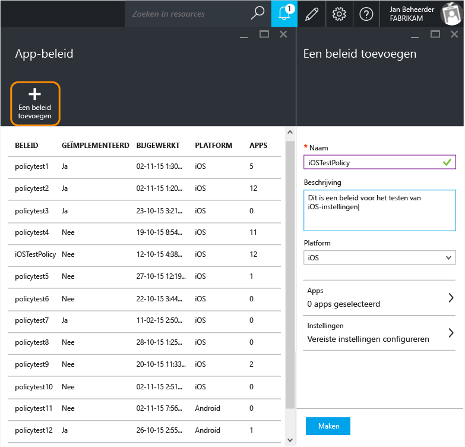
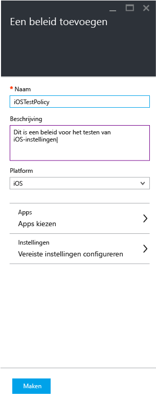
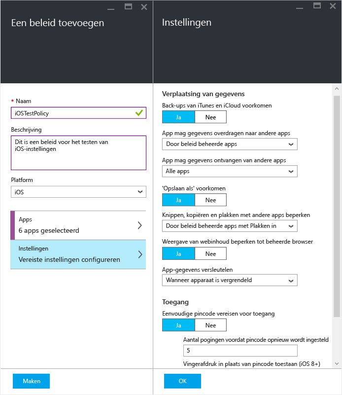
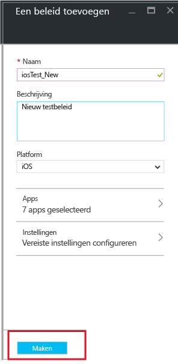
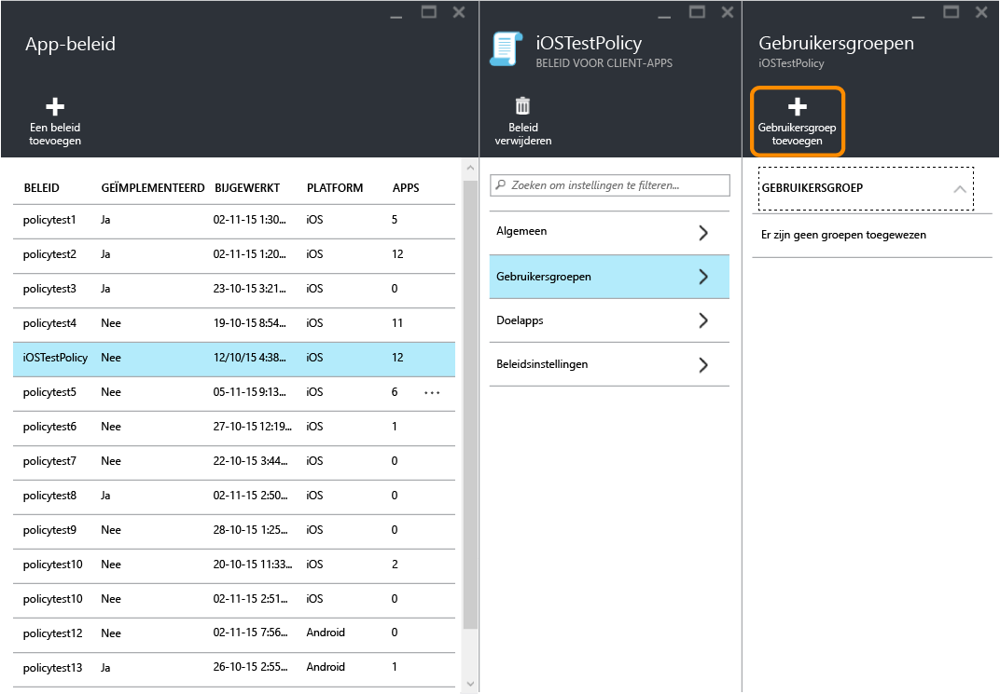
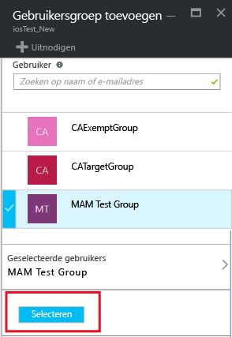
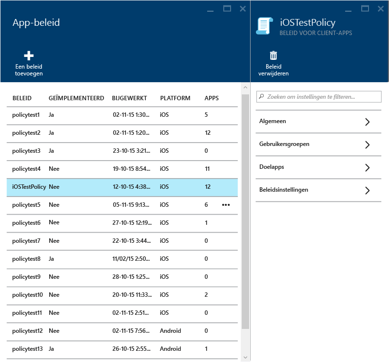
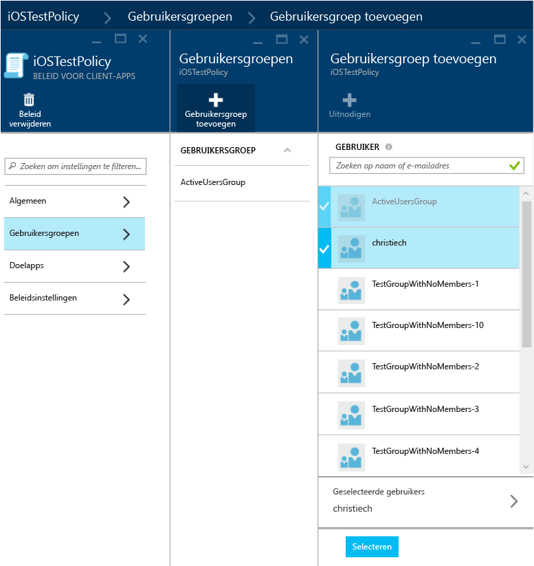
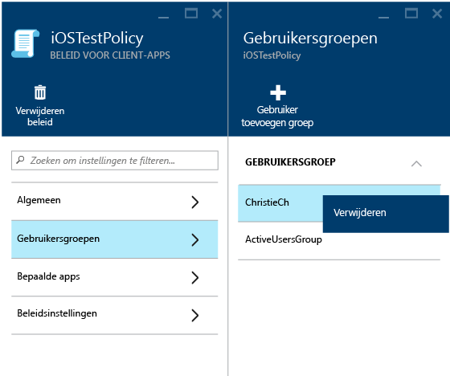
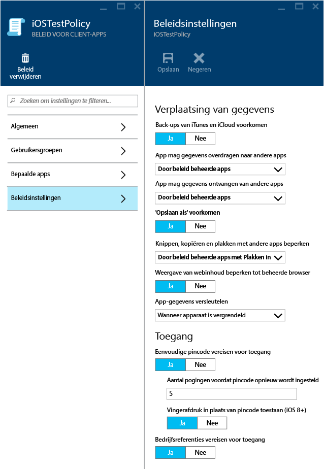

# Beleid voor Mobile App Management maken en implementeren met Microsoft Intune

[!INCLUDE[classic-portal](../includes/classic-portal.md)]

MAM-beleid (Mobile App Management-beleid) kan worden toegepast op apps die worden uitgevoerd op apparaten die al dan niet door Intune worden beheerd. Lees het onderwerp [App-gegevens beschermen met beleid voor het beheren van mobiele apps](protect-app-data-using-mobile-app-management-policies-with-microsoft-intune.md) voor een gedetailleerde beschrijving van de werking van MAM-beleid en de scenario's die door Intune MAM-beleid worden ondersteund.

In dit onderwerp wordt het proces van het maken van MAM-beleid in de **Azure-portal** beschreven. Azure Portal is de nieuwe beheerconsole voor het maken van MAM-beleid. U kunt het beste deze portal gebruiken om MAM-beleid te maken. Azure Portal ondersteunt de volgende MAM-scenario's:
- Apparaten die zijn ingeschreven in Intune.
- Apparaten die worden beheerd door een externe MDM-oplossing.
- Apparaten die niet worden beheerd door een MDM-oplossing (BYOD).

>[!IMPORTANT]
Houd rekening met het volgende als u momenteel de **Intune-beheerconsole** gebruikt om uw apparaten te beheren:

> * U kunt MAM-beleid maken dat ondersteuning biedt voor apps voor apparaten die zijn ingeschreven in Intune via de [Intune-beheerconsole](configure-and-deploy-mobile-application-management-policies-in-the-microsoft-intune-console.md).
> * MAM-beleid dat is gemaakt in de Intune-beheerconsole kan niet worden geïmporteerd in Azure Portal.  Het MAM-beleid moet opnieuw worden gemaakt in de Azure Portal.

> * Mogelijk ziet u in de Intune-beheerconsole niet alle MAM-beleidsinstellingen. De Azure-portal is de nieuwe beheerconsole voor het maken van MAM-beleid.

> * Voor het implementeren van beheerde apps moet u MAM-beleid maken in de Intune-beheerconsole. Het kan in dit geval verstandig zijn om MAM-beleid te maken in zowel de Intune-beheerconsole als de Azure-portal: in de Intune-beheerconsole om ervoor te zorgen dat u de mogelijkheid hebt om beheerde apps te implementeren en in de Azure-portal omdat dit de nieuwe beheerconsole is die alle instellingen voor MAM-beleid bevat.

> * Als u MAM-beleid maakt in zowel de Intune-beheerconsole als de Azure-portal, wordt het beleid dat in de Azure-portal is gemaakt, toegepast op de apps.

Voor een lijst met beleidsinstellingen die worden ondersteund voor het Android- en iOS-platform, selecteert u een van de volgende mogelijkheden:

> [!div class="op_single_selector"]
- [iOS-beleid](ios-mam-policy-settings.md)
- [Android-beleid](android-mam-policy-settings.md)

##  MAM-beleid maken
Controleer de [informatie over vereisten en ondersteuning](get-ready-to-configure-mobile-app-management-policies-with-microsoft-intune.md) voordat u MAM-beleid maakt.
1.  Kies **Intune Mobile Application Management &gt; Instellingen** om het tabblad **Instellingen** te openen.

    

    > [!TIP]
    > Als dit de eerste keer is dat u de Azure-portal gebruikt, lees dan eerst [Azure-portal voor Microsoft Intune MAM-beleid](azure-portal-for-microsoft-intune-mam-policies.md) om vertrouwd te raken met de portal.

2.  Kies op het tabblad **Instellingen** de optie **App-beleid**. Hiermee opent u het tabblad **App-beleid**, waar u nieuw beleid kunt maken en bestaande beleidsregels kunt bewerken. Kies **Een beleid toevoegen**.

    

3.  Geef een naam op voor het beleid, voeg een korte beschrijving toe en selecteer het platformtype om beleidsregels voor iOS of Android te maken. U kunt meer dan één beleid voor elk platform maken.

    

4.  Kies **Apps** om het tabblad **Apps** te openen, zodat er een lijst met beschikbare apps wordt weergegeven. U kunt een of meer apps in de lijst selecteren die u wilt koppelen aan het beleid dat u maakt. Nadat u de apps hebt geselecteerd, kiest u **Selecteren** onder aan het tabblad **Apps** om uw selectie op te slaan.

    > [!IMPORTANT]
    > U moet ten minste één app selecteren om een beleid maken.

5.  Op het tabblad **Een beleid toevoegen** kiest u **Vereiste instellingen configureren** om het tabblad Beleidsinstellingen te openen.

    Er zijn twee soorten beleidsinstellingen; **Herlocatie van gegevens** en **Toegang**.  Beleid voor herlocatie van gegevens is van toepassing op de verplaatsing van gegevens van en naar de apps, terwijl het toegangsbeleid bepaalt hoe de eindgebruiker in de context van zijn werk toegang tot de apps heeft.
    Om u op gang te hepen, hebben de beleidsinstellingen standaardwaarden. U hoeft niets te wijzigen als de standaardwaarden aan uw vereisten voldoen.

    > [!TIP]
    > Deze beleidsinstellingen worden alleen afgedwongen wanneer u apps in de context van het werk gebruikt.  Als de eindgebruiker de app voor een privétaak gebruikt, worden deze beleidsregels niet toegepast.

    

6.  Kies **OK** om deze configuratie op te slaan. U bent nu terug op het tabblad **Een beleid toevoegen** . Kies **Maken** om het beleid te maken en uw instellingen op te slaan.

    

Wanneer u klaar bent met het maken van een beleid, zoals beschreven in de vorige procedure, is het nog niet geïmplementeerd voor gebruikers. Zie de sectie Een beleid implementeren naar gebruikers hieronder voor het implementeren van een beleid.

> [!IMPORTANT]
> Als u met de Intune-beheerconsole een MAM-beleid voor een app maakt en met de Azure-portal een MAM-beleid maakt, heeft het beleid dat u met de Azure-portal hebt gemaakt, prioriteit. In de Intune- of Configuration Manager-console worden echter de beleidsinstellingen gerapporteerd die zijn gemaakt via de Intune-beheerconsole. Bijvoorbeeld:
>
> -   U hebt MAM-beleid in de Intune-beheerconsole gemaakt waarin het kopiëren vanuit een app wordt geblokkeerd.
> -   U hebt MAM-beleid in de Azure-console gemaakt waarin het kopiëren vanuit een app wordt toegestaan.
> -   U koppelt beide sets met beleidsregels aan dezelfde app.
> -   Het beleid dat u hebt gemaakt vanaf de Azure-console krijgt voorrang en kopiëren is toegestaan.
> -   De status en rapporten in de Intune-beheerconsole geven in dat geval echter ten onrechte aan dat kopiëren is geblokkeerd.

## Een beleid implementeren naar gebruikers

1.  Kies op het tabblad **Beleid** de optie **Gebruikersgroepen**, waarmee het tabblad **Gebruikersgroepen** wordt geopend. Kies **Gebruikersgroep toevoegen** op het tabblad **Gebruikersgroepen** om het tabblad **Gebruikersgroep toevoegen** te openen.

    

2.  Er wordt een lijst met gebruikersgroepen op het tabblad **gebruikersgroep toevoegen** weergegeven. Dit is een lijst met alle beveiligingsgroepen in uw **Azure Active Directory**. Selecteer de gebruikersgroepen waarop u dit beleid wilt toepassen en kies vervolgens **Selecteren**. Als u **Selecteren** kiest, wordt het beleid bij gebruikers geïmplementeerd.

    

    U hebt nu beleid gemaakt en het beleid geïmplementeerd naar gebruikers.

Het beleid is alleen van invloed op gebruikers aan wie [!INCLUDE[wit_nextref](../includes/wit_nextref_md.md)]-licenties zijn toegewezen. Gebruikers die zich in de geselecteerde beveiligingsgroep bevinden en aan wie geen [!INCLUDE[wit_nextref](../includes/wit_nextref_md.md)]-licentie is toegewezen, worden niet door het beleid beïnvloed.

>[!IMPORTANT]
> Als u Intune met Configuration Manager gebruik om uw iOS- en Android-apparaten te beheren, wordt het beleid alleen direct op gebruikers in de geselecteerde groep toegepast. Leden van de onderliggende groepen binnen de geselecteerde groep worden niet door het beleid beïnvloed.

Eindgebruikers kunnen de apps downloaden in de App Store of via Google Play. Zie voor meer informatie:
* [Wat u kunt verwachten wanneer uw Android-app wordt beheerd door MAM-beleid](user-experience-for-mam-enabled-android-apps-with-microsoft-intune.md)
* [Wat u kunt verwachten wanneer uw iOS-app wordt beheerd door MAM-beleid](user-experience-for-mam-enabled-ios-apps-with-microsoft-intune.md)

##  Bestaande beleidsregels wijzigen
U kunt een bestaand beleid bewerken en toepassen op de beoogde gebruikers. Wanneer u echter bestaand beleid wijzigt, worden de wijzigingen pas na 8 uur zichtbaar voor gebruikers die al bij de apps zijn aangemeld.

Om het effect van de wijzigingen onmiddellijk te zien, moet de eindgebruiker zich afmelden bij de app en zich daarna opnieuw aanmelden.

### De lijst met aan het beleid gekoppelde apps wijzigen

1.  Kies het beleid dat u wilt wijzigen, op het tabblad **App-beleid**. Hiermee opent u een tabblad dat specifiek is voor het beleid dat u zojuist hebt geselecteerd.

    

2.  Kies **Doel-apps** op het tabblad met het beleid om de lijst met apps te openen.

3.  Verwijder apps uit de lijst of voeg ze eraan toe en kies het pictogram **Opslaan** om uw wijzigingen op te slaan.

### De lijst met gebruikersgroepen wijzigen

1.  Kies het beleid dat u wilt wijzigen, op het tabblad **App-beleid**. Hiermee opent u het tabblad dat specifiek is voor het beleid dat u hebt geselecteerd.

2.  Kies **Gebruikersgroepen** op het tabblad met het beleid om het tabblad **Gebruikersgroep** te openen. Hierin wordt de lijst met huidige gebruikersgroepen weergegeven waarop dit beleid van toepassing is.

3.  Als u een nieuwe gebruikersgroep wilt toevoegen aan het beleid, kiest u **Gebruikersgroep toevoegen** en selecteert u de gebruikersgroep. Kies **Selecteren** om het beleid te implementeren bij de groep die u hebt geselecteerd.

    

4.  Als u een gebruikersgroep wilt verwijderen, selecteert u de gewenste gebruikersgroep. Kies vervolgens het beletselteken (…) en kies **Verwijderen** om de gebruikersgroep te verwijderen.

    

### Beleidsinstellingen wijzigen

1.  Kies het beleid dat u wilt wijzigen, op het tabblad **App-beleid**. Hiermee opent u een tabblad dat specifiek is voor het beleid dat u zojuist hebt geselecteerd.

    

2.  Kies **Beleidsinstellingen** om het tabblad **Beleidsinstellingen** te openen.

3.  Wijzig de instellingen en kies het pictogram **Opslaan** om uw wijzigingen op te slaan.

    

## Beleidsinstellingen
Selecteer een van de volgende mogelijkheden voor een volledig overzicht van de beleidsinstellingen voor iOS en Android:

> [!div class="op_single_selector"]
- [iOS-beleid](ios-mam-policy-settings.md)
- [Android-beleid](android-mam-policy-settings.md)

## Volgende stappen
[Compatibiliteit- en gebruikersstatus controleren](monitor-mobile-app-management-policies-with-microsoft-intune.md)

### Zie tevens
* [Wat u kunt verwachten wanneer uw Android-app wordt beheerd door MAM-beleid](user-experience-for-mam-enabled-android-apps-with-microsoft-intune.md)
* [Wat u kunt verwachten wanneer uw iOS-app wordt beheerd door MAM-beleid](user-experience-for-mam-enabled-ios-apps-with-microsoft-intune.md)

<!--HONumber=Dec16_HO3-->

