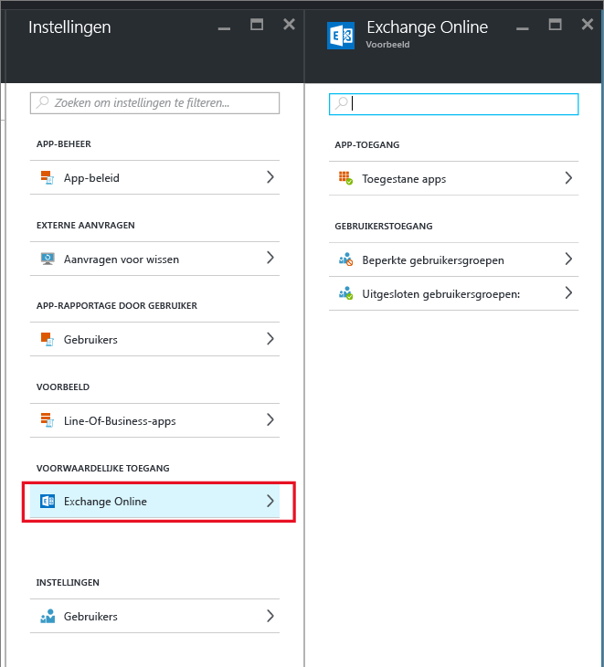
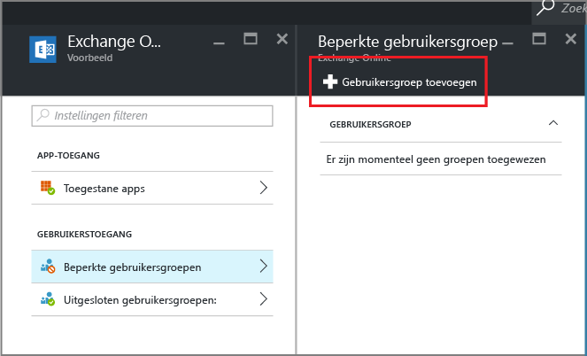

# Beleid voor voorwaardelijke toegang maken zodat alleen apps die worden ondersteund door MAM toegang hebben tot Exchange Online

[!INCLUDE[classic-portal](../includes/classic-portal.md)]

Dit onderwerp bevat stapsgewijze instructies over het instellen van voorwaardelijke toegang voor Exchange Online zodat alleen mobiele apps die ondersteuning bieden voor Intune MAM-beleidsregels (Mobile App Management).

## Beleid voor Exchange Online maken
1.  Meld u aan bij de [Azure-portal](https://portal.azure.com) waarin de functie voor app-toegang is opgenomen. Lees eerst het onderwerp [Azure-portal voor MAM-beleid](azure-portal-for-microsoft-intune-mam-policies.md) als u nog niet bekend met de Azure-portal.

2.  Kies **Bladeren > Intune > Intune mobile application management-blade > Instellingen**. Kies vervolgens in de sectie voor **voorwaardelijke toegang** de optie **Exchange Online**.

  

3.  Kies in de blade **Toegestane apps** de optie **Apps met ondersteuning voor Intune-beleid toestaan** als alleen apps met ondersteuning voor Intune MAM-beleid toegang mogen hebben tot Exchange Online. Wanneer u deze optie selecteert, wordt de lijst met ondersteunde apps weergegeven.

  >[!NOTE]
  >Alle Exchange Active Sync-e-mailclients, met inbegrip van de ingebouwde e-mailclients op iOS en Android die verbinding met Exchange Online maken, kunnen geen e-mail verzenden of ontvangen. In plaats daarvan ontvangen gebruikers één e-mailbericht dat ze de Outlook-e-mail-app moeten gebruiken. 
4.   Als u dit beleid wilt toepassen op gebruikers, opent u de blade **Beperkte gebruikersgroepen** en kiest u **Gebruikersgroep toevoegen**. Selecteer een of meer gebruikersgroepen waarop u dit beleid wilt toepassen.

  

5.  Mogelijk wilt u dat dit beleid niet wordt toegepast op bepaalde gebruikers in de gebruikersgroep die u in de vorige stap hebt geselecteerd. In dat geval voegt u die gebruikersgroepen toe aan de lijst met uitgesloten gebruikersgroepen. Kies in de blade **Exchange Online** de optie **Uitgesloten gebruikersgroepen**. Kies **Gebruikersgroep toevoegen** om de lijst met gebruikersgroepen te openen. Selecteer de groepen die u van dit beleid wilt uitsluiten.  

## Bestaand beleid wijzigen
### Gebruikersgroepen toevoegen of verwijderen

Als u **een gebruikersgroep wilt verwijderen** uit de lijst met **beperkte gebruikersgroepen**, opent u de blade **Beperkte gebruikersgroepen** en markeert u de gebruikersgroep die u wilt verwijderen. Klik vervolgens op het **beletselteken (...)** om de optie **Verwijderen** weer te geven. Kies **Verwijderen** om de gebruikersgroep uit de lijst te verwijderen. U kunt dezelfde procedure volgen als u een gebruikersgroep uit de lijst met **uitgesloten gebruikersgroepen** wilt verwijderen.

## Volgende stappen
[Apps die geen gebruik maken van moderne verificatie blokkeren](block-apps-with-no-modern-authentication.md)
### Zie tevens
[App-gegevens beveiligen met MAM-beleid](protect-app-data-using-mobile-app-management-policies-with-microsoft-intune.md)

<!--HONumber=Dec16_HO2-->

