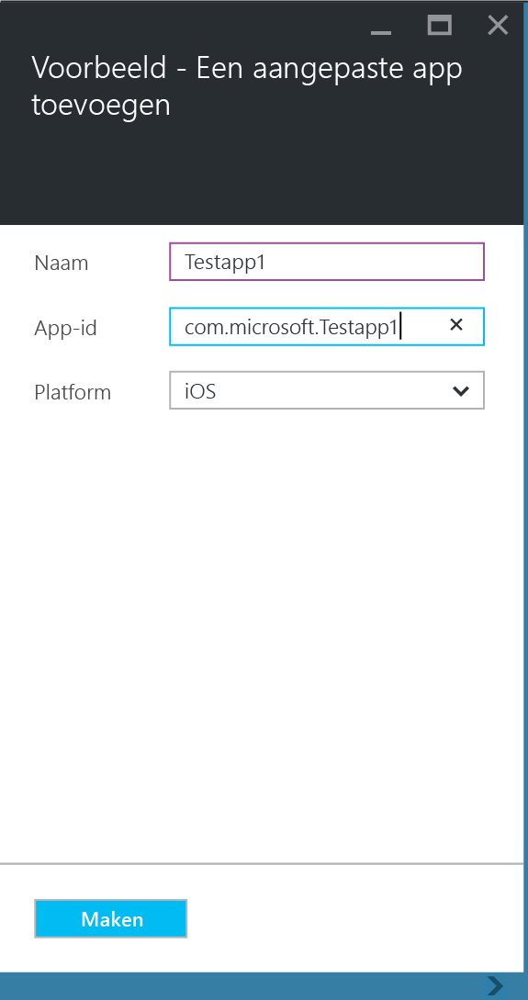
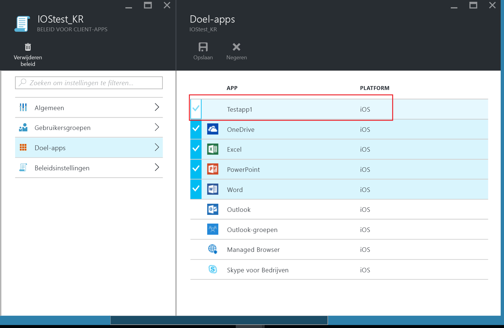

# Line-Of-Business-apps en -gegevens beveiligen op apparaten die niet zijn geregistreerd bij Microsoft Intune

MAM-beleid (Mobile Application Management) helpt bedrijfsgegevens beschermen door acties te beperken die kunnen leiden tot het lekken van bedrijfsgegevens en door het afdwingen van vereisten voor gegevenstoegang, zoals een app-pincode. Als u MAM-beleid wilt toepassen op iOS en Android Line-Of-Business-apps, moet u de app eerst inpakken met de Microsoft Intune App Wrapping Tool. App-wrapping is het proces waarbij een beheerlaag wordt toegepast op een mobiele app zonder dat de onderliggende toepassing hoeft te worden gewijzigd. Nadat de app is ingepakt, kunt u MAM-beleid op de app toepassen en deze distribueren naar uw gebruikers.  

In dit onderwerp wordt uitgelegd wat de vereiste stappen zijn om MAM-beleid toe te passen voor apps die worden geopend op **apparaten in eigendom van de werknemer die niet worden beheerd** en op apparaten die worden beheerd met een **MDM-oplossing (Mobile Device Management) van derden**.  Zie [Bepalen hoe u apps voorbereidt op Mobile Application Management met Microsoft Intune](decide-how-to-prepare-apps-for-mobile-application-management-with-microsoft-intune.md) om uw Line-Of-Business-apps voor te bereiden die worden uitgevoerd op **apparaten die zijn geregistreerd bij Intune MDM**.

##  Stap 1: De app voorbereiden

Voordat u MAM-beleidsregels op een app kunt toepassen, moet u de app eerst inpakken met de Microsoft Intune App Wrapping Tool voor [iOS](prepare-ios-apps-for-mobile-application-management-with-the-microsoft-intune-app-wrapping-tool) en [Android](prepare-android-apps-for-mobile-application-management-with-the-microsoft-intune-app-wrapping-tool) of de [Intune App SDK](/../develop/intune-app-sdk) gebruiken om handmatig de beveiligingsfuncties voor Intune-apps te integreren.

Zie [Bepalen hoe u apps voorbereidt op Mobile Application Management met Microsoft Intune](decide-how-to-prepare-apps-for-mobile-application-management-with-microsoft-intune)voor meer informatie over het gebruik van de App Wrapping Tool versus de Intune App SDK.

## Stap 2: De app toevoegen

Als u de Line-Of-Business-app wilt koppelen aan MAM-beleid, voert u de volgende stappen uit om de app-gegevens toe te voegen aan uw Intune-abonnement/tenant:

1. Ga in [Azure Portal](https://portal.azure.com/) naar **Intune M6obile Application Management** > **Instellingen** en kies **Line-of-business-apps**.

  

2. Kies op de blade **Line-Of-Business-apps** de optie **Een aangepaste app toevoegen**.

  
3.  Geef een naam voor de app op, geef in het veld App-id de bundel-id op en geef het platform (iOS of Android) op.

  

  Deze stap helpt bij het maken van een unieke vermelding van uw app. De app wordt ook weergegeven in de lijst met doel-apps voor een MAM-beleid voor uw tenant, zoals staat beschreven in de volgende stap.

## Stap 3: MAM-beleid toepassen
Nadat de metagegevens van de app zijn geüpload naar de service, wordt de app weergegeven in de lijst met apps. U kunt nu [een nieuw beleid of een bestaand beleid maken of een bestaand beleid gebruiken](create-and-deploy-mobile-app-management-policies-with-microsoft-intune.md) en dit toepassen op de Line-Of-Business-app die u hebt toegevoegd in stap 2.

>[!IMPORTANT]
>U moet het MAM-beleid toepassen op de gebruikers die de ingepakte app gaan gebruiken.  Gebruikers waarvoor dit beleid niet wordt geïmplementeerd, kunnen deze app niet gebruiken.

  
## Stap 4: De app distribueren
U kunt apps op de volgende manieren implementeren voor uw gebruikers:
* Voor apparaten die zijn geregistreerd bij een MDM-oplossing van derden, kunt u de apps distribueren via uw MDM-oplossing.
* Voor apparaten die niet worden beheerd door een MDM-oplossing, hebt u een aangepaste oplossing nodig. Gebruikers moeten de app downloaden en installeren op hun apparaat.

## De metagegevens wijzigen
Als u de app-gegevens, zoals de naam van de app of de bundel-id, moet wijzigen, moet u [de app verwijderen](#remove-apps) en [toevoegen](#step-2-add-the-app) met de nieuwe metagegevens.

##  Apps verwijderen
U kunt een Line-Of-Business-app verwijderen uit de lijst met apps. Hiermee wordt de app verwijderd uit de lijst en wordt de koppeling met het MAM-beleid verbroken. De app wordt echter niet van het apparaat van de gebruiker verwijderd.  

1.  Ga in [Azure portal](https://portal.azure.com/) naar **Intune Mobile App Management** > **Instellingen**. Kies op de blade **Instellingen** de optie **Line-Of-Business** om de lijst met bestaande apps te openen.  
2.  Kies de app die u wilt verwijderen en kies het **(…) contextmenu**.

  
3.  Kies **Toepassing verwijderen** om de app te verwijderen.

  

  Hiermee worden alle apps uit de lijst met Line-Of-Business-apps en de doellijst met apps in het MAM-beleid verwijderd.

<!--HONumber=Nov16_HO5-->

