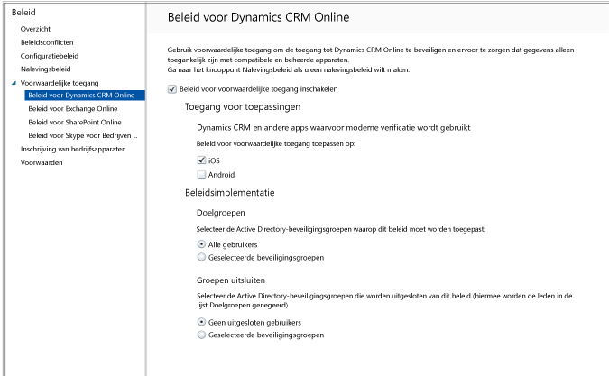

# Toegang tot Dynamics CRM Online beperken met Intune
U kunt de toegang tot Microsoft Dynamics CRM Online beheren vanaf iOS- en Android-apparaten door gebruik te maken van de voorwaardelijke toegang van Microsoft Intune.  De voorwaardelijke toegang van Intune bestaat uit twee onderdelen:
* Een [nalevingsbeleid voor apparaten](introduction-to-device-compliance-policies-in-microsoft-intune.md) waaraan het apparaat moet voldoen om te worden beschouwd als een apparaat dat het beleid naleeft.
* Een [beleid voor voorwaardelijke toegang](restrict-access-to-email-and-o365-services-with-microsoft-intune.md) waarin u de voorwaarden opgeeft waaraan het apparaat moet voldoen om toegang tot de service te krijgen.

Zie het artikel [De toegang tot e-mail, O365 en andere services beperken](restrict-access-to-email-and-o365-services-with-microsoft-intune.md) voor meer informatie over hoe voorwaardelijke toegang werkt.

> [!IMPORTANT]
> Als u voorwaardelijke toegang wilt implementeren, moet u abonnementen hebben voor Intune en Azure Active Directory Premium en moeten gebruikers over een licentie voor beide producten beschikken. Het **Enterprise Mobility + Security-abonnement** omvat zowel een abonnement op Intune als op Azure Active Directory Premium. Zie de [Enterprise Mobility-pagina met prijzen](https://www.microsoft.com/en-us/cloud-platform/enterprise-mobility-pricing) voor meer informatie. Als u geen abonnement hebt op EMS, kunt u een abonnement nemen op Azure Active Directory Premium. Zie de [Azure Active Directory-pagina met prijzen](https://azure.microsoft.com/en-us/pricing/details/active-directory/) voor meer informatie.

Wanneer een gebruiker in de doelgroep de app Dynamics CRM op zijn apparaat probeert te gebruiken, wordt de volgende evaluatie uitgevoerd:

Het apparaat waarvoor toegang tot Dynamics CRM Online nodig is, moet aan de volgende criteria voldoen:
* Het apparaat moet een**Android**- of **iOS**-apparaat zijn.
* Het apparaat moet zijn **geregistreerd** bij Intune.
* Het apparaat moet **voldoen** aan het geïmplementeerde Intune-nalevingsbeleid.

De apparaatstatus wordt opgeslagen in Azure Active Directory, waarmee toegang wordt verleend of geblokkeerd op basis van de voorwaarden die u opgeeft.

Als niet aan een voorwaarde wordt voldaan, krijgt de gebruiker een van de volgende berichten te zien tijdens het aanmelden:
* Als het apparaat niet is geregistreerd bij Intune of Azure Active Directory, wordt een bericht weergegeven met instructies over het installeren van de bedrijfsportal-app en het registreren.
* Als het apparaat niet aan het beleid voldoet, wordt er een bericht weergegeven waarin de gebruiker naar de website van de Microsoft Intune-bedrijfsportal of de bedrijfsportal-app wordt geleid, waar informatie te vinden is over het probleem en hoe dit kan worden opgelost.

## Beleid voor voorwaardelijke toegang voor Dynamics CRM Online  
### Stap 1: Active Directory-beveiligingsgroepen configureren

Voordat u begint, moet u Azure Active Directory-beveiligingsgroepen configureren voor het beleid voor voorwaardelijke toegang. U kunt deze groepen configureren in het **Office 365-beheercentrum**. U gebruikt deze groepen om gebruikers op te nemen in of uit te sluiten van het beleid. Wanneer een gebruiker deel uitmaakt van de doelgroep voor het beleid, moet elk apparaat dat hij of zij gebruikt, aan het beleid voldoen om toegang te krijgen tot bronnen.

U kunt twee soorten groepen opgeven die u voor het beleid voor Dynamics CRM kunt gebruiken:
* **Doelgroepen**. Bevat groepen gebruikers waarop het beleid van toepassing is.
* **Uitgesloten groepen**. Bevat groepen gebruikers waarop het beleid niet van toepassing is.

Als een gebruiker zich in beide groepen bevindt, wordt het beleid niet op de gebruiker toegepast.

### Stap 2: Nalevingsbeleid configureren en implementeren
[Maak](create-a-device-compliance-policy-in-microsoft-intune.md) een nalevingsbeleid [en implementeer](deploy-and-monitor-a-device-compliance-policy-in-microsoft-intune.md) dit op alle apparaten die door het beleid worden beïnvloed. Dit zijn alle apparaten die door de gebruikers in de doelgroepen worden gebruikt.

> [!NOTE]
> Terwijl nalevingsbeleid wordt geïmplementeerd voor Intune-groepen, is beleid voor voorwaardelijke toegang gericht op Azure Active Directory-beveiligingsgroepen.

> [!IMPORTANT]
> Als u geen nalevingsbeleid hebt geïmplementeerd, worden de apparaten beschouwd als apparaten die het beleid naleven.

Wanneer u klaar bent, gaat u door naar Stap 3.
### Stap 3: het Dynamics CRM-beleid configureren
Configureer vervolgens het beleid om ervoor te zorgen dat alleen beheerde apparaten en apparaten die aan het beleid voldoen toegang hebben tot Dynamics CRM. Dit beleid wordt opgeslagen in Azure Active Directory.

1.  Kies in de Intune-beheerconsole achtereenvolgens **Beleid > Voorwaardelijke toegang > Beleid voor Dynamics CRM Online**.

  

2.  Kies het beleid **Voorwaardelijke toegang inschakelen**.
3.  Onder **Toegang voor toepassingen**kunt u beleid voor voorwaardelijke toegang toepassen:
  * **iOS**
  * **Android**
4.  Selecteer bij **Doelgroepen** de optie **Wijzigen** om de Active Directory-beveiligingsgroepen te selecteren waarop het beleid van toepassing moet zijn. U kunt ervoor kiezen dit op alle gebruikers of alleen op een bepaalde groep gebruikers toe te passen.
5.  Selecteer desgewenst onder **Uitgesloten groepen** de optie **Wijzigen** om de Active Directory-beveiligingsgroepen te selecteren waarop dit beleid niet van toepassing is.
6.  Als u klaar bent, kiest u **Opslaan**.

U hebt nu voorwaardelijke toegang voor Dynamics CRM geconfigureerd. U hoeft het beleid voor voorwaardelijke toegang niet te implementeren. Het wordt direct van kracht.
##  De compatibiliteit en het beleid voor voorwaardelijke toegang bewaken

In de werkruimte **Groepen** kunt u de status voor voorwaardelijke toegang van uw apparaten bekijken.

Kies een groep mobiele apparaten en kies op het tabblad **Apparaten** een van de volgende **filters**:
* **Apparaten die niet zijn geregistreerd bij AAD**. Deze apparaten zijn geblokkeerd voor Dynamics CRM.
* **Apparaten die niet voldoen aan het beleid**. Deze apparaten zijn geblokkeerd voor Dynamics CRM.
* **Apparaten die zijn geregistreerd bij AAD en die voldoen aan het beleid**. Deze apparaten hebben toegang tot Dynamics CRM.

##  Volgende stappen
* [Toegang tot Exchange Online beperken](restrict-access-to-exchange-online-with-microsoft-intune.md)

* [Toegang tot Exchange On-Premises beperken](restrict-access-to-exchange-onpremises-with-microsoft-intune.md)
* [Toegang tot SharePoint Online beperken](restrict-access-to-sharepoint-online-with-microsoft-intune.md)

* [Toegang tot Skype voor Bedrijven Online beperken](restrict-access-to-skype-for-business-online-with-microsoft-intune.md)

<!--HONumber=Dec16_HO2-->

