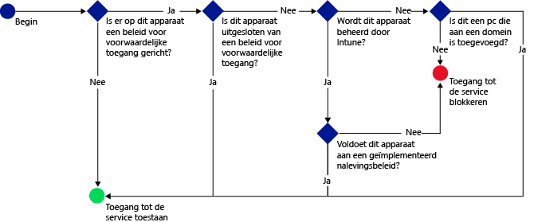

# De toegang tot e-mail, Office 365-services en andere services beperken met Microsoft Intune
U kunt de toegang tot uw bedrijfs-e-mail en Office 365-services beperken met voorwaardelijke toegang van Intune. Met de voorwaardelijke toegang van Intune kunt ervoor te zorgen dat de toegang tot uw bedrijfs-e-mail en Office 365-services wordt beperkt tot apparaten die de door u ingestelde regels naleven.
## Hoe werkt voorwaardelijke toegang?
U kunt de instellingen voor nalevingsbeleid gebruiken om te evalueren in hoeverre het apparaat aan het beleid voldoet. Deze evaluatie wordt vervolgens gebruikt voor een beleid voor voorwaardelijke toegang om de toegang tot een specifieke service te beperken of toe te staan. Wanneer u een beleid voor voorwaardelijke toegang gebruikt in combinatie met een nalevingsbeleid, is de service alleen toegankelijk voor apparaten die voldoen aan het beleid. Het nalevingsbeleid en het beleid voor voorwaardelijke toegang worden op de gebruiker toegepast. Een apparaat dat de gebruiker gebruikt voor toegang tot de services wordt gecontroleerd op naleving van het beleid.

Houd er rekening mee dat er nalevingsbeleid moet worden geïmplementeerd voor de gebruiker van het apparaat, zodat de naleving door het apparaat kan worden geëvalueerd.
Als er geen nalevingsbeleid wordt geïmplementeerd voor de gebruiker, wordt het apparaat beschouwd als een apparaat dat voldoet aan het beleid en worden er geen toegangsbeperkingen toegepast.

Wanneer apparaten niet voldoen aan de voorwaarden die in de beleidsregels zijn ingesteld, wordt de eindgebruiker door de registratieprocedure voor het apparaat geleid en ook door de procedure voor het verhelpen van het probleem dat naleving door het apparaat verhindert.

Een kenmerkend proces voor voorwaardelijke toegang:

## Voorwaardelijke toegang configureren
Gebruik voorwaardelijke toegang om de toegang tot Microsoft **Exchange On-Premises**, **Exchange Online**, **Exchange Online Dedicated**, **SharePoint Online** en **Skype voor Bedrijven Online** te beheren.

Configureer nalevingsbeleid voor apparaten en beleid voor voorwaardelijke toegang als u voorwaardelijke toegang wilt instellen.

Het nalevingsbeleid omvat instellingen zoals een wachtwoordcode, versleuteling en instructies voor als het apparaat is gekraakt. Het apparaat moet voldoen aan deze regels om te worden beschouwd als een apparaat dat het beleid naleeft.

U kunt beleid voor voorwaardelijke toegang instellen om toegang te beperken op basis van:
- De nalevingsstatus van het apparaat.
- Het platform dat op het apparaat wordt uitgevoerd.
- Het type apps dat wordt gebruikt voor toegang tot de services.

In tegenstelling tot andere Intune-beleidsregels implementeert u geen beleidsregels voor voorwaardelijke toegang. Nadat u het beleid hebt geconfigureerd en de gebruikers hebt geselecteerd op wie het beleid moet worden toegepast, wordt in plaats daarvan het beleid op alle bedoelde gebruikers toegepast. Wanneer een gebruiker deel uitmaakt van de doelgroep voor het beleid, moet elk apparaat waarmee deze gebruiker werkt, aan het beleid voldoen om toegang te krijgen tot resources.

## Volgende stappen
1. [Meer informatie over het nalevingsbeleid voor apparaten en hoe het werkt](introduction-to-device-compliance-policies-in-microsoft-intune.md).

2. [Een nalevingsbeleid maken](create-a-device-compliance-policy-in-microsoft-intune.md).

2.  Maak beleid voor voorwaardelijke toegang voor een van de volgende producten:
> [!div class="op_single_selector"]
  - [Maak beleid voor voorwaardelijke toegang voor Exchange Online](restrict-access-to-exchange-online-with-microsoft-intune.md)
  - [Maak beleid voor voorwaardelijke toegang voor Exchange On-premises](restrict-access-to-exchange-onpremises-with-microsoft-intune.md)
  - [Maak beleid voor voorwaardelijke toegang voor Exchange Online Dedicated](restrict-access-to-exchange-online-with-microsoft-intune.md)
  - [Maak beleid voor voorwaardelijke toegang voor oudere versies van Exchange Online Dedicated](restrict-access-to-exchange-onpremises-with-microsoft-intune.md)
  - [Beleid voor voorwaardelijke toegang maken voor SharePoint Online](restrict-access-to-sharepoint-online-with-microsoft-intune.md)
  - [Beleid voor voorwaardelijke toegang maken voor Skype voor Bedrijven Online](restrict-access-to-skype-for-business-online-with-microsoft-intune.md)
  - [Beleid voor voorwaardelijke toegang maken voor Dynamics CRM Online](restrict-access-to-dynamics-crm-online-with-microsoft-intune.md)

<!--HONumber=Dec16_HO2-->

