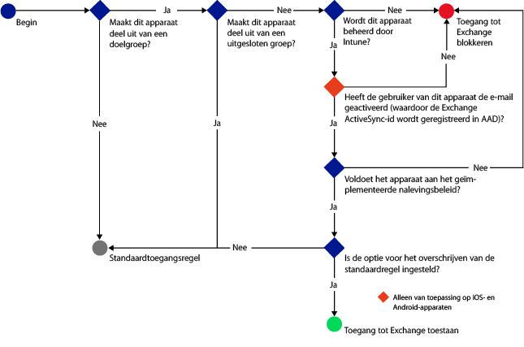
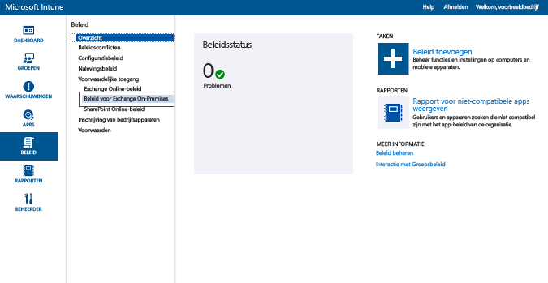
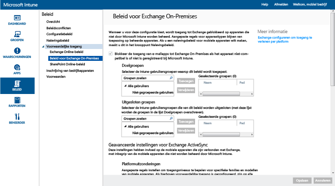

# Toegang tot e-mail beperken op Exchange On-premises en oudere Exchange Online Dedicated met Microsoft Intune

> [!NOTE]
> Als u een Exchange Online Dedicated-omgeving hebt en wilt weten of deze de nieuwe of oudere configuratie heeft, neemt u contact op met uw accountmanager.

Als u de toegang tot e-mail op Exchange On-premises of de oude Exchange Online-specifieke omgeving wilt beheren, kunt u beleid voor voorwaardelijke toegang tot Exchange On-premises configureren met behulp van Microsoft Intune.
Zie het artikel [De toegang tot e-mail en O365-service beperken]( restrict-access-to-email-and-o365-services-with-microsoft-intune.md) voor meer informatie over hoe voorwaardelijke toegang werkt.

Controleer het volgende **voordat** u voorwaardelijke toegang configureert:

-   Uw versie van Exchange moet **Exchange 2010 of hoger** zijn. De CAS-matrices (Client Access Server) voor Exchange-servers worden ondersteund.

-   U moet de **Exchange On-premises-connector** gebruiken die [!INCLUDE[wit_nextref](../includes/wit_nextref_md.md)] koppelt aan Exchange On-premises. Hiermee kunt u apparaten beheren via de [!INCLUDE[wit_nextref](../includes/wit_nextref_md.md)]-console. Zie [Intune On-premises Exchange-connector](intune-on-premises-exchange-connector.md) voor meer informatie over de connector.

    -   De Exchange On-premises-connector die u in de Intune-console vindt, is uitsluitend bestemd voor uw Intune-tenant en kan niet worden gebruikt met een andere tenant. Het is bovendien raadzaam de Exchange-connector voor uw tenant **op slechts één machine** te installeren.

        U kunt de connector downloaden vanuit de Intune-beheerconsole. Zie [On-premises Exchange-connector configureren voor on-premises of gehoste Exchange](intune-on-premises-exchange-connector.md) voor een overzicht over het configureren van de on-premises Exchange-connector.

    -   U kunt de connector op elke machine installeren, zolang die machine kan communiceren met de Exchange-server.

    -   De connector ondersteunt de **Exchange CAS-omgeving**. U kunt desgewenst de connector technisch gezien rechtstreeks installeren op de Exchange CAS-server. We raden dat echter niet aan omdat daardoor de belasting van de server toeneemt. Wanneer u de connector configureert, moet u deze zodanig instellen dat deze communiceert met een van de Exchange CAS-servers.

-   U moet **Exchange ActiveSync** configureren met verificatie op basis van certificaten of invoer van gebruikersreferenties.

Wanneer u beleid voor voorwaardelijke toegang configureert en dat toepast op een gebruiker, moet het volgende met het **apparaat** zijn gedaan voordat een gebruiker verbinding kan maken met diens e-mail:

-  Het apparaat moet een pc zijn die lid is van een domein of **geregistreerd ** zijn bij [!INCLUDE[wit_nextref](../includes/wit_nextref_md.md)].

-  Het apparaat moet zijn **geregistreerd bij Azure Active Directory**. Bovendien moet de client-id van Exchange ActiveSync zijn geregistreerd bij Azure Active Directory.

  De Azure Active Directory Device Registration Service wordt automatisch geactiveerd voor Intune- en Office 365-klanten. Klanten die de ADFS Device Registration Service al hebben geïmplementeerd, zien geen geregistreerde apparaten in on-premises Active Directory. **Dit geldt niet voor Windows-pc's en Windows Phone-apparaten**.

-   **Voldoen** aan [!INCLUDE[wit_nextref](../includes/wit_nextref_md.md)]-nalevingsbeleid dat op dat apparaat is geïmplementeerd.

Het volgende diagram illustreert de werkstroom die door het beleid voor voorwaardelijke toegang voor Exchange On-premises wordt gebruikt om te bepalen of apparaten moeten worden geblokkeerd of toegestaan.

Als niet aan een beleidsregel voor voorwaardelijke toegang wordt voldaan, krijgt de gebruiker een van de volgende berichten te zien tijdens het aanmelden:

- Als het apparaat niet is ingeschreven bij [!INCLUDE[wit_nextref](../includes/wit_nextref_md.md)] of niet is geregistreerd bij Azure Active Directory, wordt er een bericht weergegeven met instructies over hoe de bedrijfsportal-app moet worden geïnstalleerd, het apparaat moet worden ingeschreven en e-mail moet worden geactiveerd. Dit proces zorgt er ook voor dat de Exchange ActiveSync-id van het apparaat wordt gekoppeld aan het apparaatrecord in Azure Active Directory.

-   Als het apparaat niet aan het beleid voldoet, wordt er een bericht weergegeven dat de eindgebruiker omleidt naar de website of app van de [!INCLUDE[wit_nextref](../includes/wit_nextref_md.md)]-bedrijfsportal. Hier vindt de gebruiker informatie over het probleem en aanwijzingen om dit op te lossen.

## Ondersteuning voor mobiele apparaten
Het volgende wordt ondersteund:
-   Windows Phone 8.1 en hoger.

-   De systeemeigen e-mail-app voor iOS.

-   Exchange ActiveSync-mailclients zoals Gmail op Android 4 of hoger.
- Exchange ActiveSync-mailclients op **Android for Work-apparaten:** alleen de apps **Gmail** en **Nine Work** in het **werkprofiel** worden ondersteund op Android for Work-apparaten. Voorwaardelijke toegang werkt alleen in combinatie met Android for Work als u een e-mailprofiel voor de app Gmail of Nine Work implementeert en die apps ook implementeert als verplicht te installeren apps. 

[!INCLUDE[wit_nextref](../includes/afw_rollout_disclaimer.md)]

> [!NOTE]
> De Microsoft Outlook-app voor Android en iOS wordt niet ondersteund.

## Ondersteuning voor pc's
Het volgende wordt ondersteund:
-   De **Mail**-toepassing voor Windows 8.1 en hoger (wanneer de pc is geregistreerd bij [!INCLUDE[wit_nextref](../includes/wit_nextref_md.md)]).

##  Beleid voor voorwaardelijke toegang configureren

1.  Kies in de [Microsoft Intune-beheerconsole](https://manage.microsoft.com) achtereenvolgens **Beleid** > **Voorwaardelijke toegang** > **Beleid voor Exchange On-premises**.

2.  Configureer het beleid met de gewenste instellingen: 

  - **De toegang tot Exchange On-premises blokkeren voor e‑mail-apps indien het apparaat niet voldoet aan het beleid of niet is ingeschreven voor Microsoft Intune:** wanneer u deze optie selecteert, worden apparaten geblokkeerd die niet worden beheerd door [!INCLUDE[wit_nextref](../includes/wit_nextref_md.md)] of niet voldoen aan het nalevingsbeleid van Exchange-services.

  - **Standaardregel negeren - Ingeschreven en compatibele apparaten altijd toegang geven tot Exchange:** als u deze optie selecteert, hebben apparaten die zijn geregistreerd bij Intune en die voldoen aan het nalevingsbeleid, toegang tot Exchange.
  Met deze regel wordt de **Standaardregel** genegeerd. Dit houdt in dat ingeschreven apparaten die voldoen aan het beleid, nog steeds toegang kunnen krijgen tot Exchange, zelfs als u de **Standaardregel** instelt op het in quarantaine plaatsen van het apparaat of op het blokkeren van toegang.

  - **Doelgroepen:** selecteer de [!INCLUDE[wit_nextref](../includes/wit_nextref_md.md)]-gebruikersgroepen die hun apparaat moeten inschrijven bij [!INCLUDE[wit_nextref](../includes/wit_nextref_md.md)] voordat ze toegang kunnen krijgen tot Exchange.

  - **Uitgesloten groepen:** selecteer de [!INCLUDE[wit_nextref](../includes/wit_nextref_md.md)]-gebruikersgroepen die zijn uitgesloten van het beleid voor voorwaardelijke toegang. Gebruikers in deze lijst zijn uitgesloten, zelfs als ze ook in de lijst **Doelgroepen** staan.

  - **Platformuitzonderingen:** kies **Regel toevoegen** om een regel te configureren waarin de toegangsniveaus voor bepaalde mobiele-apparaatreeksen en -modellen worden gedefinieerd. Omdat deze apparaten van elk mogelijk type kunnen zijn, kunt u ook apparaattypen configureren die niet worden ondersteund door [!INCLUDE[wit_nextref](../includes/wit_nextref_md.md)].

  - **Standaardregel:** als er apparaten zijn die niet onder de andere regels vallen, kunt u zelf kiezen of deze toegang krijgen tot Exchange, worden geblokkeerd of in quarantaine worden geplaatst. Wanneer u de regel instelt op het toestaan van toegang, wordt e-mailtoegang automatisch verleend aan iOS-, Windows- en Samsung KNOX-apparaten wanneer deze zijn ingeschreven en voldoen aan het beleid. De gebruiker hoeft geen procedure te doorlopen om de e-mail op te halen.

        Op Android-apparaten die niet werken op Samsung KNOX, krijgen gebruikers een quarantaine-e-mail met aanwijzingen voor de verificatie van de inschrijving en de naleving van het beleid voordat ze toegang krijgen tot e-mail. Als u de regel zo instelt dat de toegang wordt geblokkeerd of dat apparaten in quarantaine worden geplaatst, wordt de toegang tot Exchange voor alle apparaten geblokkeerd, ongeacht of deze al zijn ingeschreven in Intune of niet. Als u wilt voorkomen dat de regel betrekking heeft op apparaten die zijn ingeschreven en voldoen aan het beleid, schakelt u het vakje **Standaardregel negeren** in.
>[!TIP]
>Als het uw bedoeling is om eerst alle apparaten te blokkeren voordat u toegang verleent tot e-mail, kiest u de regel Toegang blokkeren of de quarantaineregel. De standaardregel geldt voor alle apparaattypen. Apparaattypen die u als platformuitzondering opgeeft en die niet worden ondersteund door [!INCLUDE[wit_nextref](../includes/wit_nextref_md.md)], vallen hier dus ook onder.

  - **Gebruikersmelding:** naast de meldings-e-mail die Exchange verzendt, verstuurt Intune ook een e-mail waarin wordt beschreven hoe de blokkering van het apparaat kan worden opgeheven. U kunt het standaardbericht aanpassen aan uw behoeften. In het geval dat het apparaat van de gebruiker wordt geblokkeerd voordat de Intune-meldings-e-mail met herstelinstructies wordt bezorgd in het Exchange-postvak van de gebruiker, kan de gebruiker ook een niet-geblokkeerd apparaat of een andere methode gebruiken om Exchange te openen en het bericht weer te geven.

        This is especially true when the **Default Rule** is set to block or quarantine. In this case, the user has to go to their app store, download the Microsoft Company Portal app, and enroll their device. This is applicable to iOS, Windows, and Samsung KNOX devices. For devices that don't run Samsung KNOX, you need to send the quarantine email to an alternate email account. The user has to copy the email to their blocked device to complete the enrollment and compliance process.
  > [!NOTE]
  > Als u ervoor wilt zorgen dat Exchange de e-mailmelding kan verzenden, moet u het account opgeven dat wordt gebruikt om de e-mailmelding te verzenden.
  >
  > Zie [Exchange On-premises-connector configureren voor on-premises of gehoste Exchange](intune-on-premises-exchange-connector.md) voor meer informatie.

3.  Als u klaar bent, kiest u **Opslaan**.

-   U hoeft het beleid voor voorwaardelijke toegang niet te implementeren. Het wordt direct van kracht.

-   Wanneer een gebruiker een Exchange ActiveSync-profiel heeft ingesteld, kan het één tot drie uur duren voordat het apparaat is geblokkeerd (als het niet wordt beheerd door [!INCLUDE[wit_nextref](../includes/wit_nextref_md.md)]).

-   Als een geblokkeerde gebruiker vervolgens het apparaat inschrijft bij [!INCLUDE[wit_nextref](../includes/wit_nextref_md.md)] (en niet-naleving oplost), krijgt deze binnen twee minuten toegang tot e-mail.

-   Als de gebruiker de inschrijving van het apparaat verwijdert uit [!INCLUDE[wit_nextref](../includes/wit_nextref_md.md)], kan het één tot drie uur duren voordat de toegang tot e-mail wordt geblokkeerd.

**Raadpleeg [Voorbeeldscenario's voor het beperken van toegang tot e-mail](restrict-email-access-example-scenarios.md) voor enkele scenario's met voorbeelden van het configureren van beleid voor voorwaardelijke toegang om de toegang van apparaten te beperken.**

## Volgende stappen
-   [Toegang tot SharePoint Online beperken](restrict-access-to-sharepoint-online-with-microsoft-intune.md)

-   [Toegang tot Skype voor Bedrijven Online beperken](restrict-access-to-skype-for-business-online-with-microsoft-intune.md)

<!--HONumber=Dec16_HO2-->

