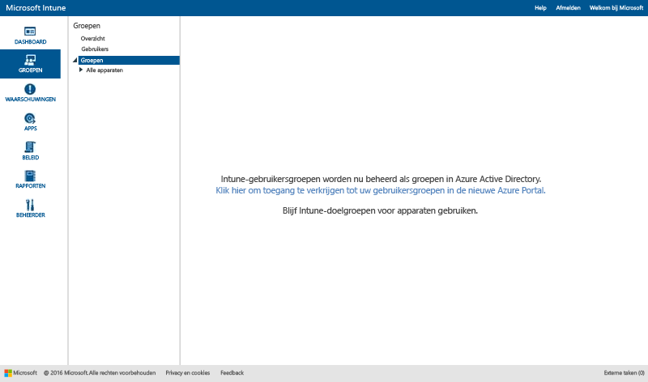
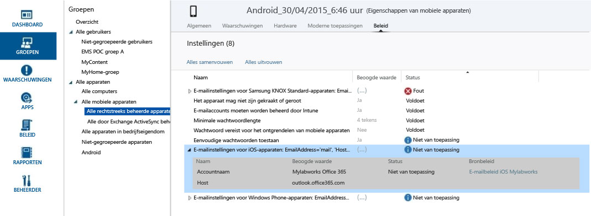

# Groepen gebruiken om gebruikers en apparaten te beheren in Microsoft Intune

[!INCLUDE[classic-portal](../includes/classic-portal.md)]

In dit onderwerp wordt beschreven hoe u groepen maakt in Intune. Het onderwerp bevat ook informatie over hoe het beheer van groepen de komende maanden gaat veranderen. 

>[!IMPORTANT]
>
>Als u de werkruimte Groepen opent in de Intune-portal en een koppeling naar de portal van Azure Active Directory (Azure AD) ziet staan, maakt u gebruik van de *nieuwe* Azure AD-beveiligingsgroepen voor groepsbeheer in Intune. Dit wordt beschreven in [Groepen migreren naar Azure Active Directory](migrating-groups-to-azure-active-directory.md). Klik op de koppeling naar de Azure AD-portal om uw groepen te maken en beheren.
>
> 
>
>Als de koppeling naar de Azure AD-portal niet wordt weergegeven, gebruikt u nog steeds de *huidige* methode voor groepsbeheer. Deze wordt beschreven in het onderwerp [Groepen maken om gebruikers en apparaten te beheren met Microsoft Intune](#Create-groups-to-manage-users-and-devices-with-Microsoft-Intune).

In dit onderwerp wordt beschreven hoe u Intune-groepen maakt in de Intune-beheerconsole.

U kunt groepen maken en beheren in de werkruimte **Groepen** van de Microsoft Intune-beheerconsole. Op de pagina **Overzicht van groepen** staan statusoverzichten die u kunnen helpen bij het identificeren en prioriteren van problemen die uw aandacht nodig hebben. Statusoverzichten bestaan uit de volgende gebieden:

-   Waarschuwingen
-   Software-updates
-   Endpoint Protection
-   Beleid
-   Softwarebeheer

Uw groepshiërarchie wordt ook weergegeven met statusoverzichten om u te helpen bij het identificeren en oplossen van problemen voor leden van een geselecteerde groep.

## Groepen maken

> [!TIP]
> Denk bij het maken van groepen goed na over hoe u beleid toepast. U kunt bijvoorbeeld beleidsregels gebruiken die specifiek zijn voor besturingssystemen van apparaten en beleidsregels die specifiek zijn voor verschillende rollen in uw organisatie of voor organisatie-eenheden die u al hebt opgegeven in Active Directory. Het kan nuttig zijn om aparte apparaatgroepen voor iOS, Android en Windows en gebruikersgroepen voor elke organisatierol te hebben.
>
> U wilt waarschijnlijk ook een standaardbeleid maken dat van toepassing is op alle groepen en apparaten, om de basisvereisten voor naleving binnen uw organisatie vast te leggen. Vervolgens kunt u een specifieker beleid maken voor de meest uiteenlopende categorieën gebruikers en apparaten. U kunt bijvoorbeeld een e-mailbeleid maken voor elk apparaatbesturingssysteem.
>
> Kies de naam voor elk beleid zorgvuldig, zodat u het beleid later eenvoudig kunt herkennen. Een goede beschrijvende beleidsnaam is bijvoorbeeld **WP-e-mailbeleid voor het hele bedrijf**.
>
> U wilt uw gebruikers natuurlijk over elk nieuw restrictief beleid informeren. Besteed daarom na het maken van algemene groepen extra aandacht aan hoe u kleinere groepen indeelt, om de communicatie te beperken.

## Een apparaatgroep maken

1.  Kies in de Intune-beheerconsole **Groepen** &gt; **Overzicht** &gt; **Groep maken**.

2.  Geef een naam en een beschrijving (optioneel) voor de groep op en selecteer een apparaatgroep als de bovenliggende groep. Kies **Volgende**.

3.  Op de pagina **Lidmaatschapscriteria definiëren** selecteert u het type apparaten dat de groep moet bevatten. Voor het configureren van groepen hebt u extra opties die zijn gebaseerd op het type apparaat dat u wilt opnemen:

    -   **Computer**. Selecteer of u alle leden van de bovenliggende groep wilt opnemen, welke organisatie-eenheden u wilt opnemen of uitsluiten en welke domeinen u wilt opnemen of uitsluiten. U kunt gegevens van organisatie-eenheden en domeinen voor een computer uit de inventaris ophalen.

    -   **Mobiel**. Selecteer of u mobiele apparaten wilt opnemen die worden beheerd met Intune, met Exchange ActiveSync of met beide.

    -   **Alle apparaten**. Deze optie omvat alle apparaten zonder uitsluitingen op basis van criteria.

4.  Kies **Bladeren** op de pagina **Direct lidmaatschap opgeven** om afzonderlijke apparaten te selecteren die moeten worden opgenomen of uitgesloten. Als u apparaten selecteert die zich niet in de door u opgegeven bovenliggende groep bevinden, worden die apparaten automatisch met Intune aan de bovenliggende groep toegevoegd.

5.  Controleer uw selecties op de pagina **Overzicht** en kies **Voltooien**.

De zojuist gemaakte groep wordt in de lijst **Groepen** weergegeven in de werkruimte **Groepen** onder de bovenliggende groep. Hier kunt u de groep ook bewerken of verwijderen.

## Een gebruikersgroep maken

1.  Kies in de Intune-beheerconsole **Groepen** &gt; **Overzicht** &gt; **Groep maken**.

2.  Geef een naam en een beschrijving (optioneel) voor de groep op en selecteer een gebruikersgroep als de bovenliggende groep. Kies **Volgende**.

3.  Geef op de pagina **Lidmaatschapscriteria definiëren** op of u alle leden van de bovenliggende groep wilt opnemen of dat u met een lege groep wilt beginnen. Vervolgens neemt u leden op of sluit u leden uit op basis van de beveiligingsgroepen van gebruikers, die u handmatig configureert in het [Office 365-beheercentrum](http://go.microsoft.com/fwlink/?LinkId=698854) of die worden gesynchroniseerd vanuit Active Directory. Als het lidmaatschap van een beveiligingsgroep verandert, kan het lidmaatschap van gebruikersgroepen die zijn gebaseerd op die beveiligingsgroep, ook veranderen.

    > [!IMPORTANT]
    > Als uw groep momenteel leden van specifieke beveiligingsgroepen of managergroepen bevat en u leden van sommige groepen uitsluit, worden de aanvankelijk opgenomen leden verwijderd. Als u een groep wilt maken met zowel opgenomen als uitgesloten leden, wordt aangeraden om eerst een bovenliggende groep met de opgenomen leden te maken. Vervolgens maakt u een onderliggende groep voor die bovenliggende groep. Voeg de uitgesloten leden toe aan de nieuwe onderliggende groep. Gebruik vervolgens die onderliggende groep om Intune-beleid, profielen en de distributie van apps te beheren.

    > [!NOTE]
    > In de Azure-portal kunt u groepen maken op basis van de managers aan wie gebruikers rapporteren. Dergelijke groepen hebben een dynamisch karakter en veranderen door het toevoegen of verwijderen van werknemers uit het team van een manager in Azure Active Directory. Het maken van een Azure-groep op basis van de naam van een manager wordt beschreven in [Geavanceerde regels maken met kenmerken](https://azure.microsoft.com/documentation/articles/active-directory-accessmanagement-groups-with-advanced-rules/) in de sectie **To configure a group as a "Manager" group** (Een groep configureren als een 'Manager'-groep).

4.  Kies **Bladeren** op de pagina **Direct lidmaatschap opgeven** om afzonderlijke gebruikers te selecteren die moeten worden opgenomen of uitgesloten. Als u gebruikers selecteert die zich niet in de door u opgegeven bovenliggende groep bevinden, worden die apparaten automatisch toegevoegd aan de bovenliggende groep. Onder in het dialoogvenster **Leden selecteren** vindt u de optie om handmatig gebruikers toe te voegen. Dit is handig als u een gebruiker wilt toevoegen die nog geen ingeschreven apparaat heeft.

5.  Controleer uw selecties op de pagina **Overzicht** en kies **Voltooien**.

De zojuist gemaakte groep wordt in de lijst **Groepen** weergegeven in de werkruimte **Groepen** onder de bovenliggende groep. Hier kunt u de groep ook bewerken of verwijderen.

> [!TIP]
> Beveiligingsgroepen zijn een goede bron voor het vullen van gebruikersgroepen. Aangezien in beveiligingsgroepen is gedefinieerd wie toegang heeft tot bronnen, kunnen beveiligingsgroepen goed worden gebruikt als basis voor Intune-gebruikersgroepen. U kunt beveiligingsgroepen die vanuit Active Directory worden gesynchroniseerd met Azure Active Directory of die u rechtstreeks in Azure Active Directory maakt via het Office 365-beheercentrum of de Azure-beheerportal, gebruiken wanneer u gebruikersgroepen in Intune maakt.

## Beheerweergaven filteren op rol
In gefilterde groepsweergaven kunt u op basis van de rol van de beheerder aanpassen wat een IT-beheerder kan zien. U kunt ook bepalen welke groepen door elke IT-beheerder kunnen worden beheerd. Dit kan handig zijn wanneer:

-   U wilt dat uw IT-beheerders alleen items kunnen implementeren voor specifieke gebruikers en apparaten.
-   U wilt dat uw IT-beheerders alleen de groepen kunnen zien die relevant zijn voor die beheerder.

U kunt gefilterde groepsweergaven voor servicebeheerders configureren in de Intune-beheerconsole. Zie [Wat u moet weten voordat u met Microsoft Intune aan de slag gaat](/intune/get-started/what-to-know-before-you-start-microsoft-intune) voor meer informatie.

Wanneer u gefilterde groepsweergaven voor een servicebeheerder hebt ingesteld en de beheerder vervolgens software of beleid implementeert of rapporten uitvoert, kan de beheerder alleen de door u opgegeven groepen weergeven en selecteren. De beheerder ziet ook geen statusinformatie op deze pagina's van de beheerconsole:

-   **Systeemoverzicht**
-   **Overzicht van groepen**
-   **Overzicht van Endpoint Protection**
-   **Overzicht van waarschuwingen**
-   **Overzicht van software**
-   **Overzicht van beleid**

### Een gefilterde groepsweergave maken

1.  Kies in de Intune-beheerconsole **Beheer** &gt; **Beheerdersbeheer** &gt; **Servicebeheerders**.

2.  Selecteer de servicebeheerder voor wie u een gefilterde groepsweergave wilt maken en kies **Groepen beheren**.

3.  In het dialoogvenster **Selecteer de groepen die zichtbaar zijn voor deze servicebeheerder** voegt u de groepen toe die de servicebeheerder kan openen en kiest u vervolgens **OK**.

Nadat u de gefilterde groepsweergaven hebt ingesteld, kan de IT-beheerder alleen de door u opgegeven groepen weergeven en selecteren.

## Groepen beheren
Wanneer u groepen hebt gemaakt, kunt u deze op basis van de behoeften van uw organisatie blijven beheren.

U kunt eigenschappen van uw groep wijzigen, zoals de naam, beschrijving of leden van de groep.

Groepen die niet meer aan de behoeften van uw organisatie voldoen, kunnen worden verwijderd. Als u een groep verwijdert, worden de gebruikers die deel uitmaken van deze groep niet verwijderd.

## Volgende stappen
Nadat u groepen en beleid hebt ingesteld, controleert u de **Bedoelde waarde** en de **Status** om de praktische gevolgen van het ontwerp te controleren.

### Uw ontwerp controleren

1. Selecteer een apparaat in een apparaatgroep en blader door de gegevenscategorieën boven aan de pagina.
2. Kies **Beleid**. Er wordt een scherm weergegeven dat lijkt op deze schermopname van de beleidsinstellingen van een Android-apparaat.

Elk beleid heeft een **Bedoelde waarde** en een **Status**. De beoogde waarde is wat u wilt bereiken met het toewijzen van het beleid. De status is datgene wat u bereikt wanneer alle beleidsregels die betrekking hebben op het apparaat, samen met de beperkingen en vereisten van de hardware en het besturingssysteem als één geheel worden beschouwd. In deze schermopname ziet u twee duidelijke voorbeelden:

-   **Eenvoudige wachtwoorden toestaan** is ingesteld op **Ja**, zoals wordt weergegeven in de kolom **Bedoelde waarde** , maar de **Status** is **Niet van toepassing**. Dit komt doordat eenvoudige wachtwoorden niet worden ondersteund voor Android-apparaten.
-   Op dezelfde wijze wordt het uitgevouwen beleidsitem **E-mailinstellingen voor iOS-apparaten** niet op dit apparaat toegepast, omdat het een Android-apparaat is.

> [!NOTE]
> Houd er rekening mee dat wanneer er twee sets beleidsregels met verschillende beperkingsniveaus zijn die op hetzelfde apparaat of dezelfde gebruiker van toepassing zijn, in de praktijk het meest beperkende beleid van toepassing is.

