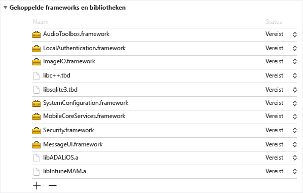
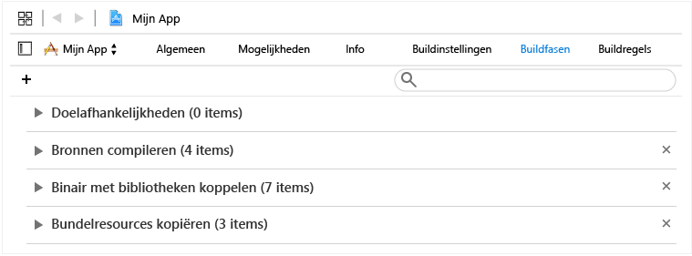
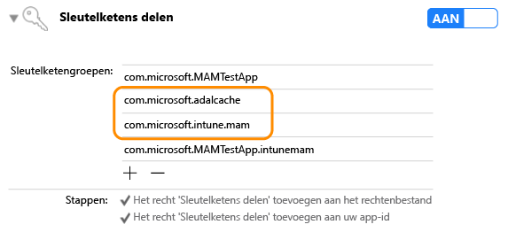

# <a name="microsoft-intune-app-sdk-for-ios-developer-guide"></a>Ontwikkelaarshandleiding voor Microsoft Intune App SDK voor iOS

> [!NOTE]
> U kunt desgewenst eerst het artikel [Aan de slag met Intune App SDK](intune-app-sdk-get-started.md) lezen, waarin wordt uitgelegd hoe u de integratie voor elk ondersteund platform kunt voorbereiden.

Met de Microsoft Intune App SDK voor iOS kunt u Intune-beleid ter bescherming van apps opnemen in uw iOS-app, in de vorm van Mobile App Management (MAM). Een MAM-app is geïntegreerd met de Intune App SDK. Hiermee kunnen IT-beheerders beleid implementeren voor uw mobiele app wanneer die actief door Intune wordt beheerd.

## <a name="prerequisites"></a>Vereisten

* U hebt een macOS-computer met OS X 10.8.5 of hoger nodig, waarop de Xcode-hulpmiddelenset versie 5 of hoger is geïnstalleerd.

* Controleer de [Licentievoorwaarden voor de Intune App SDK voor iOS](https://github.com/msintuneappsdk/ms-intune-app-sdk-ios/blob/master/Microsoft%20License%20Terms%20Intune%20App%20SDK%20for%20iOS%20.pdf). Een exemplaar van de licentievoorwaarden voor uw administratie afdrukken en bewaren. Door de Intune App SDK voor iOS te downloaden en gebruiken, gaat u akkoord met deze licentievoorwaarden.  Als u deze niet accepteert, moet u de software niet gebruiken.

* Download de bestanden voor de Intune App SDK voor iOS op [GitHub](https://github.com/msintuneappsdk/ms-intune-app-sdk-ios).

## <a name="whats-in-the-sdk"></a>Inhoud van de SDK

De ontwikkelaarshandleiding voor Intune App SDK voor iOS bevat een statische bibliotheek, resourcebestanden, API-headers, een PLIST-bestand met foutopsporingsinstellingen en een configuratiehulpprogramma. Mobiele apps omvatten mogelijk de bronbestanden en kunnen statisch aan de meeste bibliotheken voor beleidsafdwinging worden gekoppeld. Geavanceerde MAM-functies van Intune worden afgedwongen met behulp van API's.

In deze handleiding wordt ingegaan op het gebruik van de volgende onderdelen van de Intune App SDK voor iOS:

* **libIntuneMAM.a**: de statische bibliotheek van Intune App SDK. Als uw app geen extensies gebruikt, moet u deze bibliotheek aan uw project koppelen, zodat uw app gebruik kan maken van Intune Mobile Application Management.

* **IntuneMAM.framework**: het Intune-App SDK-framework. Koppel dit framework aan uw project, zodat uw app Intune Mobile Application Management kan gebruiken. Gebruik het framework in plaats van de statische bibliotheek als uw app gebruikmaakt van extensies, zodat uw project niet meerdere exemplaren van de statische bibliotheek maakt.

* **IntuneMAMResources.bundle**: een bundel met resources waarvan de SDK afhankelijk is.

* **Headers**: beschrijft de Intune App SDK-API’s. Als u een API gebruikt, moet u het headerbestand met de API opnemen. De volgende headerbestanden omvatten de API-functieaanroepen die zijn vereist om de functionaliteit van de Intune App SDK in te schakelen:

    * IntuneMAMAsyncResult.h
    * IntuneMAMDataProtectionInfo.h
    * IntuneMAMDataProtectionManager.h
    * IntuneMAMFileProtectionInfo.h
    * IntuneMAMDataProtectionManager.h
    * IntuneMAMPolicyDelegate.h
    * IntuneMAMLogger.h


## <a name="how-the-intune-app-sdk-works"></a>De werking van de Intune App SDK

Het doel van de Intune App SDK voor iOS is het toevoegen van beheermogelijkheden voor iOS-toepassingen met minimale codewijzigingen. Hoe minder codewijzigingen, hoe sneller u een mobiele app op de markt kunt brengen zonder negatieve gevolgen voor de consistentie en stabiliteit van de app.

De app moet aan de statische bibliotheek worden gekoppeld en moet de resourcebundel bevatten. Het bestand MAMDebugSettings.plist is optioneel. Het kan in het pakket worden opgenomen om te simuleren dat het MAM-beleid op de app wordt toegepast zonder dat u de app via Microsoft Intune hoeft te implementeren. Bovendien kunt u het beleid in het bestand MAMDebugSettings.plist in builds voor foutopsporing toepassen door het bestand naar de directory Documents van de app te kopiëren via de mogelijkheid om bestanden te delen in iTunes.

## <a name="build-the-sdk-into-your-mobile-app"></a>De SDK in uw mobiele app inbouwen

Als u de Intune App SDK wilt inschakelen, voert u de volgende stappen uit:

1. **Optie 1**: een koppeling maken naar de bibliotheek `libIntuneMAM.a`. Sleep de bibliotheek `libIntuneMAM.a` naar de lijst **Linked Frameworks and Libraries** van het projectdoel.
    

    > [!NOTE]
    > Als u van plan bent om uw app vrij te geven in de App Store, gebruik dan de releaseversie van `libIntuneMAM.a` en niet de foutopsporingsversie. De releaseversie bevindt zich in map **release**. De foutopsporingsversie biedt uitgebreide uitvoer die helpt bij het oplossen van problemen met de Intune App SDK.

    **Optie 2**: koppel `IntuneMAM.framework` aan uw project. Sleep `IntuneMAM.framework` naar de lijst **Linked Frameworks and Libraries** van het projectdoel.

    > [!NOTE]
    > Als u het framework gebruikt, moet u de simulatorarchitecturen handmatig verwijderen uit het universele framework voordat u uw app naar de App Store verzendt. Zie de sectie Uw app naar de App Store verzenden.

2. Voeg de volgende iOS-frameworks toe aan het project:
    * MessageUI.framework
    * Security.framework
    * MobileCoreServices.framework
    * SystemConfiguration.framework
    * libsqlite3.dylib
    * libc++.dylib
    * ImageIO.framework
    * LocalAuthentication.framework
    * AudioToolbox.framework

    > [!NOTE]
    > Als de app op iOS7 is gericht, stelt u het kenmerk `Status` van `LocalAuthentication.framework` in op Optioneel. Als `Status` niet is ingesteld, wordt de app niet gestart op iOS7.
    >
    > Xcode 7 heeft `.dylib`-extensies omgezet naar `.tbd`.

3. Voeg de resourcebundel `IntuneMAMResources.bundle` toe aan het project door deze binnen **Build Phases** naar **Copy Bundle Resources** te slepen.


4. Voeg `-force_load {PATH_TO_LIB}/libIntuneMAM.a` toe aan een van de volgende ter vervanging van `{PATH_TO_LIB}` met de Intune App SDK-locatie:
    * de buildconfiguratie-instelling `OTHER_LDFLAGS` van het project
    * de **Other Linker Flags** van de gebruikersinterface<br>

    > [!NOTE]
    > Voor het zoeken naar `PATH_TO_LIB`, selecteert u het bestand `libIntuneMAM.a` en kiest u **Get Info** in het menu **File**. Kopieer en plak de informatie onder **Where** (het pad) in het gedeelte **General** van het venster **Info**.

5. Als uw mobiele app een hoofd-nib of hoofd-storyboard definieert in het bestand Info.plist, verwijdert u het veld **Main Storyboard** of **Main Nib**. Voeg de waarden voor storyboard of nib die u eerder hebt verwijderd toe onder een nieuwe woordenlijst met de naam IntuneMAMSettings met de volgende sleutelnamen, voor zover van toepassing:
    * MainStoryboardFile
    * MainStoryboardFile~ipad
    * MainNibFile
    * MainNibFile~ipad

    > [!NOTE]
    > Als uw mobiele app geen hoofd-nib of -storyboard in het bestand Info.plist definieert, zijn deze instellingen niet vereist.

    U kunt info.plist in een onbewerkte indeling weergeven (om de sleutelnamen te bekijken) door met de rechtermuisknop op een willekeurige plaats in de hoofdtekst van het document te klikken, en het weergavetype te wijzigen in **Show Raw Keys/Values**.

6. Schakel het delen van sleutelhangers in (indien nog niet ingeschakeld) door in elk projectdoel op **Capabilities** te klikken en de schakelaar **Keychain Sharing** in te schakelen. Het delen van sleutelhangers is vereist als u wilt doorgaan met de volgende stap.

    > [!NOTE]
    > Uw inrichtingsprofiel moet ondersteuning bieden voor nieuwe waarden voor het delen van sleutelhangers. De toegangsgroepen van de sleutelhanger moeten een jokerteken ondersteunen. U kunt dit controleren door het bestand .mobileprovision in een teksteditor te openen, te zoeken naar **keychain-access-groups** en te controleren of u een jokerteken ziet. Bijvoorbeeld:
    ```xml
    <key>keychain-access-groups</key>
    <array>
    <string>YOURBUNDLESEEDID.*</string>
    </array>
    ```

7. Nadat u het delen van sleutelhangers hebt ingeschakeld, volgt u deze stappen voor het maken van een afzonderlijke toegangsgroep waarin de gegevens van de Intune App SDK worden opgeslagen. U kunt een toegangsgroep voor de sleutelhanger maken via de gebruikersinterface of met behulp van het rechtenbestand.

    Een toegangsgroep voor de sleutelhanger maken via de gebruikersinterface:

    a. Als uw mobiele app geen toegangsgroepen voor de sleutelhanger heeft gedefinieerd, moet u de bundel-id van de app toevoegen als eerste groep.

    b. Voeg de groep gedeelde sleutelhangers `com.microsoft.intune.mam` toe. De Intune App SDK gebruikt deze toegangsgroep voor het opslaan van gegevens.

    c. Voeg `com.microsoft.adalcache` aan uw bestaande toegangsgroepen toe.

    

    Als u het rechtenbestand gebruikt om de toegangsgroep voor de sleutelhanger te maken, moet u de toegangsgroep van de sleutelhanger vooraf laten gaan door `$(AppIdentifierPrefix)` in het rechtenbestand. Bijvoorbeeld:  

    * `$(AppIdentifierPrefix)com.microsoft.intune.mam`
    * `$(AppIdentifierPrefix)com.microsoft.adalcache`

    > [!NOTE]
    > Een rechtenbestand is een uniek XML-bestand voor uw mobiele toepassing. Het wordt gebruikt om speciale machtigingen en mogelijkheden in uw iOS-app op te geven.

8. Als er voor de app URL-schema's in het info.plist-bestand zijn gedefinieerd, voegt u een ander schema toe, met het achtervoegsel `-intunemam` voor elk URL-schema.

9. Voor mobiele apps die voor iOS 9+ zijn ontwikkeld, neemt u elk protocol dat door uw mobiele app wordt doorgegeven aan `UIApplication canOpenURL`, op in de matrix `LSApplicationQueriesSchemes` van het bestand Info.plist van uw app. Daarnaast moet u voor elk weergegeven protocol een nieuw protocol toevoegen met het achtervoegsel `-intunemam`. U moet ook `http-intunemam`, `https-intunemam`en `ms-outlook-intunemam` in de matrix opnemen.

10. Als er voor de app app-groepen in de rechten zijn gedefinieerd, voegt u deze groepen toe aan de woordenlijst IntuneMAMSettings onder de sleutel `AppGroupIdentifiers` als een matrix met tekenreeksen.

11. Koppel uw mobiele app aan de ADAL-bibliotheek (Azure Directory Authentication Library). De ADAL-bibliotheek voor Objective C is [beschikbaar op GitHub](https://github.com/AzureAD/azure-activedirectory-library-for-objc).

    > [!NOTE]
    > De Intune App SDK is getest met de code van de ADAL-brokervertakking van 19 juni 2015. Zorg ervoor dat u een koppeling tot stand brengt met de meeste recente werkende versie van de ADAL-bibliotheek.

12. Voeg de resourcebundel `ADALiOSBundle.bundle` toe aan het project door deze binnen **Build Phases** naar **Copy Bundle Resources** te slepen.

13. Gebruik de koppelingsoptie `-force_load PATH_TO_ADAL_LIBRARY` voor het koppelen aan de bibliotheek.

    Voeg `-force_load {PATH_TO_LIB}/libADALiOS.a` aan de buildconfiguratie-instelling `OTHER_LDFLAGS` van het project of **Other Linker Flags** in de gebruikersinterface toe. `PATH_TO_LIB` moet worden vervangen door de locatie van de binaire ADAL-bestanden.

## <a name="set-up-azure-directory-authentication-library"></a>Azure Directory Authentication Library (ADAL) instellen

De Intune App SDK gebruikt ADAL voor scenario’s voor verificatie en voorwaardelijk starten. Het is ook afhankelijk van ADAL dat de gebruikers-id wordt geregistreerd bij de MAM-service om zonder scenario's voor apparaatinschrijving beheertaken uit te voeren.

Normaal gesproken vereist ADAL dat apps zich registreren via Azure Active Directory (Azure AD) en een unieke id (de zogeheten client-id) en andere id's ophalen om de beveiliging te waarborgen van de tokens die aan de app worden toegekend. De Intune App SDK gebruikt standaardregistratiewaarden voor de communicatie met Azure AD.  

Als de app zelf ADAL voor het eigen verificatiescenario gebruikt, moet de app de bestaande registratiewaarden gebruiken en de standaardwaarden van de Intune App SDK overschrijven. Dit zorgt ervoor dat eindgebruikers niet tweemaal om verificatie wordt gevraagd (eenmaal door de Intune App SDK en een tweede maal door de app).

### <a name="adal-faqs"></a>Veelgestelde vragen over ADAL

**Welke binaire ADAL-bestanden moet ik gebruiken?**

De Intune App SDK gebruikt momenteel de brokervertakking van [ADAL op GitHub](https://github.com/AzureAD/azure-activedirectory-library-for-objc) om ondersteuning te bieden voor apps waarvoor voorwaardelijke toegang is vereist. (Deze apps zijn daarom afhankelijk van de Microsoft Authenticator-app.) Maar de SDK is nog steeds compatibel met de hoofdvertakking van de ADAL. Gebruik de vertakking die geschikt is voor uw app.

**Hoe kan ik naar binaire ADAL-bestanden koppelen?**

Voeg `-force_load {PATH_TO_LIB}/libADALiOS.a` aan de buildconfiguratie-instelling `OTHER_LDFLAGS` van het project of **Other Linker Flags** in de gebruikersinterface toe. `PATH_TO_LIB` moet worden vervangen door de locatie van de binaire ADAL-bestanden. Zorg er ook voor dat u de ADAL-bundel naar uw app kopieert.  

Zie voor meer informatie de instructies van [ADAL op Github](https://github.com/AzureAD/azure-activedirectory-library-for-objc).

**Hoe kan ik de ADAL-cache delen met andere apps die zijn ondertekend met hetzelfde inrichtingsprofiel?**

Als uw app geen toegangsgroepen voor de sleutelhanger heeft gedefinieerd, moet u de bundel-id van de app toevoegen als eerste groep.

Schakel eenmalige aanmelding van ADAL in door toegangsgroepen `com.microsoft.adalcache` en `com.microsoft.workplacejoin` toe te voegen aan de sleutelhangerrechten.

Als u de gedeelde cachesleutelhangergroep van ADAL expliciet instelt, zorg er dan voor dat deze is ingesteld op `<app_id_prefix>.com.microsoft.adalcache`. ADAL stelt dit automatisch in tenzij u dit overschrijft. Als u wilt opgeven dat een aangepaste sleutelhangergroep `com.microsoft.adalcache` vervangt, geeft u dat op in het bestand Info.plist onder 'IntuneMAMSettings', met de sleutel `ADALCacheKeychainGroupOverride`.

**Hoe dwing ik af dat de Intune App SDK gebruikmaakt van ADAL-instellingen die al door mijn app worden gebruikt?**

Als uw app al gebruikmaakt van ADAL, vindt u in de sectie over IntuneMAMSettings meer informatie over het invullen van de volgende instellingen:  

* ADALClientId
* ADALRedirectUri
* ADALRedirectScheme
* ADALCacheKeychainGroupOverride

**Hoe kan ik schakelen tussen de productieomgeving en interne testomgevingen van Azure AD?**

U kunt de instelling `AadAuthorityURI` in MAMPolicies.plist gebruiken om op te geven welke Azure AD-omgeving moet worden gebruikt voor ADAL-aanroepen. Deze is momenteel standaard ingesteld op de Azure AD-preproductieomgeving (PPE), tenzij deze is overschreven.

Als u wilt testen op basis van PPE, kunt u een compilatietijdswitch of runtimeswitch gebruiken.

Als u bij het compileren wilt overschakelen naar een andere omgeving voor de MAM-service-URL's en Azure AD, stelt u de booleaanse vlag `UsePPE` in op true (waar) in MAMEnvironment.plist. (Houd er rekening mee dat dit niet kan via Info.plist.)

Als u bij runtime wilt overschakelen naar een andere omgeving, stelt u `com.microsoft.intune.mam.useppe` in de standaardwaarden van de standaardgebruiker in op '1' om PPE te gebruiken. Op die manier wordt de bestaande instelling `com.microsoft.intune.mam.AADAuthorityEnvironment` vervangen.

**Hoe overschrijf ik de URL van de Azure AD-instantie met een URL die specifiek is voor een tenant die tijdens runtime is verstrekt?**

Stel de eigenschap `aadAuthorityUriOverride` in op het exemplaar IntuneMAMPolicyManager.

> [!NOTE]
> Dit is nodig voor de het scenario van MAM zonder apparaatinschrijving, om de SDK toe te staan de ADAL-vernieuwingstoken te gebruiken die is opgehaald door de app.

De SDK blijft deze instantie-URL gebruiken voor het vernieuwen van beleid en voor eventuele toekomstige inschrijvingsaanvragen, tenzij de waarde wordt gewist of gewijzigd.  Het is dus belangrijk dat u de waarde wist wanneer een zakelijke gebruiker zich bij de app afmeldt en de app opnieuw instelt wanneer een nieuwe zakelijke gebruiker zich weer aanmeldt.

**Wat moet ik doen als mijn app voor verificatie zelf gebruikmaakt van ADAL?**

De onderstaande acties zijn vereist als de app ADAL al gebruikt voor verificatie:

* In het bestand Info.plist van het project, onder de IntuneMAMSettings-woordenlijst met de naam van de sleutel `ADALClientId`, geeft u de client-id op die voor ADAL-aanroepen moet worden gebruikt.

* In het bestand Info.plist van het project, onder de IntuneMAMSettings-woordenlijst met de naam van de sleutel `ADALRedirectUri`, geeft u de omleidings-URI op die voor ADAL-aanroepen moet worden gebruikt. U moet mogelijk ook `ADALRedirectScheme` opgeven, afhankelijk van de indeling van de omleidings-URI van uw app.

**Wat als mijn app ADAL nog niet gebruikt voor verificatie?**

Als uw app ADAL niet gebruikt, zorgt de Intune App SDK voor de standaardwaarden voor ADAL-parameters en de verificatie met Azure AD.

## <a name="register-your-app-with-the-intune-mam-service"></a>Uw app registreren bij de Intune MAM-service

### <a name="use-the-apis"></a>Het gebruik van de API's
De Intune App SDK biedt iOS-apps nu de mogelijkheid om MAM-beleid te ontvangen van Intune zonder bij Intune te zijn ingeschreven via Mobile Device Management (MDM). Ter ondersteuning van deze nieuwe functionaliteit bevat de SDK nieuwe API's waarmee de app MAM-beleid kan ontvangen. Volg deze stappen om de nieuwe API’s te gebruiken:

1. Gebruik de nieuwste versie van de Intune App SDK, die het beheer van apps met of zonder apparaatinschrijving ondersteunt. Als uw app een oudere versie van de SDK zonder deze functie heeft gebruikt, moet u zowel de Intune MAM-bibliotheek als de map Headers bijwerken met de headers van de nieuwste SDK.

2. Voeg IntuneMAMEnrollment.h toe aan alle bestanden die de API's aanroepen.

3. Als u wilt testen op basis van PPE, kunt u een compilatietijdswitch of runtimeswitch gebruiken.

    Als u bij het compileren wilt overschakelen naar een andere omgeving voor de MAM-service-URL's en Azure AD, stelt u de booleaanse vlag `UsePPE` in op true (waar) in MAMEnvironment.plist. (Houd er rekening mee dat dit niet kan via Info.plist.)

    Als u bij runtime wilt overschakelen naar een andere omgeving, stelt u `com.microsoft.intune.mam.useppe` in de standaardwaarden van de standaardgebruiker in op '1' om PPE te gebruiken. Op die manier wordt de bestaande instelling `com.microsoft.intune.mam.AADAuthorityEnvironment` vervangen.


### <a name="register-accounts"></a>Accounts registreren

Een app kan MAM-beleid ontvangen van de Intune-service als de app namens een opgegeven gebruikersaccount is ingeschreven. De app is verantwoordelijk voor het registreren van elke nieuw aangemelde gebruiker bij de Intune App SDK. Nadat de nieuwe gebruikersaccount is geverifieerd, moet de app de methode `registerAndEnrollAccount` in Headers/IntuneMAMEnrollment.h aanroepen:

```objc
/**


 *  This method will add the account to the list of registered accounts.
 *  An enrollment request will immediately be started.
 *  @param identity The UPN of the account to be registered with the SDK
 */

(void)registerAndEnrollAccount:(NSString *)identity;

```
Door de methode `registerAndEnrollAccount` aan te roepen, kan het gebruikersaccount door de SDK worden geregistreerd en kan de app namens dit account worden ingeschreven. Als de inschrijving om een bepaalde reden mislukt, onderneemt de SDK 24 uur later automatisch een nieuwe poging om de app in te schrijven. Om fouten te kunnen opsporen, kan de app via een gemachtigde meldingen ontvangen over de resultaten van een inschrijvingsaanvraag.

Nadat deze API is aangeroepen, blijft de app gewoon functioneren. Als de inschrijving is gelukt, laat de SDK aan de gebruiker weten dat de app opnieuw moet worden opgestart. Op dat moment kan de gebruiker de app onmiddellijk opnieuw opstarten.

### <a name="deregister-accounts"></a>De registratie van accounts ongedaan maken

Voordat een gebruiker wordt afmeldt bij een app, moet de registratie van de gebruiker bij de SDK ongedaan worden gemaakt door de app. Zo kunt u er zeker van zijn:

1. Dat niet langer wordt geprobeerd om inschrijvingen voor het gebruikersaccount uit te voeren.

2. Als de gebruiker de app heeft ingeschreven, worden de gebruiker en de app uitgeschreven bij de Intune MAM-service en wordt het MAM-beleid verwijderd.

3. Als de app een (optionele) selectieve wisbewerking uitvoert, worden alle werk- of schoolgerelateerde gegevens verwijderd.

Voordat de gebruiker wordt afgemeld, moet de app de volgende API in Headers/IntuneMAMEnrollment.h aanroepen:

```objc
/*
 *  This method will remove the provided account from the list of
 *  registered accounts.  Once removed, if the account has enrolled
 *  the application, the account will be un-enrolled.
 *  @note In the case where an un-enroll is required, this method will block
 *  until the Intune MAM AAD token is acquired, then return.  This method must be called before  
 *  the user is removed from the application (so that required AAD tokens are not purged
 *  before this method is called).
 *  @param identity The UPN of the account to be removed.
 *  @param doWipe   If YES, a selective wipe if the account is un-enrolled
 */

(void)deRegisterAndUnenrollAccount:(NSString *)identity withWipe:(BOOL)doWipe;
```

Deze methode moet worden aangeroepen voordat de Azure AD-tokens van het gebruikersaccount worden verwijderd. De SDK heeft de token van de app van de gebruiker nodig om specifieke aanvragen naar de Intune MAM-service namens de gebruiker te maken.

Als de app automatisch werk- of schoolgerelateerde gegevens verwijdert, kan de vlag `doWipe` worden ingesteld op false (onwaar). Anders kan de app een selectieve wisbewerking door de SDK initiëren. Dit heeft tot gevolg dat de gemachtigde voor selectief wissen van de app wordt aangeroepen.

```objc
[[IntuneMAMEnrollmentManager instance] deRegisterAndUnenrollAccount:@”user@foo.com” withWipe:YES];
```

## <a name="enroll-without-prior-sign-in"></a>Inschrijven zonder voorafgaande aanmelding

Een app die de gebruiker niet aanmeldt bij Azure Active Directory, kan nog steeds MAM-beleid van de Intune-service ontvangen door de API aan te roepen, waardoor de SDK die verificatie afhandelt. Apps moeten deze techniek gebruiken wanneer ze een gebruiker niet hebben geverifieerd met Azure AD, maar wel MAM-beleid moeten ophalen ter bescherming van gegevens. Deze situatie kan zich voordoen wanneer een andere verificatieservice wordt gebruikt voor het aanmelden bij de app, of de app helemaal geen aanmelding vereist. Hiervoor moet de app de methode `loginAndEnrollAccount` in Headers/IntuneMAMEnrollment.h aanroepen:

```objc
/**
 *  Creates an enrollment request which is started immediately.
 *  If no token can be retrieved for the identity, the user will be prompted
 *  to enter their credentials, after which enrollment will be retried.
 *  @param identity The UPN of the account to be logged in and enrolled.
 */
 (void)loginAndEnrollAccount: (NSString *)identity;

```

Door deze methode aan te roepen, vraagt de SDK de gebruiker om referenties als er geen token wordt gevonden. De SDK probeert vervolgens de toepassing in te schrijven namens dat account. De methode kan worden aangeroepen met ‘nil’ als identiteit. In dat geval zal de SDK zich inschrijven met de bestaande MAM-gebruiker op het apparaat, of zal de gebruiker worden gevraagd een gebruikersnaam op te geven als er geen bestaande gebruiker is gevonden.

Als de inschrijving mislukt, moet de app overwegen om deze API op een later tijdstip opnieuw aan te roepen, afhankelijk van de foutinformatie. De app kan via een gemachtigde meldingen ontvangen over de resultaten van een inschrijvingsaanvraag.

Nadat deze API is aangeroepen, blijft de app gewoon functioneren. Als de inschrijving is gelukt, laat de SDK aan de gebruiker weten dat de app opnieuw moet worden opgestart.

## <a name="status-result-and-debug-notifications"></a>Status-, resultaat- en foutopsporingsmeldingen

De app kan status-, resultaat- en foutopsporingsmeldingen ontvangen over de volgende aanvragen voor de Intune MAM-service:

 - Inschrijvingsaanvragen
 - Aanvragen voor beleidsupdates
 - Uitschrijvingsaanvragen

De meldingen worden weergegeven via gemachtigdenmethoden in Headers/IntuneMAMEnrollmentDelegate.h:

```objc
/**
 *  Called when an enrollment request operation is completed.
 * @param status status object containing debug information
 */

(void)enrollmentRequestWithStatus:(IntuneMAMEnrollmentStatus *)status;

/**
 *  Called when a MAM policy request operation is completed.
 *  @param status status object containing debug information
 */
(void)policyRequestWithStatus:(IntuneMAMEnrollmentStatus *)status;

/**
 *  Called when a un-enroll request operation is completed.
 *  @Note: when a user is un-enrolled, the user is also de-registered with the SDK
 *  @param status status object containing debug information
 */

(void)unenrollRequestWithStatus:(IntuneMAMEnrollmentStatus *)status;

```

Deze gemachtigdenmethoden retourneren een object `IntuneMAMEnrollmentStatus` met de volgende gegevens:

- De identiteit van het account dat is gekoppeld aan de aanvraag
- Een statuscode die het resultaat van de aanvraag aanduidt
- Een fouttekenreeks met een beschrijving van de statuscode
- Een object `NSError`

Dit object wordt gedefinieerd in Headers/IntuneMAMEnrollmentStatus.h samen met de specifieke statuscodes die kunnen worden geretourneerd.


## <a name="sample-code"></a>Voorbeeldcode

Hier volgen voorbeeldimplementaties van de gemachtigdenmethoden:

```objc
- (void)enrollmentRequestWithStatus:(IntuneMAMEnrollmentStatus *)status


{


    NSLog(@"enrollment result for identity %@ with status code %ld", status.identity, (unsigned long)status.statusCode);


    NSLog(@"Debug Message: %@", status.errorString);


}


- (void)policyRequestWithStatus:(IntuneMAMEnrollmentStatus *)status


{


    NSLog(@"policy check-in result for identity %@ with status code %ld", status.identity, (unsigned long)status.statusCode);


    NSLog(@"Debug Message: %@", status.errorString);


}


- (void)unenrollRequestWithStatus:(IntuneMAMEnrollmentStatus *)status


{


    NSLog(@"un-enroll result for identity %@ with status code %ld", status.identity, (unsigned long)status.statusCode);


    NSLog(@"Debug Message: %@", status.errorString);


}

```

## <a name="app-restart"></a>App opnieuw opstarten

Wanneer een app voor de eerste keer MAM-beleid ontvangt, moet deze opnieuw worden opgestart om de vereiste hooks toe te passen. Om aan te geven dat de app opnieuw moet worden opgestart, biedt de SDK een gemachtigdenmethode in Headers/IntuneMAMPolicyDelegate.h.

```objc
 - (BOOL) restartApplication
```
De geretourneerde waarde van deze methode geeft voor de SDK aan of de app het vereiste opnieuw opstarten afhandelt:   

 - Als true (waar) wordt geretourneerd, handelt de app het opnieuw opstarten af.   
 - Als false (onwaar) wordt geretourneerd, start de SDK de app opnieuw op nadat deze methode wordt geretourneerd. De SDK geeft onmiddellijk een dialoogvenster weer waarin de gebruiker wordt gevraagd de app opnieuw op te starten.

## <a name="implement-save-as-controls"></a>Besturingselementen voor Opslaan als implementeren

IT-beheerders kunnen met Intune selecteren op welke opslaglocaties een beheerde app gegevens kan opslaan. Apps kunnen de toegestane opslaglocaties bij de Intune App SDK opvragen met de **isSaveToAllowedForLocation**-API.

Voordat apps beheerde gegevens kunnen opslaan in een opslagruimte in de cloud of op een lokale locatie, moeten ze met de **isSaveToAllowedForLocation**-API controleren of de IT-beheerder toestaat dat de gegevens daar mogen worden opgeslagen.

Bij het gebruik van de **isSaveToAllowedForLocation**-API moeten apps de UPN voor de opslaglocatie doorgeven als deze beschikbaar is.

### <a name="supported-save-locations"></a>Ondersteunde opslaglocaties

De **isSaveToAllowedForLocation**-API biedt constanten om te controleren of de IT-beheerder toestaat dat gegevens worden opgeslagen op de volgende locaties:

* IntuneMAMSaveLocationOther
* IntuneMAMSaveLocationOneDriveForBusiness
* IntuneMAMSaveLocationSharePoint
* IntuneMAMSaveLocationBox
* IntuneMAMSaveLocationDropbox
* IntuneMAMSaveLocationGoogleDrive
* IntuneMAMSaveLocationLocalDrive

Apps moeten de constanten in de **isSaveToAllowedForLocation**-API gebruiken om te controleren of gegevens kunnen worden opgeslagen op locaties die als 'beheerd' worden beschouwd, zoals OneDrive voor Bedrijven, of als 'persoonlijk'. Daarnaast moet de API worden gebruikt wanneer de app niet kan controleren of een locatie wordt 'beheerd' of 'persoonlijk' is.

Wanneer van een locatie bekend is dat deze 'persoonlijk' is, moeten apps de **IntuneMAMSaveLocationOther**-waarde gebruiken.

De **IntuneMAMSaveLocationLocalDrive**-constante moet worden gebruikt wanneer de app gegevens opslaat op een locatie op het lokale apparaat.

## <a name="set-up-the-intune-app-sdk"></a>De Intune App SDK instellen

U gebruikt de IntuneMAMSettings-woordenlijst die deel uitmaakt van het bestand Info.plist van de app voor het configureren van de Intune App SDK. Hier volgt een tabel met alle ondersteunde instellingen.

Sommige van deze instellingen zijn mogelijk in eerdere secties aan bod gekomen en sommige zijn niet op alle apps van toepassing.

Instelling  | Type  | Definitie | Vereist?
--       |  --   |   --       |  --
ADALClientId  | Tekenreeks  | De Azure AD-client-id van de app. | Vereist als de app gebruikmaakt van ADAL.
ADALRedirectUri  | Tekenreeks  | De Azure AD-omleidings-URI van de app. | ADALRedirectUri of ADALRedirectScheme is vereist als de app gebruikmaakt van ADAL.
ADALRedirectScheme  | Tekenreeks  | Het Azure AD-omleidingsschema van de app. Dit kan worden gebruikt in plaats van ADALRedirectUri als de omleidings-URI van de app de notatie `scheme://bundle_id` heeft. | ADALRedirectUri of ADALRedirectScheme is vereist als de app gebruikmaakt van ADAL.
ADALLogOverrideDisabled | Boolean-waarde  | Geeft aan of de SDK alle ADAL-logboeken (inclusief ADAL-aanroepen van de app, indien van toepassing) naar een eigen logboekbestand routeert. De standaardwaarde is NO (Nee). De waarde is YES (Ja) als de app een eigen ADAL-logboek wil aanroepen. | Optioneel.
ADALCacheKeychainGroupOverride | Tekenreeks  | Hiermee wordt aangegeven welke sleutelhangergroep voor de ADAL-cache moet worden gebruikt in plaats van 'com.microsoft.adalcache'. Houd er rekening mee dat deze niet het voorvoegsel app-id heeft. Die wordt tijdens runtime als voorvoegsel toegevoegd aan de gegeven tekenreeks. | Optioneel.
AppGroupIdentifiers | Matrix van tekenreeks  | Matrix van toepassingsgroepen van het gedeelte com.apple.security.application-groups met rechten van de app. | Vereist als de app toepassingsgroepen gebruikt.
ContainingAppBundleId | Tekenreeks | Deze geeft de bundel-id aan van de extensie waarvan app onderdeel uitmaakt. | Vereist voor iOS-extensies.
DebugSettingsEnabled| Boolean-waarde | Indien ingesteld op YES (Ja), kan testbeleid binnen de bundel Instellingen worden toegepast. Apps moeten *niet* worden verzonden als deze instelling is ingeschakeld. | Optioneel.
MainNibFile<br>MainNibFile~ipad  | Tekenreeks  | Deze instelling moet de bestandsnaam van de hoofd-nib van de app hebben.  | Vereist als de app MainNibFile in definieert in Info.plist.
MainStoryboardFile<br>MainStoryboardFile~ipad  | Tekenreeks  | Deze instelling moet de bestandsnaam van het hoofd-storyboard van de app hebben. | Vereist als de app UIMainStoryboardFile definieert in Info.plist.
MAMPolicyRequired| Boolean-waarde| Deze geeft aan of de app is geblokkeerd en niet kan worden gestart als de app geen Intune MAM-beleid heeft. De standaardwaarde is NO (Nee). | Optioneel.
MAMPolicyWarnAbsent | Boolean-waarde| Deze geeft aan of de app tijdens het opstarten een waarschuwing verzendt naar de gebruiker als de app geen Intune MAM-beleid heeft. Apps kunnen niet worden verzonden naar de Store als deze instelling is ingesteld op YES. | Optioneel.
MultiIdentity | Boolean-waarde| Hiermee wordt aangegeven of de app in staat is om met meerdere identiteiten te werken. | Optioneel.
SplashIconFile <br>SplashIconFile~ ipad | Tekenreeks  | Geeft het pictogrambestand van het Intune-opstartscherm aan. | Optioneel.
SplashDuration | Getal | Minimale tijdsduur in seconden voor de weergave van het Intune-opstartscherm bij het opstarten van de app. De standaardwaarde is 1,5 seconden. | Optioneel.
BackgroundColor| Tekenreeks| Hiermee geeft u de achtergrondkleur aan voor het opstartscherm en het scherm waarop een pincode moet worden ingevoerd. Accepteert een hexadecimale RGB-tekenreeks in de vorm van #XXXXXX, waarbij elke X een teken van 0-9 of A-F kan zijn. Het hekje kan worden weggelaten.   | Optioneel. De standaardkleur is lichtgrijs.
ForegroundColor| Tekenreeks| Hiermee geeft u de voorgrondkleur aan voor het opstartscherm en het scherm waarop een pincode moet worden ingevoerd, voor bijvoorbeeld tekstkleur. Accepteert een hexadecimale RGB-tekenreeks in de vorm van #XXXXXX, waarbij elke X een teken van 0-9 of A-F kan zijn. Het hekje kan worden weggelaten.  | Optioneel. De standaardkleur is zwart.
AccentColor | Tekenreeks| Hiermee geeft u de accentkleur aan voor schermen waarop een pincode moet worden ingevoerd, voor bijvoorbeeld knoptekst en de kleur voor het markeren van vakken. Accepteert een hexadecimale RGB-tekenreeks in de vorm van #XXXXXX, waarbij elke X een teken van 0-9 of A-F kan zijn. Het hekje kan worden weggelaten.| Optioneel. De standaardkleur is systeemblauw.
MAMTelemetryDisabled| Boolean-waarde| Hiermee wordt aangegeven dat de SDK geen telemetriegegevens verzendt naar de back-end.| Optioneel.
MAMTelemetryUsePPE | Boolean-waarde | Hiermee wordt aangegeven of de SDK gegevens verzendt naar de PPE-back-end. Gebruik deze instelling als u wilt testen of uw apps voldoen aan het Intune-beleid, zodat telemetrietestgegevens niet worden verward met klantgegevens. | Optioneel.

## <a name="telemetry"></a>Telemetrie

De Intune App SDK voor iOS registreert standaard telemetriegegevens van de volgende gebruiksgebeurtenissen. Deze gegevens worden naar Microsoft Intune verzonden.

* **Het starten van de app**: om Microsoft Intune meer inzicht te geven in het MAM-gebruik van de app per beheertype (MAM met MDM-, MAM zonder MDM-inschrijving, enzovoort).
* **Het aanroepen van de EnrollApplication-API**: om Microsoft Intune inzicht te geven in het slagingspercentage en andere meetwaarden voor het aanroepen van `enrollApplication` vanaf de client.

> [!NOTE]
> Als u ervoor kiest geen telemetriegegevens van de Intune App SDK naar Microsoft Intune te verzenden, moet u het vastleggen van telemetriegegevens in de SDK uitschakelen. Stel de eigenschap `MAMTelemetryDisabled` in op YES in de IntuneMAMSettings-woordenlijst.

## <a name="enable-multi-identity-optional"></a>Meerdere identiteiten inschakelen (optioneel)

Standaard past de SDK een beleid toe op de gehele app. Meerdere identiteiten is een MAM-functie waarmee u beleid kunt toepassen per identiteit. Hiervoor wordt meer deelname van een app vereist dan bij andere MAM-functies.

De app moet aan de app-SDK melden wanneer de actieve identiteit zal worden gewijzigd. De SDK meldt ook aan de app wanneer er een identiteitswijziging is vereist. Op dit moment wordt slechts één beheerde identiteit ondersteund. Nadat de gebruiker het apparaat of de app inschrijft, gebruikt de SDK deze identiteit en beschouwt de SDK deze identiteit als de primaire beheerde identiteit. Andere gebruikers in de app worden beschouwd als niet-beheerd met onbeperkte beleidsinstellingen.

Een identiteit wordt gewoon als een tekenreeks gedefinieerd. Identiteiten zijn niet hoofdlettergevoelig. In identiteitsaanvragen die door de SDK worden geretourneerd, wordt mogelijk niet hetzelfde gebruik van hoofd- en kleine letters toegepast als bij het instellen van de identiteit.

### <a name="identity-overview"></a>Overzicht van identiteit

Een identiteit is gewoon de gebruikersnaam van een account (zoals user@contoso.com)). Ontwikkelaars kunnen de identiteit van de app instellen op de volgende niveaus:

* **Procesidentiteit**: stelt de identiteit voor het hele proces in en wordt hoofdzakelijk gebruikt voor toepassingen met één identiteit. Deze identiteit is van invloed op alle taken, bestanden en de gebruikersinterface.
* **Gebruikersinterface-identiteit**: bepaalt welk beleid wordt toegepast op taken van de gebruikersinterface op de hoofdthread zoals knippen/kopiëren/plakken, pincode, verificatie en gegevens delen. De gebruikersinterface-identiteit heeft geen invloed op taken zoals versleuteling en het maken van back-ups.
* **Threadidentiteit**: beïnvloedt welk beleid wordt toegepast op de huidige thread. Deze identiteit is van invloed op alle taken, bestanden en de gebruikersinterface.

Het is de verantwoordelijkheid van de app om de identiteiten juist in te stellen, ongeacht of de gebruiker wordt beheerd of niet.

Elke thread heeft op ieder moment een effectieve identiteit voor gebruikersinterface- en bestandstaken. Dit is de identiteit die wordt gebruikt om te controleren welk beleid er eventueel moet worden toegepast. Als de identiteit 'geen identiteit' is of als de gebruiker niet wordt beheerd, wordt er geen beleid toegepast.

### <a name="thread-queues"></a>Threadwachtrijen

Apps verzenden vaak asynchrone en synchrone taken naar threadwachtrijen. De SDK onderschept GCD-aanroepen (Grand Central Dispatch) en koppelt de huidige threadidentiteit aan de verzonden taken. Wanneer de taken zijn voltooid, wijzigt de SDK tijdelijk de threadidentiteit in de identiteit die is gekoppeld aan de taak, voltooit de taken en zet vervolgens de oorspronkelijke threadidentiteit terug.


Omdat `NSOperationQueue` bovenop GCD is gebouwd, worden `NSOperations` uitgevoerd op de identiteit van de thread op het tijdstip dat de taken worden toegevoegd aan de `NSOperationQueue`. `NSOperations` of functies die rechtstreeks zijn verzonden via GCD hebben ook de mogelijkheid om de huidige threadidentiteit te wijzigen terwijl ze worden uitgevoerd. Deze identiteit overschrijft de identiteit die is overgenomen van de verzendende thread.

### <a name="file-owner"></a>Bestandseigenaar

De SDK houdt de identiteiten van de lokale bestandseigenaars bij en past op basis daarvan beleid toe. De bestandseigenaar wordt ingesteld wanneer een bestand wordt gemaakt of wordt geopend in de afkapmodus. De eigenaar wordt ingesteld op de effectieve bestandstaakidentiteit van de thread die de taak uitvoert.

Apps kunnen echter de identiteit van de bestandseigenaar ook expliciet instellen met behulp van de `IntuneMAMFilePolicyManager`. Apps kunnen `IntuneMAMFilePolicyManager` gebruiken om de bestandseigenaar op te halen en de gebruikersinterface-identiteit in te stellen voordat de bestandsinhoud wordt weergegeven.

### <a name="shared-data"></a>Gedeelde gegevens

Als de app bestanden maakt die gegevens van beheerde en onbeheerde gebruikers bevatten, is het de verantwoordelijkheid van de app om de gegevens van de beheerde gebruiker te versleutelen. U kunt gegevens versleutelen met de API’s `protect` en `unprotect` in `IntuneMAMDataProtectionManager`.

De methode `protect` accepteert een identiteit, die een beheerde of een niet-beheerde gebruiker kan zijn. Als het een beheerde gebruiker is, worden de gegevens versleuteld. Als het een niet-beheerde gebruiker is, wordt een header toegevoegd aan de gegevens waarmee de identiteit wordt gecodeerd, maar worden de gegevens niet versleuteld. U kunt de methode `protectionInfo` gebruiken voor het ophalen van de eigenaar van de gegevens.

### <a name="share-extensions"></a>Share-extensies

Als de app een share-extensie bevat, kan de eigenaar van het item dat wordt gedeeld, worden opgehaald met de methode `protectionInfoForItemProvider` in `IntuneMAMDataProtectionManager`. Als het gedeelde item een bestand is, wordt het instellen van de bestandseigenaar door de SDK afgehandeld. Als het bij het gedeelde item om gegevens gaat, is de app verantwoordelijk voor het instellen van de bestandseigenaar als deze gegevens naar een bestand worden opgeslagen, en voor het aanroepen van de API `setUIPolicyIdentity` voordat de gegevens worden weergegeven in de gebruikersinterface.

### <a name="turning-on-multi-identity"></a>Meerdere identiteiten inschakelen

Alle apps worden standaard beschouwd als apps met één identiteit. De SDK stelt de procesidentiteit in voor de ingeschreven gebruiker. Om ondersteuning voor meerdere identiteiten mogelijk te maken, voegt u een Booleaanse instelling met de naam `MultiIdentity` en de waarde YES toe aan de IntuneMAMSettings-woordenlijst in het bestand Info.plist van de app.

> [!NOTE]
> Wanneer het gebruik van meerdere identiteiten is ingeschakeld, worden de procesidentiteit, de gebruikersinterface-identiteit en de threadidentiteiten op nil ingesteld. De app is verantwoordelijk voor het juist instellen hiervan.

### <a name="switching-identities"></a>Schakelen tussen identiteiten

* **Door app geïnitieerde overschakeling naar een andere identiteit**:

    Bij het starten wordt van apps met meerdere identiteiten verondersteld dat ze worden uitgevoerd onder een onbekend, niet-beheerd account. De voorwaardelijke gebruikersinterface voor opstarten wordt niet uitgevoerd, en er wordt geen beleid afgedwongen op de app. Het is de verantwoordelijkheid van de app om aan de SDK te melden wanneer de identiteit moet worden gewijzigd. Dit gebeurt meestal wanneer de app op het punt staat om gegevens voor een specifiek gebruikersaccount weer te geven.

    Een voorbeeld daarvan is wanneer de gebruiker een document, een postvak of een tabblad in een notitieblok opent. De app moet de SDK op de hoogte stellen voordat het bestand, het postvak of het tabblad wordt geopend. Dit wordt gedaan via de `setUIPolicyIdentity`-API in `IntuneMAMPolicyManager`. Deze API moet worden aangeroepen, ongeacht of het om een beheerde of niet-beheerde gebruiker gaat. Als het een beheerde gebruiker is, voert de SDK de voorwaardelijke startcontroles uit, zoals jailbreakdetectie, pincode en verificatie.

    Het resultaat van de overschakeling naar een andere identiteit wordt asynchroon naar de app geretourneerd via een voltooiingshandler. De app moet het openen van het document, postvak of tabblad uitstellen totdat er een resultaatcode wordt geretourneerd. Als het overschakelen naar een andere identiteit mislukt, moet de app de taak annuleren.

* **Door SDK geïnitieerde overschakeling naar andere identiteit**:

    Soms moet de SDK de app verzoeken om naar een specifieke identiteit over te schakelen. Apps met meerdere identiteiten moeten de `identitySwitchRequired`-methode in `IntuneMAMPolicyDelegate` implementeren om deze aanvraag te verwerken.

    Wanneer deze methode wordt aangeroepen, en indien de app de aanvraag kan afhandelen om naar een opgegeven identiteit over te schakelen, moet de app `IntuneMAMAddIdentityResultSuccess` doorgeven aan de voltooiingshandler. Als de app de aanvraag om naar een andere identiteit over te schakelen niet kan afhandelen, moet de app `IntuneMAMAddIdentityResultFailed` doorgeven aan de voltooiingshandler.

    De app hoeft `setUIPolicyIdentity` niet aan te roepen als reactie op deze aanroep. Als de SDK het nodig acht dat de app moet overschakelen naar een niet-beheerd gebruikersaccount, wordt een lege tekenreeks doorgegeven aan de `identitySwitchRequired`-aanroep.

* **Selectief wissen**:

    Wanneer de app selectief wordt gewist, zal de SDK de `wipeDataForAccount`-methode in `IntuneMAMPolicyDelegate` aanroepen. Het is de verantwoordelijkheid van de app om het opgegeven gebruikersaccount en alle bijbehorende gegevens te verwijderen. De SDK is in staat om alle bestanden te verwijderen waarvan de gebruiker de eigenaar is, en zal dit doen als de app FALSE (onwaar) retourneert als reactie op de aanroep `wipeDataForAccount`.

    Deze methode wordt aangeroepen vanuit een achtergrondthread. De app mag geen waarde retourneren totdat alle gegevens van de gebruiker zijn verwijderd (met uitzondering van bestanden, als de app FALSE retourneert).

## <a name="debug-the-intune-app-sdk-in-xcode"></a>Foutopsporing voor de Intune App SDK in Xcode

Voordat u uw MAM-app handmatig test met Microsoft Intune, kunt u een bestand Settings.bundle in Xcode gebruiken. Hiermee kunt u beleidsregels testen zonder dat er een verbinding met Intune is vereist. U kunt deze header als volgt inschakelen:

1. Voeg een Settings.bundle-bestand toe door met de rechtermuisknop op de map op het hoogste niveau in uw project te klikken. Kies **Add** > **New File** in het menu. Kies onder **Resources** de sjabloon **Settings Bundle** om toe te voegen.

2. Kopieer alleen bij builds voor foutopsporing MAMDebugSettings.plist naar Settings.bundle.

3. In Root.plist (dat zich in Settings.bundle bevindt) voegt u een voorkeur toe met `Type` = `Child Pane` en `FileName` = `MAMDebugSettings`.

4. Schakel in **Settings** > **Your-App-Name** de optie **Enable Test Policies** in.

5. Start de app (binnen of buiten Xcode).

6. Schakel in **Settings** > **Your-App-Name** > **Enable Test Policies** een beleid in, bijvoorbeeld **PIN**.

7. Start de app (binnen of buiten Xcode). Controleer of pincode werkt zoals verwacht.

> [!NOTE]
> U kunt **Settings** > **Your-App-Name** > **Enable Test Policies** gebruiken om instellingen in te schakelen of andere instellingen te kiezen.

## <a name="ios-best-practices"></a>Aanbevolen procedures voor iOS

Hier volgen enkele aanbevolen procedures voor het ontwikkelen voor iOS:

* Het iOS-bestandssysteem is hoofdlettergevoelig. Zorg dat het hoofdlettergebruik juist is voor bestandsnamen zoals `libIntuneMAM.a` en `IntuneMAMResources.bundle`.

* Als Xcode `libIntuneMAM.a` niet kan vinden, kunt u dit probleem oplossen door het pad naar deze bibliotheek toe te voegen in de gekoppelde zoekpaden.

## <a name="faq"></a>Veelgestelde vragen


**Zijn alle API's adresseerbaar via systeemeigen Swift of via de interoperabiliteit tussen Objective-C en Swift?**

De Intune App SDK-API’s zijn alleen in Objective-C en ondersteunen geen systeemeigen Swift.  


**Moeten alle gebruikers van mijn app worden geregistreerd bij de MAM-service?**

Nee. In feite hoeven alleen werk- of schoolaccounts te worden geregistreerd bij de Intune App SDK. Apps zijn er verantwoordelijk voor om te bepalen of een account wordt gebruikt in de context van werk of school.   

**Wat gebeurt er met gebruikers die zich al bij de app hebben aangemeld? Moeten ze worden ingeschreven?**

De toepassing is verantwoordelijk voor het inschrijven van gebruikers nadat ze zijn geverifieerd. De toepassing is ook verantwoordelijk voor het inschrijven van eventuele accounts die aanwezig waren voordat de app MAM-functionaliteit zonder MDM had.   

Om dit te bereiken, moet de app gebruikmaken van de methode `registeredAccounts:`. Deze methode retourneert een NSDictionary met alle accounts die zijn geregistreerd bij de Intune MAM-service. Als bestaande accounts in de app niet op de lijst staan, moet de app deze accounts registreren en inschrijven via `registerAndEnrollAccount:`.

**Hoe vaak probeert de SDK inschrijvingen opnieuw uit te voeren?**

De SDK probeert alle eerder mislukte inschrijvingen automatisch opnieuw uit te voeren met een interval van 24 uur. De SDK doet dit om te garanderen dat als de organisatie van een gebruiker MAM heeft ingeschakeld nadat de gebruiker zich heeft aangemeld bij de app, de gebruiker zich kan inschrijven en beleid zal ontvangen.

De SDK stopt met proberen wanneer wordt gedetecteerd dat een gebruiker de app heeft kunnen inschrijven. Dit komt doordat slechts één gebruiker een app op een bepaald moment kan inschrijven. Als de gebruiker wordt uitgeschreven, worden de nieuwe pogingen opnieuw gestart met dezelfde interval van 24 uur.

**Waarom moet de registratie van de gebruiker ongedaan worden gemaakt?**

De SDK voert regelmatig de volgende acties op de achtergrond uit:

 - Als de app nog niet is ingeschreven, probeert deze alle geregistreerde accounts elke 24 uur opnieuw in te schrijven.
 - Als de app is ingeschreven, controleert de SDK elke 8 uur of het MAM-beleid is gewijzigd.

Door de registratie van een gebruiker ongedaan te maken, wordt de SDK gewaarschuwd dat de gebruiker de app niet langer gebruikt, en dat de periodiek uitgevoerde gebeurtenissen voor dat gebruikersaccount kunnen worden gestopt. Hierdoor worden indien nodig ook het uitschrijven van de app en een selectieve wisbewerking geactiveerd.

**Moet ik de doWipe-vlag op true (waar) instellen in de deregister-methode?**

Deze methode moet worden aangeroepen voordat de gebruiker wordt afgemeld bij de app.  Als de gegevens van de gebruiker uit de app worden verwijderd als onderdeel van de afmelding, kan `doWipe` worden ingesteld op false (onwaar). Maar als de app de gegevens van de gebruiker niet daadwerkelijk verwijdert, moet `doWipe` worden ingesteld op true (waar), zodat de SDK de gegevens kan verwijderen.

**Zijn er andere manieren om een app uit te schrijven?**

Ja, de IT-beheerder kan een opdracht voor selectief wissen verzenden naar de app. Hierdoor wordt de gebruiker uitgeschreven en de registratie ongedaan gemaakt, en worden de gegevens van de gebruiker gewist. De SDK handelt dit scenario automatisch af en verzendt een melding via de gemachtigdenmethode voor uitschrijving.


## <a name="submit-your-app-to-the-app-store"></a>Uw app naar de App Store verzenden

Zowel de statische bibliotheek als de frameworkbuilds van de Intune App SDK zijn universele binaire bestanden. Dit houdt in dat ze een code hebben voor alle apparaat- en simulatorarchitecturen. Apple weigert apps die naar de App Store worden verzonden als deze simulatorcode bevatten. Bij een compilatie op basis van de statische bibliotheek voor builds die uitsluitend voor apparaten zijn bestemd, wordt de linker automatisch ontdaan van de simulatorcode. Volg de onderstaande stappen om ervoor te zorgen dat alle simulatorcode wordt verwijderd voordat u de app uploadt naar de App Store.

1. Zorg dat `IntuneMAM.framework` zich op uw bureaublad bevindt.

2. Voer deze opdrachten uit:

    ```bash
    lipo ~/Desktop/IntuneMAM.framework/IntuneMAM -remove i386 -remove x86_64 -output ~/Desktop/IntuneMAM.device_only
    ```

    ```bash
    cp ~/Desktop/IntuneMAM.device_only ~/Desktop/IntuneMAM.framework/IntuneMAM
    ```
    De eerste opdracht verwijdert de simulatorarchitecturen uit het bestand DYLIB van het framework. Met de tweede opdracht wordt het bestand DYLIB dat uitsluitend voor apparaten is bestemd, terug gekopieerd naar de frameworkmap.


<!--HONumber=Jan17_HO3-->


