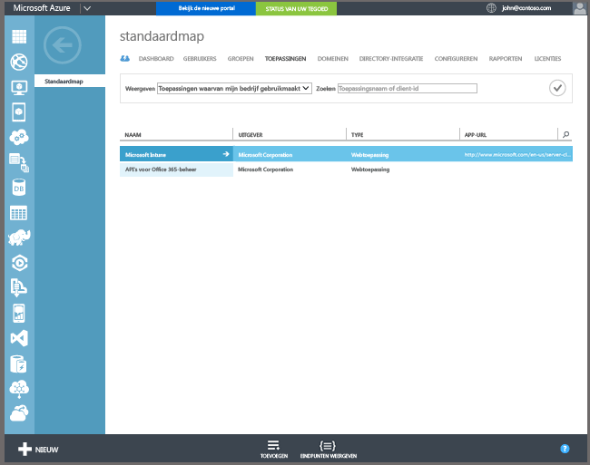

## Automatische inschrijving met Azure Active Directory Premium installeren voor Windows 10 en Windows 10 Mobile

Met automatische registratie kunnen gebruikers Windows 10-pc’s en Windows 10 Mobile-apparaten van het bedrijf of van henzelf in Intune registreren door werk- of schoolaccount toe te voegen en akkoord te gaan met het beheer. Zo simpel is het. Het apparaat van de gebruiker wordt op de achtergrond geregistreerd en aangesloten bij Azure Active Directory. Wanneer het apparaat is geregistreerd, wordt het met Intune beheerd.

**Vereisten**
- Azure Active Directory Premium-abonnement ([proefabonnement](http://go.microsoft.com/fwlink/?LinkID=816845))
- Microsoft Intune-abonnement

### Automatische MDM-registratie configureren

1. Ga in de [Azure-beheerportal](https://manage.windowsazure.com) (https://manage.windowsazure.com) naar het knooppunt **Active Directory** en selecteer uw map.

2. Selecteer het tabblad **Toepassingen**. **Microsoft Intune** wordt in de lijst met toepassingen weergegeven.

    

3. Selecteer de pijl voor **Microsoft Intune**. Er verschijnt een pagina waarop u Microsoft Intune kunt configureren.

4. Selecteer **Configureren** om de automatische MDM-registratie met Microsoft Intune te configureren.

5. Geef de URL's voor Intune op:

  - **URL voor MDM-registratie**: gebruik de standaardwaarde.
  - **URL naar gebruiksrechtovereenkomst voor MDM**: gebruik de standaardwaarde. Met deze URL worden de gebruiksvoorwaarden weergegeven wanneer gebruikers apparaten registreren.
  - **URL naar naleving voor MDM**: gebruik de standaardwaarde. Als een apparaat niet-compatibel is, wordt het bericht **Toegang geweigerd** weergegeven met deze URL. De URL verwijst naar een pagina waarop gebruikers kunnen lezen waarom hun apparaat niet compatibel is met het beleid en hoe ze dat kunnen verhelpen.

6.  Geef op van welke gebruikers apparaten moeten worden beheerd met Microsoft Intune. De Windows 10-apparaten van deze gebruikers worden automatisch geregistreerd voor beheer met Microsoft Intune.

  - **Alle**
  - **GROEPEN**
  - **Geen**

7. Kies **Opslaan**.

<!--HONumber=Feb17_HO2-->

